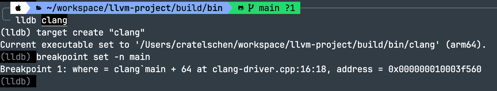

clang是 LLVM 项目中的重要子项目，是一个编译器，我们可以将它作为入口来学习。

通过编译选项LLVM_ENABLE_PROJECTS=clang 来编译clang；通过编译选项CMAKE_BUILD_TYPE=Debug指定起编译类型为 debug，这样的话后续可以对其进行调试，也便于步进来学习 clang 代码。

```
 cmake -S llvm -B build -G Ninja -DCMAKE_BUILD_TYPE=Debug -DLLVM_ENABLE_PROJECTS=clang -DLLVM_TARGETS_TO_BUILD=X86
```

编译出来的 clang 位于 build/bin 目录中，我们可以切换到该目录并使用 lldb 对二进制 clang 进行调试。

首先就是找出 clang 的入口文件。



可知 main 的位置在文件 clang-main.cpp中，接下来找到该文件即可。

> 该文件由 cmake 在 generate 阶段通过模版替换生成在 build 目录中，而不在源码目录中。
