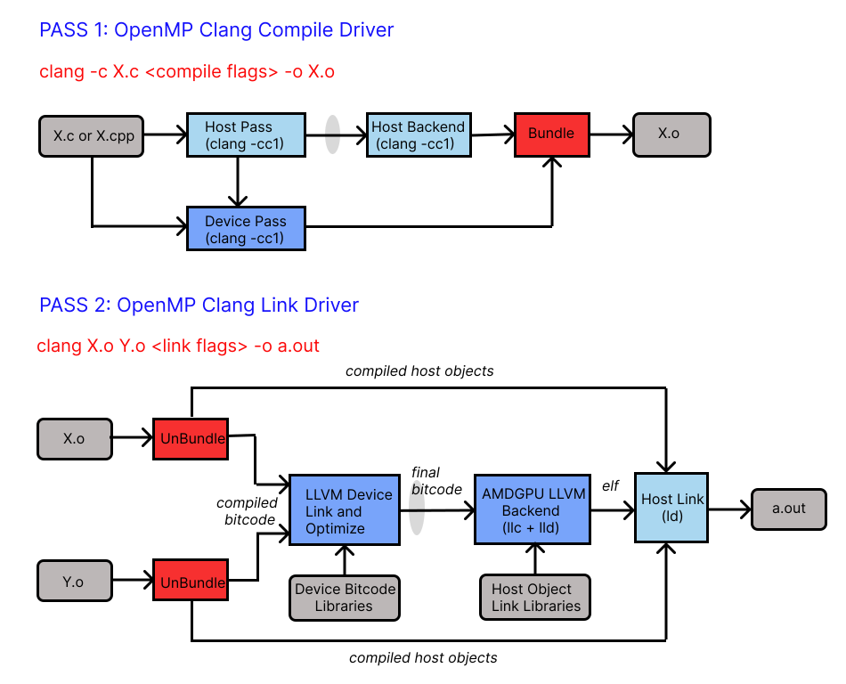

---
myst:
    html_meta:
        "description": "Describes ROCm support for OpenMP"
        "keywords": "OpenMP, LLVM, OpenMP toolchain"
---

# ROCm OpenMP support

The ROCm installation includes an LLVM-based implementation that fully supports
the OpenMP 4.5 standard and a subset of OpenMP 5.0, 5.1, and 5.2 standards.
Fortran, C/C++ compilers, and corresponding runtime libraries are included.
Along with host APIs, the OpenMP compilers support offloading code and data onto
GPU devices. This document briefly describes the installation location of the
OpenMP toolchain and provides examples of device offloading. The GPUs supported are the same as those supported by
this ROCm release. See the list of supported GPUs for {doc}`Linux<rocm-install-on-linux:reference/system-requirements>` and
{doc}`Windows<rocm-install-on-windows:reference/system-requirements>`.

The ROCm OpenMP compiler is implemented using LLVM compiler technology.
The following image illustrates the internal steps taken to translate a user’s application into an executable that can offload computation to the AMDGPU. The compilation is a two-pass process. Pass 1 compiles the application to generate the CPU code and Pass 2 links the CPU code to the AMDGPU device code.



### Installation

The OpenMP toolchain is automatically installed as part of the standard ROCm
installation and is available under `/opt/rocm-{version}/llvm`. The
sub-directories are:

* bin: Compilers (`flang` and `clang`) and other binaries.
* examples: The usage section below shows how to compile and run these programs.
* include: Header files.
* lib: Libraries including those required for target offload.
* lib-debug: Debug versions of the above libraries.

## Usage

The example programs can be compiled and run by pointing the environment
variable `ROCM_PATH` to the ROCm install directory.

**Example:**

```bash
export ROCM_PATH=/opt/rocm-{version}
cd $ROCM_PATH/share/openmp-extras/examples/openmp/veccopy
sudo make run
```

:::{note}
`sudo` is required since we are building inside the `/opt` directory.
Alternatively, copy the files to your home directory first.
:::

The above invocation of Make compiles and runs the program. Note the options
that are required for target offload from an OpenMP program:

```bash
-fopenmp --offload-arch=<gpu-arch>
```

:::{note}
The compiler also accepts the alternative offloading notation:

```bash
-fopenmp -fopenmp-targets=amdgcn-amd-amdhsa -Xopenmp-target=amdgcn-amd-amdhsa -march=<gpu-arch>
```

:::

Obtain the value of `gpu-arch` by running the following command:

```bash
% /opt/rocm-{version}/bin/rocminfo | grep gfx
```

[//]: # (dated link below, needs updating)

See the complete list of [compiler command-line references](https://github.com/ROCm/llvm-project/blob/amd-staging/openmp/docs/CommandLineArgumentReference.rst).

### Environment variables

:::{table}
:widths: auto
| Environment Variable        | Purpose                  |
| --------------------------- | ---------------------------- |
| `GPU_MAX_HW_QUEUES`         | To set the number of HSA queues in the OpenMP runtime. The HSA queues are created on demand up to the maximum value as supplied here. The queue creation starts with a single initialized queue to avoid unnecessary allocation of resources. The provided value is capped if it exceeds the recommended, device-specific value. |
| `LIBOMPTARGET_AMDGPU_MAX_ASYNC_COPY_BYTES` | To set the threshold size up to which data transfers are initiated asynchronously. The default threshold size is 1*1024*1024 bytes (1MB). |
| `LIBOMPTARGET_DEBUG`        | To get detailed debugging information about data transfer operations and kernel launch when using a debug version of the device library. Set this environment variable to 1 to get the detailed information from the library. |
| `LIBOMPTARGET_INFO`         | To print informational messages from the device runtime as the program executes. Setting it to a value of 1 or higher, prints fine-grain information and setting it to -1 prints complete information. |
| `LIBOMPTARGET_KERNEL_TRACE` | To print useful statistics for device operations. Setting it to 1 and running the program emits the name of every kernel launched, the number of teams and threads used, and the corresponding register usage. Setting it to 2 additionally emits timing information for kernel launches and data transfer operations between the host and the device. |
| `OMP_NUM_TEAMS`             | To set the number of teams for kernel launch, which is otherwise chosen by the implementation by default. You can set this number (subject to implementation limits) for performance tuning. |
| `OMPX_DGPU_MAPS`            | To ensure data copy operations between the host and device occur regardless of the `HSA_XNACK` setting. This APU-specific variable helps to test code on APUs with memory behaviors similar to dGPUs, enhancing code portability between APU and dGPU. Set it to 1 to enable and 0 to disable. By default, it is disabled. When set to 0, the OpenMP runtime follows the `HSA_XNACK` setting for memory operations. |
| `OMPX_FORCE_SYNC_REGIONS`   | To force the runtime to execute all operations synchronously, i.e., wait for an operation to complete immediately. This affects data transfers and kernel execution. While it is mainly designed for debugging, it may have a minor positive effect on performance in certain situations. |
:::

## Features

The OpenMP programming model is greatly enhanced with the following new features
implemented in the past releases.

(openmp_usm)=

### Asynchronous behavior in OpenMP target regions

* Controlling Asynchronous Behavior

The OpenMP offloading runtime executes in an asynchronous fashion by default, allowing multiple data transfers to start concurrently. However, if the data to be transferred becomes larger than the default threshold of 1MB, the runtime falls back to a synchronous data transfer. The buffers that have been locked already are always executed asynchronously.
You can overrule this default behavior by setting `LIBOMPTARGET_AMDGPU_MAX_ASYNC_COPY_BYTES` and `OMPX_FORCE_SYNC_REGIONS`. See the [Environment Variables](#environment-variables) table for details.

* Multithreaded Offloading on the Same Device

The `libomptarget` plugin for GPU offloading allows creation of separate configurable HSA queues per chiplet, which enables two or more threads to concurrently offload to the same device.

* Parallel Memory Copy Invocations

Implicit asynchronous execution of single target region enables parallel memory copy invocations.

### Unified shared memory

Unified Shared Memory (USM) provides a pointer-based approach to memory
management. To implement USM, fulfill the following system requirements along
with XNACK capability.

#### Prerequisites

* Linux Kernel versions above 5.14
* Latest AMD Kernel-mode GPU Driver (KMD) packaged in ROCm stack
* XNACK, as USM support can only be tested with applications compiled with XNACK
  capability

#### XNACK capability

When enabled, XNACK capability allows GPU threads to access CPU (system) memory,
allocated with OS-allocators, such as `malloc`, `new`, and `mmap`. XNACK must be
enabled both at compile- and run-time. To enable XNACK support at compile-time,
use:

```bash
--offload-arch=gfx908:xnack+
```

Or use another functionally equivalent option Xnack-any:

```bash
--offload-arch=gfx908
```

To enable XNACK functionality at runtime on a per-application basis,
use environment variable:

```bash
HSA_XNACK=1
```

When XNACK support is not needed:

* Build the applications to maximize resource utilization using:

```bash
--offload-arch=gfx908:xnack-
```

* At runtime, set the `HSA_XNACK` environment variable to 0.

#### Unified shared memory pragma

There are two ways in which you can trigger USM:

- Add ``#pragma omp requires unified_shared_memory`` in your source files.

- Use the flag ``-fopenmp-force-usm`` and run the application in XNACK-enabled mode.

As stated in the OpenMP specifications, the ``omp requires unified_shared_memory`` pragma makes the map clause on target constructs optional. By default, on MI200, all memory allocated on the
host is fine grain. Using the map clause on a target clause is allowed, which
transforms the access semantics of the associated memory to coarse grain.

```bash
A simple program demonstrating the use of this feature is:
$ cat parallel_for.cpp
#include <stdlib.h>
#include <stdio.h>

#define N 64
#pragma omp requires unified_shared_memory
int main() {
  int n = N;
  int *a = new int[n];
  int *b = new int[n];

  for(int i = 0; i < n; i++)
    b[i] = i;

  #pragma omp target parallel for map(to:b[:n])
  for(int i = 0; i < n; i++)
    a[i] = b[i];

  for(int i = 0; i < n; i++)
    if(a[i] != i)
      printf("error at %d: expected %d, got %d\n", i, i+1, a[i]);

  return 0;
}
$ clang++ -O2 -target x86_64-pc-linux-gnu -fopenmp --offload-arch=gfx90a:xnack+ parallel_for.cpp
$ HSA_XNACK=1 ./a.out
```

In the above code example, pointer “a” is not mapped in the target region, while
pointer “b” is. Both are valid pointers on the GPU device and passed by-value to
the kernel implementing the target region. This means the pointer values on the
host and the device are the same.

The difference between the memory pages pointed to by these two variables is
that the pages pointed by “a” are in fine-grain memory, while the pages pointed
to by “b” are in coarse-grain memory during and after the execution of the
target region. This is accomplished in the OpenMP runtime library with calls to
the ROCr runtime to set the pages pointed by “b” as coarse grain.

#### Zero-copy behavior on MI300A and discrete GPUs

OpenMP provides a relaxed shared memory model, which allows you to achieve zero-copy behavior on MI300A and other discrete GPUs. Zero-copy is the implementation of OpenMP data mapping that does not result in GPU memory allocations and CPU-to-GPU memory copies. While data mapping is optional on any GPU that provides native USM, it helps to achieve good performance when porting across MI300A and discrete memory GPUs.

The following sections explain achieving zero-copy behavior on MI300A and discrete GPUs.

##### Zero-copy behavior on MI300A

To obtain zero-copy implementation on MI300A, use either of the following two ways:
- Specify the [unified shared memory pragma](#unified-shared-memory-pragma) `requires unified_shared_memory` in the code to inform the compiler and runtime that the code must be compiled for and executed on GPUs providing USM through XNACK.
- Don't specify the unified shared memory pragma and rely on the OpenMP runtime's implicit zero-copy behavior on MI300A. When the OpenMP runtime detects that it is running on an MI300A and the XNACK support is enabled in the environment, in which the application is run, it turns on the zero-copy mode. This behavior is named implicit zero-copy.

The following table lists the runtime behavior based on the unified shared memory pragma and XNACK specification:

| MI300A | unified_shared_memory pragma <br>NOT specified</br> | unified_shared_memory pragma <br>specified</br> |
| --- | --- | --- |
| XNACK enabled | implicit zero-copy | zero-copy |
| XNACK disabled | copy | runtime warning* |

##### Zero-copy behavior on discrete GPUs

To turn on implicit zero-copy behavior on discrete memory GPUs such as MI200 and MI300X for applications not using unified shared memory pragma, run applications in XNACK enabled environment and set the environment variable OMPX_APU_MAPS to true:

```bash
HSA_XNACK=1 OMPX_APU_MAPS=1 ./app_exec
```

When OMPX_APU_MAPS is not set, then applications not using unified shared memory pragma will run in copy mode irrespective of the XNACK configuration.

The following table lists the runtime behavior based on the unified shared memory pragma and XNACK specification:

| Discrete GPUs | unified_shared_memory pragma <br>NOT specified</br> | unified_shared_memory pragma <br>specified</br> |
| --- | --- | --- |
| XNACK enabled and OMPX_APU_MAPS=1 | implicit zero-copy | zero-copy |
| XNACK enabled | copy | zero-copy |
| XNACK disabled | copy | runtime warning* |

:::{note}
(*) To convert the runtime warning generated when running an application using unified shared memory pragma in XNACK disabled mode into a runtime error, set environment variable OMPX_STRICT_SANITY_CHECKS to true:

```bash
OMPX_STRICT_SANITY_CHECKS=true ./app_exec
```

:::

### OMPT target support

The OpenMP runtime in ROCm implements a subset of the OMPT device APIs, as
described in the OpenMP specification document. These APIs allow first-party
tools to examine the profile and kernel traces that execute on a device. A tool
can register callbacks for data transfer and kernel dispatch entry points or use
APIs to start and stop tracing for device-related activities such as data
transfer and kernel dispatch timings and associated metadata. If device tracing
is enabled, trace records for device activities are collected during program
execution and returned to the tool using the APIs described in the
specification.

The following example demonstrates how a tool uses the supported OMPT target
APIs. The `README` in `/opt/rocm/llvm/examples/tools/ompt` outlines the steps to
be followed, and the provided example can be run as shown below:

```bash
cd $ROCM_PATH/share/openmp-extras/examples/tools/ompt/veccopy-ompt-target-tracing
sudo make run
```

The file `veccopy-ompt-target-tracing.c` simulates how a tool initiates device
activity tracing. The file `callbacks.h` shows the callbacks registered and
implemented by the tool.

### Floating point atomic operations

The MI200-series GPUs support the generation of hardware floating-point atomics
using the OpenMP atomic pragma. The support includes single- and
double-precision floating-point atomic operations. The programmer must ensure
that the memory subjected to the atomic operation is in coarse-grain memory by
mapping it explicitly with the help of map clauses when not implicitly mapped by
the compiler as per the [OpenMP
specifications](https://www.openmp.org/specifications/). This makes these
hardware floating-point atomic instructions “fast,” as they are faster than
using a default compare-and-swap loop scheme, but at the same time “unsafe,” as
they are not supported on fine-grain memory. The operation in
`unified_shared_memory` mode also requires programmers to map the memory
explicitly when not implicitly mapped by the compiler.

To request fast floating-point atomic instructions at the file level, use
compiler flag `-munsafe-fp-atomics` or a hint clause on a specific pragma:

```bash
double a = 0.0;
#pragma omp atomic hint(AMD_fast_fp_atomics)
a = a + 1.0;
```

:::{note}
`AMD_unsafe_fp_atomics` is an alias for `AMD_fast_fp_atomics`, and
`AMD_safe_fp_atomics` is implemented with a compare-and-swap loop.
:::

To disable the generation of fast floating-point atomic instructions at the file
level, build using the option `-msafe-fp-atomics` or use a hint clause on a
specific pragma:

```bash
double a = 0.0;
#pragma omp atomic hint(AMD_safe_fp_atomics)
a = a + 1.0;
```

The hint clause value always has a precedence over the compiler flag, which
allows programmers to create atomic constructs with a different behavior than
the rest of the file.

See the example below, where the user builds the program using
`-msafe-fp-atomics` to select a file-wide “safe atomic” compilation. However,
the fast atomics hint clause over variable “a” takes precedence and operates on
“a” using a fast/unsafe floating-point atomic, while the variable “b” in the
absence of a hint clause is operated upon using safe floating-point atomics as
per the compiler flag.

```bash
double a = 0.0;.
#pragma omp atomic hint(AMD_fast_fp_atomics)
a = a + 1.0;

double b = 0.0;
#pragma omp atomic
b = b + 1.0;
```

### Using AddressSanitizer tool with OpenMP applications

AddressSanitizer (ASan) is a memory error detector tool utilized by applications to
detect various errors ranging from spatial issues such as out-of-bound access to
temporal issues such as use-after-free. The AOMP compiler supports ASan for AMD
GPUs with applications written in both HIP and OpenMP. For more details on ASan, see [Using AddressSanitizer on a GPU](https://rocm.docs.amd.com/projects/llvm-project/en/latest/conceptual/using-gpu-sanitizer.html)

**Compiling an OpenMP application with ASan**

To demonstrate the compilation process, the following sample code is used:

```bash
$ cat test.cpp

#include <omp.h>

int main(int argc, char *argv[]) {
  int N = 1000;
  int *Ptr = new int[N];
#pragma omp target data map(tofrom : Ptr[0 : N])
#pragma omp target teams distribute parallel for
  for (int i = 0; i < N; i++) {
    Ptr[i + 1] = 2 * (i + 1);
  }
  delete[] Ptr;
  return 0;
}
```

To compile the preceding sample code, use:

```bash
$ clang++ -fopenmp --offload-arch=gfx90a:xnack+ -g -fsanitize=address -shared-libsan test.cpp

$ HSA_XNACK=1 ./a.out
```

**ASan report**

```bash
=================================================================
==1987655==ERROR: AddressSanitizer: heap-buffer-overflow on amdgpu device 0 at pc 0x7f1d71a87c50
WRITE of size 4 in workgroup id (124,0,0)
  #0 0x7f1d71a87c50 in __omp_offloading_fd00_5d33b5b_main_l7 at /work/ampandey/test/test.cpp:9:16

Thread ids and accessed addresses:
07 : 0x7f1d71a31fa0

0x7f1d71a31fa0 is located 0 bytes after 4000-byte region [0x7f1d71a31000,0x7f1d71a31fa0)
allocated by thread T0 here:
    #0 0x7f1d82402610 in hsa_amd_memory_pool_allocate /work1/omp-nightly/build/git/aomp20.0/llvm-project/compiler-rt/lib/asan/asan_interceptors.cpp:776:3
    #1 0x7f1d7c1d603c in llvm::omp::target::plugin::AMDGPUMemoryPoolTy::allocate(unsigned long, void**) /work1/omp-nightly/build/git/aomp20.0/llvm-project/offload/plugins-nextgen/amdgpu/src/rtl.cpp:527:9
    #2 0x7f1d7c1d603c in llvm::omp::target::plugin::AMDGPUDeviceTy::allocate(unsigned long, void*, TargetAllocTy) /work1/omp-nightly/build/git/aomp20.0/llvm-project/offload/plugins-nextgen/amdgpu/src/rtl.cpp:5208:31
    #3 0x7f1d7c18cae9 in MemoryManagerTy::allocateOnDevice(unsigned long, void*) const /work1/omp-nightly/build/git/aomp20.0/llvm-project/offload/plugins-nextgen/common/include/MemoryManager.h:137:28
    #4 0x7f1d7c18cae9 in MemoryManagerTy::allocateOrFreeAndAllocateOnDevice(unsigned long, void*) /work1/omp-nightly/build/git/aomp20.0/llvm-project/offload/plugins-nextgen/common/include/MemoryManager.h:178:20
    #5 0x7f1d7c1868d0 in MemoryManagerTy::allocate(unsigned long, void*) /work1/omp-nightly/build/git/aomp20.0/llvm-project/offload/plugins-nextgen/common/include/MemoryManager.h:262:22
    #6 0x7f1d7c14f61c in llvm::omp::target::plugin::GenericDeviceTy::dataAlloc(long, void*, TargetAllocTy) /work1/omp-nightly/build/git/aomp20.0/llvm-project/offload/plugins-nextgen/common/src/PluginInterface.cpp:1542:30
    #7 0x7f1d7c16b179 in llvm::omp::target::plugin::GenericPluginTy::data_alloc(int, long, void*, int)::$_0::operator()() const /work1/omp-nightly/build/git/aomp20.0/llvm-project/offload/plugins-nextgen/common/src/PluginInterface.cpp:2181:29
    #8 0x7f1d7c16b179 in llvm::omp::target::plugin::GenericPluginTy::data_alloc(int, long, void*, int) /work1/omp-nightly/build/git/aomp20.0/llvm-project/offload/plugins-nextgen/common/src/PluginInterface.cpp:2175:12
    #9 0x7f1d7c0ca518 in DeviceTy::allocData(long, void*, int) /work1/omp-nightly/build/git/aomp20.0/llvm-project/offload/src/device.cpp:134:20
    #10 0x7f1d7c13ee12 in MappingInfoTy::getTargetPointer(Accessor<std::set<HostDataToTargetMapKeyTy, std::less<void>, std::allocator<HostDataToTargetMapKeyTy>>>&, void*, void*, long, long, void*, bool, bool, bool, bool, bool, bool, bool, AsyncInfoTy&, HostDataToTargetTy*, bool) /work1/omp-nightly/build/git/aomp20.0/llvm-project/offload/src/OpenMP/Mapping.cpp:314:27
    #11 0x7f1d7c0e4bb3 in targetDataBegin(ident_t*, DeviceTy&, int, void**, void**, long*, long*, void**, void**, AsyncInfoTy&, bool) /work1/omp-nightly/build/git/aomp20.0/llvm-project/offload/src/omptarget.cpp:464:40
    #12 0x7f1d7c0d0cf2 in void targetData<AsyncInfoTy>(ident_t*, long, int, void**, void**, long*, long*, void**, void**, int (*)(ident_t*, DeviceTy&, int, void**, void**, long*, long*, void**, void**, AsyncInfoTy&, bool), char const*, char const*) /work1/omp-nightly/build/git/aomp20.0/llvm-project/offload/src/interface.cpp:184:8
    #13 0x7f1d7c0cfb9b in __tgt_target_data_begin_mapper /work1/omp-nightly/build/git/aomp20.0/llvm-project/offload/src/interface.cpp:212:3
    #14 0x000000216c18 in main /work/ampandey/test/test.cpp:6:1
    #15 0x7f1d7be29d8f in __libc_start_call_main csu/../sysdeps/nptl/libc_start_call_main.h:58:16

Shadow bytes around the buggy address:
  0x7f1d71a31d00: 00 00 00 00 00 00 00 00 00 00 00 00 00 00 00 00
  0x7f1d71a31d80: 00 00 00 00 00 00 00 00 00 00 00 00 00 00 00 00
  0x7f1d71a31e00: 00 00 00 00 00 00 00 00 00 00 00 00 00 00 00 00
  0x7f1d71a31e80: 00 00 00 00 00 00 00 00 00 00 00 00 00 00 00 00
  0x7f1d71a31f00: 00 00 00 00 00 00 00 00 00 00 00 00 00 00 00 00
=>0x7f1d71a31f80: 00 00 00 00[fa]fa fa fa fa fa fa fa fa fa fa fa
  0x7f1d71a32000: fa fa fa fa fa fa fa fa fa fa fa fa fa fa fa fa
  0x7f1d71a32080: fa fa fa fa fa fa fa fa fa fa fa fa fa fa fa fa
  0x7f1d71a32100: fa fa fa fa fa fa fa fa fa fa fa fa fa fa fa fa
  0x7f1d71a32180: fa fa fa fa fa fa fa fa fa fa fa fa fa fa fa fa
  0x7f1d71a32200: fa fa fa fa fa fa fa fa fa fa fa fa fa fa fa fa
Shadow byte legend (one shadow byte represents 8 application bytes):
  Addressable:           00
  Partially addressable: 01 02 03 04 05 06 07
  Heap left redzone:       fa
  Freed heap region:       fd
  Stack left redzone:      f1
  Stack mid redzone:       f2
  Stack right redzone:     f3
  Stack after return:      f5
  Stack use after scope:   f8
  Global redzone:          f9
  Global init order:       f6
  Poisoned by user:        f7
  Container overflow:      fc
  Array cookie:            ac
  Intra object redzone:    bb
  ASan internal:           fe
  Left alloca redzone:     ca
  Right alloca redzone:    cb
==1987655==ABORTING
```

**Software (kernel/OS) requirements:** Unified Shared Memory support with XNACK
capability. See the section on [Unified Shared Memory](#unified-shared-memory)
for prerequisites and details on XNACK.

**Additional examples:**

* Heap buffer overflow

```bash
void  main() {
.......  // Some program statements
.......  // Some program statements
#pragma omp target map(to : A[0:N], B[0:N]) map(from: C[0:N])
{
#pragma omp parallel for
    for(int i =0 ; i < N; i++){
    C[i+10] = A[i] + B[i];
  }   // end of for loop
}
.......   // Some program statements
}// end of main
```

See the complete sample code for heap buffer overflow
[here](https://github.com/ROCm/aomp/blob/aomp-dev/examples/tools/asan/heap_buffer_overflow/openmp/vecadd-HBO.cpp).

* Global buffer overflow

```bash
#pragma omp declare target
   int A[N],B[N],C[N];
#pragma omp end declare target
void main(){
......  // some program statements
......  // some program statements
#pragma omp target data map(to:A[0:N],B[0:N]) map(from: C[0:N])
{
#pragma omp target update to(A,B)
#pragma omp target parallel for
for(int i=0; i<N; i++){
    C[i]=A[i*100]+B[i+22];
} // end of for loop
#pragma omp target update from(C)
}
........  // some program statements
} // end of main
```

See the complete sample code for global buffer overflow
[here](https://github.com/ROCm/aomp/blob/aomp-dev/examples/tools/asan/global_buffer_overflow/openmp/vecadd-GBO.cpp).

### Clang compiler option for kernel optimization

You can use the clang compiler option `-fopenmp-target-fast` for kernel optimization if certain constraints implied by its component options are satisfied. `-fopenmp-target-fast` enables the following options:

* `-fopenmp-target-ignore-env-vars`: It enables code generation of specialized kernels including no-loop and Cross-team reductions.

* `-fopenmp-assume-no-thread-state`: It enables the compiler to assume that no thread in a parallel region modifies an Internal Control Variable (`ICV`), thus potentially reducing the device runtime code execution.

* `-fopenmp-assume-no-nested-parallelism`: It enables the compiler to assume that no thread in a parallel region encounters a parallel region, thus potentially reducing the device runtime code execution.

* `-O3` if no `-O*` is specified by the user.

### Specialized kernels

Clang will attempt to generate specialized kernels based on compiler options and OpenMP constructs. The following specialized kernels are supported:

* No-loop
* Big-jump-loop
* Cross-team reductions

To enable the generation of specialized kernels, follow these guidelines:

* Do not specify teams, threads, and schedule-related environment variables. The `num_teams` clause in an OpenMP target construct acts as an override and prevents the generation of the no-loop kernel. If the specification of `num_teams` clause is a user requirement then clang tries to generate the big-jump-loop kernel instead of the no-loop kernel.

* Assert the absence of the teams, threads, and schedule-related environment variables by adding the command-line option `-fopenmp-target-ignore-env-vars`.

* To automatically enable the specialized kernel generation, use `-Ofast` or `-fopenmp-target-fast` for compilation.

* To disable specialized kernel generation, use `-fno-openmp-target-ignore-env-vars`.

#### No-loop kernel generation

The no-loop kernel generation feature optimizes the compiler performance by generating a specialized kernel for certain OpenMP target constructs such as target teams distribute parallel for. The specialized kernel generation feature assumes every thread executes a single iteration of the user loop, which leads the runtime to launch a total number of GPU threads equal to or greater than the iteration space size of the target region loop. This allows the compiler to generate code for the loop body without an enclosing loop, resulting in reduced control-flow complexity and potentially better performance.

#### Big-jump-loop kernel generation

A no-loop kernel is not generated if the OpenMP teams construct uses a `num_teams` clause. Instead, the compiler attempts to generate a different specialized kernel called the big-jump-loop kernel. The compiler launches the kernel with a grid size determined by the number of teams specified by the OpenMP `num_teams` clause and the `blocksize` chosen either by the compiler or specified by the corresponding OpenMP clause.

#### Cross-team optimized reduction kernel generation

If the OpenMP construct has a reduction clause, the compiler attempts to generate optimized code by utilizing efficient cross-team communication. New APIs for cross-team reduction are implemented in the device runtime and are automatically generated by clang.

## OpenMP release updates 

* Additional optimizations for OpenMP offload
* Host-exec services for printing on-device and doing malloc/free from device
* Improved support for OMPT, the OpenMP tools interface
* Driver improvements for multi-image and Target ID features
* OMPD support, implements OpenMP debugger interfaces
* ASan support for OpenMP
* MI300A Unified Shared Memory support
* Heterogeneous Debugging - A prototype of debug-info supporting AMDGPU targets, affecting most parts of the compiler, is implemented as documented in docs/AMDGPULLVMExtensionsForHeterogeneousDebugging.rst but is an ongoing work-in-progress. Fundamental changes are expected as parts of the design are adapted for upstreaming.
