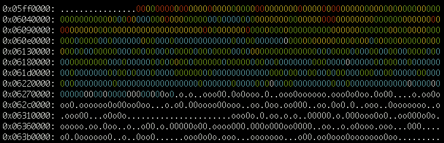
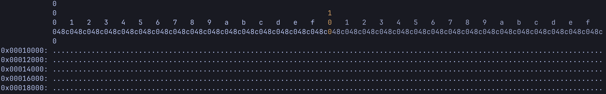

# Code Heatmaps

BOLT has gained the ability to print code heatmaps based on
sampling-based profiles generated by `perf`, either with `LBR` data or not.
The output is produced in colored ASCII to be displayed in a color-capable
terminal. It looks something like this:



Heatmaps can be generated for BOLTed and non-BOLTed binaries. You can
use them to compare the code layout before and after optimizations.

To generate a heatmap, start with running your app under `perf`:

```bash
$ perf record -e cycles:u -j any,u -- <executable with args>
```
or if you want to monitor the existing process(es):
```bash
$ perf record -e cycles:u -j any,u [-p PID|-a] -- sleep <interval>
```

Running with LBR (`-j any,u` or `-b`) is recommended. Heatmaps can be generated
from basic events by using the llvm-bolt-heatmap option `-nl` (no LBR) but
such heatmaps do not have the coverage provided by LBR and may only be useful
for finding event hotspots at larger code block granularities.

Once the run is complete, and `perf.data` is generated, run llvm-bolt-heatmap:

```bash
$ llvm-bolt-heatmap -p perf.data <executable>
```

By default the heatmap will be dumped to *stdout*. You can change it
with `-o <heatmapfile>` option.


If you prefer to look at the data in a browser (or would like to share
it that way), then you can use an HTML conversion tool. E.g.:

```bash
$ aha -b -f <heatmapfile> > <heatmapfile>.html
```

---

## Background on heatmaps:
A heatmap is effectively a histogram that is rendered into a grid for better
visualization.
In theory we can generate a heatmap using any binary and a perf profile.

Each block/character in the heatmap shows the execution data accumulated for
corresponding 64 bytes of code. You can change this granularity with a
`-block-size` option.
E.g. set it to 4096 to see code usage grouped by 4K pages.


When a block is shown as a dot, it means that no samples were found for that
address.
When it is shown as a letter, it indicates a captured sample on a particular
text section of the binary.
To show a mapping between letters and text sections in the legend, use
`-print-mappings`.
When a sampled address does not belong to any of the text sections, the
characters 'o' or 'O' will be shown.

The legend shows by default the ranges in the heatmap according to the number
of samples per block.
A color is assigned per range, except the first two ranges that distinguished by
lower and upper case letters.

On the Y axis, each row/line starts with an actual address of the binary.
Consecutive lines in the heatmap advance by the same amount, with the binary
size covered by a line dependent on the block size and the line size.
An empty new line is inserted for larger gaps between samples.

On the X axis, the horizontally emitted hex numbers can help *estimate* where
in the line the samples lie, but they cannot be combined to provide a full
address, as they are relative to both the bucket and line sizes.

In the example below, the highlighted `0x100` column is not an offset to each
row's address, but instead, it points to the middle of the line.
For the generation, the default bucket size was used with a line size of 128.





Some useful options are:

```
-line-size=<uint>   - number of entries per line (default 256)
-max-address=<uint> - maximum address considered valid for heatmap (default 4GB)
-print-mappings     - print mappings in the legend, between characters/blocks and text sections (default false)
```
