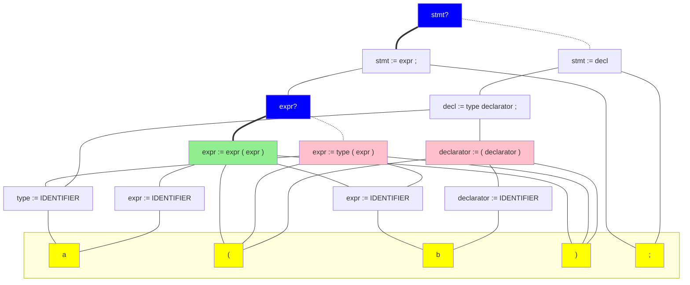
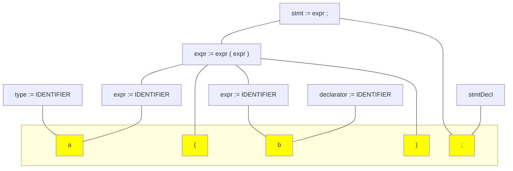
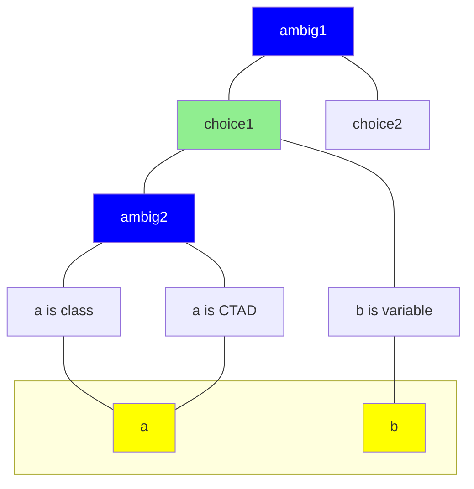
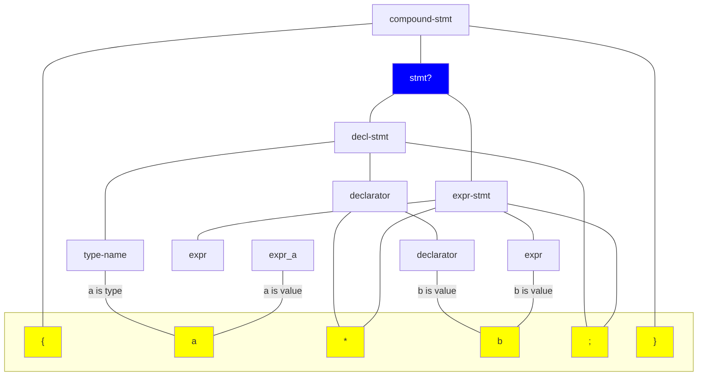
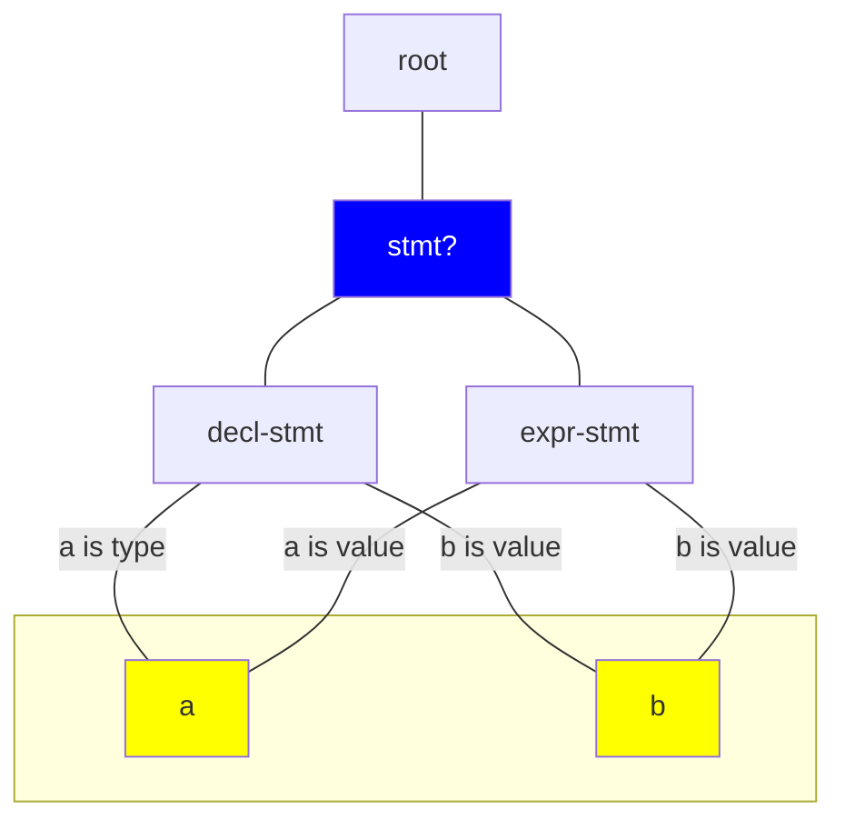

# Disambiguation

The C++ grammar is highly ambiguous, so the GLR parser produces a forest of
parses, represented compactly by a DAG.
A real C++ parser finds the correct parse through semantic analysis: mostly
resolving names. But we can't do that, as we don't parse the headers.

Our disambiguation phase should take the parse forest, and choose a single parse
tree that is most likely.
It might **optionally** use some other hints (e.g. coding style, or what
specific names tend to mean in this codebase).

There are some grammatical ambiguities that can be resolved without semantic
analysis, e.g. whether `int <declarator>{}` is a function-definition.
We eliminate these earlier e.g., with rule guards. By "disambiguation" we mean
choosing between interpretations that we can't reject confidently and locally.

## Types of evidence

We have limited information to go on, and strive to use similar heuristics a
human reader might.

### Likely and unlikely structure

In some cases, the shape of a particular interpretation is unlikely but not
impossible. For example, the statement `x(a);` might:

- call a function `x` (likely) 
- construct a temporary of class type `x` (less likely)
- define a variable `a` of type `x`, which is an alias for e.g. `int`
  (unlikely!)

We model this as a bonus/penalty for including a particular forest node in the
chosen parse. For each rule we want to apply, we can write some code to
recognize the corresponding pattern in the parse tree, and run these recognizers
at each node to assign the bonuses.

### Interpreting names

Just as resolving names allows a C++ parser to choose the right parse (rejecting
others), chunks of a parse tree imply things about how names resolve.

Because the same name often means the same thing in different contexts, we can
apply knowledge from elsewhere. This can be as simple as knowing "`vector` is
usually a type", and adding bonuses to nodes that include that interpretation.

However we can also transfer knowlegde across the same file we're parsing:

```cpp
// Is `Builder` a class or a namespace?
void Builder::build() { ... }
// ...
// `Builder` is a type.
Builder b;
```

We can use this to understand more-ambiguous code based on names in a section
we're more sure about. It also pushes us to provide a consistent parse, rather
than interpreting each occurrence of an unclear name differently.

Again, we can define bonuses/penalties for forest nodes that interpret names,
but this time those bonuses change as we disambiguate. Specifically:

- we can group identifiers into **classes**, most importantly "all identifiers
  with text 'foo'" but also "all snake_case identifiers".
- clusters of nodes immediately above the identifiers in the parse forest are
  **interpretations**, they bind the identifier to a **kind** such "type",
  "value", "namespace", "other".
- for each class we can query information once from an external source (such as
  an index or hard-coded list), yielding a vector of weights (one per kind)
- at each point we can compute metrics based on interpretations in the forest:
   - the number of identifiers in the class that are interpreted as each kind
     (e.g. *all* remaining interpretations of 'foo' at 3:7 are 'type')
   - the number of identifiers in the class that *may* be interpereted as each
     kind (e.g. 'foo' at 3:7 might be a 'type').
- we can mash these metrics together into a vector of bonuses for a class (e.g.
  for identifiers with text 'bar', 'type'=>+5, 'namespace'=>+1, 'value'=>-2).
- these bonuses are assigned to corresponding interpretations in the graph

### Templates

Another aspect of a name is whether it names a template (type or value). This 
is ambiguous in many more cases since CTAD allowed template arguments to be
omitted.

A fairly simple heuristic appears sufficient here: things that look like
templates usually are, so if a node for certain rules exists in the forest
(e.g. `template-id := template-name < template-argument-list >`) then we treat
the template name as a probable template, and apply a bonus to every node that
interprets it that way. We do this even if alternate parses are possible
(`a < b > :: c` might be a comparison, but is still evidence `a` is a template).

## Algorithm sketch

With static node scores, finding the best tree is a very tractable problem
with an efficient solution.
With dynamic scores it becomes murky and we have to settle for approximations.
These build on the same idea, so we'll look at the simple version first.

### Naive version (static scores)

At a high level, we want to assign bonuses to nodes, and find the tree that
maximizes the total score. If bonuses were fixed, independent of other
disambiguation decisions, then we could simply walk bottom-up, aggregating
scores and replacing each ambiguous node with the top-scoring alternative
subtree. This could happen directly on the parse tree.

Given this tree as input:



A post-order traversal reaches the ambiguous node `expr?` first.
The left alternative has a total score of +1 (green bonus for
`expr := expr (expr)`) and the right alternative has a total bonus of -1
(red penalty for `expr := type (expr)`). So we replace `expr?` with its left
alternative.

As we continue traversing, we reach `stmt?` next: again we have +1 in the left
subtree and -1 in the right subtree, so we pick the left one. Result:



### Degrees of freedom

We must traverse the DAG bottom-up in order to make score-based decisions:
if an ambiguous node has ambiguous descendants then we can't calculate the score
for that subtree.

This gives us a topological **partial** order, but we don't have to go from
left-to-right. At any given point there is a "frontier" of ambiguous nodes with
no ambiguous descendants. The sequence we choose matters: each choice adds
more interpretations that should affect future choices.

Initially, most of the ambiguous nodes in the frontier will be e.g. "is this
identifier a type or a value". If we had to work left-to-right then we'd
immediately be forced to resolve the first name in the file, likely with
little to go on and high chance of a mistake.
But there are probably names where we have strong evidence, e.g. we've seen an
(unambiguous) declaration of a variable `foo`, so other occurrences of `foo`
are very likely to be values rather than types. We can disambiguate these with
high confidence, and these choices are likely to "unlock" other conclusions that
we can use for further disambiguation.

This is intuitively similar to how people decipher ambiguous code: they find a
piece that's easy to understand, read that to learn what names mean, and use
the knowledge gained to study the more difficult parts.

To formalize this a little:
- we prioritize making the **highest confidence** decisions first
- we define **confidence** as the score of the accepted alternative, minus the
  score of the best rejected alternative.

### Removing the bottom-up restriction

Strictly only resolving "frontier" ambiguities may cause problems.
Consider the following example:



We have some evidence that `choice1` is good. If we selected it, we would know
that `b` is a variable and could use this in disambiguating the rest of the
file. However we can't select `choice1` until we decide exactly how to interpret
`a`, and there might be little info to do so. Gating higher-confidence decisions
on lower-confidence ones increases our chance of making an error.

A possible fix would be to generalize to a **range** of possible scores for
nodes above the frontier, and rank by **minimum confidence**, i.e. the highest
min-score of the accepted alternative, minus the highest max-score among the
rejected alternative.

## Details

The remaining challenges are mainly:
- defining the score function for an alternative. This is TBD, pending
  experiments.
- finding a data structure and algorithm to efficiently resolve/re-evaluate
  in a loop until we've resolved all ambiguities.

### Disambiguation DAG

Rather than operate on the forest directly, it's simpler to consider a reduced
view that hides complexity unrelated to disambiguation:

**Forest:**



**Ambiguity graph:**



Here the clusters of non-ambiguous forest nodes are grouped together, so that the DAG is bipartite with ambiguous/cluster nodes, and interpretation edges at the bottom.

Scoring the clusters and selecting which to include is equivalent to disambiguating the full graph.

### Resolving the ambiguity DAG

The static scores of the forest nodes are aggregated into static scores for the clusters.
The interpretation edges of the frontier clusters can be scored based on the context available so far, and the scores "bubble up" to parent nodes, with ambiguous nodes creating score ranges as described above.

The main dynamic signal is when a token has been fully resolved, which happens when all the interpretations leading to it have the same label.

The naive algorithm is to score all clusters, choose the best to resolve and repeat.
However this is very slow:
 - there are **many** ambiguities available at first, therefore many clusters to score
 - each time we resolve an ambiguity, we invalidate previously computed scores
 - while the clusters become fewer over time, there are more interpretations per cluster

It's tempting to use a priority queue to avoid repeatedly scanning clusters. However if we invalidate a large fraction of a heap's elements each round, we lose the efficiency benefits it brings.
We could reuse scores if the resolved cluster doesn't tell us much about the target cluster.
The simplest idea is to only recalculate clusters with an overlapping word, this may not save much (consider `std`) as clusters get larger.
A heuristic to estimate how much a cluster affects another may help.

To stop the clusters having too many interpretation edges (and thus take too long to score), we can drop the edges for any token that is fully resolved. We need to track these anyway (for scoring of interpretations of other identifiers with the same text). And once only a single interpretation exists, removing it has no impact on scores.

So for now the sketch is:
- build the ambiguity DAG
- compute scores for all clusters
- place confidences (score difference) for each cluster in a priority queue
- while there is still ambiguity:
  - take the most confident cluster C and resolve it
  - propagate the score change to all of C's ancestors
  - work out which identifiers are now resolved, record that and remove the interpretations from the graph
  - recompute scores for the K clusters most affected by resolving those identifiers, and their ancestors
