==========================
    ASTs for Templates
==========================

.. contents::
   :local:

.. role:: raw-html(raw)
    :format: html

.. comment: The *.ded diagrams used in this document can be edited with
            https://github.com/smcpeak/ded
            Note that diagram width should be kept under 1000 pixels,
            since otherwise there is a risk it will be demagnified by
            the browser, making it blurry.

.. comment: The graph data inside the diagrams can be regenerated with
            https://github.com/smcpeak/print-clang-ast

Preliminaries
=============

Document scope
--------------

This document assumes a general familiarity with at least the concept of
an abstract syntax tree (AST), and moderate familiarity with C++
templates.  Some familiarity with the Clang AST is helpful but not
necessary; but see :doc:`IntroductionToTheClangAST` and
:doc:`InternalsManual` (section "The AST Library") if you want some more
background before diving in.

The document's main focus is on how the language feature of templates is
represented in the Clang AST, especially in the form it takes after
parsing and semantic analysis is complete.  It also discusses
non-template-related AST features that the template infrastructure
relies upon, where the latter could not reasonably be understood without
the former.  But AST elements that are orthogonal to templates and not
conceptually foundational to them are described only briefly, or omitted
entirely.

This document currently omits discussion of some topics:

* Detailed discussion of the way templates affect the ``Expr``
  hierarchy.  Instead, this document is focused on the ``Decl``
  hierarchy.

* Template non-type parameters and template template parameters.

* Variable templates.

* Type alias templates.

* Variadic templates (and therefore parameter packs).

* Lambdas.

* Declaration nesting beyond two levels.  For example, it does not
  examine the case of a function template that contains an ordinary
  class, one of whose members is a template, as that is three levels of
  nesting.

* Template ``requires`` constraints.

* Concepts.

There is some overlap between material here and the comments in the
source code.  This document is meant to provide a complimentary overview
of the most important structures, while source code comments go into
greater detail, especially on more ancillary topics.

Documentation strategy
----------------------

The overall approach taken here is to focus on documenting the private
data members of the relevant AST classes, with only secondary importance
given to the public APIs.  This contrasts with the Doxygen-generated API
documentation, which only shows the APIs and omits private data
entirely.  The reason for the focus on the data is that it provides the
"ground truth" and conceptual framework needed to truly understand the
design.  On top of that foundation, the APIs can easily be learned
individually as needed.

We also document some physical memory allocation patterns, such as
trailing objects and "owner" pointers.  The reason is that, although an
AST consumer generally does not care where things are in memory, they
*do* care whether a piece of data is potentially shared with other AST
nodes, since that affects both how it is interpreted and what
modifications might be possible (for those trying to do source-to-source
using Clang at the AST level).  Trailing objects and owner pointers are
specifically *not* shared, and documenting them as such conveys the
non-shared nature.

Definitions of terms
--------------------

The terms used within the Clang AST generally align with those used in
the C++ standard.  Some key terms are listed below; the annotation
"(Clang)" means the term is specific to the Clang implementation:

* A *declaration* is, typically, a piece of syntax that introduces an
  entity such as a function or class into the program.  It also usually
  associates a name with that entity.  When dealing with the
  representation of templates, we're primarily dealing with
  declarations.  A declaration is a *syntactic* notion, and consequently
  has an associated location in the source code.

* A *definition* is a declaration that provides the operational details
  of the declared entity, such as the body of a function or the members
  of a class.  Every definition is also a declaration.

* (Clang) A *canonical declaration* is one particular declaration
  (usually the first in the translation unit) chosen to represent the
  entire set of declarations that all pertain to the same *semantic*
  entity.  The canonical declaration can thus be thought of as
  representing that semantic entity (as well as being one particular
  syntactic declaration of it).

* A *type* is a semantic property of an expression or declared entity.
  A non-dependent type constrains the set of allowable operations on the
  expression or entity.  Object types (as opposed to function types)
  also specify how many bytes of storage objects of that type occupy and
  how those bytes are interpreted as mathematical objects.  Because a
  type is a semantic notion, it (unlike a declaration) is not inherently
  tied to any particular source location.  However, in the Clang AST, a
  type that was defined using a declaration (such as a ``class`` or a
  ``typedef``) provides a way to navigate back to that declaration, and
  some AST nodes contain ``TypeLoc`` objects that augment a type with
  source location information for a particular syntactic description of
  a type.

* A *dependent type* is a type that depends in some way on template
  parameters for which an argument has not been supplied.  Generally,
  dependent types have fewer constraints on the set of allowable
  operations and less information about size and interpretation of their
  representation than do non-dependent types.

* (Clang) A *canonical type* is one constructed in such a way that two
  canonical types are semantically equivalent if and only if they are
  structurally identical.  For example, after ``typedef int MyInt;``,
  ``MyInt`` is semantically equivalent to ``int`` but (in the Clang AST)
  is not structurally identical because ``MyInt`` knows its user-defined
  name and declaration location, so it is not canonical.  Given an
  arbitrary type, the Clang API has methods (such as
  ``QualType::getCanonicalType()``) to get the corresponding canonical
  type.

* A *template* is a kind of declaration, represented as an object that
  is (in most cases) a subtype of ``TemplateDecl``.  It corresponds to
  the ``template <class T> ...`` syntax.  Its effect is to define a
  family of classes, functions, or a few other kinds of things, related
  by the parameterization in the template declaration.  We say (e.g.)
  "class template", not "template class", to emphasize that we are
  referring to the template.

* Immediately inside a template declaration is the *templated* entity;
  notice the final "d" in "templated".  Metaphorically, you start with
  (say) an ordinary class declaration, and then wrap ``template <...>``
  around it, hence the past tense "-ed" ending.  The templated entity is
  generic in the sense that it refers to the parameters introduced by
  the template declaration, but for which arguments have not been
  supplied.  We say "templated class" to emphasize that we are referring
  to the class inside the template declaration.

  * (Clang) The standard term "templated" applies to anything inside the
    template declaration, but in Clang AST terminology it refers to the
    one declaration immediately inside.

* (Clang) A *pattern* is another name for a templated declaration.  This
  term is used to emphasize the role it plays as the basis of
  instantiation.

* An *instantiation* of a template is a declaration synthesized, by the
  compiler, by substituting template arguments for corresponding
  template parameters within a templated entity.  Instantiation can be
  *explicit*, meaning it was requested by the programmer using dedicated
  syntax, or *implicit*, meaning it was a consequence of how the
  template was used.  An instantiation is the output of an *algorithm*.

* A *specialization* of a template is a declaration that is associated
  with that template and with a particular sequence of template
  arguments.  A specialization can be *explicit*, meaning it was
  directly provided by the programmer, or *implicit*, meaning it was the
  result of instantiation.  A specialization is the *name* of an entity.

The relationship between those last two is potentially confusing due to
all the similar terminology.  It can be summarized with this concept
hierarchy:

* A specialization, e.g., ``C<int>``, is one of:

  * Explicit specialization, which is written by the programmer, for
    example: :raw-html:` `
    ``template <> class C<int> {...};``

  * Implicit specialization, a synonym for instantiation, which is one
    of:

    * Explicit instantiation, which is directly requested by the
      programmer, for example: :raw-html:` `
      ``template class C<int>;``

    * Implicit instantiation, which is induced by usage:
      :raw-html:` `
      ``C<int> someVariable;``

Continuing the terminology:

* A *member specialization* is a specialization of an element of a
  template that arises because the template is instantiated.  The
  element could be a member of a class or it could be a declaration
  inside a function template, although the terminology is based on the
  former case.  The member itself may or may not be a template, and the
  member specialization may be implicit or explicit.  If the member is a
  template, specialization as a member is distinct from specialization
  of the member template itself.  For example, explicit member
  specialization effectively replaces the entire member within its
  containing class, whereas explicit (template) specialization provides
  a definition of that member for a particular template argument
  sequence.  Consequently, logically, member specialization happens
  before template specialization.  Another way to think about it is to
  regard member specialization as specialization with respect to the
  template parameters of the containing the template, while template
  specialization operates with respect to the parameters of the template
  itself (if it is one).

  * (Clang) The standard does not use the term "member specialization"
    directly, but it's a modest extrapolation from
    `temp.expl.spec <https://wg21.link/temp.expl.spec>`_.  However,
    that extrapolation does not include elements inside a function
    template, whereas the Clang term does.

* (Clang) A *class scope specialization* is an explicit specialization
  declaration that appears inside the body of a (possibly templated)
  class definition.  When the enclosing class is templated, the
  semantics are different from an explicit specialization outside the
  class body because the class scope specialization is then subject to
  instantiation.

External AST sources
--------------------

ASTs can be created either by parsing source code or by loading them
from an "external source" such as a serialized AST file.  In a number of
places, the AST has a "lazy" pointer to an AST node, meaning it can be
an ordinary pointer, or it can contain a numeric ID used to locate the
node in an external source.  When a node is loaded from an external
source, the ID in a lazy pointer is replaced by an ordinary pointer, and
subsequent accesses follow the pointer normally.

In this document, we will ignore the possibility of loading from an
external source, and assume the AST was created by parsing source code.
Consequently, we document "lazy" pointers as if they were always
ordinary pointers.

Function templates
==================

We'll start by looking at how function templates and their related
entities are represented, since they are significantly simpler than
class templates, which will be discussed later.  Consider this
translation unit:

.. code-block:: c++

    template <class T>
    T identity(T t)
    {
      return t;
    }

If we call this file ``test.cc`` and dump its AST like so:

.. code-block:: console

    $ clang -Xclang -ast-dump -fsyntax-only test.cc

we get output like this::

    TranslationUnitDecl 0x563d45cd1ac8 <<invalid sloc>> <invalid sloc>
    | [...]
    `-FunctionTemplateDecl 0x563d45d18d60 <test.cc:1:1, line:5:1> line:2:3 identity
      |-TemplateTypeParmDecl 0x563d45d18af0 <line:1:11, col:17> col:17 referenced class depth 0 index 0 T
      `-FunctionDecl 0x563d45d18cb8 <line:2:1, line:5:1> line:2:3 identity 'T (T)'
        |-ParmVarDecl 0x563d45d18bc0 <col:12, col:14> col:14 referenced t 'T'
        `-CompoundStmt 0x563d45d18eb0 <line:3:1, line:5:1>
          `-ReturnStmt 0x563d45d18ea0 <line:4:3, col:10>
            `-DeclRefExpr 0x563d45d18e80 <col:10> 'T' lvalue ParmVar 0x563d45d18bc0 't' 'T'

The primary objects of interest are ``FunctionTemplateDecl``,
``TemplateTypeParmDecl``, ``FunctionDecl``, and ``ParmVarDecl``.  We'll
look at each in turn.

``FunctionTemplateDecl``
------------------------

At a high level, ``FunctionTemplateDecl`` has three key pieces of data:

* A sequence of template parameters.

* A pointer to the templated function declaration.

* The set of specializations, both implicit and explicit.

That's probably enough to know on a first reading of this document, so
you may want to skip the remainder of this section and come back later
to study these foundational details.  This pattern is repeated
throughout this document: for each type of object, there is a brief,
high-level description, followed by details that are skippable on a
first read.  The details always begin with the inheritance hierarchy,
so that's the natural choice point regarding what to read when.

Let's dig into ``FunctionTemplateDecl``.  Its inheritance structure is::

    Class Name                                  Header
    ------------------------------------------  --------------
    FunctionTemplateDecl                        DeclTemplate.h
      RedeclarableTemplateDecl                  DeclTemplate.h
        TemplateDecl                            DeclTemplate.h
          NamedDecl                             Decl.h
            Decl                                DeclBase.h
        Redeclarable<RedeclarableTemplateDecl>  Redeclarable.h

The Doxygen-generated documentation focuses on the public methods, but
it is hard to tell how things really work by looking at that.  Instead,
we need to look at the private data structure definitions.  The fields
of ``FunctionTemplateDecl``, simplified a little by giving names to
fields stored in the low bits of pointers, are:

* From base class ``Decl``:

  * ``Decl *NextInContext`` and
    ``PointerUnion<DeclContext*, MultipleDC*> DeclCtx``: Parent
    and sibling links to form the ``DeclContext`` tree.  ``DeclCtx`` can
    be either one or two parent pointers, the latter for the case of an
    entity defined outside its semantically containing class or
    namespace.

  * ``SourceLocation Loc``: Source code location.

  * Various flags, including ``unsigned DeclKind : 7``, an indicator of
    what kind of object this is (the Clang AST does not use C++ RTTI for
    performance and flexibility reasons).

* From base class ``NamedDecl``:

  * ``DeclarationName Name``: The name of the template, which is the
    same as the name of the templated declaration.

* From base class ``TemplateDecl``:

  * ``NamedDecl *TemplatedDecl``: The templated declaration, which for
    ``FunctionTemplateDecl`` will be a ``FunctionDecl``.

  * ``TemplateParameterList *TemplateParams``: The template parameters.
    (This is only the "inner" list of parameters directly associated
    with the declared entity; see ``DeclaratorDecl`` for the "outer"
    lists associated with qualifiers in the name.) This list is
    physically part of the ``TemplateDecl`` object, using the "trailing
    objects" technique (see ``llvm::TrailingObjects``).  The parameter
    list contains:

    * ``SourceLocation TemplateLoc, LAngleLoc, RAngleLoc``: Locations of
      key bits of syntax.

    * ``unsigned NumParams``: The number of parameters.

    * A few flags indicating which optional elements of a parameter
      list, such as a parameter pack, are present.

    * The parameters themselves, as an array of ``NamedDecl *``.  A
      template parameter must be a
      ``TemplateTypeParmDecl``,
      ``NonTypeTemplateParmDecl``, or
      ``TemplateTemplateParmDecl``; ``NamedDecl`` is the most specific
      type that encompasses all three.

    * An optional ``requires`` clause, as an ``Expr *``.

* From base class ``Redeclarable<RedeclarableTemplateDecl>``, which uses
  the name ``decl_type`` to refer to its template parameter:

  * ``decl_type *First`` and ``decl_type *Previous``: Pointers to the
    first and previous elements in a circular list of declarations of
    the same template.  Beware: The terminology within ``Redeclarable``
    is confusing, as the "*previous* declaration"
    (``Redeclarable::getPreviousDecl()``) is the same thing as the
    "*next* **RE**\ declaration"
    (``Redeclarable::getNextRedeclaration()``).

* From base class ``RedeclarableTemplateDecl``:

  * ``CommonBase *Common``: A pointer to data that is shared with other
    redeclarations of the same template.
    ``RedeclarableTemplateDecl::CommonBase`` contains:

    * ``PointerIntPair<RedeclarableTemplateDecl*, 1, bool> InstantiatedFromMember``:
      Two elements:

      * ``RedeclarableTemplateDecl*``:
        If this template is a member specialization of a member template
        of a class template, this points to the member template from
        which it was instantiated.  An example is shown in
        `Diagram: Class template contains function template: Instantiation`_.
        Otherwise, it is ``nullptr``.

      * ``bool explicitMemberSpec``:
        The member specialization can be explicit, and when it is, this
        flag is set.  See
        `Diagram: Class template contains function template: Explicit member specialization`_
        for an example.
        Beware: The value of this flag is readable via the public method
        ``RedeclarableTemplateDecl::isMemberSpecialization()``, but that
        name is misleading because it is only true if the member
        specialization is *explicit*.

    * ``uint32_t *LazySpecializations``: A pointer to an array of IDs
      that can be used to load specializations of this template from an
      external source.  It is ``nullptr`` for ASTs created by parsing
      rather than loading.

    * ``TemplateArgument *InjectedArgs``: An array of "injected"
      template arguments.  For each template parameter, its injected
      argument is a template argument that simply uses that parameter as
      the argument.  This allows substituting a parameter for itself,
      which is useful when we want to substitute arguments for
      parameters at one level while leaving those at another level
      unaffected.  This pointer is only non-``nullptr`` if
      ``RedeclarableTemplateDecl::getInjectedTemplateArgs()`` has been
      called.

  * When the ``RedeclarableTemplateDecl`` is a
    ``FunctionTemplateDecl``, then the ``Common`` pointer points to an
    instance of ``FunctionTemplateDecl::Common``, which in addition to
    the fields of ``CommonBase``, contains:

    * ``FoldingSetVector<FunctionTemplateSpecializationInfo>
      Specializations``: Set of specializations (both explicit and
      implicit) of this function template.  When a specialization has
      multiple declarations, only one of them appears in this list.

For the example fragment above, the most important relations are:

* ``TemplatedDecl`` points at the ``FunctionDecl`` inside it.

* ``TemplateParams`` points at the ``TemplateTypeParmDecl``.

* ``Redeclarable::Previous`` points to itself, meaning there are no
  other redeclarations.

* ``RedeclarableTemplateDecl::Common->Specializations`` is empty because
  there are no specializations.

``TemplateTypeParmDecl``
------------------------

At a high level, ``TemplateTypeParmDecl`` declares a new dependent type,
for use within the scope of the template, whose concrete details are
known only when a template argument is supplied.  The type is
represented by a ``TemplateTypeParmType`` object whose most important
piece of data is simply a pointer back to the corresponding
``TemplateTypeParmDecl``.

The class hierarchy for ``TemplateTypeParmDecl`` is::

    Class Name                              Header             Novel?
    --------------------------------------  -----------------  ------------
    TemplateTypeParmDecl                    DeclTemplate.h     yes
      TypeDecl                              Decl.h             yes
        NamedDecl                           Decl.h             no
          Decl                              DeclBase.h         contextually
      TrailingObjects<..., TypeConstraint>  TrailingObjects.h  yes
        TypeConstraint                      ASTConcept.h       yes

In this table, "Novel?" indicates whether the class is novel in the
sense of not having already been discussed previously in this document.
"Contextually" means the class was discussed, but something about it is
different in this context.

Technically, ``TrailingObjects<TemplateTypeParmDecl, TypeConstraint>``
does not inherit ``TypeConstraint``, but it arranges for a
``TypeConstraint`` object to be contiguously allocated after the
``TemplateTypeParmDecl`` if one is needed.  Consequently, it acts like
an optional field.

The fields of ``TemplateTypeParmDecl`` are:

* Those from bases ``NamedDecl`` and ``Decl``, discussed above.
  However:

  * As explained above, ``Decl`` has a pointer to its containing
    ``DeclContext``.  But for a template parameter, its ``DeclContext``
    is *not* the (outer) template declaration, but is instead the
    (inner) template\ **d** declaration.  That is because none of the
    ``TemplateDecl`` classes are ``DeclContext``\ s.  But the template
    parameter is not added to the list of child declarations of its (or
    any) ``DeclContext``, presumably because it is very different from
    the normal declaration children of a function (namely, parameters)
    or class (namely, class members).

* From ``TypeDecl``:

  * ``Type *TypeForDecl``: The ``Type`` object this declaration
    introduces.  In this case it is a ``TemplateTypeParmType``, and that
    points back to the ``TemplateTypeParmDecl``.
    ``TemplateTypeParmType`` can be a "canonical" type, lacking a
    pointer to the declaration; this is discussed below, at
    `Canonical TemplateTypeParmType`_.

  * ``SourceLocation LocStart``: Location of the start of the type
    declaration.  In ``template <class T> ...``, the start of the
    template type parameter declaration is the "c" in ``class``.

* From ``TypeConstraint`` (when present):

  * Imposes a constraint on any template argument for this parameter.
    The details are, for now, beyond the scope of this document.

* In ``TemplateTypeParmDecl`` itself:

  * ``bool Typename``: True if ``typename`` was used to declare the
    parameter, false if ``class`` was.

  * ``bool HasTypeConstraint``: True if there is a type constraint,
    which means there is an associated ``TypeConstraint`` member.

  * ``bool TypeConstraintInitialized``:
    If false, which can be due to a syntax error, the type constraint is
    effectively ignored.

  * ``bool ExpandedParameterPack``:
    True if this parameter is an expanded parameter pack.  Parameter
    packs are, for now, outside the scope of this document.

  * ``unsigned NumExpanded``: The number of type parameters in an
    expanded parameter pack.

It is also worth noting that ``TemplateTypeParmDecl`` does not have a
direct pointer to its ``TemplateDecl``.  Instead, to navigate to the
``TemplateDecl``, one must use ``DeclCtx`` to get to the templated
entity, then figure out which kind of thing that is (function, class,
etc.), then use its pointer to the template (in the case of a function,
that is the ``TemplateOrSpecialization`` field).

``FunctionDecl``
----------------

A ``FunctionDecl`` declares, and optionally defines, a function.  There
are three main kinds of template-associated ``FunctionDecl`` nodes:

* The templated function in a ``FunctionTemplateDecl``, which provides
  the pattern from which instantiation can proceed.

* A specialization of a function template, resulting either from
  instantiation or explicit specialization of a template declaration.
  This is discussed further under `FunctionTemplateSpecializationInfo`_.

* A specialization of a member (method) of a class template, where the
  method itself may or may not also be a template.  This is discussed
  further under `MemberSpecializationInfo`_.

In all three cases, the ``FunctionDecl`` has a pointer to the structure
that describes its template-ness.

Additionally, the parameters and body of a template-associated
``FunctionDecl`` can refer to ``TemplateTypeParmType`` objects, as they
mark the places that will be substituted during instantiation.  (They
can also refer to non-type and template template parameters, but those
are currently out of the scope of this document).

The class hierarchy for ``FunctionDecl`` is::

    Class Name                     Header          Novel?
    -----------------------------  --------------  ------------
    FunctionDecl                   Decl.h          yes
      DeclaratorDecl               Decl.h          yes
        ValueDecl                  Decl.h          yes
          NamedDecl                Decl.h          no
            Decl                   DeclBase.h      contextually
      DeclContext                  DeclBase.h      yes
      Redeclarable<FunctionDecl>   Redeclarable.h  no

The fields of ``FunctionDecl`` are:

* Those from bases ``NamedDecl``, ``Decl``, and ``Redeclarable``,
  already discussed above, except:

  * ``Decl::DeclCtx`` for the templated declaration is the same as for
    its template declaration (whereas one might naively expect the
    templated declaration to use the template declaration as its
    context).  In the example above, that is the
    ``TranslationUnitDecl``.

* From ``ValueDecl``:

  * ``QualType DeclType``: The type of the declared entity.  For a
    ``FunctionDecl``, the type will be a ``FunctionType``.  This type
    may refer to ``TemplateTypeParmType`` types, indicating where in the
    type substitution will occur when the template is instantiated, and
    providing a way to navigate back to the ``TemplateTypeParmDecl``.

* From ``DeclaratorDecl``:

  * ``TypeSourceInfo *TInfo``: Augments the ``DeclType`` with source
    location information, indicating where in the source code this
    particular declaration denotes the type.  It can be ``nullptr``, for
    example for the destructor of a lambda.

  * Optional ``ExtInfo *``: A structure with extra information needed
    when a function is defined outside its class body, or has a trailing
    ``requires`` clause.  It has these data members:

    * From base ``QualifierInfo``, which describes the namespace and
      class scope qualifiers appearing in front of the declared name:

      * ``NestedNameSpecifierLoc QualifierLoc``: The scope qualifier
        and its source location information.  This will be empty in the
        case where the ``ExtInfo`` was necessitated by having a
        ``requires`` clause but the name was not qualified.

      * ``unsigned NumTemplParamLists``:
        The number of "outer" or "qualifier-associated" template
        parameter lists, i.e., those not directly associated with the
        declared entity.  The count includes all of the template
        parameter lists that were matched against the template-ids
        occurring in the ``NestedNameSpecifier`` of a qualified name,
        plus possibly (in the case of an explicit specialization) a
        final ``template <>``.

      * ``TemplateParameterList** TemplParamLists``: Pointer to an
        array of ``NumTemplParamLists`` parameter list objects.  The
        array is owned by the ``QualifierInfo`` object.

    * ``Expr *TrailingRequiresClause``: Optional ``requires`` clause, or
      ``nullptr`` if there is none.

  * ``SourceLocation InnerLocStart``: The start of the source range for
    this declaration, ignoring outer template declarations.

* From ``DeclContext``:

  * ``DeclContextBits``: Contains several flags that are not important
    to the implementation of templates.  However, for the purpose of
    understanding core AST mechanics, it is worth noting that
    ``DeclContextBits`` also stores the ``DeclKind`` in order to allow
    ``dyn_cast`` from ``DeclContext`` to ``Decl``, since that requires
    knowing the most-derived type, and ``DeclContext`` is independently
    inherited by many ``Decl`` subclasses.  It should, of course, agree
    with ``Decl::DeclKind``.

  * ``StoredDeclsMap *LookupPtr``:
    Nullable pointer to a map of the context's members for efficient
    lookup.

  * ``Decl *FirstDecl, *LastDecl``: List of ``Decl`` objects directly
    contained by this ``DeclContext``.  For a ``FunctionDecl``, these
    are the function parameters.  (Local variables are contained by
    a ``CompoundStmt`` or similar inside the function body.)

* In ``FunctionDecl`` itself:

  * ``FunctionDeclBits``: When a ``DeclContext`` is a
    ``FunctionDecl``, the ``DeclContextBits`` bitfield is extended to
    contain additional bits specific to function declarations.  Most of
    the flags are not related to templates, but two are:

    * ``IsLateTemplateParsed``: True if the body has been tokenized but
      not parsed.  It will be parsed when the end of the translation
      unit is reached.  This can only happen if the
      ``LangOptions::DelayedTemplateParsing`` flag is set, which happens
      when the ``-fdelayed-template-parsing`` command line option is
      present.  (Beware: The Doxygen documentation does not include the
      ``LangOptions`` flags; see ``clang/Basic/LangOptions.def``
      instead.)

    * ``InstantiationIsPending``: True if this is an instantiation
      (created due to implicit or explicit demand), but the body has not
      yet been seen.  If the definition is never seen, then the flag
      remains set at the end of parsing.

  * ``ParmVarDecl **ParamInfo``: Owned array of pointers to the formal
    parameters of this function.

  * Anonymous union discriminated by
    ``FunctionDeclBits.HasDefaultedFunctionInfo``:

    * ``LazyDeclStmtPtr Body`` (``Has...==0``): A pointer to the body
      of the function, or ``nullptr`` if the declaration does not have
      a body.

    * ``DefaultedFunctionInfo *DefaultedInfo`` (``Has...==1``): Pointer
      to information about the ``= default`` definition of this
      function.  Since the semantics of default definitions is
      orthongonal to that of templates, this document will not spend
      time on ``DefaultedFunctionInfo``, other than to note that the
      object is physically shared between a function and its
      instantiation when the required contents for both are the same.

  * ``unsigned ODRHash``: A hash of the AST structure, used to detect
    when definitions differ between translation units (i.e., violations
    of the "One Definition Rule" (ODR)).

  * ``SourceLocation EndRangeLoc``: The location of the end of the
    (conceptual) declaration.  If a function body is present, then this
    is the location of the close-brace.  Otherwise, it is the location
    of the last character of the token preceding the semicolon or comma
    that terminates the declarator.

  * ``SourceLocation DefaultKWLoc``: The location of the ``default``
    keyword in a defaulted definition; otherwise, invalid.

  * ``PointerUnion<...> TemplateOrSpecialization``:
    Pointer union with, effectively, six cases, corresponding to the
    elements of the ``FunctionDecl::TemplatedKind`` enumeration:

    * ``nullptr`` (corresponding to ``TK_NonTemplate``): None of the
      cases below apply.

    * ``NamedDecl *`` that is a ``FunctionDecl *``
      (``TK_DependentNonTemplate``): This non-templated function is declared
      directly inside the body of a function template.  The pointer
      points to the enclosing templated function.

    * ``NamedDecl *`` that is a ``FunctionTemplateDecl *``
      (``TK_FunctionTemplate``): This is a templated function, and the
      pointer points to the enclosing function template.

    * ``MemberSpecializationInfo *`` (``TK_MemberSpecialization``):
      This is a non-templated member function of a class template.  The
      pointer points to additional information that describes the
      relationship between this member function and its containing class
      template.

    * ``FunctionTemplateSpecializationInfo *``
      (``TK_FunctionTemplateSpecialization``): This is a specialization
      of a function template.  The pointer has additional information
      about the specialization, including the template arguments.

    * ``DependentFunctionTemplateSpecializationInfo *``
      (``TK_DependentFunctionTemplateSpecialization``): This can only
      appear as the target of a ``friend`` declaration, and represents a
      set of candidate templates and a sequence of dependent template
      arguments.  Resolution of both, to a particular concrete
      specialization, is delayed until the enclosing class template is
      instantiated.  See
      `Diagram: Class template contains friend function template specialization`_
      for an example.

  * ``DeclarationNameLoc DNLoc``: Additional location and type
    information for the ``NamedDecl::Name`` field.  For example, if this
    function is a conversion operator like ``operator int** ()``, then
    ``DNLoc`` has details about where and how ``int**`` was described,
    although interpreting those details requires the name itself; see
    the ``getNameInfo()`` method.

``ParmVarDecl``
---------------

A ``ParmVarDecl`` is a declaration of a function parameter.  For the
purpose of this document, the most important thing is its
``ValueDecl::DeclType`` can be or refer to a ``TemplateTypeParmType``.

``ParmVarDecl`` has this inheritance diagram::

    Class Name                 Header          Novel?
    -------------------------  --------------  ------------
    ParmVarDecl                Decl.h          yes
      VarDecl                  Decl.h          yes
        DeclaratorDecl         Decl.h          no
          ValueDecl            Decl.h          contextually
            NamedDecl          Decl.h          no
              Decl             DeclBase.h      no
        Redeclarable<VarDecl>  Redeclarable.h  no

Its fields are:

* Those from ``DeclaratorDecl``, ``ValueDecl``, ``NamedDecl``,
  ``Decl``, and ``Redeclarable``, discussed above.  With respect to
  templates, the main notable thing is that ``ValueDecl::DeclType`` is a
  ``TemplateTypeParmType`` in the ``identity`` function template example
  under consideration.

* From ``VarDecl``:

  * ``PointerUnion<Stmt *, EvaluatedStmt *> Init``: Pointer to
    the initializer or default argument.  The details are orthogonal to
    templates, so omitted here.

  * ``VarDeclBits``: Describes storage class and initialization syntax,
    neither of which is particularly relevant for templates.

  * ``ParmVarDeclBitFields``: Most of the values are not related to
    templates, but one is:

    * ``unsigned DefaultArgKind : 2``: A value of an enumeration, also
      called ``DefaultArgKind``.  One of the possibilities is
      ``DAK_Uninstantiated``, which signifies a default argument whose
      instantiation has been delayed.  This is used for tricky cases
      like a lambda with a default argument that is itself a lambda with
      dependent type, all inside a template.  Since it involves lambda,
      further details are outside the current scope of this document.

* From ``ParmVarDecl``:

  * ``ParmVarDeclBits``: A set of flags and small fields, none of which
    is directly relevant to templates.

.. comment: Sema::SubstParmVarDecl() has an example of DAK_Uninstantiated.

Diagram: Function template: Definition
--------------------------------------

The following diagram shows the AST objects involved in representing a
single function template:

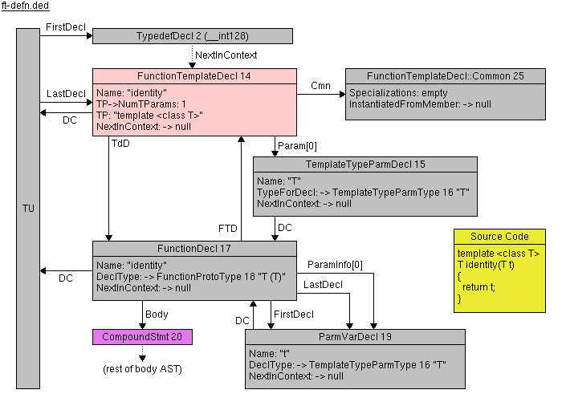

In this diagram, and all that follow, the peach-colored node is the most
important, "focus" node.  Here, it is the ``FunctionTemplateDecl 14``
node corresponding to the template declaration.  (The numbers in the box
titles are arbitrary, being artifacts of the process by which the
diagram was created.)

Observations:

* The ``TypedefDecl`` shown at the top is first of several implicitly
  defined typedefs that appear at the start of every translation unit.
  Their ``NextInContext`` chain ends with ``FunctionTemplateDecl 14``.

* ``FunctionTemplateDecl 14`` and ``FunctionDecl 17`` point to each
  other.

* ``FunctionDecl 17`` has a pointer to the ``Body`` that gives the
  definition of the behavior of the function, which in this case is a
  templated "pattern" to instantiate.  In this and subsequent diagrams,
  nodes in the ``Stmt`` hierarchy (which includes ``Expr``) are colored
  purple to visually distinguish them from the gray used for ``Decl``
  nodes (and decl-associated nodes like ``Common``).

* There are no specializations in ``FunctionTemplateDecl::Common 25``.

* ``TemplateTypeParmDecl 15`` uses the template\ **d** function as its
  ``DeclContext``.

Function template instantiation
-------------------------------

Let's now add a use of the ``identity`` template that will induce it to
be instantiated:

.. code-block:: c++

    template <class T>
    T identity(T t)
    {
      return t;
    }

    int caller(int x)
    {
      return identity(x);
    }

Now dumping its AST:

.. code-block:: text

    $ clang -Xclang -ast-dump -fsyntax-only test.cc
    TranslationUnitDecl 0x560469a80ba8 <<invalid sloc>> <invalid sloc>
    | [...]
    |-FunctionTemplateDecl 0x560469ac7cb0 <test.cc:1:1, line:5:1> line:2:3 identity
    | |-TemplateTypeParmDecl 0x560469ac7a40 <line:1:11, col:17> col:17 referenced class depth 0 index 0 T
    | |-FunctionDecl 0x560469ac7c08 <line:2:1, line:5:1> line:2:3 identity 'T (T)'
    | | |-ParmVarDecl 0x560469ac7b10 <col:12, col:14> col:14 referenced t 'T'
    | | `-CompoundStmt 0x560469ac7e00 <line:3:1, line:5:1>
    | |   `-ReturnStmt 0x560469ac7df0 <line:4:3, col:10>
    | |     `-DeclRefExpr 0x560469ac7dd0 <col:10> 'T' lvalue ParmVar 0x560469ac7b10 't' 'T'
    | `-FunctionDecl 0x560469ac8178 <line:2:1, line:5:1> line:2:3 used identity 'int (int)'
    |   |-TemplateArgument type 'int'
    |   | `-BuiltinType 0x560469a80cb0 'int'
    |   |-ParmVarDecl 0x560469ac80b8 <col:12, col:14> col:14 used t 'int':'int'
    |   `-CompoundStmt 0x560469ac83d0 <line:3:1, line:5:1>
    |     `-ReturnStmt 0x560469ac83c0 <line:4:3, col:10>
    |       `-ImplicitCastExpr 0x560469ac83a8 <col:10> 'int':'int' <LValueToRValue>
    |         `-DeclRefExpr 0x560469ac8388 <col:10> 'int':'int' lvalue ParmVar 0x560469ac80b8 't' 'int':'int'
    `-FunctionDecl 0x560469ac7f00 <line:7:1, line:10:1> line:7:5 caller 'int (int)'
      |-ParmVarDecl 0x560469ac7e30 <col:12, col:16> col:16 used x 'int'
      `-CompoundStmt 0x560469ac8370 <line:8:1, line:10:1>
        `-ReturnStmt 0x560469ac8360 <line:9:3, col:20>
          `-CallExpr 0x560469ac8320 <col:10, col:20> 'int':'int'
            |-ImplicitCastExpr 0x560469ac8308 <col:10> 'int (*)(int)' <FunctionToPointerDecay>
            | `-DeclRefExpr 0x560469ac8280 <col:10> 'int (int)' lvalue Function 0x560469ac8178 'identity' 'int (int)' (FunctionTemplate 0x560469ac7cb0 'identity')
            `-ImplicitCastExpr 0x560469ac8348 <col:19> 'int' <LValueToRValue>
              `-DeclRefExpr 0x560469ac7ff8 <col:19> 'int' lvalue ParmVar 0x560469ac7e30 'x' 'int'

The ``FunctionTemplateDecl`` has the same structure as before, except
that it has a second ``FunctionDecl`` child with type ``int (int)``.
We also have a ``FunctionDecl`` for ``caller``.

``DeclRefExpr`` pointing at an instantiation
--------------------------------------------

A ``DeclRefExpr`` is an expression that refers to a declaration,
typically a variable or function parameter.  Within ``caller``, there is
a ``DeclRefExpr`` representing the ``identity`` expression of the
``identity(x)`` call site.  In this case, there are two notable fields
relevant to templates:

* ``ValueDecl *DeclRefExpr::D``: The primary declaration that this node
  references, ``D`` points at the *instantiated* ``FunctionDecl``.

* ``NamedDecl *DeclRefExpr::FoundDecl``, physically part of a
  ``TrailingObjects`` base class: The declaration found during name
  lookup, when different from ``D``.  Its presence is indicated by
  ``DeclRefExprBits.HasFoundDecl`` being true.  Here, ``FoundDecl``
  points at the ``FunctionTemplateDecl``.

Aside from this node, the rest of ``caller`` is not affected by the use
of templates.

``FunctionTemplateSpecializationInfo``
--------------------------------------

Although it is not shown in the AST dump, the there is an important node
sitting between the ``FunctionTemplateDecl`` and the instantiation
``FunctionDecl``, namely the ``FunctionTemplateSpecializationInfo``
(FTSI).  It is an element of the
``RedeclarableTemplateDecl::Specializations`` set, which itself is
stored in the ``Common`` node shared by all redeclarations of the
template.

The FTSI acts as a parent node of a ``FunctionDecl`` that is a
specialization of a template; there is one FTSI record for each
specialization of a given function template in the translation unit.  It
contains these fields:

* ``void *FoldingSetNode::NextInFoldingSetBucket``:
  The pointer that allows this FTSI to be stored in the
  ``Specializations`` data structure.  The fact that this pointer is
  stored in the FTSI means a given FTSI can only be in one such
  container, and thus FTSI can be logically regarded as a child node of
  ``Common``.  (But note that a specialization ``FunctionDecl`` also
  points at its associated FTSI, so it is not entirely encapsulated.)

* ``PointerIntPair<FunctionDecl *, 1, bool> Function``:
  A pointer to the specialization, along with a ``bool`` that is true
  if this is a "member specialization", meaning the optional
  ``MemberSpecializationInfo*`` trailing object is present.

* ``PointerIntPair<FunctionTemplateDecl *, 2> Template``:
  A pointer to the template, along with the
  ``TemplateSpecializationKind``, which distinguishes explicit from
  implicit specializations, and among the latter, whether the
  instantiation was implicit, explicit as a declaration (meaning no
  definition is synthesized for this TU), or explicit as a definition.

* ``const TemplateArgumentList *TemplateArguments``: Pointer to the
  template arguments, which act as the name of this specialization in
  the context of its template.

* ``const ASTTemplateArgumentListInfo *TemplateArgumentsAsWritten``:
  Optional pointer to template argument syntax.

* ``SourceLocation PointOfInstantiation``:
  The point at which this function template specialization was
  first instantiated.

* Optional trailing object ``MemberSpecializationInfo *``:
  When present in an FTSI, this is an explicit specialization that arose
  via member specialization, and the ``MemberSpecializationInfo`` record
  has the details of the member specialization. See
  `Diagram: Class template contains function template: Class scope specialization`_
  for an example.

The instantiation ``FunctionDecl``
----------------------------------

In most respects, the instantiated ``FunctionDecl`` looks just like an
ordinary, directly written function definition.  However, its
``FunctionDecl::TemplateOrSpecialization`` field (which, recall, is a
pointer union) contains a ``FunctionTemplateSpecializationInfo*`` that
points at the FTSI describing this specialization.

Thus, the procedure for finding this specialization is to first find its
``FunctionTemplateDecl``, then look up the template argument list
``<int>`` among its ``Common->Specializations`` to get the FTSI, and
finally follow the FTSI's ``Function`` pointer.

To reverse the procedure, one follows the FTSI pointer stored in
``FunctionDecl``, then the ``Template`` pointer of FTSI.

Diagram: Function template: Instantiation
-----------------------------------------

The following diagram shows the major objects involved in representing a
function that has been implicitly instantiated:

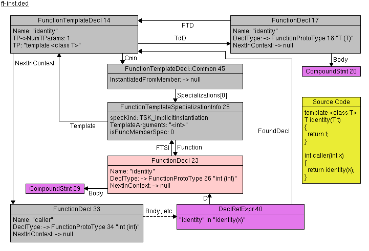

In this diagram, all of the pointers related to scoping and lookup have
been removed in order to focus on the template relationships.

The essence of this diagram is the three objects in the middle:
``Common``, FTSI, and ``FunctionDecl``.  ``Common`` has the list of all
specializations, and the FTSI/``FunctionDecl`` pair represent one such
specialization.

The ``DeclRefExpr`` that caused the instantiation is shown, with its two
pointers, one to the found template definition and the other to the
resulting instantiated definition.

Diagram: Ordinary class contains function template: Definition
--------------------------------------------------------------

A method of a non-templated class can be templated:

.. code-block:: c++

    struct S {
      template <class T>
      T identity(T t)
      {
        return t;
      }
    };

The object interaction diagram is similar to the case for a global
function template:

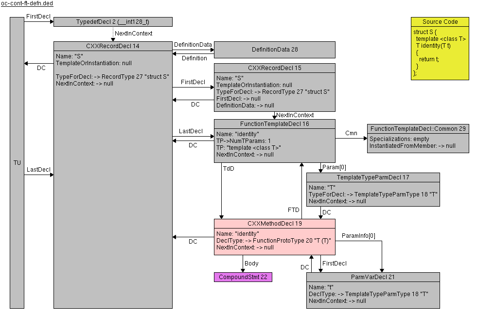

The changes from the function template case are:

* A ``CXXRecordDecl`` now plays the role of the declaration context for
  the template and its templated declaration, instead of the
  ``TranslationUnitDecl``.  The declaration child list, implemented with
  ``FirstDecl``, ``NextInContext``, and ``LastDecl``, contains the class
  members.  The role of ``CXXRecordDecl::TemplateOrInstantiation`` will
  be discussed below, but here it is simply ``nullptr`` because this
  class is neither templated nor a specialization.

* The ``CXXRecordDecl`` has an associated ``DefinitionData`` structure.
  All redeclarations of a given class share the same ``DefinitionData``
  instance (or are all ``nullptr`` if there is no definition), and
  ``DefinitionData::Definition`` points back to a particular
  ``CXXRecordDecl``.  However, ``DefinitionData`` doesn't have anything
  relevant to templates except for the relatively obscure
  ``LambdaDefinitionData::DependencyKind``, so we will mostly ignore the
  contents of ``DefinitionData`` in this document.

* The first member is another ``CXXRecordDecl``.  This represents the
  "injected class name".  For class templates, this is plays an
  important role because it is the reason one can write ``C`` instead of
  ``C<T>`` to name the templated class type while within its scope.
  However, for a class that merely contains a method template, the
  injected class name works the same as for a class without any
  templates.

* The templated entity is now a ``CXXMethodDecl`` instead of a
  ``FunctionDecl``.  However, ``CXXMethodDecl`` does not add any new
  data, and the bits of ``FunctionDeclBitfields`` that pertain
  exclusively to methods (such as ``IsVirtualAsWritten``) are orthogonal
  to template concerns.  Method templates use the same data structures
  as function templates.

Thus, we can safely understand this case as being essentially the same
as the function template case, just in a different scope.  Even when the
method template is instantiated, there are no new features.

Class templates
===============

We'll start with a simple example of a class template by itself, with
no methods:

.. code-block:: c++

    template <class T>
    struct S {
      T data;
      S *ptr1;
      S<T> *ptr2;
    };

The AST dump looks like::

    TranslationUnitDecl 0x55980437cc78 <<invalid sloc>> <invalid sloc>
    | [...]
    `-ClassTemplateDecl 0x5598043c9298 <tmp.cc:7:1, line:12:1> line:8:8 S
      |-TemplateTypeParmDecl 0x5598043c9120 <line:7:11, col:17> col:17 referenced class depth 0 index 0 T
      `-CXXRecordDecl 0x5598043c91e8 <line:8:1, line:12:1> line:8:8 struct S definition
        |-DefinitionData aggregate standard_layout trivially_copyable trivial
        | |-DefaultConstructor exists trivial needs_implicit
        | |-CopyConstructor simple trivial has_const_param needs_implicit implicit_has_const_param
        | |-MoveConstructor exists simple trivial needs_implicit
        | |-CopyAssignment simple trivial has_const_param needs_implicit implicit_has_const_param
        | |-MoveAssignment exists simple trivial needs_implicit
        | `-Destructor simple irrelevant trivial constexpr needs_implicit
        |-CXXRecordDecl 0x5598043c9508 <col:1, col:8> col:8 implicit referenced struct S
        |-FieldDecl 0x5598043c95c8 <line:9:3, col:5> col:5 data 'T'
        |-FieldDecl 0x5598043c96c8 <line:10:3, col:6> col:6 ptr1 'S<T> *'
        `-FieldDecl 0x5598043c9818 <line:11:3, col:9> col:9 ptr2 'S<T> *'

We have a ``ClassTemplateDecl`` on the outside and a templated
``CXXRecordDecl`` on the inside, similar to the ``FunctionTemplateDecl``
and ``FunctionDecl`` pair.  Additionally, we have some ``FieldDecl``\ s
with interesting types.

``ClassTemplateDecl``
---------------------

At a high level, ``ClassTemplateDecl`` has four key pieces of data:

* A template parameter list.
* A pointer to the templated ``CXXRecordDecl``.
* A set of (full) specializations.
* A set of partial specializations, a feature that function templates
  lack.

``ClassTemplateDecl`` has the following inheritance hierarchy::

    Class Name                                  Header          Novel?
    ------------------------------------------  --------------  ------------
    ClassTemplateDecl                           DeclTemplate.h  yes
      RedeclarableTemplateDecl                  DeclTemplate.h  contextually
        TemplateDecl                            DeclTemplate.h  contextually
          NamedDecl                             Decl.h          no
            Decl                                DeclBase.h      no
        Redeclarable<RedeclarableTemplateDecl>  Redeclarable.h  no

All of the base classes have been described above, and the descriptions
apply here too, except:

* ``NamedDecl *TemplateDecl::TemplatedDecl`` points to a
  ``CXXRecordDecl`` (instead of a ``FunctionDecl``).

* ``CommonBase *RedeclarableTemplateDecl::Common`` points to a
  ``ClassTemplateDecl::Common`` (instead of a
  ``FunctionTemplateDecl::Common``).

``ClassTemplateDecl`` does not directly add any data fields.
However, it declares ``ClassTemplateDecl::Common`` as an extension of
``RedeclarableTemplateDecl::CommonBase``, adding these fields:

* ``FoldingSetVector<ClassTemplateSpecializationDecl> Specializations``:
  Set of full specializations, both implicit and explicit.

* ``FoldingSetVector<ClassTemplatePartialSpecializationDecl> PartialSpecializations``:
  Set of partial specializations (which are always explicit).

* ``QualType InjectedClassNameType``:
  The type of the
  `injected-class-name <https://wg21.link/class.pre#2>`_
  for this class template.

The ``Common::Specializations`` field is approximately analogous to the
``Specializations`` field in ``FunctionTemplateDecl::Common``.  However,
while the latter points to an intermediate
``FunctionTemplateSpecializationInfo`` (FTSI) node that in turn points
at the specialization ``FunctionDecl``, for classes, the
``Specializations`` set directly contains the
``ClassTemplateSpecializationDecl`` nodes.

* Design rationale: The reason for this difference is that
  ``FunctionDecl`` has a subclass hierarchy for various kinds of methods
  that is orthogonal to template-ness, so we cannot subclass it to
  represent template specializations (without creating an "inheritance
  diamond problem"), and therefore use a separate auxiliary structure
  (the FTSI) to store the data related to specialization.  But, in a
  universe without templates, ``CXXRecordDecl`` does not have any
  subclasses, so we can represent specializations by subclassing.

``Common::InjectedClassNameType`` is a ``TemplateSpecializationType``
whose ``Template`` member refers to the canonical ``ClassTemplateDecl``.
Note the difference between ``InjectedClassNameType`` (ICNT) and
``TemplateSpecializationType`` (TST): An ICNT is syntactically denoted
``C``, while a TST is denoted ``C<T>``.  The ICNT is specifically a
short alias for a TST, usable only within the scope of the template,
somewhat like writing ``typedef C<T> C;`` as a member declaration (if
that was legal).

Furthermore, the templated ``CXXRecordDecl`` has as its
``Type *TypeDecl::TypeForDecl`` an ``InjectedClassNameType`` whose
``InjectedType`` is the same as ``Common::InjectedClassNameType``.

``CXXRecordDecl``
-----------------

A ``CXXRecordDecl`` declares or defines a C++ ``class`` or ``struct`` or
``union``.  With respect to templates, ``CXXRecordDecl`` plays the same
three basic roles that ``FunctionDecl`` did:

* The templated class of a class template declaration.

* A specialization, whether implicit, explicit, or partial.  In these
  cases, the ``CXXRecordDecl`` object is a base class subobject of
  a ``ClassTemplateSpecializationDecl`` or
  ``ClassTemplatePartialSpecializationDecl``.

* A member specialization, as a member of an instantiation of an outer
  class template.

``CXXRecordDecl`` is also used to represent the injected-class-name
inside the class, although that mechanism is mostly orthogonal to
templates.

``CXXRecordDecl`` has the following inheritance hierarchy::

    Class Name                   Header          Novel?
    ---------------------------  --------------  ------------
    CXXRecordDecl                DeclCXX.h       yes
      RecordDecl                 Decl.h          yes
        TagDecl                  Decl.h          yes
          TypeDecl               Decl.h          contextually
            NamedDecl            Decl.h          no
              Decl               DeclBase.h      no
          DeclContext            DeclBase.h      contextually
          Redeclarable<TagDecl>  Redeclarable.h  no

Whenever we have a defined (possibly templated) class, there are always
two ``CXXRecordDecl`` objects at hand.  One is the real definition,
recognizable as having ``TagDecl::TagDeclBits.IsCompleteDefinition``,
and the other is the injected-class-name, recognizable as *not* having
``IsCompleteDefinition``, and instead having ``Decl::Implicit``.
(``RecordDecl::isInjectedClassName()`` checks a few other things, but
those are the key bits.)  The descriptions below apply to both of these
objects except where indicated.

Be aware that even though it has the same ``TypeForDecl`` (as explained
below), the injected-class-name is *not* considered a redeclaration of
the definition ``CXXRecordDecl``.  Again, it's more like a ``typedef``
that aliases the class, rather than a redeclaration of it.  Since there
is no syntax to do so, the injected-class-name never has any
redeclarations (other than itself).

The novel fields (and novel meanings of fields for this context) of
``CXXRecordDecl`` are:

* From ``TypeDecl``:

  * ``Type *TypeForDecl``: For a non-templated class, ``TypeForDecl`` is
    a ``RecordType`` pointing back at that class.  But for a templated
    class, on both the definition object and the injected-name-object,
    ``TypeForDecl`` is an ``InjectedClassNameType`` with fields
    that name the templated class, its enclosing template, and template
    arguments for all parameters:

    * ``CXXRecordDecl *Decl``: Pointer to the templated
      ``CXXRecordDecl``.

    * ``QualType InjectedType``: A ``TemplateSpecializationType``
      with fields:

      * ``TemplateName Template``: A name with kind ``Template`` that
        points at the enclosing ``ClassTemplateDecl``.

      * Trailing ``TemplateArguments`` objects formed by converting each
        template parameter into a template argument naming that
        parameter.

  * ``SourceLocation LocStart``: The location of the keyword that
    introduced the type, such as ``class`` or ``struct``.

* From ``DeclContext``:

  * ``StoredDeclsMap *LookupPtr``:
    Map for looking up structure members by name.  The definition
    ``CXXRecordDecl`` always has at least the injected-class-name in the
    map (and member list).  The injected-class-name object has
    ``nullptr``.

  * ``Decl *FirstDecl``, ``Decl *LastDecl``:
    For a ``RecordDecl``, these point to the first and last members of
    the structure.  The members' ``Decl::NextInContext`` pointers form a
    linked list containing all of the members.

* From ``TagDecl``:

  * ``TagDeclBitfields TagDeclBits``:

    * ``TagTypeKind TagDeclKind``: The keyword that introduced the type,
      such as ``struct`` or ``union``.

    * ``bool IsCompleteDefinition``: True for the declaration that also
      is a definition.  False for the injected-class-name.

    * Several other flags that are orthogonal to templates.

  * ``SourceRange BraceRange``: If this is a definition, this range
    goes from the opening brace to the closing brace.  Otherwise it is
    invalid.

  * ``PointerUnion<TypedefNameDecl *, ExtInfo *> TypedefNameDeclOrQualifier``:
    Cases:

    * ``TypedefNameDecl *``: Used for name mangling of a
      ``CXXRecordDecl`` when the class is anonymous.  This is case not
      relevant to templates because templates cannot be anonymous.

    * ``ExtInfo *``, where ``ExtInfo`` is an alias for ``QualifierInfo``:
      Used for definitions of class members (that are themselves
      classes) appearing outside their parent class body.  The details
      are discussed above, under `FunctionDecl`_.

    * ``nullptr``: Used in the common case where neither of the
      preceding apply.  The injected-class-name always has ``nullptr``.

* From ``RecordDecl``:

  * ``RecordDeclBitfields RecordDeclBits``:
    Several flags, all of which are orthogonal to templates.

* From ``CXXRecordDecl``:

  * ``struct DefinitionData *DefinitionData``: Pointer to data that
    describes the definition, or ``nullptr`` if there is no definition
    (and for the injected-class-name).  All redeclarations of the same
    class share a single ``DefinitionData``.  It has these data members:

    * A large number of flags declared in
      ``CXXRecordDeclDefinitionBits.def``, all of which are orthogonal
      to templates.  These flags generally indicate which optional
      features are present in the class, like private fields or a
      user-defined destructor.

    * The sets of base classes and conversion functions, which are also
      orthogonal to templates, except that we must be mindful of the
      possibility that they contain dependent types.

    * A few other miscellaneous bits, like ``ODRHash`` and
      ``FirstFriend``, that are orthogonal to templates.

    * ``CXXRecordDecl *Definition``:
      Pointer to the definition syntax among the set of redeclarations
      of this (possibly templated) class.
      ``Definition->TagDeclBits.IsCompleteDefinition`` is ``true``.

  * In the case that this class represents a lambda, the
    ``DefinitionData`` is actually the ``LambdaDefinitionData``
    subclass.  This subclass has:

    * ``LambdaDependencyKind DependencyKind``:
      From among {always, never, unknown}, this indicates whether the
      lambda is dependent despite appearing in a non-dependent
      context.  See the documentation for
      ``CXXRecordDecl::isDependentLambda()`` for more information.  The
      case where this matters is fairly obscure, so won't be further
      considered in this document.

    * ``bool IsGenericLambda``:
      When true, the class is a generic lambda (C++20 7.5.5p5).  The
      class itself is not templated, but its ``operator()`` is.

    * Other fields that are orthogonal to templates, with the caveat
      that where types appear, they could be dependent (for example, in
      ``TypeSourceInfo *MethodTyInfo``).

  * ``PointerUnion<...> TemplateOrInstantiation``:
    This is the most important template-related field in
    ``CXXRecordDecl``.  It has these cases:

    * ``ClassTemplateDecl *``: This is a templated class, and the
      pointer refers to the enclosing template declaration.  The
      injected-class-name *also* points to the enclosing template
      declaration.

    * ``MemberSpecializationInfo *``:
      For a member specialization of a member of a template class, the
      corresponding `MemberSpecializationInfo`_ details.

    * ``nullptr``: Neither of the above apply.

``FieldDecl``
-------------

In a template context, what is interesting about a ``FieldDecl`` is its
``ValueDecl::DeclType`` field, which specifies the type, potentially in
terms of ``TemplateTypeParmType`` and ``InjectedClassNameType`` nodes.

The inheritance hierarchy for ``FieldDecl`` is::

    Class Name              Header          Novel?
    ----------------------  -------         ------------
    FieldDecl               Decl.h          yes
      DeclaratorDecl        Decl.h          no
        ValueDecl           Decl.h          contextually
          NamedDecl         Decl.h          no
            Decl            DeclBase.h      no
      Mergeable<FieldDecl>  Redeclarable.h  yes

The novel fields and interpretations in the context of a ``FieldDecl``
inside a class template are:

* From ``ValueDecl``:

  * ``QualType DeclType``:
    The field type.  In our example, we have three cases:

    * Type written ``T``, as for ``data``:
      This is a ``TemplateTypeParmType`` whose ``TTPDecl`` field points
      at the ``TemplateTypeParmDecl`` in the template parameter list.

    * Type written ``S``, as for ``ptr1``:
      This is an ``ElaboratedType`` that points at an
      ``InjectedClassNameType`` that points at a
      ``TemplateSpecializationType``.  The ``InjectedClassNameType::Decl``
      field points at the definition (outer) ``CXXRecordDecl``, while
      the ``TemplateSpecializationType::Template`` field points at
      the ``ClassTemplateDecl``.  The ``TemplateSpecializationType``
      is the most general way of naming the type, while the
      ``InjectedClassNameType`` is the convenience alias for use within
      the class.

    * Type written ``S<T>``, as for ``ptr2``:
      This is again an ``ElaboratedType``, but now it points directly to
      the ``TemplateSpecializationType`` because the convenience alias
      has been bypassed.

* From ``Mergeable``:

  * This is just a marker interface class without any data.

* From ``FieldDecl``:

  * Everything in ``FieldDecl`` itself is orthogonal to templates, and
    not interesting to examine in that context, so omitted here.

The key idea here, applicable to all class members (not just
``FieldDecl``, which is merely representative), is that, within a class
template, the template parameters are in scope as types, as is the class
itself, which can be named in two different (but semantically
equivalent) ways.

Canonical ``TemplateTypeParmType``
----------------------------------

As explained above, the type of the ``data`` field within the template
is a ``TemplateTypeParmType`` whose ``TTPDecl`` field points at the
``TemplateTypeParmDecl`` node at the top of the template declaration.
But this type node is not *canonical*, because semantically the
same type can be introduced again, potentially with a different name.

Consider this example:

.. code-block:: c++

    template <class T1, class U1>
    struct S {
      int f(T1 t1, U1 u1);             // Overload #1
      int f(U1 u1, T1 t1);             // Overload #2
    };

    template <class T2, class U2>
    int S<T2,U2>::f(T2 t2, U2 u2)      // Overload #1
    {
      return (int)sizeof(t2) - (int)sizeof(u2);
    }

    template <class T3, class U3>
    int S<T3,U3>::f(U3 u3, T3 t3)      // Overload #2
    {
      return (int)sizeof(u3) - (int)sizeof(t3);
    }

The compiler has to be able to associate each definition with its
corresponding declaration despite none of the parameter names matching.
This motivates the introduction of a second variant of
``TemplateTypeParmType``, one that is by construction canonical, known
by the abbreviation ``CanTTPT``.

Rather than refer to a particular syntactic declaration of
a template parameter, a ``CanTTPT`` uses a (depth, index) numbering
scheme, where the depth indicates how many templates the parameter of
interest is nested inside, and the index is the parameter's index within
the parameter list at the desired depth.

In the above example, ``T1``, ``T2``, and ``T3`` all use
``CanTTPT(0,0)`` as their canonical type (which
``QualType::getAsString()`` renders as ``type-parameter-0-0``), while
``U1``, ``U2``, and ``U3`` all use ``CanTTPT(0,1)``.

Diagram: Class template: Definition
-----------------------------------

Let's now diagram the AST relationships for the example with a single
class template, first focusing on the ``Decl`` objects:

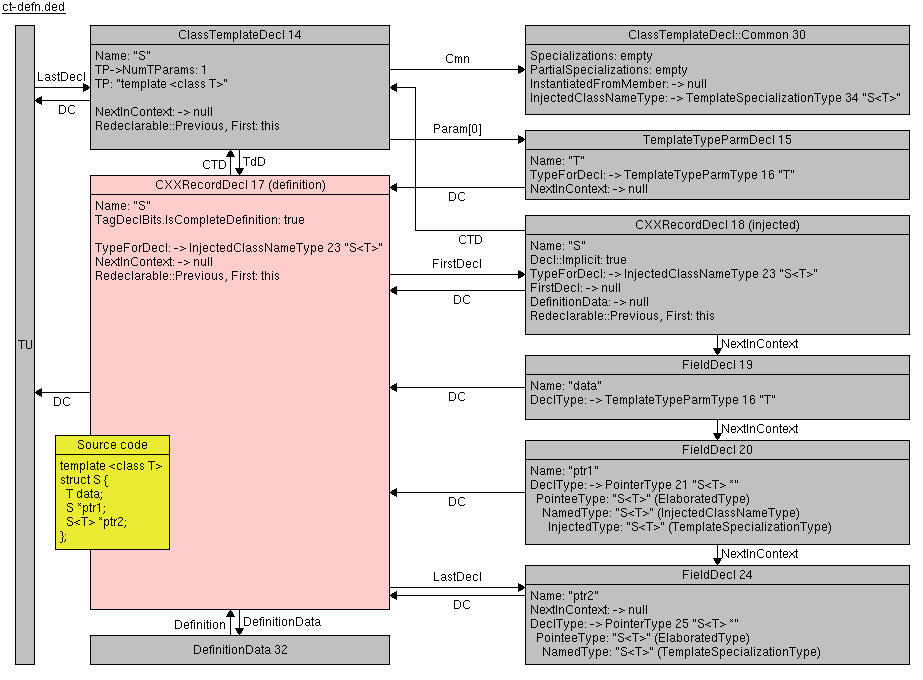

The most essential observations are:

* We have both a ``ClassTemplateDecl`` and a (definition)
  ``CXXRecordDecl`` that point at each other.

* The template declaration has a ``Common`` object that, in this
  example, has no ``Specializations``.

* This class template is represented in the type system as either a
  ``TemplateSpecializationType`` or as its alias,
  ``InjectedClassNameType`` (which points at the TST).

This diagram focuses on the relationships among the ``Type`` objects:

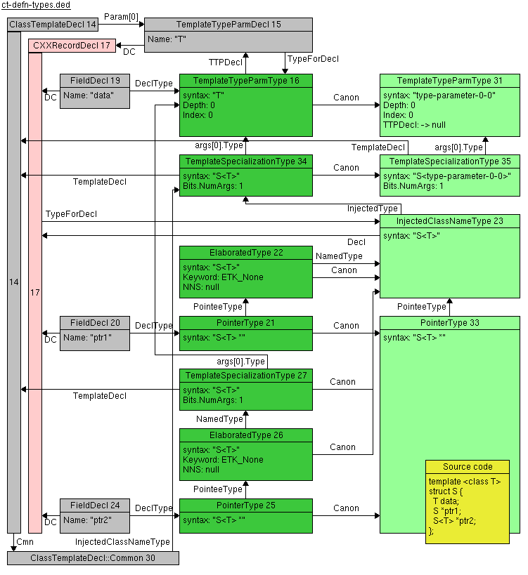

The green boxes are ``Type`` nodes.  Lighter green means the ``Type`` is
canonical.

The main thing to observe is the parallel structure between the
non-canonical types, which use user-defined names for template
parameters, and canonical types, which exclusively use the depth/index
scheme for template parameters.

Class template instantiation
----------------------------

Now let's look at an instantiation of a class template:

.. code-block:: c++

    template <class T>
    struct S {
      T data;
      S *ptr1;
      S<T> *ptr2;
    };

    S<int> s;       // Implicit instantiation of S.

The AST key parts of the dump are::

    TranslationUnitDecl 0x55b01971ac78 <<invalid sloc>> <invalid sloc>
    | [...]
    |-ClassTemplateDecl 0x55b0197671c8 <tmp.cc:1:1, line:6:1> line:2:8 S
    | |-TemplateTypeParmDecl 0x55b019767050 <line:1:11, col:17> col:17 referenced class depth 0 index 0 T
    | |-CXXRecordDecl 0x55b019767118 <line:2:1, line:6:1> line:2:8 struct S definition
    | | |-DefinitionData aggregate standard_layout trivially_copyable trivial
    | | | `-[...]
    | | |-CXXRecordDecl 0x55b019767438 <col:1, col:8> col:8 implicit referenced struct S
    | | |-FieldDecl 0x55b0197674f8 <line:3:3, col:5> col:5 data 'T'
    | | |-FieldDecl 0x55b0197675f8 <line:4:3, col:6> col:6 ptr1 'S<T> *'
    | | `-FieldDecl 0x55b019767748 <line:5:3, col:9> col:9 ptr2 'S<T> *'
    | `-ClassTemplateSpecializationDecl 0x55b0197677d0 <line:1:1, line:6:1> line:2:8 struct S definition
    |   |-DefinitionData pass_in_registers aggregate standard_layout trivially_copyable pod trivial literal has_constexpr_non_copy_move_ctor
    |   | `-[...]
    |   |-TemplateArgument type 'int'
    |   | `-BuiltinType 0x55b01971ad80 'int'
    |   |-CXXRecordDecl 0x55b019767ad0 <col:1, col:8> col:8 implicit struct S
    |   |-FieldDecl 0x55b019767bc0 <line:3:3, col:5> col:5 data 'int':'int'
    |   |-FieldDecl 0x55b019767cb8 <line:4:3, col:6> col:6 ptr1 'S<int> *'
    |   |-FieldDecl 0x55b019767de8 <line:5:3, col:9> col:9 ptr2 'S<int> *'
    |   |-CXXConstructorDecl 0x55b019786698 <line:2:8> col:8 implicit used constexpr S 'void () noexcept' inline default trivial
    |   | `-CompoundStmt 0x55b019786bf8 <col:8>
    |   |-CXXConstructorDecl 0x55b019786810 <col:8> col:8 implicit constexpr S 'void (const S<int> &)' inline default trivial noexcept-unevaluated 0x55b019786810
    |   | `-ParmVarDecl 0x55b019786930 <col:8> col:8 'const S<int> &'
    |   `-CXXConstructorDecl 0x55b019786a10 <col:8> col:8 implicit constexpr S 'void (S<int> &&)' inline default trivial noexcept-unevaluated 0x55b019786a10
    |     `-ParmVarDecl 0x55b019786b30 <col:8> col:8 'S<int> &&'
    `-VarDecl 0x55b0197679a8 <line:8:1, col:8> col:8 s 'S<int>':'S<int>' callinit
      `-CXXConstructExpr 0x55b019786d10 <col:8> 'S<int>':'S<int>' 'void () noexcept'

The original ``ClassTemplateDecl`` is still there, but now it has a
``ClassTemplateSpecializationDecl`` child, which is the instantiation.
The instantiation has the same constituents as the templated
``CXXRecordDecl``, plus three implicitly-defined ``CXXConstructorDecl``
nodes.  Finally there is the ``VarDecl`` that caused the instantiation.

We'll look at each of these in turn.

``ClassTemplateSpecializationDecl``
-----------------------------------

A ``ClassTemplateSpecializationDecl`` has four main pieces:

* A class declaration, as an embedded ``CXXRecordDecl`` subobject.

* A pointer to the primary class template it specializes.

* The template arguments that identify the specialization in the context
  of the primary.

* For the case of an instantiation of a partial specialization, a
  pointer to the partial and the arguments that apply to that partial.

The inheritance hierarchy for ``ClassTemplateSpecializationDecl`` is::

    Class Name                       Header          Novel?
    -------------------------------  --------------  ------------
    ClassTemplateSpecializationDecl  DeclTemplate.h  yes
      CXXRecordDecl                  DeclCXX.h       contextually
        RecordDecl                   Decl.h          no
          TagDecl                    Decl.h          no
            TypeDecl                 Decl.h          contextually
              NamedDecl              Decl.h          no
                Decl                 DeclBase.h      no
            DeclContext              DeclBase.h      no
            Redeclarable<TagDecl>    Redeclarable.h  no
      FoldingSetNode                 FoldingSet.h    yes

``ClassTemplateSpecializationDecl`` represents (as the name suggests) a
specialization of a class template, either explicit or implicit.  It
inherits ``CXXRecordDecl``, so can be treated like a class in its own
right.  It has these novel fields or interpretations:

* From base ``CXXRecordDecl``:

  * ``PointerUnion<...> TemplateOrInstantiation``:
    Three cases:

    * ``ClassTemplateDecl *``:
      This is a templated class, and the pointer points to the template
      declaration.  If this is *also* a member specialization, then the
      ``ClassTemplateDecl`` has information about the original member.

    * ``MemberSpecializationInfo *``:
      This is a non-templated class that is a member of an instantiation
      of a class template (that is, it is a member specialization).  The
      MSI record points at the member of the class template that was
      instantiated or the subject of explicit member specialization,
      and indicates which of those it was.

    * ``nullptr``:
      None of the above applies; that is, this is not a templated class,
      nor a member specialization of a class template member.

* From base ``TypeDecl``:

  * ``Type *TypeForDecl``:
    The ``Type`` of a class template specialization, when seen "from the
    inside" via this field, is simply a ``RecordType`` whose
    ``TagDecl *TagType::decl`` field points at the
    ``ClassTemplateSpecializationDecl``.  That is, from the type
    system perspective, it's just a class.

* From base ``llvm::FoldingSetNode``, which is an alias for
  ``llvm::FoldingSetBase::Node``:

  * ``void *NextInFoldingSetBucket``:
    Analogous to
    ``FunctionTemplateSpecializationInfo::NextInFoldingSetBucket``,
    this pointer allows the ``ClassTemplateSpecializationDecl`` to be
    linked into the ``ClassTemplateDecl::Common::Specializations`` set
    carried by the template declaration.

* In ``ClassTemplateSpecializationDecl`` itself:

  * ``PointerUnion<...> SpecializedTemplate``:
    Two cases:

    * ``ClassTemplateDecl *``:
      For a specialization of a primary class template, this points to
      that primary template.

    * ``SpecializedPartialSpecialization *``:
      For an instantiation of a class template partial specialization
      (note that explicit specialization of a partial specialization is
      not possible; an attempt at such a thing would simply be treated
      as an explicit specialization of the primary template), this field
      points to a ``SpecializedPartialSpecialization`` structure that
      has:

      * ``ClassTemplatePartialSpecializationDecl *PartialSpecialization``:
        The partial specialization that was instantiated.

      * ``const TemplateArgumentList *TemplateArgs``:
        The template arguments, corresponding to the parameters of the
        partial specialization (not the primary), with which the partial
        was instantiated.  There is an example below, in
        `Diagram: Class template: Partial specialization`_.

    * ``nullptr`` is *not* a possibility here.

  * ``ExplicitSpecializationInfo *ExplicitInfo``:
    For an implicit instantiation, such as in the example we are
    currently studying, this is ``nullptr``.  For an explicit
    specialization (including a partial specialization), or an explicit
    instantiation, this points to an ``ExplicitSpecializationInfo``
    structure, which contains:

    * ``TypeSourceInfo *TypeAsWritten``:
      The specialization type as written in the source code, along with
      location information for various syntactic elements of that type
      description.  Usually this is a ``TemplateSpecializationType``.

    * ``SourceLocation ExternLoc``:
      If this is an
      `explicit instantiation declaration <https://wg21.link/temp.explicit#2>`_,
      this is set to the location of the ``extern`` keyword; otherwise
      it is invalid.

    * ``SourceLocation TemplateKeywordLoc``:
      The location of the ``template`` keyword that introduced this
      explicit specialization or instantiation.

  * ``const TemplateArgumentList *TemplateArgs``:
    Template arguments, corresponding to the parameters of the primary
    template, that identify this specialization in the context of that
    primary template.

  * ``SourceLocation PointOfInstantiation``:
    The point where this template was instantiated.

  * ``TemplateSpecializationKind SpecializationKind``:
    Distinguishes explicit specialization and the various kinds of
    instantiation.

The first member of the ``ClassTemplateSpecializationDecl`` is the
``CXXRecordDecl`` for its injected-class-name.  Like the
``ClassTemplateSpecializationDecl``, the injected-class-name has
``TypeDecl::TypeForDecl`` that is a ``RecordType`` pointing at the
``ClassTemplateSpecializationDecl``.

The main takeaways here are:

* Within the type system, ``ClassTemplateSpecializationDecl`` is like a
  class, and referred to using a ``RecordType`` by declarations inside
  the class.

* It is *named* by combining the name of the primary template and a
  sequence of template arguments.  Navigating to the primary template is
  usually direct, but goes through an auxillary structure for the case
  of an instantiation of a partial specialization.

* It is *created* either through explicit specialization or by
  instantiation from a template (which could be the primary, or could be
  a partial specialization).

``FieldDecl``
-------------

Let's now revisit ``FieldDecl`` within the instantiation.  The main
field of interest is ``QualType ValueDecl::DeclType``:

* For the ``data`` member, ``DeclType`` is a
  ``SubstTemplateTypeParmType``, which records that a particular type
  was the result of substituting a template argument, and has several
  fields of interest:

  * ``SubstTemplateTypeParmTypeBitfields SubstTemplateTypeParmTypeBits``:

    * ``bool HasNonCanonicalUnderlyingType``:
      If true, the replacement type is non-canonical, and stored as a
      trailing object.  Otherwise, the replacement is simply the
      canonical type, which is stored in the
      ``ExtQualsTypeCommonBase::CanonicalType`` field.

    * ``unsigned Index``:
      The index, within the instantiated template, of the template
      parameter that was substituted.

    * ``unsigned PackIndex``:
      Identifies the substituted element within a parameter pack, if
      any.  The details are, for now, outside the scope of this
      document.

  * ``Decl *AssociatedDecl``:
    Typically, this is the instantiation created by substituting the
    template argument for its parameter in the specialized template.
    In this case, it points at the ``ClassTemplateSpecializationDecl``,
    from which it is possible to navigate to the template.

  * The substituted ``QualType``, stored either as a trailing object or
    in ``ExtQualsTypeCommonBase::CanonicalType``, and available from the
    ``getReplacementType()`` method.  The ``SubstTemplateTypeParmType``
    is semantically an alias for the replacement type.  For our ``data``
    member, that substituted type is the ``BuiltinType`` representing
    ``int``.

* For the ``ptr1`` member, ``DeclType`` is a ``PointerType`` whose
  pointee is an ``ElaboratedType``, whose ``NamedType`` is a
  ``RecordType`` pointing at the ``ClassTemplateSpecializationDecl``.
  That is, it looks basically like an ordinary pointer to class type,
  using the instantiation's "internal" type, albeit with the intervening
  ``ElaboratedType`` object.

* For the ``ptr2`` member, ``DeclType`` is again a ``PointerType``
  pointing at an ``ElaboratedType``, but this time the ``NamedType``
  points at a ``TemplateSpecializationType`` whose ``Template`` member
  refers to the ``ClassTemplateDecl`` and has the ``<int>`` template
  arguments.  That is, it's like the previous case, but now using the
  "external" name.

Diagram: Class template: Instantiation
--------------------------------------

Here is a diagram showing the key ``Decl`` objects for the class
template instantiation example:

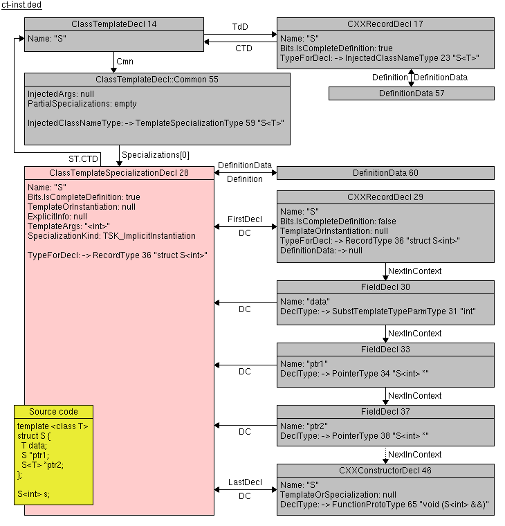

Observations:

* Instantiation put an entry into the
  ``ClassTemplateDecl::Common::Specializations`` set associated with the
  primary template.

* The ``ClassTemplateSpecializationDecl`` object has the
  ``TemplateArgs`` that uniquely identify it within its template.
  It also has a pointer back to that template.

* The structure of the members of the instantiation largely mirrors that
  of the templated class.  The types of those members make use of the
  ``SubstTemplateTypeParmType`` object, discussed above.

* There is no direct link from an instantiated ``FieldDecl`` back to
  the corresponding declaration in the templated class.  Navigating in
  that way would require going through the
  ``ClassTemplateSpecializationDecl`` to get to the templated class,
  then looking up the member by its name.

* The instantiation contains three implicitly generated constructors (of
  which only one is shown in the diagram).  Because there is no
  user-written counterpart in the template, these methods are not
  considered instantiations of anything; instead, they are considered to
  be ordinary, implicitly-generated members of a class that, itself,
  happens to arise from instantiation.

Here is a diagram showing the ``Type`` objects used to represent the
types of the instantiated data members:

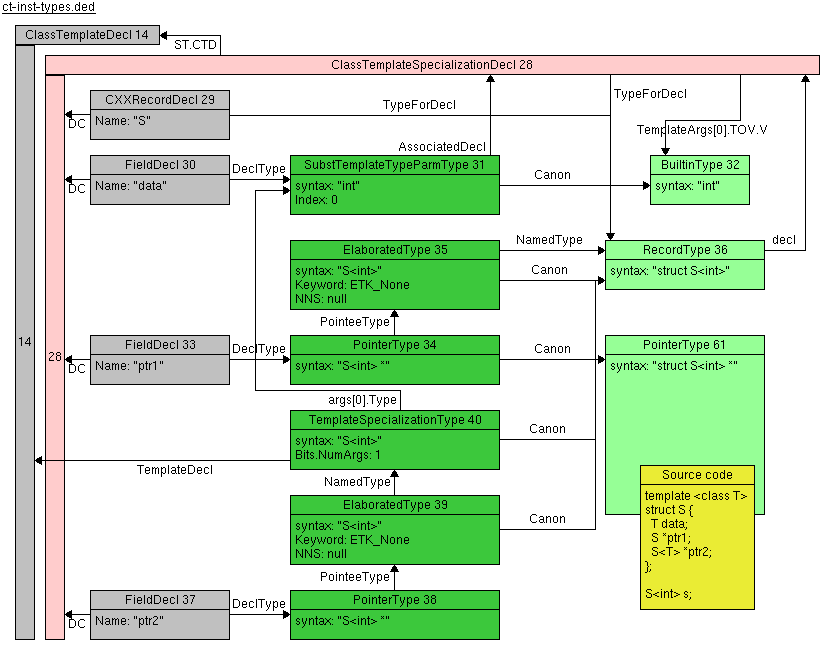

This diagram omits discussion of the types of the implicitly
generated constructors because methods will be discussed more generally
in the next section.

Observations:

* Both the ``ClassTemplateSpecialization`` and the injected-class-name
  ``CXXRecordDecl`` have a ``TypeForDecl`` that is a ``RecordType``
  which refers back to the ``ClassTemplateSpecialization``.

* The ``FieldDecl`` for ``data`` has a ``SubstTemplateTypeParmType``,
  whose ``AssociatedDecl`` is the ``ClassTemplateSpecializationDecl``,
  whose ``Index`` is the index of the ``T`` parameter, and whose
  ``CanonicalType`` is the ``BuiltinType`` representing ``int``.  This
  allows one to see that the type arose by substituting ``int`` for
  ``T``.

* The ``FieldDecl`` for ``ptr1`` makes use of an ``ElaboratedType``
  that refers to the ``RecordType`` tied to the
  ``ClassTemplateSpecializationDecl``.

* The ``FieldDecl`` for ``ptr2`` also has an ``ElaboratedType``, but
  that one refers to a ``TemplateSpecializationType`` representing the
  name of the specialization from the "outside" perspective.  However,
  it canonicalizes to the same ``RecordType`` as in the preceding case.

Diagram: Class template contains ordinary function: Definition
--------------------------------------------------------------

Now let's look at an example of a class template with a method:

.. code-block:: c++

    template <class T>
    struct S {
      T identity(T t)
      {
        return t;
      }
    };

Here is a diagram of some of the relevant AST objects:

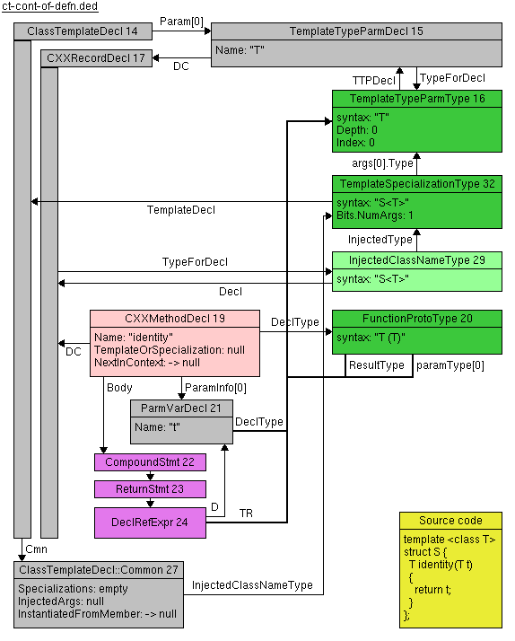

The main thing to note in the diagram is that its structure is very much
like a non-template class and method, just with ``TemplateTypeParmType``
in the place of what would otherwise be a concrete type.

``MemberSpecializationInfo``
----------------------------

Let's consider instantiation of a member:

.. code-block:: c++

    template <class T>
    struct S {
      T identity(T t)
      {
        return t;
      }
    };

    int call(S<int> &s, int x)
    {
      return s.identity(x);
    }

The parameter type ``S<int>`` causes the class template data to be
instantiated, then the call to ``identity`` causes its ``identity``
method to also be instantiated as a *member specialization* (see the
`Definitions of terms`_ section).

When a class or function member of a class template is member
specialized (implicitly or explicitly), the AST records the relationship
between the specialization and the original member in a
``MemberSpecializationInfo`` structure (declared in ``DeclTemplate.h``).
Its fields are:

* ``PointerIntPair<NamedDecl *, 2> MemberAndTSK``:
  Two values:

  * ``NamedDecl *Member``:
    The member of the template that was specialized; never ``nullptr``.
    The example above features an implicit specialization, but this also
    applies to explicit member specialization, an example of which
    is shown in
    `Diagram: Class template contains ordinary function: Explicit member specialization`_.

  * ``TemplateSpecializationKind TSK``:
    Implicit versus explicit specialization, etc.

* ``SourceLocation PointOfInstantiation``:
  The point at which this member was first instantiated.
  For an explicit specialization, this is invalid.

A ``MemberSpecializationInfo`` can appear in these places:

* Pointed to by ``FunctionDecl::TemplateOrSpecialization``:
  For a non-templated member function of a class template instantiation,
  it points at the corresponding original member of the class template.

* As a trailing object on a ``FunctionTemplateSpecializationInfo``:
  For a templated member function of a class template instantiation, it
  points at the original member template.

* Pointed to by ``CXXRecordDecl::TemplateOrInstantiation``:
  For a non-templated member class of a class template instantiation,
  this points at the corresponding original member.

* Plus a couple more cases that are currently outside the scope of this
  document.

Finally, for a templated member class, the member specialization
relationship is directly recorded in the
``ClassTemplateDecl::InstantiatedFromMember`` field, without using any
``MemberSpecializationInfo`` structure.

Diagram: Class template contains ordinary function: Instantiation
-----------------------------------------------------------------

For the method instantiation example above, part of the resulting AST
looks like this:

.. image:: ASTsForTemplatesImages/ct-cont-of-inst.ded.png

Observations:

* The ``ClassTemplateDecl::Common::Specializations`` list, which before
  was empty, now contains the ``ClassTemplateSpecializationDecl`` that
  resulted from instantiation.

* The ``ClassTemplateSpecializationDecl`` has three key elements:

  * A pointer to the ``ClassTemplateDecl`` from which it was
    instantiated.

  * The template arguments used to do so.

  * The fact that the specialization is implicit (i.e., this is an
    instantiation).

* The instantiated ``CXXMethodDecl`` has a pointer to a
  ``MemberSpecializationInfo`` structure, which itself points at the
  particular ``CXXMethodDecl`` from which the former was instantiated.
  (Recall that, for a non-static data member, this origin information is
  not recorded.)

* An ``ImplicitCastExpr`` node is present in the instantiation that was
  absent in the template member.  That is because, in general, implicit
  conversions depend on the specific template argument types, so they
  typically do not appear in dependent contexts.

Diagram: Class template contains ordinary class: Instantiation
--------------------------------------------------------------

A class template can contain an ordinary class as a member:

.. code-block:: c++

    template <class T>
    struct Outer {
      struct Inner {
        T t;
        float u;
      };
    };

    Outer<int>::Inner i;

The resulting object graph is:

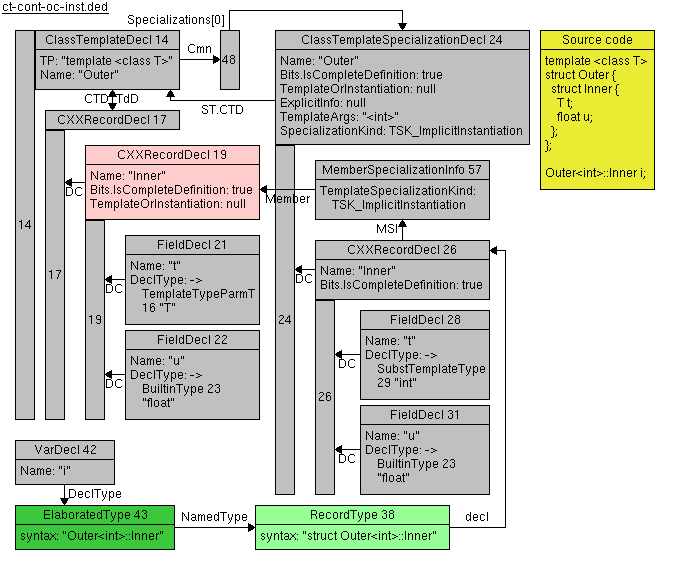

The main observation is that the instantiation, ``CXXRecordDecl 26``,
has its ``MemberSpecializationInfo 57`` pointing back at the member
class, ``CXXRecordDecl 19`` (the focus node).

Diagram: Class template contains ordinary class: Explicit member specialization
-------------------------------------------------------------------------------

It is possible to provide an explicit member specialization for an
ordinary class member of a class template:

.. code-block:: c++

    template <class T>
    struct Outer {
      struct Inner;
    };

    template <>
    struct Outer<int>::Inner {
      int t;
      float u;
    };

The resulting object graph is:

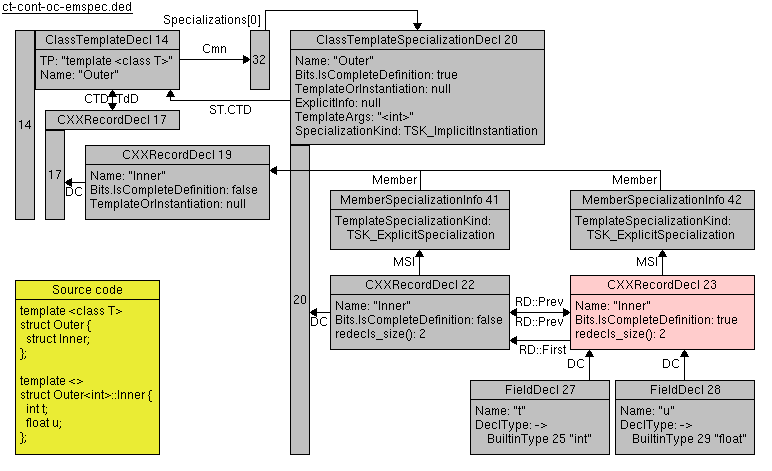

Simply mentioning ``Outer<int>`` induces the creation of
``CXXRecordDecl 22``.  Then, our focus node, ``CXXRecordDecl 23``,
overrides the former's definition.

``DependentFunctionTemplateSpecializationInfo``
-----------------------------------------------

It is possible to befriend a function template specialization where the
argument list is dependent:

.. code-block:: c++

    template <class T>
    T identity(T t);

    template <class T>
    class A {
      friend T identity<T>(T t);
    };      // ^^^^^^^^^^^ DependentFunctionTemplateSpecializationInfo

In the C++ syntax, the template arguments can be fully explicit, as in
this example, or partially or completely deduced from the signature, but
in all cases, at least a pair of angle brackets must be present, since
otherwise the befriended declaration is an ordinary function.

This is represented in the AST as a
``DependentFunctionTemplateSpecializationInfo``, which at a high level,
stores a sequence of template arguments and a set of overloaded
candidate templates to which the arguments could apply.  The arguments
stored are only those syntactically present, since deduction only
happens when the surrounding class template is instantiated.

The inheritance hierarchy of
``DependentFunctionTemplateSpecializationInfo`` is::

    Class Name                                   Header             Novel?
    -------------------------------------------  ----------------   ------------
    DependentFunctionTemplateSpecializationInfo  DeclTemplate.h     yes
      TrailingObjects<...>                       TrailingObjects.h  no
        TemplateArgumentLoc                      TemplateBase.h     yes
        FunctionTemplateDecl*                    (built-in pointer)

Its fields are:

* ``unsigned NumTemplates``:
  The number of overloaded candidate templates.

* Trailing object sequence of ``FunctionTemplateDecl*``:
  Pointers to the ``NumTemplates`` candidates.

* ``unsigned NumArgs``:
  The number of template arguments.

* Trailing object sequence of ``TemplateArgumentLoc``\ s, giving the
  template arguments.  Each ``TemplateArgumentLoc`` has these fields:

  * ``TemplateArgument Argument``:
    The argument itself.

  * ``TemplateArgumentLocInfo LocInfo``:
    Source location information for the argument, represented as a
    discriminated union of pointers based on the kind of template
    parameter.  For type parameters, it is a ``TypeSourceInfo*``, which
    has location information for layer of declarator structure within
    the type description.  Other kinds of parameters are currently
    outside the scope of this document.

* ``SourceRange AngleLocs``:
  The locations of the left and right angle brackets.

Diagram: Class template contains friend function template specialization
------------------------------------------------------------------------

This example declares and instantiates a class template that befriends
a function template specialization:

.. code-block:: c++

    template <class T>
    T identity(T t);

    template <class T>
    class A {
      friend T identity<T>(T t);
      T m_t;
    };

    template <class T>
    T identity(T t)
    {
      A<T> a;
      a.m_t = t;
      return a.m_t;
    }

    int caller(int x)
    {
      return identity(x);
    }

The resulting object graph is:

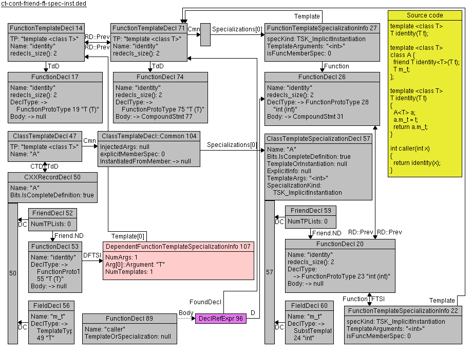

The focus node, ``DependentFunctionTemplateSpecializationInfo 107``,
has the template argument list ``<T>`` and a pointer to the (in this
case only) candidate, ``FunctionTemplateDecl 14``.

In the instantation of ``A<int>``, the ``friend`` declaration refers to
``FunctionDecl 20``, a redeclaration of the definition instantiation
``identity<int>`` at ``FunctionDecl 26``.

Like in the case of a member specialization of a non-static data member,
member specialization of a friend declaration does not have a pointer
back to the originating declaration.

Explicit specialization
=======================

.. _explicit specialization of a function template:

Diagram: Function template: Explicit specialization
---------------------------------------------------

A function template can be explicitly specialized:

.. code-block:: c++

    template <class T>
    T identity(T t);

    template <>
    int identity(int t)
    {
      return t;
    }

The resulting object graph looks like this:

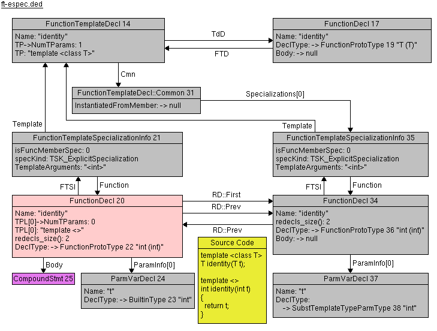

Interestingly, the specialization creates *two* ``FunctionDecl`` nodes,
not one.  One of them (#34) is merely a declaration without a body.  Its
type uses ``SubstTemplateTypeParmType`` to represent ``int``, reflecting
the fact that it arose due to the process of matching the
specialization's signature against the available templates to find the
one it specializes.  The other (#20) comes from parsing the source
as-is, and consequently has a body, an empty template parameter list,
and uses ``BuiltinType`` to represent ``int``.  The two declarations are
linked together by the ``Redeclarable`` links, with the non-definition
considered "first".

The diagram above includes ``redecls_size()`` for ``Redeclarable``
nodes.  There is no actual method by that name; it is computed as
``std::distance(decl->redecls_begin(), decl->redecls_end())``, meaning
it counts the total number of declarations in the ``redecls()`` list,
which is always at least one because it includes the ``decl`` node
itself.

The ``FunctionTemplateDecl::Common::Specializations`` list only contains
one of the declarations.  However, both of them have their own
``FunctionTemplateSpecializationInfo`` structure that indicates they are
explicit specializations, of which template, and with which template
arguments.

Diagram: Class template: Explicit specialization
------------------------------------------------

A class template can be explicitly specialized:

.. code-block:: c++

    template <class T>
    struct S;

    template <>
    struct S<int>
    {
      int data;
      S *ptr1;
      S<int> *ptr2;
    };

The resulting object graph looks like this:

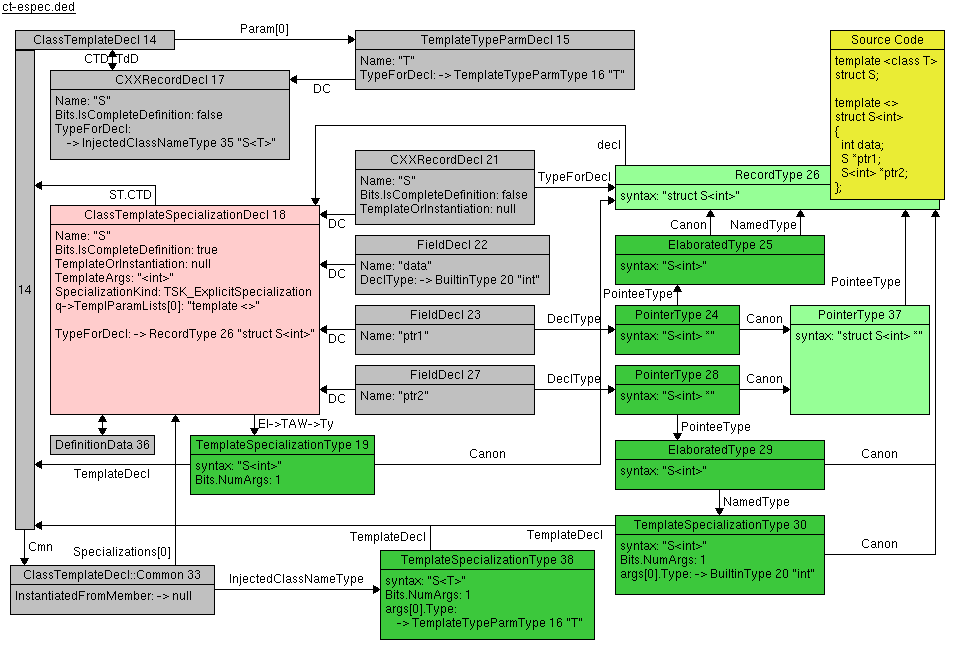

The focus of the diagram is ``ClassTemplateSpecializationDecl 18``,
which records the associated template, the specialized template
arguments, and the fact that it is an explicit specialization.  This
object is in the ``ClassTemplateDecl::Common::Specializations`` list, so
can be found when needed.

As with class template instantiation, there are two ways to name the
class from within a specialization, either with or without using the
injected-class-name.  Those lead to different ``Type`` structures, but
with the same canonical forms.

It is somewhat notable that, unlike for functions, there is no "hidden"
declaration that uses ``SubstTemplateTypeParmType`` here.  That is
because overload resolution is not required to find the primary template
for a class template specialization.

``ClassTemplatePartialSpecializationDecl``
------------------------------------------

A class template partial specialization is simultaneously a template,
from which concrete specializations can be instantiated, and an explicit
specialization of a primary template.  It is represented by the
``ClassTemplatePartialSpecializationDecl`` class, which principally adds
a sequence of template parameters to a
``ClassTemplateSpecializationDecl``.

It has this inheritance hierarchy::

    Class Name                              Header          Novel?
    --------------------------------------  --------------  ------------
    ClassTemplatePartialSpecializationDecl  DeclTemplate.h  yes
      ClassTemplateSpecializationDecl       DeclTemplate.h  contextually
        CXXRecordDecl                       DeclCXX.h       contextually
          RecordDecl                        Decl.h          no
            TagDecl                         Decl.h          no
              TypeDecl                      Decl.h          contextually
                NamedDecl                   Decl.h          no
                  Decl                      DeclBase.h      no
              DeclContext                   DeclBase.h      no
              Redeclarable<TagDecl>         Redeclarable.h  no
        FoldingSetNode                      FoldingSet.h    contextually

It has these novel fields and interpretations:

* From base ``FoldingSetNode``:

  * ``void *NextInFoldingSetBucket``:
    Pointer that allows a ``ClassTemplatePartialSpecializationDecl`` to
    be stored in the ``ClassTemplateDecl::Common::PartialSpecializations``
    set.  This is the same pointer that would allow a
    ``ClassTemplateSpecializationDecl`` object (that isn't also a CTPSD)
    to be stored in ``ClassTemplateDecl::Common::Specializations``; a
    given CTSD/CTPSD object can only be in one of them, and for CTPSD,
    it's in the list of partials.

* Base ``CXXRecordDecl``:
  In this context, the ``CXXRecordDecl`` is the templated declaration,
  analogous to the ``CXXRecordDecl`` inside a ``ClassTemplateDecl``.
  In contrast, the ``CXXRecordDecl`` inside a non-partial
  ``ClassTemplateSpecializationDecl`` is a concrete declaration.

* From base ``TypeDecl``:

  * ``Type *TypeForDecl``:
    Like with a templated ``CXXRecordDecl``, the ``TypeForDecl`` is an
    ``InjectedClassNameType`` whose ``InjectedType`` field is a
    ``TemplateSpecializationType``.

* From base ``ClassTemplateSpecializationDecl``:

  * ``const TemplateArgumentList *TemplateArgs``:
    The template arguments, forming a pattern against which future
    instantiations' arguments will be matched to see if this
    explicit specialization applies.  The pattern uses canonical
    ``TemplateTypeParmType`` nodes, for example,
    ``<type-parameter-0-0 *>``.

* In ``ClassTemplatePartialSpecializationDecl`` itself:

  * ``TemplateParameterList* TemplateParams``:
    The parameters for this partial specialization, when seen as a
    template in its own right.

  * ``const ASTTemplateArgumentListInfo *ArgsAsWritten``:
    Source location information for the template arguments pattern
    (``ClassTemplateSpecializationDecl::TemplateArgs``).  As noted in a
    comment in the source code, this is potentially redundant with
    ``ClassTemplateSpecializationDecl::ExplicitSpecializationInfo::TypeAsWritten``.

  * ``PointerIntPair<...> InstantiatedFromMember``:
    Tuple of two elements:

    * ``ClassTemplatePartialSpecializationDecl *``:
      If this partial specialization declaration was created by
      instantiating a class scope partial specialization of a member
      class template, this points at the instantiated member.  Otherwise
      it is ``nullptr``.

    * ``bool specdThisLevel``:
      This flag, which is anonymous in the code but given a name in this
      document for convenience, is set when the preceding pointer is not
      ``nullptr``, but the definition of the partial specialization was
      provided by an explicit member specialization.  See
      `Diagram: Class template contains class template: Explicit member specialization of class scope partial specialization`_
      for an example of this scenario.  Beware: This flag is queried via
      the public
      ``ClassTemplatePartialSpecializationDecl::isMemberSpecialization()``
      method, but that name is slightly misleading because the flag is
      only ``true`` when the specialization is *explicit*.  Furthermore,
      in that case, there are two
      ``ClassTemplatePartialSpecializationDecl`` objects (which are
      redeclarations of each other), and the flag is only set on the one
      that was *not* explicitly present in the source code.

It is notable that ``ClassTemplatePartialSpecializationDecl`` does *not*
contain a list of specializations.  Instead, instantiations of the
partial go into the list of specializations of the primary, and it is
not possible to explicitly specialize a partial specialization (ignoring
member specialization, which effectively overrides the entire partial
rather than specialize it as a template).

Diagram: Class template: Partial specialization
-----------------------------------------------

For the following translation unit:

.. code-block:: c++

    template <class T>
    struct S;

    template <class U>
    struct S<U*>
    {
      U *data;
      S *ptr1;
      S<U*> *ptr2;
    };

    S<int*> s;

The resulting object graph looks like this:

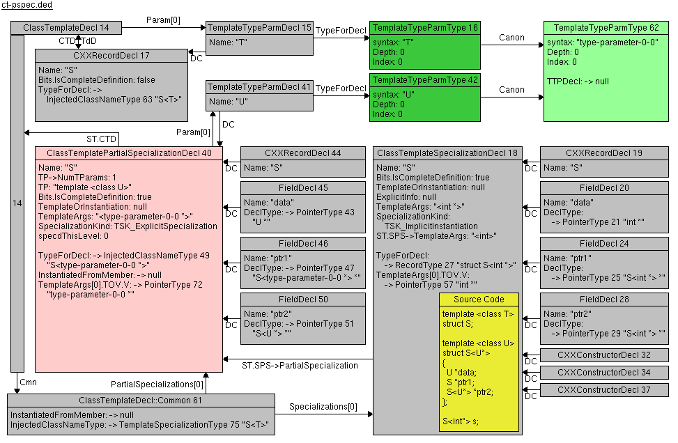

The peach-colored node is the ``ClassTemplatePartialSpecializationDecl``
we are focusing on.  It has a pointer to the primary template, and is
pointed to by the primary's ``Common`` structure, among its
``PartialSpecializations`` (in this case it is the only one).  Its
members are very similar to those of a primary class template, with the
main difference being the use of canonical rather than non-canonical
``TemplateTypeParmDecl`` nodes.

It's also notable that the partial's ``TemplateTypeParmDecl`` (node #41)
uses the partial itself as its ``DeclContext``.  This is another way
that the partial is playing the role of a templated ``CXXRecordDecl``.

When instantiated, the resulting ``ClassTemplateSpecializationDecl``
(node #18) is in most respects like an instantiation of a primary class
template, with the key difference that its ``SpecializedTemplate`` field
now points at a ``SpecializedPartialSpecialization`` (SPS) instead of
directly at the primary ``ClassTemplateDecl``.  As explained above,
under `ClassTemplateSpecializationDecl`_, the SPS points at the
``ClassTemplatePartialSpecializationDecl`` and has the
``TemplateArgumentList`` that applies to it.

To emphasize:

* ``ClassTemplateSpecializationDecl::TemplateArgs`` has the arguments
  the apply to the *primary*.  These arguments are the *name* of this
  specialization within the context of the primary.  For a CTPSD, the
  name is a pattern that includes template parameters.

* ``ClassTemplateSpecializationDecl::SpecializedTemplate.SPS->TemplateArgs``
  has the arguments that apply to the *partial*.  These arguments are
  part of the instantiation *process* that creates the declaration's
  contents.

Diagram: Class template contains ordinary function: Explicit member specialization
----------------------------------------------------------------------------------

A non-templated member function of a class template can have an explicit
member specialization:

.. code-block:: c++

    template <class T>
    struct S {
      T identity(T t);
    };

    template <>
    int S<int>::identity(int t)
    {
      return t;
    }

The resulting object graph looks like this:

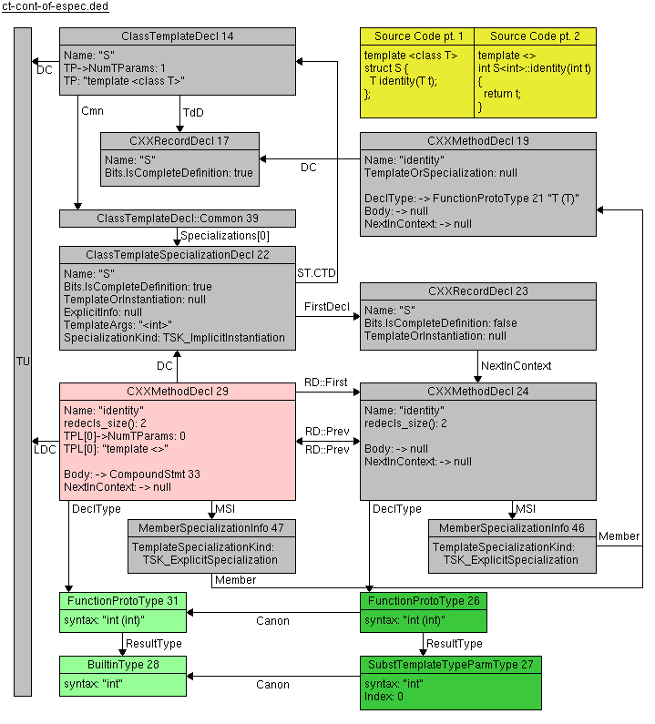

The peach-colored node is the ``CXXMethodDecl`` directly associated with
the syntactic declaration starting with ``template <>``.  It is
lexically contained in the ``TranslationUnitDecl`` but semantically
contained by the ``S<int>`` instantiation.

Similar to the case of `explicit specialization of a function template`_,
there is a second ``CXXMethodDecl`` (node #24) that
arises due to using overload resolution to match the syntactic
declaration (node #29) with the members of the class template (node
#19).  These two are redeclarations of each other.

Each of the explicit specialization declarations has an associated
``MemberSpecializationInfo`` that indicates they are explicit member
specializations, and points at the member of the templated class that
was specialized.

Function template contains ordinary class
=========================================

.. comment: This slightly awkward section exists to contain the
            following diagram and present it at a point in the document
            where the reader is prepared for its complexity.  In
            contrast, putting it at the end of "Function templates"
            would be too abrupt.

Diagram: Function template contains ordinary class: Instantiation
-----------------------------------------------------------------

A function template can define and use an ordinary class in its body:

.. code-block:: c++

    template <class T>
    T identity(T x)
    {
      struct S {
        T m_t;

        S(T t)
          : m_t(t)
        {}
      };

      S s(x);
      return s.m_t;
    }

    int caller(int y)
    {
      return identity(y);
    }

The resulting object diagram is:

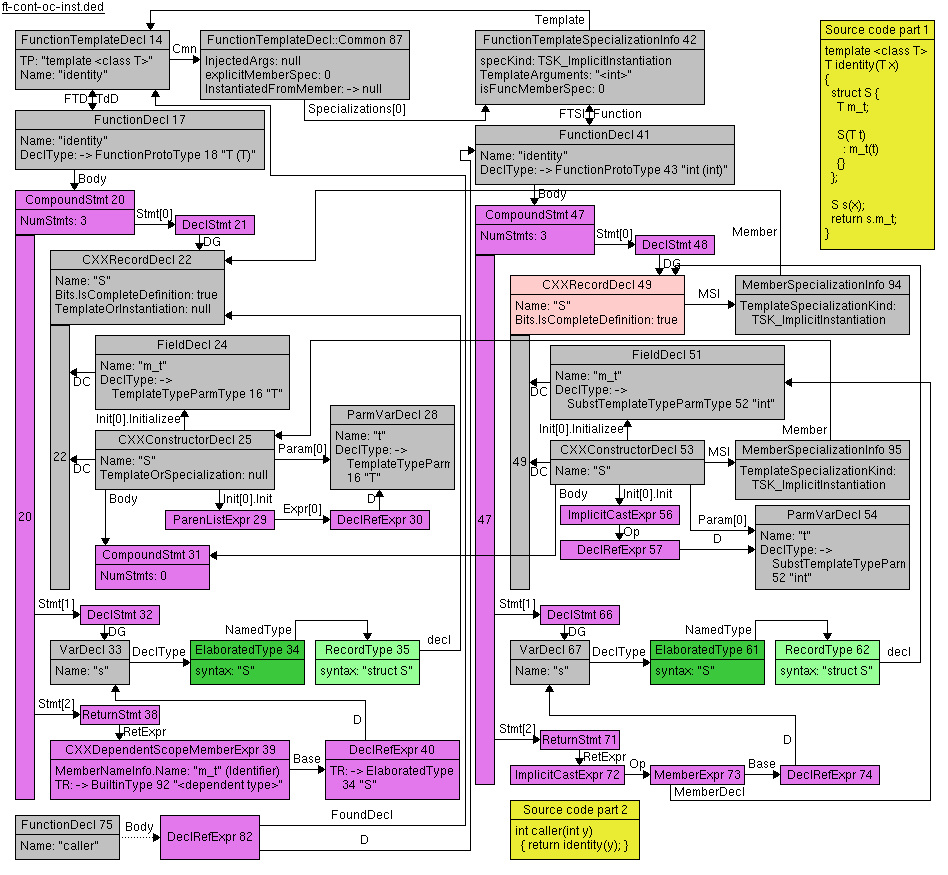

The focus node, ``CXXRecordDecl 49``, is the instantiation of ``S``
inside ``identity<int>``.  It is a member specialization of the
original, ``CXXRecordDecl 22``.  Additionally, its member function
``CXXConstructorDecl 53`` is a member specialization of the
corresponding original, ``CXXConstructorDecl 25``.

The diagram also includes ``CXXDependentScopeMemberExpr 39``, used to
represent ``s.m_t`` in the template, where the type of ``m_t`` is
dependent on the template parameter.  However, this document's scope
currently excludes a detailed examination of how templates affect
classes in the ``Expr`` hierarchy, so for now we just note this feature
in passing.

Finally, note that the body of ``CXXConstructorDecl 53``,
``CompoundStmt 31``, is physically shared with the member from which it
was instantiated, ``CXXConstructorDecl 22``, since that part of the
template is not dependent on the template parameters (as it is
completely empty in this example).

Class template contains function template
=========================================

Diagram: Class template contains function template: Definition
--------------------------------------------------------------

A class template can contain a member function template:

.. code-block:: c++

    template <class T>
    struct S {
      template <class U>
      unsigned sum(T t, U u)
      {
        return t + u;
      }
    };

The resulting object graph, without any instantiations, looks like this:

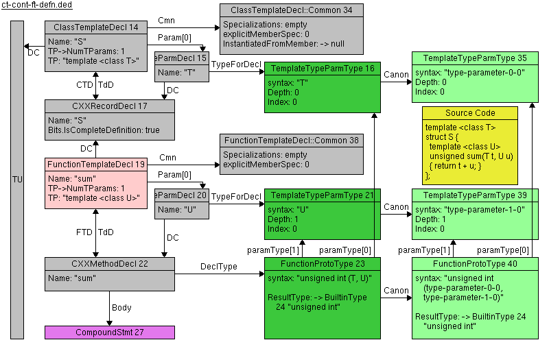

The peach-colored node is the member function template.  It contains the
templated function, and is contained by the templated class.  Its
template parameter, ``U``, has as its canonical form
``type-parameter-1-0`` because it is nested one level deep.

Diagram: Class template contains function template: Instantiation
-----------------------------------------------------------------

We now add code that will cause instantiation:

.. code-block:: c++

    template <class T>
    struct S {
      template <class U>
      unsigned sum(T t, U u)
      {
        return t + u;
      }
    };

    unsigned caller(S<int> &s)
    {
      return s.sum<float>(1, 2.0f);
    }

The parameter type ``S<int>`` causes instantiation of that class
specialization, and the call to ``sum`` causes instantiation of the
method.  For clarity, ``sum`` is invoked with the explicit template
argument list ``<float>``, but the result would be the same if the
template argument list was removed (it would be deduced from the types
of the argument expressions).

The resulting object graph looks like this:

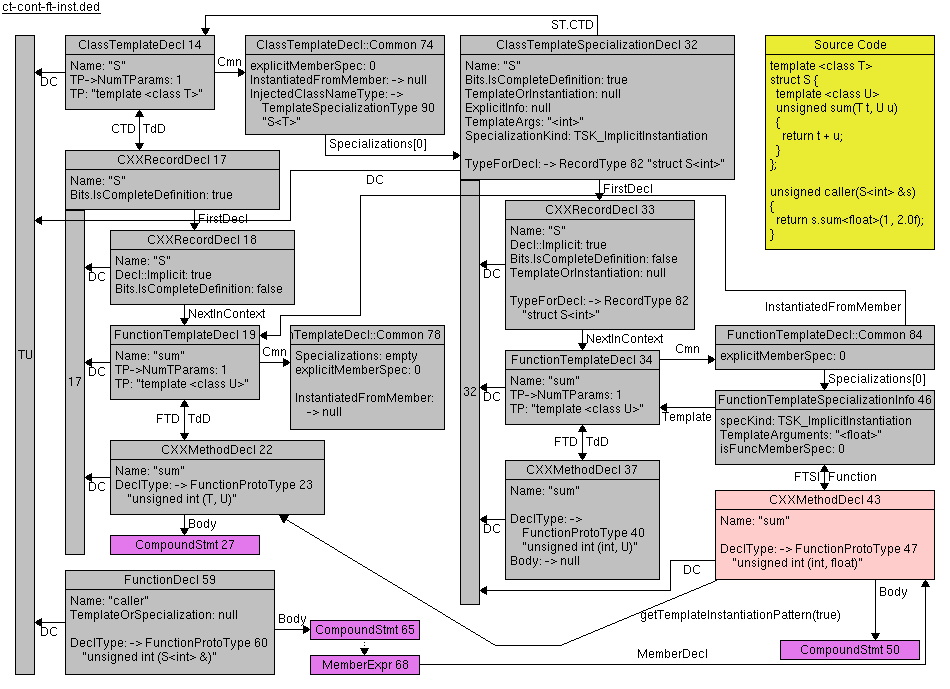

The peach-colored node is the instantiation of the method template.
This is a two-step process: first the class is instantiated with
``<int>``, generating ``CXXMethodDecl 37`` (which does not have a body
in the AST), then the method is instantiated with ``<float>``.

If we had a pointer to ``CXXMethodDecl 43``, how would we navigate back
to the original definition at ``CXXMethodDecl 22``?  One might suspect
we could call ``FunctionDecl::getInstantiatedFromMemberFunction()``, but
that returns ``nullptr`` here because that is for the case of an
instantiation of a *non-templated* member function.  (It is also
``nullptr`` for ``CXXMethodDecl 37``.)

Instead, starting from ``CXXMethodDecl 43``, we must:

* Follow ``FunctionDecl::TemplateOrSpecialization``, which has as one
  of its union elements a ``FunctionTemplateSpecializationInfo*``, to
  reach ``FunctionTemplateSpecializationInfo 46``.

* Follow ``FunctionTemplateSpecializationInfo::Template`` to reach
  ``FunctionTemplateDecl 34``.  (These last two steps can be
  accomplished by calling ``getPrimaryTemplate()``.)  But this
  template was itself the result of instantiation, so we keep going.

* Follow the ``RedeclarableTemplateDecl::Common`` pointer to reach
  ``FunctionTemplateDecl::Common 84``.

* Follow ``RedeclarableTemplateDecl::CommonBase::InstantiatedFromMember``
  to reach ``FunctionTemplateDecl 19``, which (unlike #34) corresponds
  directly to syntax in the source code.

* Follow ``TemplateDecl::TemplatedDecl`` to, finally, reach
  ``CXXMethodDecl 22``.

This complete sequence can be accomplished by calling
``FunctionDecl::getTemplateInstantiationPattern()``.

Diagram: Class template contains function template: Explicit specialization
---------------------------------------------------------------------------

Alternatively, we can explicitly specialize the method template:

.. code-block:: c++

    template <class T>
    struct S {
      template <class U>
      unsigned sum(T t, U u);
    };

    template <>
    template <>
    unsigned S<int>::sum(int t, float u)
    {
      return t + u;
    }

The resulting object graph looks like this:

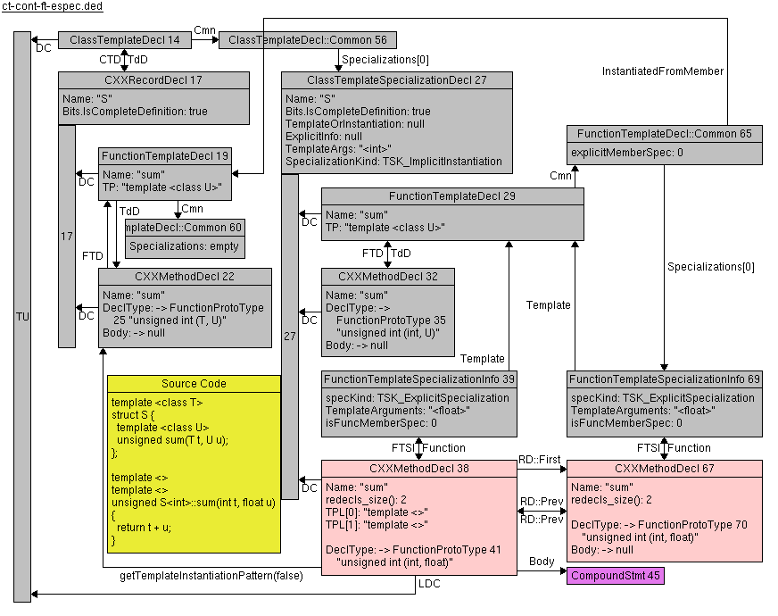

As with earlier examples of specializing a function template, the
process produces two AST nodes that are redeclarations of each other.

The main semantic difference here is the
``FunctionTemplateSpecializationInfo`` nodes (now there are two) have
their specialization kind as ``TSK_ExplicitSpecialization`` instead of
``TSK_ImplicitInstantiation``.

The same navigation path back to ``CXXMethodDecl 22`` is available,
but as this is no longer the origin of the body of the specialization,
we must pass ``false`` as the ``ForDefinition`` parameter of
``getTemplateInstantiationPattern()`` to use that method.

Diagram: Class template contains function template: Explicit member specialization
----------------------------------------------------------------------------------

It is possible for a member specialization of a member template to be
explicit:

.. code-block:: c++

    template <class T>
    struct S {
      template <class U>
      unsigned sum(T t, U u);
    };

    template <>
    template <class U>
    unsigned S<int>::sum(int t, U u)
    {
      return t + u;
    }

    int caller(S<int> &s, int i, float f)
    {
      return s.sum(i, f);
    }

To think about this, first imagine that the middle declaration was
absent.  Writing ``S<int>`` would cause the ``S<T>::sum<U>`` member
template to be instantiated, yielding ``S<int>::sum<U>`` (a member
specialization), which would then itself be instantiated to create
``S<int>::sum<float>``.  But the presence of the explicit member
specialization overrides the definition of ``S<int>::sum<U>``, and
*that* is then instantiated to make ``S<int>::sum<float>``.

The resulting object graph looks like this:

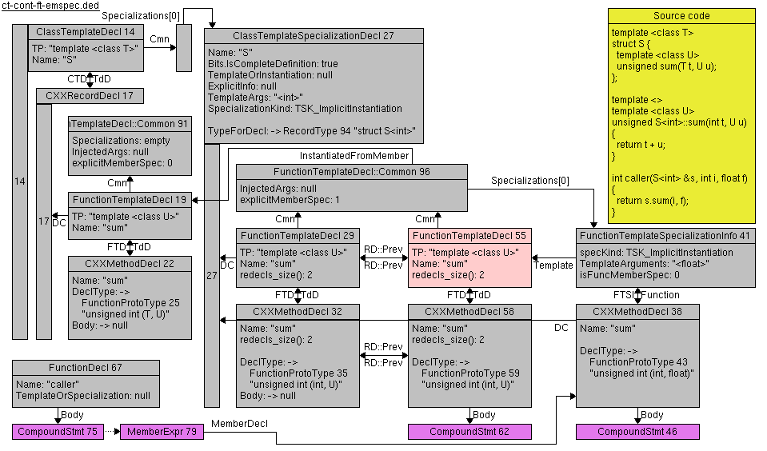

The focus node, ``FunctionTemplateDecl 55``, is the user-written
explicit member specialization.  Its ``Common`` (#96) structure points
at the member that it specializes, and has ``explicitMemberSpec`` set to
``true``.  This is the first example we've looked at that has that flag
set.  (Recall that ``explicitMemberSpec`` is the name we've chosen to
give to the otherwise anonymous ``bool`` value stored in
``RedeclarableTemplateDecl::CommonBase::InstantiatedFromMember``.)

``ClassScopeFunctionSpecializationDecl``
----------------------------------------

A ``ClassScopeFunctionSpecializationDecl`` represents an explicit
specialization of a member function template within the body of a class
template, for example:

.. code-block:: c++

    template <class T>
    struct S {
      template <class U>
      int add(T t, U u);

      template <>              // ClassScopeFunctionSpecializationDecl
      int add(T t, float u)
      {
        return t + u;
      }
    };

This is sort of the opposite of the previous case, as it specializes the
member template's parameter rather than the containing class template's
parameter.

The inheritance hierarchy of ``ClassScopeFunctionSpecializationDecl``
is::

    Class Name                            Header          Novel?
    ------------------------------------  --------------  ------------
    ClassScopeFunctionSpecializationDecl  DeclTemplate.h  yes
      Decl                                DeclBase.h      no

``ClassScopeFunctionSpecializationDecl`` (CSFSD) has two fields (other
than those it inherits):

* ``CXXMethodDecl *Specialization``:
  The pointer to the ``CXXMethodDecl`` that has the specialization
  signature and (possibly) definition.

* ``const ASTTemplateArgumentListInfo *TemplateArgs``:
  A nullable pointer to template arguments.  For example, in the above
  example, ``add`` could have been written ``add<float>``; providing
  template arguments is needed if they cannot be deduced from the
  signature.

Note that CSFSD is only used when the specialization is inside a class
template.  Inside an ordinary class, the equivalent case is represented
with just a ``CXXMethodDecl``.

Diagram: Class template contains function template: Class scope specialization
------------------------------------------------------------------------------

Here is an example that demonstrates
``ClassScopeFunctionSpecializationDecl``:

.. code-block:: c++

    template <class T>
    struct S {
      template <class U>
      int add(T t, U u);

      template <>              // ClassScopeFunctionSpecializationDecl
      int add(T t, float u)
      {
        return t + u;
      }
    };

    int caller(S<int> &s, int i, float f)
    {
      return s.add(i, f);
    }

The resulting object graph looks like this:

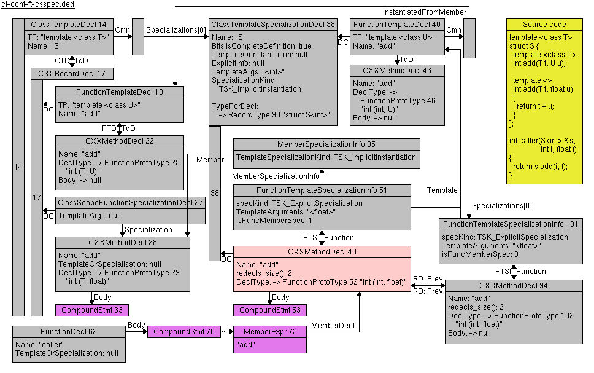

``CXXMethodDecl 48`` (representing ``S<int>::add<float>``) is both a
(template) specialization of ``FunctionTemplateDecl 40`` (representing
``S<int>::add<U>``) and also a member specialization of
``ClassScopeFunctionSpecializationDecl 27`` (representing
``S<T>::add<float>``).  This demonstrates simultaneous template
specialization and member specialization.

Class template contains class template
======================================

Diagram: Class template contains class template: Definition and instantiation
-----------------------------------------------------------------------------

We can define and instantiate a class template inside a class template:

.. code-block:: c++

    template <class T>
    struct Outer {
      template <class U>
      struct Inner {
        T t;
        U u;
      };
    };

    Outer<int>::Inner<float> i;

The resulting object graph looks like this:

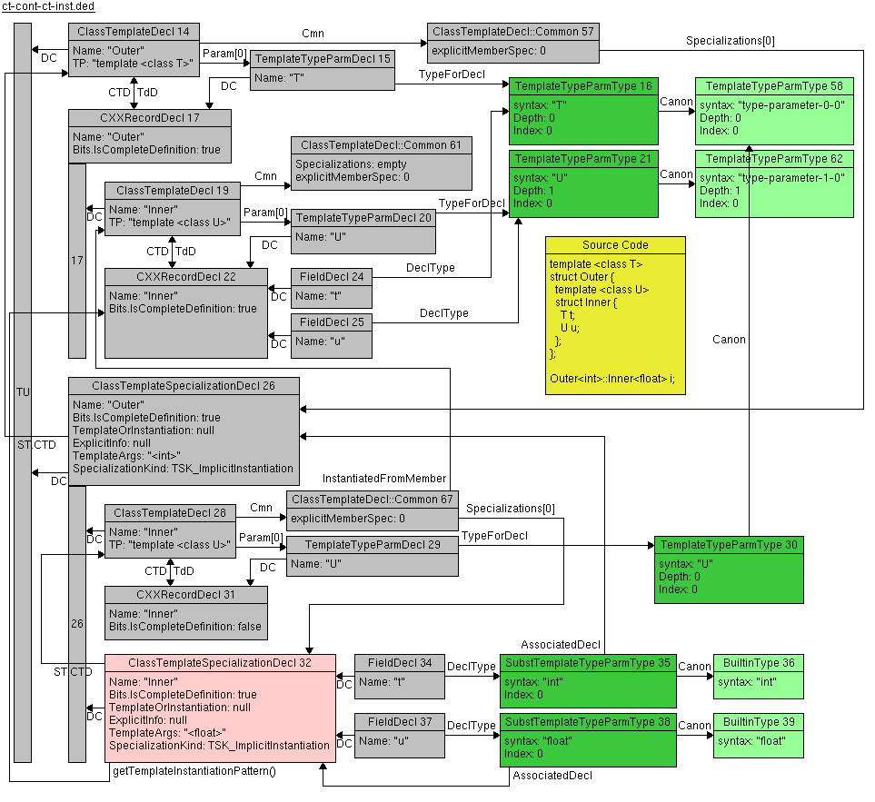

The peach-colored node, ``ClassTemplateSpecializationDecl 32`` is the
result of instantiating ``Outer<int>::Inner<float>``.  It is most
directly an instantiation of ``ClassTemplateDecl 28``, which represents
``Outer<int>::Inner<U>``, but that doesn't have a materialized
definition because it is, in turn, the result of instantating
``ClassTemplateDecl 19``.

Like with the case of
`Diagram: Class template contains function template: Instantiation`_,
we can navigate from ``ClassTemplateSpecializationDecl 32`` back to
its original definition at ``CXXRecordDecl 22`` by going through the
intermediate instantiation, or by calling
``CXXRecordDecl::getTemplateInstantiationPattern()``.

Also, observe that ``TemplateTypeParmType 30`` represents the type ``U``
in the intermediate instantiated ``ClassTemplateDecl 28``, but
canonicalizes to ``type-parameter-0-0``, the same thing that the type
``T`` did in the original template.  That is because the intermediate
template only has one level of parameterization, so both are at depth 0.

Diagram: Class template contains class template: Explicit specialization
------------------------------------------------------------------------

We can explicitly specialize a class template inside a class template
specialization:

.. code-block:: c++

    template <class T>
    struct Outer {
      template <class U>
      struct Inner;
    };

    template <>
    template <>
    struct Outer<int>::Inner<float> {
      int t;
      float u;
    };

The resulting object graph looks like this:

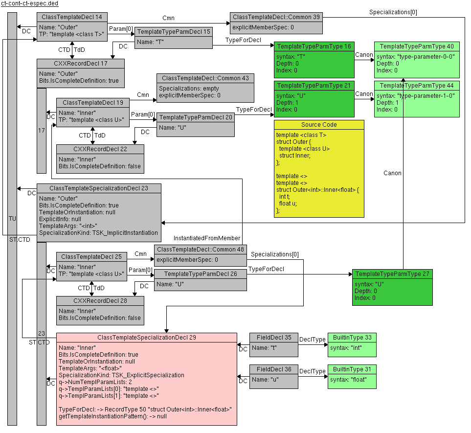

In many respects, this looks like the previous case, with the major
difference that the ``ClassTemplateSpecializationDecl`` of interest
(node #29, peach colored) has a specialization kind of
``TSK_ExplicitSpecialization`` instead of
``TSK_ImplicitInstantiation``.

Note that, although we are explicitly specializing ``Inner<float>``,
its containing class, ``Outer<int>`` is still implicitly specialized.

Unlike for function specializations as shown in
`Diagram: Class template contains function template: Explicit specialization`_,
there isn't a method to navigate from ``ClassTemplateSpecializationDecl
29`` back to the unspecialized declaration ``ClassTemplateDecl 19`` in a
single step here, since
``CXXRecordDecl::getTemplateInstantiationPattern()`` does not have a
``ForDefinition`` parameter the way
``FunctionDecl::getTemplateInstantiationPattern()`` does.

It is not possible to explicitly (fully) specialize a member class
template of the unspecialized containing class template using a
declaration outside the containing class template, for example:

.. code-block:: c++

    template <class T>
    template <>
    struct Outer<T>::Inner<float> {
                  // ^ error: cannot specialize (with 'template<>') a member of an unspecialized template
      T t;
      float u;
    };

It is possible to do so inside the containing class template, however,
as shown in
`Diagram: Class template contains class template: Class scope specialization`_.

Diagram: Class template contains class template: Partial specialization
-----------------------------------------------------------------------

We can partially specialize a class template inside a class template:

.. code-block:: c++

    template <class T>
    struct Outer {
      template <class U>
      struct Inner;
    };

    template <class T>
    template <class V>
    struct Outer<T>::Inner<V*> {
      T t;
      V *u;
    };

    Outer<int>::Inner<float*> i;

The resulting object graph looks like this:

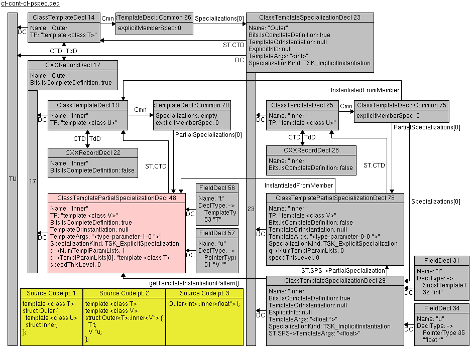

This diagram omits the ``TemplateTypeParmDecl`` nodes and their types in
order to focus on the rest of the structure.

The translation unit first declares the template primaries
``ClassTemplateDecl 14`` and ``ClassTemplateDecl 19``.

Next, it partially specializes the ``Inner`` contained by the general
``Outer``; that is ``ClassTemplatePartialSpecializationDecl 48``, the
peach-colored node.

Finally, it instantiates ``Outer<int>::Inner<float*>``, which involves
these steps:

* Instantiate ``Outer<int>``.  That creates
  ``ClassTemplateSpecializationDecl 23`` for ``Outer<int>``, and
  ``ClassTemplateDecl 25`` for ``Outer<int>::Inner<U>``.

* Because we have a partial specialization for ``Outer<T>::Inner``,
  that is transferred over to ``Outer<int>``.  The result is
  ``ClassTemplatePartialSpecializationDecl 78``, representing
  ``Outer<int>::Inner<V*>``.  But this is not an independent
  definition, it is instead an instantiation of
  ``ClassTemplatePartialSpecializationDecl 48``, and recorded as such
  via the ``InstantiatedFromMember`` field.  Note the parallel
  ``InstantiatedFromMember`` pointer from ``ClassTemplateDecl::Common 75``
  to ``ClassTemplateDecl 19``, which records the same relationship but
  between the two general (rather than specialized) cases of ``Inner``.

* Now, to instantiate ``Outer<int>::Inner<float*>``, we see that
  ``ClassTemplatePartialSpecializationDecl 78`` applies, observe that it
  comes from ``ClassTemplatePartialSpecializationDecl 48``, so
  instantiate that to create
  ``ClassTemplateSpecializationDecl 29``.  From that node (#29), the
  query ``getTemplateInstantiationPattern()`` will return node #48.

A key idea here is that, to materialize ``Outer<int>::Inner<float*>``,
we first fully materialize ``Outer<int>``, including its template for
``Inner<U>`` (node #25).  *Then*, we instantiate and overlay partial
specialization ``Outer<int>::Inner<V*>`` on top (node #78).  Finally,
``Outer<int>::Inner<float*>`` can be instantiated (node #29).

Diagram: Class template contains class template: Class scope specialization
---------------------------------------------------------------------------

We can specialize a class template inside a class template from within
the scope of the outer template class body:

.. code-block:: c++

    template <class T>
    struct Outer {
      template <class U>
      struct Inner;

      template <>
      struct Inner<float> {
        T t;
        float u;
      };
    };

    Outer<int>::Inner<float> i;

The resulting object graph looks like this:

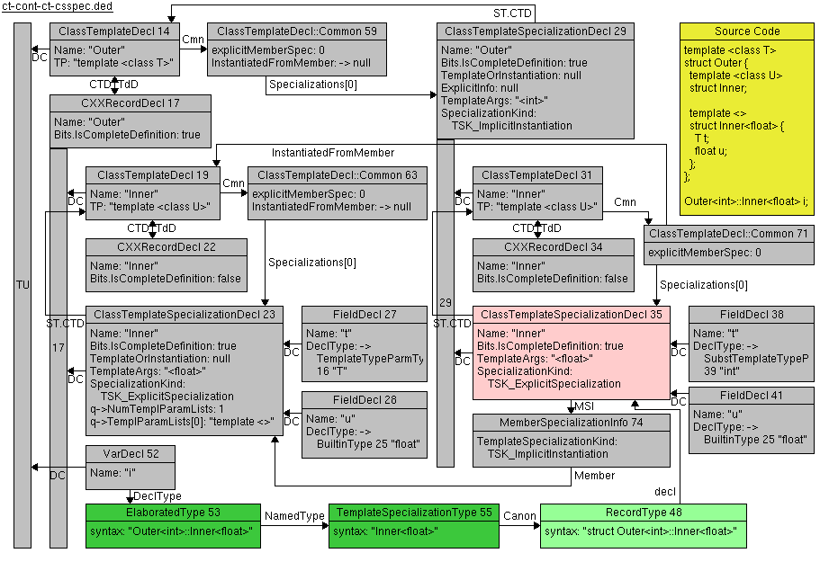

The focus node, ``ClassTemplateSpecializationDecl 35``, is both a
(template) specialization of ``ClassTemplateDecl 31`` (representing
``Outer<int>::Inner<U>``) and a member specialization of
``ClassTemplateSpecializationDecl 23`` (representing
``Outer<T>::Inner<float>``).

Diagram: Class template contains class template: Class scope partial specialization
-----------------------------------------------------------------------------------

We can partially specialize a class template inside a class template
from within the scope of the outer template class body:

.. code-block:: c++

    template <class T>
    struct Outer {
      template <class U>
      struct Inner;

      template <class V>
      struct Inner<V*> {
        T t;
        V *u;
      };
    };

    Outer<int>::Inner<float*> i;

The resulting object graph looks like this:

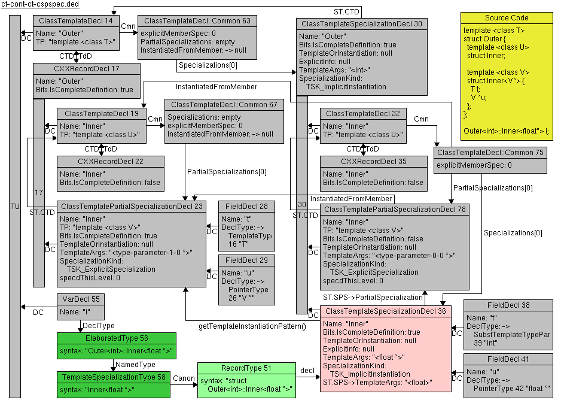

The focus node, ``ClassTemplateSpecializationDecl 36``
(representing ``Outer<int>::Inner<float*>``), is an
instantiation of ``ClassTemplatePartialSpecializationDecl 78``
(representing ``Outer<int>::Inner<V*>``), which
was instantiated from ``ClassTemplatePartialSpecializationDecl 23``
(representing ``Outer<T>::Inner<V*>``).

Meanwhile, ``ClassTemplateDecl 32`` (representing
``Outer<int>::Inner<U>``), which is an instantiation of
``ClassTemplateDecl 19`` (representing ``Outer<T>::Inner<U>``),
has both a partial specialization (#78) and a full specialization
(#36, the focus node).

In this case, there is nothing that is simultaneously a (full, template)
specialization and a member specialization because the member
specialization is #78, but that is only a partial specialization.

Diagram: Class template contains class template: Explicit member specialization
-------------------------------------------------------------------------------

A member class template can have an explicit member specialization:

.. code-block:: c++

    template <class T>
    struct Outer {
      template <class U>
      struct Inner;
    };

    template <>
    template <class U>
    struct Outer<int>::Inner {
      int t;
      U u;
    };

    Outer<int>::Inner<float> i;

The resulting object graph looks like this:

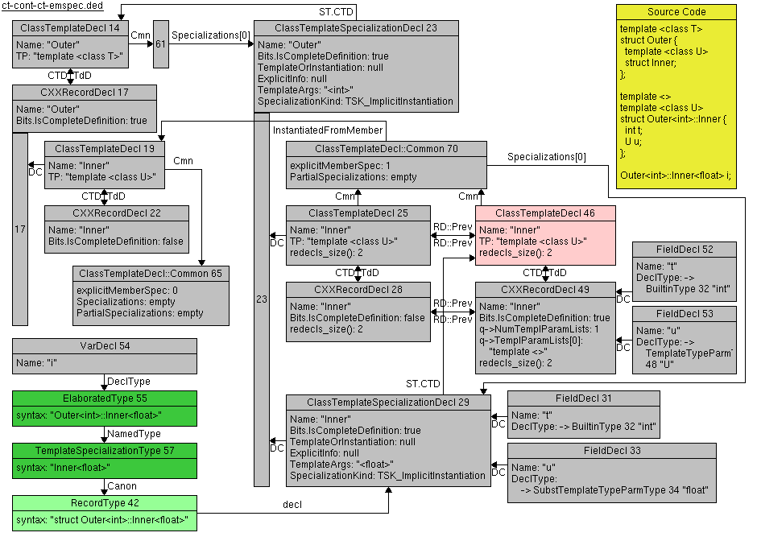

Observations:

* We have two ``ClassTemplateDecl``\ s, similar to the case of explicitly
  specializing a function template.  ``ClassTemplateDecl 25`` is created
  as soon as we mention ``Outer<int>``, and then
  ``ClassTemplateDecl 46`` (the user-defined focus node) is added as a
  redeclaration afterwards.

* ``ClassTemplateDecl::Common 70`` has ``explicitMemberSpec`` as
  ``true``, like with
  `Diagram: Class template contains function template: Explicit member specialization`_.

Diagram: Class template contains class template: Partial member specialization
------------------------------------------------------------------------------

A member class template can have an explicit member specialization that
is a partial specialization:

.. code-block:: c++

    template <class T>
    struct Outer {
      template <class U>
      struct Inner;
    };

    template <>
    template <class V>
    struct Outer<int>::Inner<V*> {
      int t;
      V *u;
    };

    Outer<int>::Inner<float*> i;

The resulting object graph looks like this:

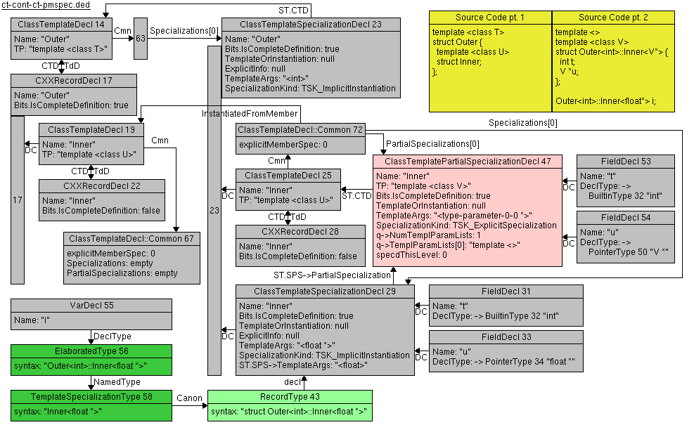

As above, ``ClassTemplateDecl 25`` (which is no longer an *explicit*
member specialization) arises just by mentioning ``Outer<int>``, but now
our focus node, ``ClassTemplatePartialSpecializationDecl 47``, is
attached to it as a partial specialization rather than a redeclaration.

Beware: This example does not work correctly in Clang-16 or earlier due
to `Issue #60778 <https://github.com/llvm/llvm-project/issues/60778>`_.
In the older versions, the type of ``i.u`` (visible in ``FieldDecl 33``)
is computed as ``int*`` rather than ``float*``.

Diagram: Class template contains class template: Explicit member specialization of class scope partial specialization
---------------------------------------------------------------------------------------------------------------------

A class scope partial specialization of a member class template can have
an explicit member specialization:

.. code-block:: c++

    template <class T>
    struct Outer {
      template <class U>
      struct Inner;

      // Class scope partial specialization (cspspec).
      template <class V>
      struct Inner<V*>;
    };

    // Explicit member specialization (emspec) of the cspspec.
    template <>
    template <class V>
    struct Outer<int>::Inner<V*> {
      int t;
      V *u;
    };

    // Instantiate the emspec.
    Outer<int>::Inner<float*> i;

The resulting object graph looks like this:

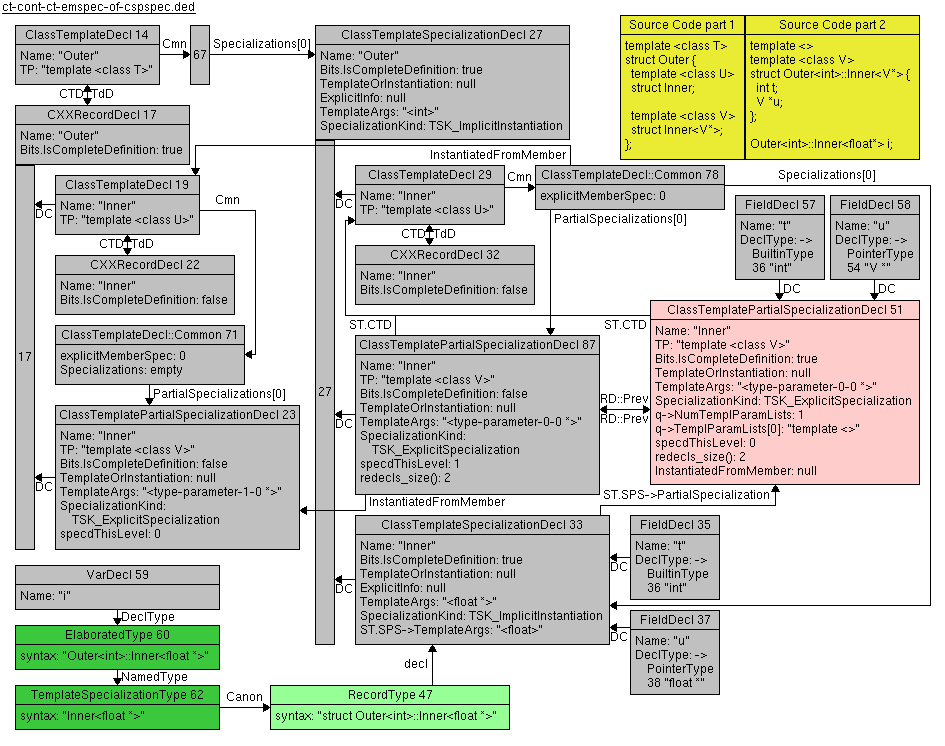

The main feature that is new is that
``ClassTemplatePartialSpecializationDecl 87`` (of which the focus node
is treated as a redeclaration) has ``specdThisLevel=1``, thereby
demonstrating the conditions required to set that flag.

Beware: Like the previous example, this one does not work correctly in
Clang-16 or earlier due to
`Issue #60778 <https://github.com/llvm/llvm-project/issues/60778>`_.
