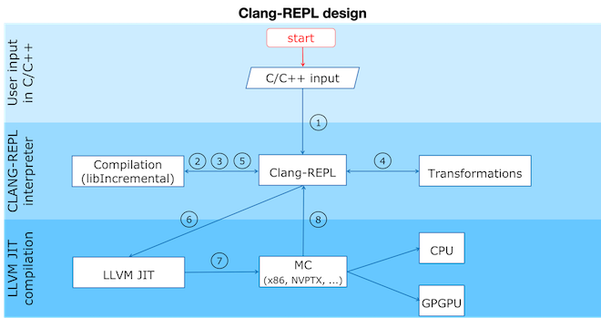

===========
Clang-Repl
===========

**Clang-Repl** is an interactive C++ interpreter that allows for incremental
compilation. It supports interactive programming for C++ in a
read-evaluate-print-loop (REPL) style. It uses Clang as a library to compile the
high level programming language into LLVM IR. Then the LLVM IR is executed by
the LLVM just-in-time (JIT) infrastructure.

Clang-Repl is suitable for exploratory programming and in places where time
to insight is important. Clang-Repl is a project inspired by the work in
`Cling <https://github.com/root-project/cling>`_, a LLVM-based C/C++ interpreter
developed by the field of high energy physics and used by the scientific data
analysis framework `ROOT <https://root.cern/>`_. Clang-Repl allows to move parts
of Cling upstream, making them useful and available to a broader audience.

Clang-Repl Basic Data Flow
==========================

Clang-Repl data flow can be divided into roughly 8 phases:

1. Clang-Repl controls the input infrastructure by an interactive prompt or by
   an interface allowing the incremental processing of input.

2. Then it sends the input to the underlying incremental facilities in Clang
   infrastructure.

3. Clang compiles the input into an AST representation.

4. When required the AST can be further transformed in order to attach specific
   behavior.

5. The AST representation is then lowered to LLVM IR.

6. The LLVM IR is the input format for LLVM’s JIT compilation infrastructure.
   The tool will instruct the JIT to run specified functions, translating them
   into machine code targeting the underlying device architecture (eg. Intel
   x86 or NVPTX).

7. The LLVM JIT lowers the LLVM IR to machine code.

8. The machine code is then executed.

===================
Build Instructions:
===================

.. code-block:: console

   $ cd llvm-project
   $ mkdir build
   $ cd build
   $ cmake -DCMAKE_BUILD_TYPE=RelWithDebInfo -DLLVM_ENABLE_PROJECTS=clang -G "Unix Makefiles" ../llvm

**Note here**, above RelWithDebInfo - Debug / Release

.. code-block:: console

   cmake --build . --target clang clang-repl -j n
      OR
   cmake --build . --target clang clang-repl

**Clang-repl** is built under llvm-project/build/bin. Proceed into the directory **llvm-project/build/bin**

.. code-block:: console

   ./clang-repl
   clang-repl>

================
Clang-Repl Usage
================

**Clang-Repl** is an interactive C++ interpreter that allows for incremental
compilation. It supports interactive programming for C++ in a
read-evaluate-print-loop (REPL) style. It uses Clang as a library to compile the
high level programming language into LLVM IR. Then the LLVM IR is executed by
the LLVM just-in-time (JIT) infrastructure.

Basic:
======

.. code-block:: text

  clang-repl> #include <iostream>
  clang-repl> int f() { std::cout << "Hello Interpreted World!\n"; return 0; }
  clang-repl> auto r = f();
   // Prints Hello Interpreted World!

.. code-block:: text

   clang-repl> #include<iostream>
   clang-repl> using namespace std;
   clang-repl> std::cout << "Welcome to CLANG-REPL" << std::endl;
   Welcome to CLANG-REPL
   // Prints Welcome to CLANG-REPL

Function Definitions and Calls:
===============================

.. code-block:: text

   clang-repl> #include <iostream>
   clang-repl> int sum(int a, int b){ return a+b; };
   clang-repl> int c = sum(9,10);
   clang-repl> std::cout << c << std::endl;
   19
   clang-repl>

Iterative Structures:
=====================

.. code-block:: text

   clang-repl> #include <iostream>
   clang-repl> for (int i = 0;i < 3;i++){ std::cout << i << std::endl;}
   0
   1
   2
   clang-repl> while(i < 7){ i++; std::cout << i << std::endl;}
   4
   5
   6
   7

Classes and Structures:
=======================

.. code-block:: text

   clang-repl> #include <iostream>
   clang-repl> class Rectangle {int width, height; public: void set_values (int,int);\
   clang-repl... int area() {return width*height;}};
   clang-repl>  void Rectangle::set_values (int x, int y) { width = x;height = y;}
   clang-repl> int main () { Rectangle rect;rect.set_values (3,4);\
   clang-repl... std::cout << "area: " << rect.area() << std::endl;\
   clang-repl... return 0;}
   clang-repl> main();
   area: 12
   clang-repl>
   // Note: This '\' can be used for continuation of the statements in the next line

Lamdas:
=======

.. code-block:: text

   clang-repl> #include <iostream>
   clang-repl> using namespace std;
   clang-repl> auto welcome =   { std::cout << "Welcome to REPL" << std::endl;};
   clang-repl> welcome();
   Welcome to REPL

Using Dynamic Library:
======================

.. code-block:: text

   clang-repl> %lib print.so
   clang-repl> #include"print.hpp"
   clang-repl> print(9);
   9

**Generation of dynamic library**

.. code-block:: text

   // print.cpp
   #include <iostream>
   #include "print.hpp"

   void print(int a)
   {
      std::cout << a << std::endl;
   }

   // print.hpp
   void print (int a);

   // Commands
   clang++-17  -c -o print.o print.cpp
   clang-17 -shared print.o -o print.so

Comments:
=========

.. code-block:: text

   clang-repl> // Comments in Clang-Repl
   clang-repl> /* Comments in Clang-Repl */

Closure or Termination:
=======================

.. code-block:: text

   clang-repl>%quit

Just like Clang, Clang-Repl can be integrated in existing applications as a library
(using the clangInterpreter library). This turns your C++ compiler into a service that
can incrementally consume and execute code. The **Compiler as A Service** (**CaaS**)
concept helps support advanced use cases such as template instantiations on demand and
automatic language interoperability. It also helps static languages such as C/C++ become
apt for data science.

Related Reading
===============
`Cling Transitions to LLVM's Clang-Repl <https://root.cern/blog/cling-in-llvm/>`_

`Moving (parts of) the Cling REPL in Clang <https://lists.llvm.org/pipermail/llvm-dev/2020-July/143257.html>`_

`GPU Accelerated Automatic Differentiation With Clad <https://arxiv.org/pdf/2203.06139.pdf>`_
