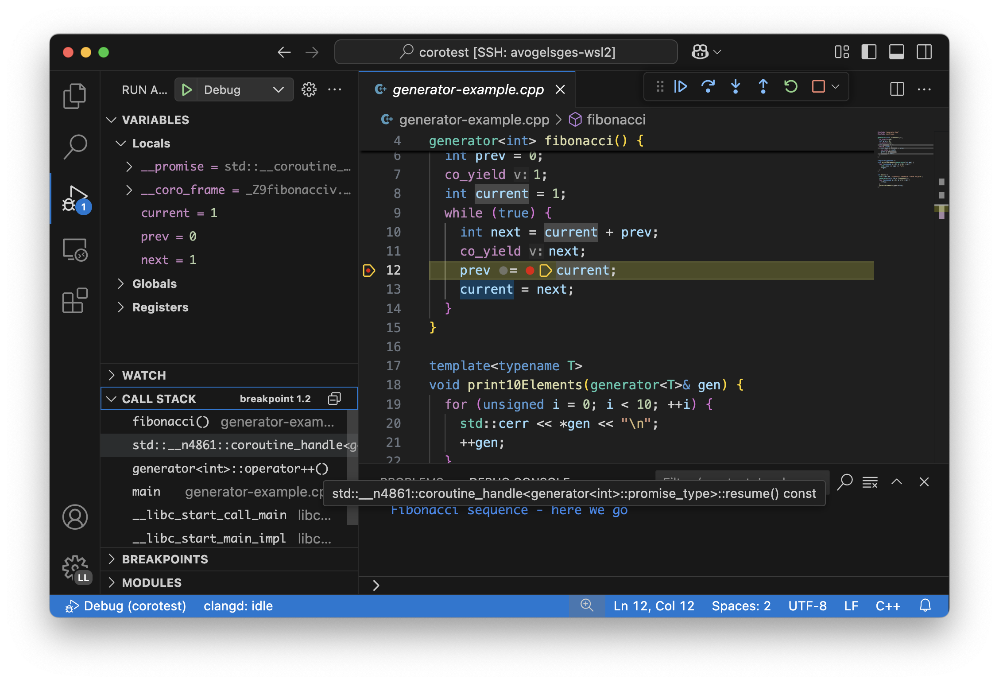
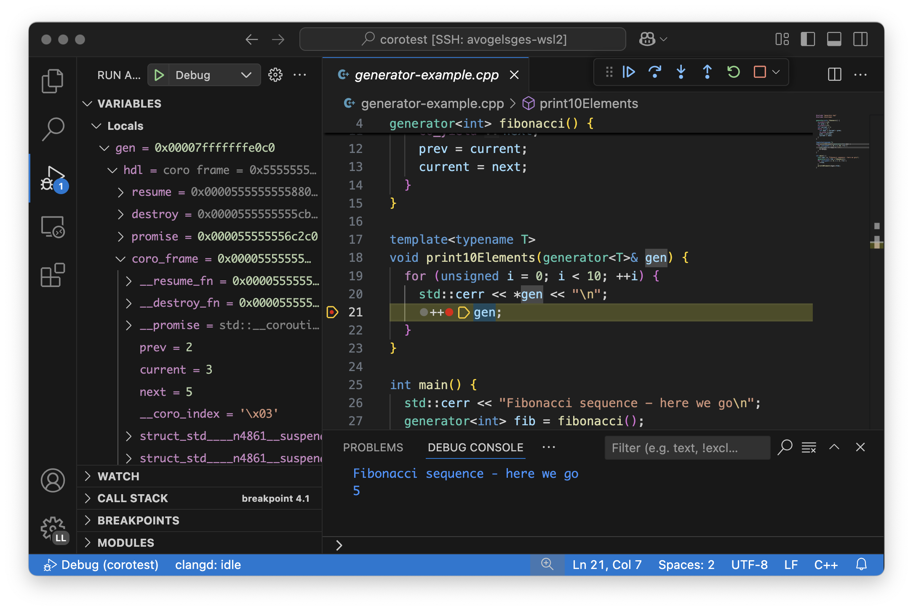
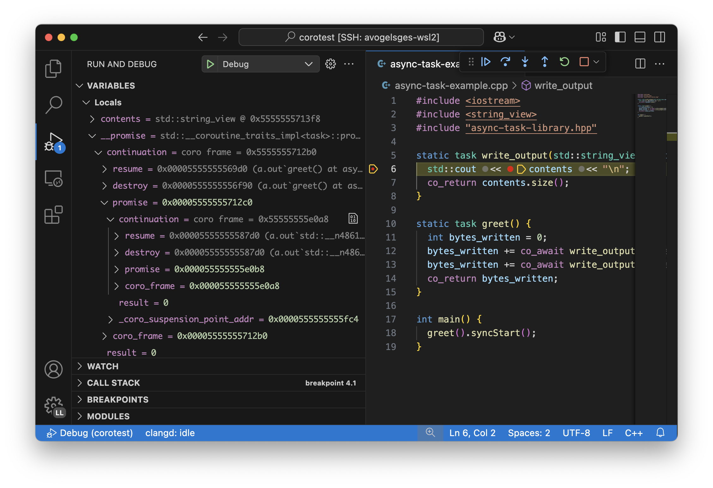

========================
Debugging C++ Coroutines
========================

.. contents::
   :local:

Introduction
============

Coroutines in C++ were introduced in C++20, and the user experience for
debugging them can still be challenging. This document guides you on how to most
efficiently debug coroutines and how to navigate existing shortcomings in
debuggers and compilers.

Coroutines are generally used either as generators or for asynchronous
programming. In this document, we will discuss both use cases. Even if you are
using coroutines for asynchronous programming, you should still read the
generators section, as it introduces foundational debugging techniques also
applicable to the debugging of asynchronous programs.

Both compilers (clang, gcc, ...) and debuggers (lldb, gdb, ...) are
still improving their support for coroutines. As such, we recommend using the
latest available version of your toolchain.

This document focuses on clang and lldb. The screenshots show
`lldb-dap <https://marketplace.visualstudio.com/items?itemName=llvm-vs-code-extensions.lldb-dap>`_
in combination with VS Code. The same techniques can also be used in other
IDEs.

Debugging clang-compiled binaries with gdb is possible, but requires more
scripting. This guide comes with a basic GDB script for coroutine debugging.

This guide will first showcase the more polished, bleeding-edge experience, but
will also show you how to debug coroutines with older toolchains. In general,
the older your toolchain, the deeper you will have to dive into the
implementation details of coroutines (such as their ABI). The further down you go in
this document, the more low-level, technical the content will become. If
you are on an up-to-date toolchain, you will hopefully be able to stop reading
earlier.

Debugging generators
====================

One of the two major use cases for coroutines in C++ is generators, i.e.,
functions which can produce values via ``co_yield``. Values are produced
lazily, on-demand. For this purpose, every time a new value is requested, the
coroutine gets resumed. As soon as it reaches a ``co_yield`` and thereby
returns the requested value, the coroutine is suspended again.

This logic is encapsulated in a ``generator`` type similar to this one:

.. code-block:: c++

  // generator.hpp
  #include <coroutine>

  // `generator` is a stripped down, minimal generator type.
  template<typename T>
  struct generator {
    struct promise_type {
      T current_value{};

      auto get_return_object() {
        return std::coroutine_handle<promise_type>::from_promise(*this);
      }
      auto initial_suspend() { return std::suspend_always(); }
      auto final_suspend() noexcept { return std::suspend_always(); }
      auto return_void() { return std::suspend_always(); }
      void unhandled_exception() { __builtin_unreachable(); }
      auto yield_value(T v) {
        current_value = v;
        return std::suspend_always();
      }
    };

    generator(std::coroutine_handle<promise_type> h) : hdl(h) { hdl.resume(); }
    ~generator() { hdl.destroy(); }

    generator<T>& operator++() { hdl.resume(); return *this; } // resume the coroutine
    T operator*() const { return hdl.promise().current_value; }

    private:
    std::coroutine_handle<promise_type> hdl;
  };

We can then use this ``generator`` class to print the Fibonacci sequence:

.. code-block:: c++

  #include "generator.hpp"
  #include <iostream>

  generator<int> fibonacci() {
    co_yield 0;
    int prev = 0;
    co_yield 1;
    int current = 1;
    while (true) {
      int next = current + prev;
      co_yield next;
      prev = current;
      current = next;
    }
  }

  template<typename T>
  void print10Elements(generator<T>& gen) {
    for (unsigned i = 0; i < 10; ++i) {
      std::cerr << *gen << "\n";
      ++gen;
    }
  }

  int main() {
    std::cerr << "Fibonacci sequence - here we go\n";
    generator<int> fib = fibonacci();
    for (unsigned i = 0; i < 5; ++i) {
      ++fib;
    }
    print10Elements(fib);
  }

To compile this code, use ``clang++ --std=c++23 generator-example.cpp -g``.

Breakpoints inside the generators
---------------------------------

We can set breakpoints inside coroutines just as we set them in regular
functions. For VS Code, that means clicking next the line number in the editor.
In the ``lldb`` CLI or in ``gdb``, you can use ``b`` to set a breakpoint.

Inspecting variables in a coroutine
-----------------------------------

If you hit a breakpoint inside the ``fibonacci`` function, you should be able
to inspect all local variables (``prev``, ``current``, ``next``) just like in
a regular function.



Note the two additional variables ``__promise`` and ``__coro_frame``. Those
show the internal state of the coroutine. They are not relevant for our
generator example but will be relevant for asynchronous programming described
in the next section.

Stepping out of a coroutine
---------------------------

When single-stepping, you will notice that the debugger will leave the
``fibonacci`` function as soon as you hit a ``co_yield`` statement. You might
find yourself inside some standard library code. After stepping out of the
library code, you will be back in the ``main`` function.

Stepping into a coroutine
-------------------------

If you stop at ``++fib`` and try to step into the generator, you will first
find yourself inside ``operator++``. Stepping into the ``handle.resume()`` will
not work by default.

This is because lldb does not step into functions from the standard library by
default. To make this work, you first need to run ``settings set
target.process.thread.step-avoid-regexp ""``. You can do so from the "Debug
Console" towards the bottom of the screen. With that setting change, you can
step through ``coroutine_handle::resume`` and into your generator.

You might find yourself at the top of the coroutine at first, instead of at
your previous suspension point. In that case, single-step and you will arrive
at the previously suspended ``co_yield`` statement.


Inspecting a suspended coroutine
--------------------------------

The ``print10Elements`` function receives an opaque ``generator`` type. Let's
assume we are suspended at the ``++gen;`` line and want to inspect the
generator and its internal state.

To do so, we can simply look into the ``gen.hdl`` variable. LLDB comes with a
pretty printer for ``std::coroutine_handle`` which will show us the internal
state of the coroutine. For GDB, the pretty printer is provided by a script,
see :ref:`gdb-script` for setup instructions.



We can see two function pointers ``resume`` and ``destroy``. These pointers
point to the resume / destroy functions. By inspecting those function pointers,
we can see that our ``generator`` is actually backed by our ``fibonacci``
coroutine. When using VS Code + lldb-dap, you can Cmd+Click on the function
address (``0x555...`` in the screenshot) to jump directly to the function
definition backing your coroutine handle.

Next, we see the ``promise``. In our case, this reveals the current value of
our generator.

The ``coro_frame`` member represents the internal state of the coroutine. It
contains our internal coroutine state ``prev``, ``current``, ``next``.
Furthermore, it contains many internal, compiler-specific members, which are
named based on their type. These represent temporary values which the compiler
decided to spill across suspension points, but which were not declared in our
original source code and hence have no proper user-provided name.

Tracking the exact suspension point
-----------------------------------

Among the compiler-generated members, the ``__coro_index`` is particularly
important. This member identifies the suspension point at which the coroutine
is currently suspended. However, it is non-trivial to map this number back to
a source code location.

For GDB, the provided :ref:`gdb-script` already takes care of this and provides
the exact line number of the suspension point as part of the coroutine handle's
summary string. Unfortunately, LLDB's pretty-printer does not support this, yet.
Furthermore, those labels are only emitted starting with clang 21.0.

When debugging with LLDB or when using older clang versions, we will have to use
a different approach.

For simple cases, you might still be able to guess the suspension point correctly.
Alternatively, you might also want to modify your coroutine library to store
the line number of the current suspension point in the promise:

.. code-block:: c++

  // For all promise_types we need a new `_coro_return_address` variable:
  class promise_type {
    ...
    void* _coro_return_address = nullptr;
  };

  // For all the awaiter types we need:
  class awaiter {
    ...
    template <typename Promise>
    __attribute__((noinline)) auto await_suspend(std::coroutine_handle<Promise> handle) {
          ...
          handle.promise()._coro_return_address = __builtin_return_address(0);
    }
  };

This stores the return address of ``await_suspend`` within the promise.
Thereby, we can read it back from the promise of a suspended coroutine and map
it to an exact source code location. For a complete example, see the ``task``
type used below for asynchronous programming.

Alternatively, we can modify the C++ code to store the line number in the
promise type. We can use ``std::source_location`` to get the line number of
the await and store it inside the ``promise_type``. In the debugger, we can
then read the line number from the promise of the suspended coroutine.

.. code-block:: c++

  // For all the awaiter types we need:
  class awaiter {
    ...
    template <typename Promise>
    void await_suspend(std::coroutine_handle<Promise> handle,
                       std::source_location sl = std::source_location::current()) {
          ...
          handle.promise().line_number = sl.line();
    }
  };

The downside of both approaches is that they come at the price of additional
runtime cost. In particular, the second approach increases binary size, since it
requires additional ``std::source_location`` objects, and those source
locations are not stripped by split-dwarf. Whether the first approach is worth
the additional runtime cost is a trade-off you need to make yourself.

Async stack traces
==================

Besides generators, the second common use case for coroutines in C++ is
asynchronous programming, usually involving libraries such as stdexec, folly,
cppcoro, boost::asio, or similar libraries. Some of those libraries already
provide custom debugging support, so in addition to this guide, you might want
to check out their documentation.

When using coroutines for asynchronous programming, your library usually
provides you with some ``task`` type. This type usually looks similar to this:

.. code-block:: c++

  // async-task-library.hpp
  #include <coroutine>
  #include <utility>

  struct task {
    struct promise_type {
      task get_return_object() { return std::coroutine_handle<promise_type>::from_promise(*this); }
      auto initial_suspend() { return std::suspend_always{}; }

      void unhandled_exception() noexcept {}

      auto final_suspend() noexcept {
        struct FinalSuspend {
          std::coroutine_handle<> continuation;
          auto await_ready() noexcept { return false; }
          auto await_suspend(std::coroutine_handle<> handle) noexcept {
            return continuation;
          }
          void await_resume() noexcept {}
        };
        return FinalSuspend{continuation};
      }

      void return_value(int res) { result = res; }

      std::coroutine_handle<> continuation = std::noop_coroutine();
      int result = 0;
      #ifndef NDEBUG
      void* _coro_suspension_point_addr = nullptr;
      #endif
    };

    task(std::coroutine_handle<promise_type> handle) : handle(handle) {}
    ~task() {
      if (handle)
        handle.destroy();
    }

    struct Awaiter {
      std::coroutine_handle<promise_type> handle;
      auto await_ready() { return false; }

      template <typename P>
      #ifndef NDEBUG
      __attribute__((noinline))
      #endif
      auto await_suspend(std::coroutine_handle<P> continuation) {
        handle.promise().continuation = continuation;
        #ifndef NDEBUG
        continuation.promise()._coro_suspension_point_addr = __builtin_return_address(0);
        #endif
        return handle;
      }
      int await_resume() {
        return handle.promise().result;
      }
    };

    auto operator co_await() {
      return Awaiter{handle};
    }

    int syncStart() {
      handle.resume();
      return handle.promise().result;
    }

  private:
    std::coroutine_handle<promise_type> handle;
  };

Note how the ``task::promise_type`` has a member variable
``std::coroutine_handle<> continuation``. This is the handle of the coroutine
that will be resumed when the current coroutine is finished executing (see
``final_suspend``). In a sense, this is the "return address" of the coroutine.
It is set inside ``operator co_await`` when another coroutine calls our
generator and awaits for the next value to be produced.

The result value is returned via the ``int result`` member. It is written in
``return_value`` and read by ``Awaiter::await_resume``. Usually, the result
type of a task is a template argument. For simplicity's sake, we hard-coded the
``int`` type in this example.

Stack traces of in-flight coroutines
------------------------------------

Let's assume you have the following program and set a breakpoint inside the
``write_output`` function. There are multiple call paths through which this
function could have been reached. How can we find out said call path?

.. code-block:: c++

  #include <iostream>
  #include <string_view>
  #include "async-task-library.hpp"

  static task write_output(std::string_view contents) {
    std::cout << contents << "\n";
    co_return contents.size();
  }

  static task greet() {
    int bytes_written = 0;
    bytes_written += co_await write_output("Hello");
    bytes_written += co_await write_output("World");
    co_return bytes_written;
  }

  int main() {
    int bytes_written = greet().syncStart();
    std::cout << "Bytes written: " << bytes_written << "\n";
    return 0;
  }

To do so, let's break inside ``write_output``. We can understand our call-stack
by looking into the special ``__promise`` variable. This artificial variable is
generated by the compiler and points to the ``promise_type`` instance
corresponding to the currently in-flight coroutine. In this case, the
``__promise`` variable contains the ``continuation`` which points to our
caller. That caller again contains a ``promise`` with a ``continuation`` which
points to our caller's caller.



We can figure out the involved coroutine functions and their current suspension
points as discussed above in the "Inspecting a suspended coroutine" section.

When using LLDB's CLI, the command ``p --ptr-depth 4 __promise`` might also be
useful to automatically dereference all the pointers up to the given depth.

To get a flat representation of that call stack, we can use a debugger script,
such as the one shown in the :ref:`lldb-script` section. With that
script, we can run ``coro bt`` to get the following stack trace:

.. code-block::

  (lldb) coro bt
  frame #0: write_output(std::basic_string_view<char, std::char_traits<char>>) at /home/avogelsgesang/Documents/corotest/async-task-example.cpp:6:16
  [async] frame #1: greet() at /home/avogelsgesang/Documents/corotest/async-task-example.cpp:12:20
  [async] frame #2: std::__n4861::coroutine_handle<std::__n4861::noop_coroutine_promise>::__frame::__dummy_resume_destroy() at /usr/include/c++/14/coroutine:298, suspension point unknown
  frame #3: std::__n4861::coroutine_handle<task::promise_type>::resume() const at /usr/include/c++/14/coroutine:242:29
  frame #4: task::syncStart() at /home/avogelsgesang/Documents/corotest/async-task-library.hpp:78:14
  frame #5: main at /home/avogelsgesang/Documents/corotest/async-task-example.cpp:18:11
  frame #6: __libc_start_call_main at sysdeps/nptl/libc_start_call_main.h:58:16
  frame #7: __libc_start_main_impl at csu/libc-start.c:360:3
  frame #8: _start at :4294967295

Note how the frames #1 and #2 are async frames.

The ``coro bt`` command already includes logic to identify the exact suspension
point of each frame based on the ``_coro_suspension_point_addr`` stored inside
the promise.

Stack traces of suspended coroutines
------------------------------------

Usually, while a coroutine is waiting for, e.g., an in-flight network request,
the suspended ``coroutine_handle`` is stored within the work queues inside the
IO scheduler. As soon as we get hold of the coroutine handle, we can backtrace
it by using ``coro bt <coro_handle>`` where ``<coro_handle>`` is an expression
evaluating to the coroutine handle of the suspended coroutine.

Keeping track of all existing coroutines
----------------------------------------

Usually, we should be able to get hold of all currently suspended coroutines by
inspecting the worker queues of the IO scheduler. In cases where this is not
possible, we can use the following approach to keep track of all currently
suspended coroutines.

One such solution is to store the list of in-flight coroutines in a collection:

.. code-block:: c++

  inline std::unordered_set<std::coroutine_handle<void>> inflight_coroutines;
  inline std::mutex inflight_coroutines_mutex;

  class promise_type {
  public:
      promise_type() {
          std::unique_lock<std::mutex> lock(inflight_coroutines_mutex);
          inflight_coroutines.insert(std::coroutine_handle<promise_type>::from_promise(*this));
      }
      ~promise_type() {
          std::unique_lock<std::mutex> lock(inflight_coroutines_mutex);
          inflight_coroutines.erase(std::coroutine_handle<promise_type>::from_promise(*this));
      }
  };

With this in place, it is possible to inspect ``inflight_coroutines`` from the
debugger and rely on LLDB's ``std::coroutine_handle`` pretty-printer to
inspect the coroutines.

This technique will track *all* coroutines, also the ones which are currently
awaiting another coroutine, though. To identify just the "roots" of our
in-flight coroutines, we can use the ``coro in-flight inflight_coroutines``
command provided by the :ref:`lldb-script`.

Please note that the above is expensive from a runtime performance perspective,
and requires locking to prevent data races. As such, it is not recommended to
use this approach in production code.

Known issues & workarounds for older LLDB versions
==================================================

LLDB before 21.0 did not yet show the ``__coro_frame`` inside
``coroutine_handle``. To inspect the coroutine frame, you had to use the
approach described in the :ref:`devirtualization` section.

LLDB before 18.0 hid the ``__promise`` and ``__coro_frame``
variables by default. The variables are still present, but they need to be
explicitly added to the "watch" pane in VS Code or requested via
``print __promise`` and ``print __coro_frame`` from the debugger console.

LLDB before 16.0 did not yet provide a pretty-printer for
``std::coroutine_handle``. To inspect the coroutine handle, you had to manually
use the approach described in the :ref:`devirtualization`
section.

Toolchain Implementation Details
================================

This section covers the ABI as well as additional compiler-specific behavior.
The ABI is followed by all compilers, on all major systems, including Windows,
Linux, and macOS. Different compilers emit different debug information, though.

Ramp, resume and destroy functions
----------------------------------

Every coroutine is split into three parts:

* The ramp function allocates the coroutine frame and initializes it, usually
  copying over all variables into the coroutine frame
* The resume function continues the coroutine from its previous suspension point
* The destroy function destroys and deallocates the coroutine frame
* The cleanup function destroys the coroutine frame but does not deallocate it.
  It is used when the coroutine's allocation was elided thanks to
  `Heap Allocation Elision (HALO) <https://www.open-std.org/JTC1/SC22/WG21/docs/papers/2018/p0981r0.html>`_

The ramp function is called by the coroutine's caller, and available under the
original function name used in the C++ source code. The resume function is
called via ``std::coroutine_handle::resume``. The destroy function is called
via ``std::coroutine_handle::destroy``.

Information between the three functions is passed via the coroutine frame, a
compiler-synthesized struct that contains all necessary internal state. The
resume function knows where to resume execution by reading the suspension point
index from the coroutine frame. Similarly, the destroy function relies on the
suspension point index to know which variables are currently in scope and need
to be destructed.

Usually, the destroy function calls all destructors and deallocates the
coroutine frame. When a coroutine frame was elided thanks to HALO, only the
destructors need to be called, but the coroutine frame must not be deallocated.
In those cases, the cleanup function is used instead of the destroy function.

For coroutines allocated with ``[[clang::coro_await_elidable]]``, clang also
generates a ``.noalloc`` variant of the ramp function, which does not allocate
the coroutine frame by itself, but instead expects the caller to allocate the
coroutine frame and pass it to the ramp function.

When trying to intercept all creations of new coroutines in the debugger, you
hence might have to set breakpoints in the ramp function and its ``.noalloc``
variant.

Artificial ``__promise`` and ``__coro_frame`` variables
-------------------------------------------------------

Inside all coroutine functions, clang / LLVM synthesize a ``__promise`` and
``__coro_frame`` variable. These variables are used to store the coroutine's
state. When inside the coroutine function, those can be used to directly
inspect the promise and the coroutine frame of the own function.

The ABI of a coroutine
----------------------

A ``std::coroutine_handle`` essentially only holds a pointer to a coroutine
frame. It resembles the following struct:

.. code-block:: c++

  template<typename promise_type>
  struct coroutine_handle {
    void* __coroutine_frame = nullptr;
  };

The structure of coroutine frames is defined as

.. code-block:: c++

  struct my_coroutine_frame {
    void (*__resume)(coroutine_frame*); // function pointer to the `resume` function
    void (*__destroy)(coroutine_frame*); // function pointer to the `destroy` function
    promise_type promise; // the corresponding `promise_type`
    ... // Internal coroutine state
  }

For each coroutine, the compiler synthesizes a different coroutine type,
storing all necessary internal state. The actual coroutine type is type-erased
behind the ``std::coroutine_handle``.

However, all coroutine frames always contain the ``resume`` and ``destroy``
functions as their first two members. As such, we can read the function
pointers from the coroutine frame and then obtain the function's name from its
address.

The promise is guaranteed to be at a 16-byte offset from the coroutine frame.
If we have a coroutine handle at address 0x416eb0, we can hence reinterpret-cast
the promise as follows:

.. code-block:: text

  print (task::promise_type)*(0x416eb0+16)

Implementation in clang / LLVM
------------------------------

The C++ Coroutines feature in the Clang compiler is implemented in two parts of
the compiler. Semantic analysis is performed in Clang, and coroutine
construction and optimization take place in the LLVM middle-end.

For each coroutine function, the frontend generates a single corresponding
LLVM-IR function. This function uses special ``llvm.coro.suspend`` intrinsics
to mark the suspension points of the coroutine. The middle end first optimizes
this function and applies, e.g., constant propagation across the whole,
non-split coroutine.

CoroSplit then splits the function into ramp, resume and destroy functions.
This pass also moves stack-local variables which are alive across suspension
points into the coroutine frame. Most of the heavy lifting to preserve debugging
information is done in this pass. This pass needs to rewrite all variable
locations to point into the coroutine frame.

Afterwards, a couple of additional optimizations are applied before code
gets emitted, but none of them are really interesting regarding debugging
information.

For more details on the IR representation of coroutines and the relevant
optimization passes, see `Coroutines in LLVM <https://llvm.org/docs/Coroutines.html>`_.

Emitting debug information inside ``CoroSplit`` forces us to generate
insufficient debugging information. Usually, the compiler generates debug
information in the frontend, as debug information is highly language specific.
However, this is not possible for coroutine frames because the frames are
constructed in the LLVM middle-end.

To mitigate this problem, the LLVM middle end attempts to generate some debug
information, which is unfortunately incomplete, since much of the
language-specific information is missing in the middle end.

.. _devirtualization:

Devirtualization of coroutine handles
-------------------------------------

Figuring out the promise type and the coroutine frame type of a coroutine
handle requires inspecting the ``resume`` and ``destroy`` function pointers.
There are two possible approaches to do so:

1. clang always names the type by appending ``.coro_frame_ty`` to the
   linkage name of the ramp function.
2. Both clang and GCC add the function-local ``__promise`` and
   ``__coro_frame`` variables to the resume and destroy functions.
   We can lookup their types and thereby get the types of promise
   and coroutine frame.

In general, the second approach is preferred, as it is more portable.

To do so, we look up the types in the destroy function and not the resume function
because the resume function pointer will be set to a ``nullptr`` as soon as a
coroutine reaches its final suspension point. If we used the resume function,
devirtualization would hence fail for all coroutines that have reached their final
suspension point.

LLDB comes with devirtualization support out of the box, as part of the
pretty-printer for ``std::coroutine_handle``. For GDB, a similar pretty-printer
is provided by the :ref:`gdb-script`.

Interpreting the coroutine frame in optimized builds
----------------------------------------------------

The ``__coro_frame`` variable usually refers to the coroutine frame of an
*in-flight* coroutine. This means the coroutine is currently executing.
However, the compiler only guarantees the coroutine frame to be in a consistent
state while the coroutine is suspended. As such, the variables inside the
``__coro_frame`` variable might be outdated, particularly when optimizations
are enabled.

Furthermore, when optimizations are enabled, the compiler will layout the
coroutine frame more aggressively. Unused values are optimized out, and the
state will usually contain only the minimal information required to reconstruct
the coroutine's state.

clang / LLVM usually use variables like ``__int_32_0`` to represent this
optimized storage. Those values usually do not directly correspond to variables
in the source code.

When compiling the program

.. code-block:: c++

  static task coro_task(int v) {
    int a = v;
    co_await some_other_task();
    a++; // __int_32_0 is 43 here
    std::cout << a << "\n";
    a++; // __int_32_0 is still 43 here
    std::cout << a << "\n";
    a++; // __int_32_0 is still 43 here!
    std::cout << a << "\n";
    co_await some_other_task();
    a++; // __int_32_0 is still 43 here!!
    std::cout << a << "\n";
    a++; // Why is __int_32_0 still 43 here?
    std::cout << a << "\n";
  }

clang creates a single entry ``__int_32_0`` in the coroutine state.

Intuitively, one might assume that ``__int_32_0`` represents the value of the
local variable ``a``. However, inspecting ``__int_32_0`` in the debugger while
single-stepping will reveal that the value of ``__int_32_0`` stays constant,
despite ``a`` being frequently incremented.

While this might be surprising, this is a result of the optimizer recognizing
that it can eliminate most of the load/store operations.
The above code is optimized to the equivalent of:

.. code-block:: c++

  static task coro_task(int v) {
    store v into __int_32_0 in the frame
    co_await await_counter{};
    a = load __int_32_0
    std::cout << a+1 << "\n";
    std::cout << a+2 << "\n";
    std::cout << a+3 << "\n";
    co_await await_counter{};
    a = load __int_32_0
    std::cout << a+4 << "\n";
    std::cout << a+5 << "\n";
  }

It should now be obvious why the value of ``__int_32_0`` remains unchanged
throughout the function. It is important to recognize that ``__int_32_0`` does
not directly correspond to ``a``, but is instead a variable generated to assist
the compiler in code generation. The variables in an optimized coroutine frame
should not be thought of as directly representing the variables in the C++
source.


Mapping suspension point indices to source code locations
---------------------------------------------------------

To aid in mapping a ``__coro_index`` back to a source code location, clang 21.0
and newer emit special, compiler-generated labels for the suspension points.

In gdb, we can use the ``info line`` command to get the source code location of
the suspension point.

::

  (gdb) info line -function coro_task -label __coro_resume_2
  Line 45 of "llvm-example.cpp" starts at address 0x1b1b <_ZL9coro_taski.resume+555> and ends at 0x1b46 <_ZL9coro_taski.resume+598>.
  Line 45 of "llvm-example.cpp" starts at address 0x201b <_ZL9coro_taski.destroy+555> and ends at 0x2046 <_ZL9coro_taski.destroy+598>.
  Line 45 of "llvm-example.cpp" starts at address 0x253b <_ZL9coro_taski.cleanup+555> and ends at 0x2566 <_ZL9coro_taski.cleanup+598>.

LLDB does not support looking up labels, yet. For this reason, LLDB's pretty-printer
does not show the exact line number of the suspension point.


Resources
=========

.. _lldb-script:

LLDB Debugger Script
--------------------

The following script provides the ``coro bt`` and ``coro in-flight`` commands
discussed above. It can be loaded into LLDB using ``command script import
lldb_coro_debugging.py``. To load this by default, add this command to your
``~/.lldbinit`` file.

Note that this script requires LLDB 21.0 or newer.

.. code-block:: python

  # lldb_coro_debugging.py
  import lldb
  from lldb.plugins.parsed_cmd import ParsedCommand

  def _get_first_var_path(v, paths):
      """
      Tries multiple variable paths via `GetValueForExpressionPath`
      and returns the first one that succeeds, or None if none succeed.
      """
      for path in paths:
          var = v.GetValueForExpressionPath(path)
          if var.error.Success():
              return var
      return None


  def _print_async_bt(coro_hdl, result, *, curr_idx, start, limit, continuation_paths, prefix=""):
      """
      Prints a backtrace for an async coroutine stack starting from `coro_hdl`,
      using the given `continuation_paths` to get the next coroutine from the promise.
      """
      target = coro_hdl.GetTarget()
      while curr_idx < limit and coro_hdl is not None and coro_hdl.error.Success():
          # Print the stack frame, if in range
          if curr_idx >= start:
              # Figure out the function name
              destroy_func_var = coro_hdl.GetValueForExpressionPath(".destroy")
              destroy_addr = target.ResolveLoadAddress(destroy_func_var.GetValueAsAddress())
              func_name = destroy_addr.function.name
              # Figure out the line entry to show
              suspension_addr_var = coro_hdl.GetValueForExpressionPath(".promise._coro_suspension_point_addr")
              if suspension_addr_var.error.Success():
                  line_entry = target.ResolveLoadAddress(suspension_addr_var.GetValueAsAddress()).line_entry
                  print(f"{prefix} frame #{curr_idx}: {func_name} at {line_entry}", file=result)
              else:
                  # We don't know the exact line, print the suspension point ID, so we at least show
                  # the id of the current suspension point
                  suspension_point_var = coro_hdl.GetValueForExpressionPath(".coro_frame.__coro_index")
                  if suspension_point_var.error.Success():
                      suspension_point = suspension_point_var.GetValueAsUnsigned()
                  else:
                      suspension_point = "unknown"
                  line_entry = destroy_addr.line_entry
                  print(f"{prefix} frame #{curr_idx}: {func_name} at {line_entry}, suspension point {suspension_point}", file=result)
          # Move to the next stack frame
          curr_idx += 1
          promise_var = coro_hdl.GetChildMemberWithName("promise")
          coro_hdl = _get_first_var_path(promise_var, continuation_paths)
      return curr_idx

  def _print_combined_bt(frame, result, *, unfiltered, curr_idx, start, limit, continuation_paths):
      """
      Prints a backtrace starting from `frame`, interleaving async coroutine frames
      with regular frames.
      """
      while curr_idx < limit and frame.IsValid():
          if curr_idx >= start and (unfiltered or not frame.IsHidden()):
              print(f"frame #{curr_idx}: {frame.name} at {frame.line_entry}", file=result)
          curr_idx += 1
          coro_var = _get_first_var_path(frame.GetValueForVariablePath("__promise"), continuation_paths)
          if coro_var:
              curr_idx = _print_async_bt(coro_var, result,
                  curr_idx=curr_idx, start=start, limit=limit,
                  continuation_paths=continuation_paths, prefix="[async]")
          frame = frame.parent


  class CoroBacktraceCommand(ParsedCommand):
      def get_short_help(self):
          return "Create a backtrace for C++-20 coroutines"

      def get_flags(self):
          return lldb.eCommandRequiresFrame | lldb.eCommandProcessMustBePaused

      def setup_command_definition(self):
          ov_parser = self.get_parser()
          ov_parser.add_option(
              "e",
              "continuation-expr",
              help = (
                  "Semi-colon-separated list of expressions evaluated against the promise object"
                  "to get the next coroutine (e.g. `.continuation;.coro_parent`)"
              ),
              value_type = lldb.eArgTypeNone,
              dest = "continuation_expr_arg",
              default = ".continuation",
          )
          ov_parser.add_option(
              "c",
              "count",
              help = "How many frames to display (0 for all)",
              value_type = lldb.eArgTypeCount,
              dest = "count_arg",
              default = 20,
          )
          ov_parser.add_option(
              "s",
              "start",
              help = "Frame in which to start the backtrace",
              value_type = lldb.eArgTypeIndex,
              dest = "frame_index_arg",
              default = 0,
          )
          ov_parser.add_option(
              "u",
              "unfiltered",
              help = "Do not filter out frames according to installed frame recognizers",
              value_type = lldb.eArgTypeBoolean,
              dest = "unfiltered_arg",
              default = False,
          )
          ov_parser.add_argument_set([
              ov_parser.make_argument_element(
                  lldb.eArgTypeExpression,
                  repeat="optional"
              )
          ])

      def __call__(self, debugger, args_array, exe_ctx, result):
          ov_parser = self.get_parser()
          continuation_paths = ov_parser.continuation_expr_arg.split(";")
          count = ov_parser.count_arg
          if count == 0:
              count = 99999
          frame_index = ov_parser.frame_index_arg
          unfiltered = ov_parser.unfiltered_arg

          frame = exe_ctx.GetFrame()
          if not frame.IsValid():
              result.SetError("invalid frame")
              return

          if len(args_array) > 1:
              result.SetError("At most one expression expected")
              return
          elif len(args_array) == 1:
              expr = args_array.GetItemAtIndex(0).GetStringValue(9999)
              coro_hdl = frame.EvaluateExpression(expr)
              if not coro_hdl.error.Success():
                  result.AppendMessage(
                      f'error: expression failed {expr} => {coro_hdl.error}'
                  )
                  result.SetError(f"Expression `{expr}` failed to evaluate")
                  return
              _print_async_bt(coro_hdl, result,
                  curr_idx = 0, start = frame_index, limit = frame_index + count,
                  continuation_paths = continuation_paths)
          else:
              _print_combined_bt(frame, result, unfiltered=unfiltered,
                  curr_idx = 0, start = frame_index, limit = frame_index + count,
                  continuation_paths = continuation_paths)


  class CoroInflightCommand(ParsedCommand):
      def get_short_help(self):
          return "Identify all in-flight coroutines"

      def get_flags(self):
          return lldb.eCommandRequiresTarget | lldb.eCommandProcessMustBePaused

      def setup_command_definition(self):
          ov_parser = self.get_parser()
          ov_parser.add_option(
              "e",
              "continuation-expr",
              help = (
                  "Semi-colon-separated list of expressions evaluated against the promise object"
                  "to get the next coroutine (e.g. `.continuation;.coro_parent`)"
              ),
              value_type = lldb.eArgTypeNone,
              dest = "continuation_expr_arg",
              default = ".continuation",
          )
          ov_parser.add_option(
              "c",
              "count",
              help = "How many frames to display (0 for all)",
              value_type = lldb.eArgTypeCount,
              dest = "count_arg",
              default = 5,
          )
          ov_parser.add_argument_set([
              ov_parser.make_argument_element(
                  lldb.eArgTypeExpression,
                  repeat="plus"
              )
          ])

      def __call__(self, debugger, args_array, exe_ctx, result):
          ov_parser = self.get_parser()
          continuation_paths = ov_parser.continuation_expr_arg.split(";")
          count = ov_parser.count_arg

          # Collect all coroutine_handles from the provided containers
          all_coros = []
          for entry in args_array:
              expr = entry.GetStringValue(9999)
              if exe_ctx.frame.IsValid():
                  coro_container = exe_ctx.frame.EvaluateExpression(expr)
              else:
                  coro_container = exe_ctx.target.EvaluateExpression(expr)
              if not coro_container.error.Success():
                  result.AppendMessage(
                      f'error: expression failed {expr} => {coro_container.error}'
                  )
                  result.SetError(f"Expression `{expr}` failed to evaluate")
                  return
              for entry in coro_container.children:
                  if "coroutine_handle" not in entry.GetType().name:
                      result.SetError(f"Found entry of type {entry.GetType().name} in {expr},"
                                      "  expected a coroutine handle")
                      return
                  all_coros.append(entry)

          # Remove all coroutines that are currently waiting for other coroutines to finish
          coro_roots = {c.GetChildMemberWithName("coro_frame").GetValueAsAddress(): c for c in all_coros}
          for coro_hdl in all_coros:
              parent_coro = _get_first_var_path(coro_hdl.GetChildMemberWithName("promise"), continuation_paths)
              parent_addr = parent_coro.GetChildMemberWithName("coro_frame").GetValueAsAddress()
              if parent_addr in coro_roots:
                  del coro_roots[parent_addr]

          # Print all remaining coroutines
          for addr, root_hdl in coro_roots.items():
              print(f"coroutine root 0x{addr:x}", file=result)
              _print_async_bt(root_hdl, result,
                              curr_idx=0, start=0, limit=count,
                              continuation_paths=continuation_paths, prefix="    ")


  def __lldb_init_module(debugger, internal_dict):
      debugger.HandleCommand("command container add -h 'Debugging utilities for C++20 coroutines' coro")
      debugger.HandleCommand(f"command script add -o -p -c {__name__}.CoroBacktraceCommand coro bt")
      debugger.HandleCommand(f"command script add -o -p -c {__name__}.CoroInflightCommand coro in-flight")
      print("Coro debugging utilities installed. Use `help coro` to see available commands.")

  if __name__ == '__main__':
      print("This script should be loaded from LLDB using `command script import <filename>`")

.. _gdb-script:

GDB Debugger Script
-------------------

The following script provides:

* a pretty-printer for coroutine handles
* a frame filter to add coroutine frames to the built-in ``bt`` command
* the ``get_coro_frame`` and ``get_coro_promise`` functions to be used in
  expressions, e.g. ``p get_coro_promise(fib.coro_hdl)->current_state``

It can be loaded into GDB using ``source gdb_coro_debugging.py``.
To load this by default, add this command to your ``~/.gdbinit`` file.

.. code-block:: python

  # gdb_coro_debugging.py
  import gdb
  from gdb.FrameDecorator import FrameDecorator

  import typing
  import re

  def _load_pointer_at(addr: int):
      return gdb.Value(addr).reinterpret_cast(gdb.lookup_type('void').pointer().pointer()).dereference()

  """
  Devirtualized coroutine frame.

  Devirtualizes the promise and frame pointer types by inspecting
  the destroy function.

  Implements `to_string` and `children` to be used by `gdb.printing.PrettyPrinter`.
  Base class for `CoroutineHandlePrinter`.
  """
  class DevirtualizedCoroFrame:
      def __init__(self, frame_ptr_raw: int, val: gdb.Value | None = None):
          self.val = val
          self.frame_ptr_raw = frame_ptr_raw

          # Get the resume and destroy pointers.
          if frame_ptr_raw == 0:
              self.resume_ptr = None
              self.destroy_ptr = None
              self.promise_ptr = None
              self.frame_ptr = gdb.Value(frame_ptr_raw).reinterpret_cast(gdb.lookup_type("void").pointer())
              return

          # Get the resume and destroy pointers.
          self.resume_ptr = _load_pointer_at(frame_ptr_raw)
          self.destroy_ptr = _load_pointer_at(frame_ptr_raw + 8)

          # Devirtualize the promise and frame pointer types.
          frame_type = gdb.lookup_type("void")
          promise_type = gdb.lookup_type("void")
          self.destroy_func = gdb.block_for_pc(int(self.destroy_ptr))
          if self.destroy_func is not None:
              frame_var = gdb.lookup_symbol("__coro_frame", self.destroy_func, gdb.SYMBOL_VAR_DOMAIN)[0]
              if frame_var is not None:
                  frame_type = frame_var.type
              promise_var = gdb.lookup_symbol("__promise", self.destroy_func, gdb.SYMBOL_VAR_DOMAIN)[0]
              if promise_var is not None:
                  promise_type = promise_var.type.strip_typedefs()

          # If the type has a template argument, prefer it over the devirtualized type.
          if self.val is not None:
              promise_type_template_arg = self.val.type.template_argument(0)
              if promise_type_template_arg is not None and promise_type_template_arg.code != gdb.TYPE_CODE_VOID:
                  promise_type = promise_type_template_arg

          self.promise_ptr = gdb.Value(frame_ptr_raw + 16).reinterpret_cast(promise_type.pointer())
          self.frame_ptr = gdb.Value(frame_ptr_raw).reinterpret_cast(frame_type.pointer())

          # Try to get the suspension point index and look up the exact line entry.
          self.suspension_point_index = int(self.frame_ptr.dereference()["__coro_index"]) if frame_type.code == gdb.TYPE_CODE_STRUCT else None
          self.resume_func = gdb.block_for_pc(int(self.resume_ptr))
          self.resume_label = None
          if self.resume_func is not None and self.suspension_point_index is not None:
              label_name = f"__coro_resume_{self.suspension_point_index}"
              self.resume_label = gdb.lookup_symbol(label_name, self.resume_func, gdb.SYMBOL_LABEL_DOMAIN)[0]

      def get_function_name(self):
          if self.destroy_func is None:
              return None
          name = self.destroy_func.function.name
          # Strip the "clone" suffix if it exists.
          if "() [clone " in name:
              name = name[:name.index("() [clone ")]
          return name

      def to_string(self):
          result = "coro(" + str(self.frame_ptr_raw) + ")"
          if self.destroy_func is not None:
              result += ": " + self.get_function_name()
          if self.resume_label is not None:
              result += ", line " + str(self.resume_label.line)
          if self.suspension_point_index is not None:
              result += ", suspension point " + str(self.suspension_point_index)
          return result

      def children(self):
          if self.resume_ptr is None:
              return [
                  ("coro_frame", self.frame_ptr),
              ]
          else:
              return [
                  ("resume", self.resume_ptr),
                  ("destroy", self.destroy_ptr),
                  ("promise", self.promise_ptr),
                  ("coro_frame", self.frame_ptr)
              ]


  # Works for both libc++ and libstdc++.
  libcxx_corohdl_regex = re.compile('^std::__[A-Za-z0-9]+::coroutine_handle<.+>$|^std::coroutine_handle<.+>(( )?&)?$')

  def _extract_coro_frame_ptr_from_handle(val: gdb.Value):
      if libcxx_corohdl_regex.match(val.type.strip_typedefs().name) is None:
          raise ValueError("Expected a std::coroutine_handle, got %s" % val.type.strip_typedefs().name)

      # We expect the coroutine handle to have a single field, which is the frame pointer.
      # This heuristic works for both libc++ and libstdc++.
      fields = val.type.fields()
      if len(fields) != 1:
          raise ValueError("Expected 1 field, got %d" % len(fields))
      return int(val[fields[0]])


  """
  Pretty printer for `std::coroutine_handle<T>`

  Works for both libc++ and libstdc++.

  It prints the coroutine handle as a struct with the following fields:
  - resume: the resume function pointer
  - destroy: the destroy function pointer
  - promise: the promise pointer
  - coro_frame: the coroutine frame pointer

  Most of the functionality is implemented in `DevirtualizedCoroFrame`.
  """
  class CoroutineHandlePrinter(DevirtualizedCoroFrame):
      def __init__(self, val : gdb.Value):
          frame_ptr_raw = _extract_coro_frame_ptr_from_handle(val)
          super(CoroutineHandlePrinter, self).__init__(frame_ptr_raw, val)


  def build_pretty_printer():
      pp = gdb.printing.RegexpCollectionPrettyPrinter("coroutine")
      pp.add_printer('std::coroutine_handle', libcxx_corohdl_regex, CoroutineHandlePrinter)
      return pp

  gdb.printing.register_pretty_printer(
      gdb.current_objfile(),
      build_pretty_printer())


  """
  Get the coroutine frame pointer from a coroutine handle.

  Usage:
  ```
  p *get_coro_frame(coroutine_hdl)
  ```
  """
  class GetCoroFrame(gdb.Function):
      def __init__(self):
          super(GetCoroFrame, self).__init__("get_coro_frame")

      def invoke(self, coroutine_hdl_raw):
          return CoroutineHandlePrinter(coroutine_hdl_raw).frame_ptr

  GetCoroFrame()


  """
  Get the coroutine frame pointer from a coroutine handle.

  Usage:
  ```
  p *get_coro_promise(coroutine_hdl)
  ```
  """
  class GetCoroFrame(gdb.Function):
      def __init__(self):
          super(GetCoroFrame, self).__init__("get_coro_promise")

      def invoke(self, coroutine_hdl_raw):
          return CoroutineHandlePrinter(coroutine_hdl_raw).promise_ptr

  GetCoroFrame()


  """
  Decorator for coroutine frames.

  Used by `CoroutineFrameFilter` to add the coroutine frames to the built-in `bt` command.
  """
  class CoroutineFrameDecorator(FrameDecorator):
      def __init__(self, coro_frame: DevirtualizedCoroFrame, inferior_frame: gdb.Frame):
          super(CoroutineFrameDecorator, self).__init__(inferior_frame)
          self.coro_frame = coro_frame

      def function(self):
          func_name = self.coro_frame.get_function_name()
          if func_name is not None:
              return "[async] " + func_name
          return "[async] coroutine (coro_frame=" + str(self.coro_frame.frame_ptr_raw) + ")"

      def address(self):
          return None

      def filename(self):
          if self.coro_frame.destroy_func is not None:
              return self.coro_frame.destroy_func.function.symtab.filename
          return None

      def line(self):
          if self.coro_frame.resume_label is not None:
              return self.coro_frame.resume_label.line
          return None

      def frame_args(self):
          return []

      def frame_locals(self):
          return []


  def _get_continuation(promise: gdb.Value) -> DevirtualizedCoroFrame | None:
      try:
          # TODO: adjust this according for your coroutine framework
          return DevirtualizedCoroFrame(_extract_coro_frame_ptr_from_handle(promise["continuation"]))
      except Exception as e:
          return None


  def _create_coroutine_frames(coro_frame: DevirtualizedCoroFrame, inferior_frame: gdb.Frame):
      while coro_frame is not None:
          yield CoroutineFrameDecorator(coro_frame, inferior_frame)
          coro_frame = _get_continuation(coro_frame.promise_ptr)


  """
  Frame filter to add coroutine frames to the built-in `bt` command.
  """
  class CppCoroutineFrameFilter():
      def __init__(self):
          self.name = "CppCoroutineFrameFilter"
          self.priority = 50
          self.enabled = True
          # Register this frame filter with the global frame_filters dictionary.
          gdb.frame_filters[self.name] = self

      def filter(self, frame_iter: typing.Iterable[gdb.FrameDecorator]):
          for frame in frame_iter:
              yield frame
              inferior_frame = frame.inferior_frame()
              try:
                  promise_ptr = inferior_frame.read_var("__promise")
              except Exception:
                  continue
              parent_coro = _get_continuation(promise_ptr)
              if parent_coro is not None:
                  yield from _create_coroutine_frames(parent_coro, inferior_frame)

  CppCoroutineFrameFilter()

Further Reading
---------------

The authors of the Folly libraries wrote a blog post series on how they debug coroutines:

* `Async stack traces in folly: Introduction <https://developers.facebook.com/blog/post/2021/09/16/async-stack-traces-folly-Introduction/>`_
* `Async stack traces in folly: Synchronous and asynchronous stack traces <https://developers.facebook.com/blog/post/2021/09/23/async-stack-traces-folly-synchronous-asynchronous-stack-traces/>`_
* `Async stack traces in folly: Forming an async stack from individual frames <https://developers.facebook.com/blog/post/2021/09/30/async-stack-traces-folly-forming-async-stack-individual-frames/>`_
* `Async Stack Traces for C++ Coroutines in Folly: Walking the async stack <https://developers.facebook.com/blog/post/2021/10/14/async-stack-traces-c-plus-plus-coroutines-folly-walking-async-stack/>`_
* `Async stack traces in folly: Improving debugging in the developer lifecycle <https://developers.facebook.com/blog/post/2021/10/21/async-stack-traces-folly-improving-debugging-developer-lifecycle/>`_

Besides some topics also covered here (stack traces from the debugger), Folly's blog post series also covers
additional topics, such as capturing async stack traces in performance profiles via eBPF filters
and printing async stack traces on crashes.
