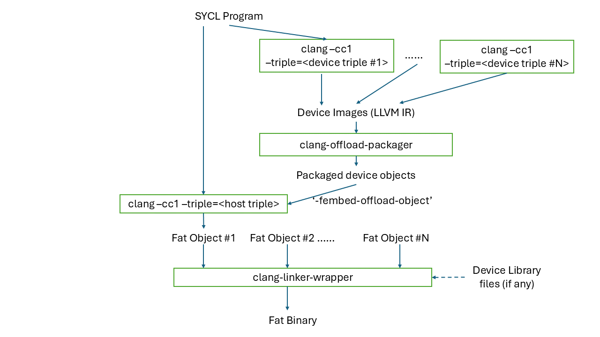
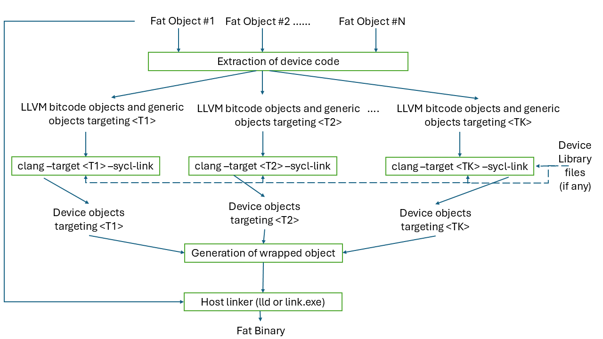
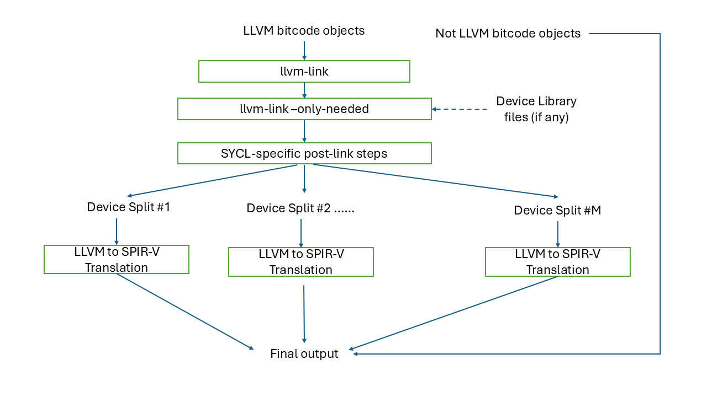
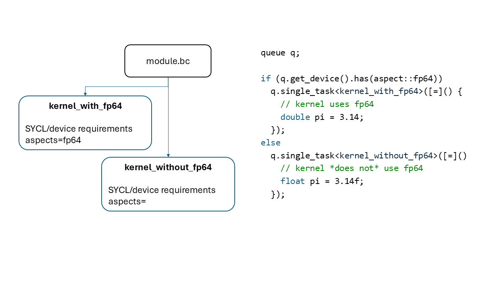

=============================
SYCL Offloading Design & Internals
=============================

.. contents::
   :local:

Introduction
============

This document describes the Clang driver and code generation steps for creating
offloading applications. Clang supports offloading to various architectures
using programming models like CUDA, HIP, and OpenMP. Currently, Clang support
for SYCL offloading is being added. The purpose of this document is to
illustrate the steps necessary to create an offloading application using Clang
for the SYCL programming model.

SYCL Offloading
=================

Clang will support SYCL target offloading to several different architectures
such as Intel CPUs and GPUs, NVPTX, and AMDGPU. Offloading code is generated by
Clang and then executed using SYCL runtime. This section describes the steps
necessary to create a functioning device image that can be loaded by the SYCL
runtime. {{ SYCL runtime reference? }}.

SYCL offloading can support two modes of compilation: (i) Just-In-Time (JIT)
compilation and (ii) Ahead-Of-Time (AOT) compilation. In JIT compilation, final
wrapped device object is represented using the SPIR-V Intermediate
Representation. Final device code generation is deferred until application
runtime. JIT compilation provides portability of device code and allows for
target specific optimizations to happen. In AOT copilation, final device code is
generated at compile time (before the wrapping step) to produce the final
binary. AOT compilation reduces application execution time by skipping the
device code generation step during runtime and final device code can also be
tested before deploying.

Compilation Process
^^^^^^^^^^^^^^^^^^^

   
   Figure 1: Top-level SYCL offloading compilation flow.

Figure 1 showcases the SYCL offloading compilation flow. The SYCL compiler
performs the following high-level actions to generate SYCL offloading code:

- Front-end device compilation step (`clang --target=<device triple>`)
- Packaging of device code (`clang-offload-packager`)
- Front-end host compilation step (`clang --target=<host triple>
                                      --fembed-offload-object`)
- Linking stage (`clang-linker-wrapper`)

The set of possible 'clang -cc1' invocations for a given user command is shown
below. 

.. code-block:: console

  $ clang++ -fsycl --offload-arch=pvc,sm_52 test.cpp -###
  clang -cc1 -triple nvptx64 ...     // AOT device compilation for sm_52
  clang -cc1 -triple spir64_gen ...  // AOT device compilation for pvc
  clang -cc1 -triple spir64 ...      // JIT device compilation (backup) for pvc
  clang -cc1 -triple x86_64 ...      // Host compilation

Front-end device compilation
----------------------------
This step parses input source, outlines device part of the code, applies
additional restrictions on the device code (e.g. no exceptions or virtual
calls), generates LLVM IR bitcode for the device code only and "integration
header" which provides information like kernel name, parameters order and data
type for the runtime library. Multiple LLVM IR bitcodes (in case of multiple
targets) are packaged into a single object by the clang-offload-packager.
Front-end device compilation for SYCL offloading can be split into the following
components - Device code outlining, SYCL kernel function object lowering,
Generation of device code diagnostics, and Integration header generation. These
components are explained in the sections below.

* Device code outlining:
This component is responsible for identifying and outlining "device code" in the
single source.
Here is a code example of a SYCL program that demonstrates compiler outlining
work:

.. code-block:: c++

  int foo(int x) { return ++x; }
  int bar(int x) { throw std::exception{"CPU code only!"}; }
  // ...
  using namespace sycl;
  queue Q;
  buffer<int, 1> a{range<1>{1024}};
  Q.submit([&](handler& cgh) {
    auto A = a.get_access<access::mode::write>(cgh);
    cgh.parallel_for<init_a>(range<1>{1024}, [=](id<1> index) {
      A[index] = index[0] * 2 + foo(42);
    });
  }

In this example, the compiler needs to compile the lambda expression passed
to the `sycl::handler::parallel_for` method, as well as the function `foo`
called from the lambda expression for the device.

The compiler must also ignore the `bar` function when we compile the
"device" part of the single source code, as it's unused inside the device
portion of the source code (the contents of the lambda expression passed to the
`sycl::handler::parallel_for` and any function called from this lambda
expression).

The current approach is to use the SYCL kernel attribute in the runtime to
mark code passed to `sycl::handler::parallel_for` as "kernel functions".
The runtime library can't mark foo as "device" code - this is a compiler
job: to traverse all symbols accessible from kernel functions and add them to
the "device part" of the code marking them with the new SYCL device attribute.

* SYCL kernel function object (functor or lambda) lowering:
This component creates an OpenCL kernel function interface for SYCL kernels.
All SYCL memory objects shared between host and device (buffers/images,
these objects map to OpenCL buffers and images) must be accessed through special
`accessor` classes. The "device" side implementation of these classes contains
pointers to the device memory. As there is no way in OpenCL to pass structures
with pointers inside as kernel arguments all memory objects shared between host
and device must be passed to the kernel as raw pointers.

SYCL also has a special mechanism for passing kernel arguments from host to
the device. In OpenCL kernel arguments are set by calling `clSetKernelArg`
function for each kernel argument, meanwhile in SYCL all the kernel arguments
are fields of "SYCL kernel function" which can be defined as a lambda function
or a named function object and passed as an argument to SYCL function for
invoking kernels (such as `parallel_for` or `single_task`). For example, in the
previous code snippet above `accessor` `A` is one such captured kernel argument.

To facilitate the mapping of SYCL kernel data members to OpenCL
kernel arguments and overcome OpenCL limitations we added the generation of an
OpenCL kernel function inside the compiler. An OpenCL kernel function contains
the body of the SYCL kernel function, receives OpenCL-like parameters and
additionally does some manipulation to initialize SYCL kernel data members
with these parameters. In some pseudo code the OpenCL kernel function for the
previous code snippet above looks like this:

.. code-block:: c++

  // SYCL kernel is defined in SYCL headers:
  template <typename KernelName, typename KernelType/*, ...*/>
  __attribute__((sycl_kernel)) void sycl_kernel_function(KernelType KernelFuncObj) {
    // ...
    KernelFuncObj();
  }
  // Generated OpenCL kernel function
  __kernel KernelName(global int* a) {
    KernelType KernelFuncObj; // Actually kernel function object declaration
    // doesn't have a name in AST.
    // Let the kernel function object have one captured field - accessor A.
    // We need to init it with global pointer from arguments:
    KernelFuncObj.A.__init(a);
    // Body of the SYCL kernel from SYCL headers:
    {
      KernelFuncObj();
    }
  }

OpenCL kernel function is generated by the compiler inside the Sema using AST
nodes.

* Generation of device code diagnostics:
This component enforces language restrictions on device code.

* Integration header generation:
This component emits information required for binding host and device parts of
the SYCL code via OpenCL API. In proposed design, we use SYCL device front-end
compiler to produce the integration header for two reasons. First, it must be
possible to use any host compiler to produce SYCL heterogeneous applications.
Second, even if the same clang compiler is used for the host compilation,
information provided in the integration header is used (included) by the SYCL
runtime implementation, so the header must be available before the host
compilation starts.

Front-end host compilation
--------------------------
This step parses input file and emits code for the host device. This host
compilation takes an additional argument which helps to embed the packaged
device binary into the host code. This step generates a fat object that will be
consumed during link stage.

Linking stage
-------------
Pass the fat object file(s) to the linker wrapper tool. The tool extracts the
device objects and runs the device linking action on the extracted objects.
Fully formed device images are then wrapped into host objects and then linked
with host image in the original fat object using the host linker tool.

   
   Figure 2: Device linking flow for SYCL offloading inside the linker-wrapper tool.

Figure 2 shows the compilation flow inside the linker-wrapper tool. First, all
device objects are extracted from the fat objects and grouped according to the
target device. For each target device group, we invoke clang to link the device
objects and generate a list of device objects. All the device objects are then
wrapped together and embedded into a wrapped host object. This wrapper object is
linked normally with the rest of host objects and/or libraries using the usual
linker - e.g. `ld` on Linux and `link.exe` on Windows.

* Linking of device objects

Device code linking for SYCL offloading will be performed by making a call to
the clang driver. A SYCL specific option '--sycl-link' is passed to the driver
to control the linking process. In the presence of this option, the clang driver
will invoke a SYCL linker tool called 'clang-sycl-linker'. This tool is
responsible for linking the device bitcode and generating a group of
fully-formed device images. An example of a call to clang-sycl-linker is shown
below.

.. code-block:: console

  $ clang++ --target <device triple> --sycl-link test.bc test.o -Xlinker <SYCLLINKOPTS> -###
  clang-sycl-linker -triple <device triple> <SYCLLINKOPTS> test.bc test.o

   
   Figure 3: SYCL-specific device code linking for JIT compilation flow.

Figure 3 shows the device code linking process performed inside the SYCL linker
tool for JIT compilation. Following are the key steps performed:

1. All the inputs of LLVM IR bitcode type are gathered and linked together using
the llvm-link tool.

2. If the user provides device library files, the ouput of the previous step is
linked with such files to get the final fully linked LLVM IR device bitcode
image.

3. The fully linked LLVM IR device bitcode image undergoes several post-link
steps. This include device code splitting, specialization constant lowering,
symbol table generation, and property sets generation.

Device code splitting - This process takes as input a fully linked device module
with a set of SYCL device kernels for a specific target and performs splitting
to generate several fully-contained device modules. Each of the newly formed
module contains a sub-set of the original set of SYCL device kernels along with
a union of all the functions from each of their respective call graphs. Here,
call graph of a SYCL kernel is the set of all functions reachable from that
kernel.
Device code splitting is performed for two reasons:

(1) User requests a specific mode of code splitting. Three modes of code
splitting are supported. They are:

  i. per-kernel - Every SYCL kernel and the functions that are contained in its 
  call graph go into a separate module.

  ii. per-module - All SYCL kernels belonging to a specific user-specified
  module and all functions from their respective call graphs go into a separate
  module.

  iii. auto - per-kernel or per-module option is selected based on some
  heuristics.

(2) SYCL kernels can be specialized for different devices. For example, kernels
that use 64-bit floating point (FP64) operations can be executed only on devices
that support such operations. Hence, it is required that all kernels that
require FP64 support be grouped separately from kernels that do not require FP64
support. A point to note: A SYCL kernel is said to require FP64 support if the
kernel itself or any funtion in its call graph uses FP64 operations. Figure 6
showcases this device code split.

   
   Figure 6: An example of device code splitting for SYCL offloading.

Specialization constant lowering - Specialization constants are implemented in
accordance with how they are defined by SYCL 2020 specification. Here are links
to `sycl-registry https://www.khronos.org/registry/SYCL/`_ and
`sycl-2020-spec https://www.khronos.org/registry/SYCL/specs/sycl-2020/html/sycl-2020.html`_.

Specialization constants represent constants whose values can be set dynamically
during execution of the SYCL application. The values of these constants are
fixed when a SYCL kernel function is invoked, and they do not change during the
execution of the kernel. However, the application is able to set a new value for
a specialization constants each time a kernel is invoked, so the values can be
tuned differently for each invocation. An example usage of specialization
constant is shown below:

.. code-block:: c++
  #include <sycl/sycl.hpp>
  using namespace sycl;

  using coeff_t = std::array<std::array<float, 3>, 3>;

  // Read coefficients from somewhere.
  coeff_t get_coefficients();

  // Identify the specialization constant.
  constexpr specialization_id<coeff_t> coeff_id;

  void do_conv(buffer<float, 2> in, buffer<float, 2> out) {
    queue myQueue;

    myQueue.submit([&](handler &cgh) {
      accessor in_acc { in, cgh, read_only };
      accessor out_acc { out, cgh, write_only };

      // Set the coefficient of the convolution as constant.
      // This will build a specific kernel the coefficient available as literals.
      cgh.set_specialization_constant<coeff_id>(get_coefficients());

      cgh.parallel_for<class Convolution>(
          in.get_range(), [=](item<2> item_id, kernel_handler h) {
            float acc = 0;
            coeff_t coeff = h.get_specialization_constant<coeff_id>();
            for (int i = -1; i <= 1; i++) {
              if (item_id[0] + i < 0 || item_id[0] + i >= in_acc.get_range()[0])
                continue;
              for (int j = -1; j <= 1; j++) {
                if (item_id[1] + j < 0 || item_id[1] + j >= in_acc.get_range()[1])
                  continue;
                // The underlying JIT can see all the values of the array returned
                // by coeff.get().
                acc += coeff[i + 1][j + 1] *
                      in_acc[item_id[0] + i][item_id[1] + j];
              }
            }
            out_acc[item_id] = acc;
          });
    });

    myQueue.wait();
  }

Symbol table generation -

Property Set generation - 

* Generation of wrapped object

