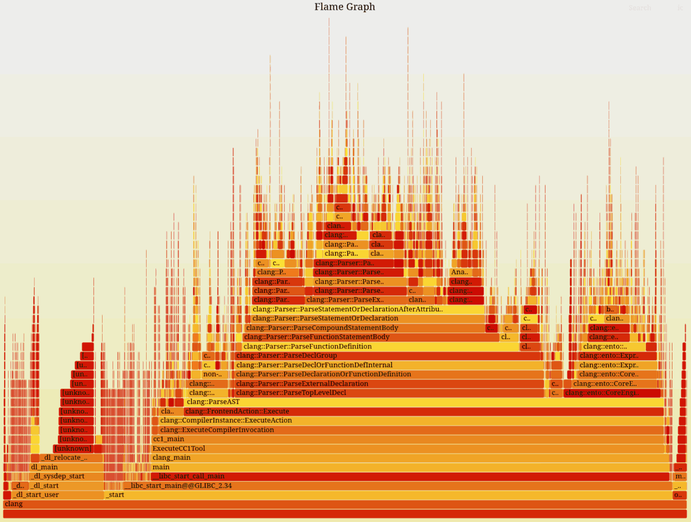
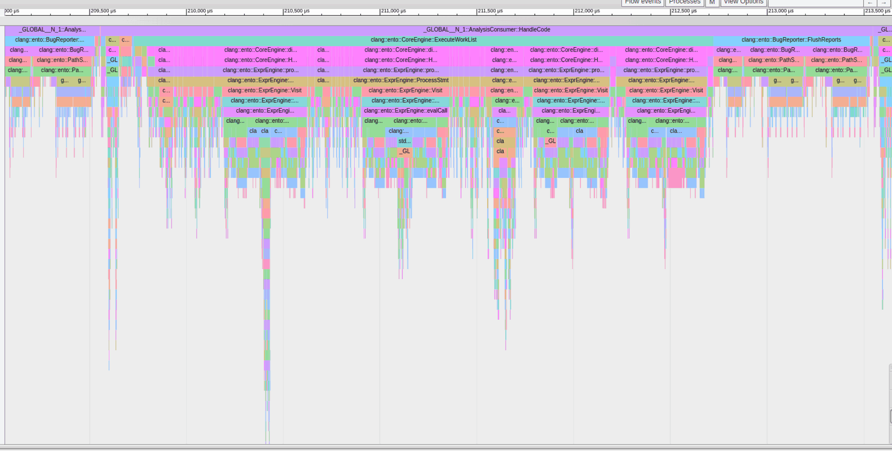

=========================
Performance Investigation
=========================

Multiple factors contribute to the time it takes to analyze a file with Clang Static Analyzer.
A translation unit contains multiple entry points, each of which take multiple steps to analyze.

Performance analysis using ``-ftime-trace``
===========================================

You can add the ``-ftime-trace=file.json`` option to break down the analysis time into individual entry points and steps within each entry point.
You can explore the generated JSON file in a Chromium browser using the ``chrome://tracing`` URL,
or using `perfetto <https://ui.perfetto.dev>`_ or `speedscope <https://speedscope.app>`_.
Once you narrow down to specific analysis steps you are interested in, you can more effectively employ heavier profilers,
such as `Perf <https://perfwiki.github.io/main/>`_ and `Callgrind <https://valgrind.org/docs/manual/cl-manual.html>`_.

Each analysis step has a time scope in the trace, corresponds to processing of an exploded node, and is designated with a ``ProgramPoint``.
If the ``ProgramPoint`` is associated with a location, you can see it on the scope metadata label.

Here is an example of a time trace produced with

.. code-block:: bash
   :caption: Clang Static Analyzer invocation to generate a time trace of string.c analysis.

   clang -cc1 -analyze -verify clang/test/Analysis/string.c \
         -analyzer-checker=core,unix,alpha.unix.cstring,debug.ExprInspection \
         -ftime-trace=trace.json -ftime-trace-granularity=1

.. image:: ../images/speedscope.png

On the speedscope screenshot above, under the first time ruler is the bird's-eye view of the entire trace that spans a little over 60 milliseconds.
Under the second ruler (focused on the 18.09-18.13ms time point) you can see a narrowed-down portion.
The second box ("HandleCode memset...") that spans entire screen (and actually extends beyond it) corresponds to the analysis of ``memset16_region_cast()`` entry point that is defined in the "string.c" test file on line 1627.
Below it, you can find multiple sub-scopes each corresponding to processing of a single exploded node.

- First: a ``PostStmt`` for some statement on line 1634. This scope has a selected subscope "CheckerManager::runCheckersForCallEvent (Pre)" that takes 5 microseconds.
- Four other nodes, too small to be discernible at this zoom level
- Last on this screenshot: another ``PostStmt`` for a statement on line 1635.

In addition to the ``-ftime-trace`` option, you can use ``-ftime-trace-granularity`` to fine-tune the time trace.

- ``-ftime-trace-granularity=NN`` dumps only time scopes that are longer than NN microseconds.
- ``-ftime-trace-verbose`` enables some additional dumps in the frontend related to template instantiations.
  At the moment, it has no effect on the traces from the static analyzer.

Note: Both Chrome-tracing and speedscope tools might struggle with time traces above 100 MB in size.
Luckily, in most cases the default max-steps boundary of 225 000 produces the traces of approximately that size
for a single entry point.
You can use ``-analyze-function=get_global_options`` together with ``-ftime-trace`` to narrow down analysis to a specific entry point.

Performance analysis using ``perf``
===================================

`Perf <https://perfwiki.github.io/main/>`_ is a tool for conducting sampling-based profiling.
It's easy to start profiling, you only have 2 prerequisites.
Build with ``-fno-omit-frame-pointer`` and debug info (``-g``).
You can use release builds, but probably the easiest is to set the ``CMAKE_BUILD_TYPE=RelWithDebInfo``
along with ``CMAKE_CXX_FLAGS="-fno-omit-frame-pointer"`` when configuring ``llvm``.
Here is how to `get started <https://llvm.org/docs/CMake.html#quick-start>`_ if you are in trouble.

.. code-block:: bash
   :caption: Running the Clang Static Analyzer through ``perf`` to gather samples of the execution.

   # -F: Sampling frequency, use `-F max` for maximal frequency
   # -g: Enable call-graph recording for both kernel and user space
   perf record -F 99 -g --  clang -cc1 -analyze -verify clang/test/Analysis/string.c \
         -analyzer-checker=core,unix,alpha.unix.cstring,debug.ExprInspection

Once you have the profile data, you can use it to produce a Flame graph.
A Flame graph is a visual representation of the stack frames of the samples.
Common stack frame prefixes are squashed together, making up a wider bar.
The wider the bar, the more time was spent under that particular stack frame,
giving a sense of how the overall execution time was spent.

Clone the `FlameGraph <https://github.com/brendangregg/FlameGraph>`_ git repository,
as we will use some scripts from there to convert the ``perf`` samples into a Flame graph.
It's also useful to check out Brendan Gregg's (the author of FlameGraph)
`homepage <https://www.brendangregg.com/FlameGraphs/cpuflamegraphs.html>`_.

.. code-block:: bash
   :caption: Converting the ``perf`` profile into a Flamegraph, then opening it in Firefox.

   perf script | /path/to/FlameGraph/stackcollapse-perf.pl > perf.folded
   /path/to/FlameGraph/flamegraph.pl perf.folded  > perf.svg
   firefox perf.svg

Performance analysis using ``uftrace``
======================================

`uftrace <https://github.com/namhyung/uftrace/wiki/Tutorial#getting-started>`_ is a great tool to generate rich profile data
that you can use to focus and drill down into the timeline of your application.
We will use it to generate Chromium trace JSON.
In contrast to ``perf``, this approach statically instruments every function, so it should be more precise and thorough than the sampling-based approaches like ``perf``.
In contrast to using ``-ftime-trace``, functions don't need to opt-in to be profiled using ``llvm::TimeTraceScope``.
All functions are profiled due to automatic static instrumentation.

There is only one prerequisite to use this tool.
You need to build the binary you are about to instrument using ``-pg`` or ``-finstrument-functions``.
This will make it run substantially slower but allows rich instrumentation.
It will also consume many gigabites of storage for a single trace unless filter flags are used during recording.

.. code-block:: bash
   :caption: Recording with ``uftrace``, then dumping the result as a Chrome trace JSON.

   uftrace record  clang -cc1 -analyze -verify clang/test/Analysis/string.c \
         -analyzer-checker=core,unix,alpha.unix.cstring,debug.ExprInspection
   uftrace dump --filter=".*::AnalysisConsumer::HandleTranslationUnit" --time-filter=300 --chrome > trace.json

In this picture, you can see the functions below the Static Analyzer's entry point, which takes at least 300 nanoseconds to run, visualized by Chrome's ``about:tracing`` page
You can also see how deep function calls we may have due to AST visitors.

Using different filters can reduce the number of functions to record.
For the common options, refer to the ``uftrace`` `documentation <https://github.com/namhyung/uftrace/blob/master/doc/uftrace-record.md#common-options>`_.

Similar filters can be applied for dumping too. That way you can reuse the same (detailed)
recording to selectively focus on some special part using a refinement of the filter flags.
Remember, the trace JSON needs to fit into Chrome's ``about:tracing`` or `speedscope <https://speedscope.app>`_,
thus it needs to be of a limited size.
If you do not apply filters on recording, you will collect a large trace and every dump operation
would need to sieve through the much larger recording which may be annoying if done repeatedly.

If the trace JSON is still too large to load, have a look at the dump as plain text and look for frequent entries that refer to non-interesting parts.
Once you have some of those, add them as ``--hide`` flags to the ``uftrace dump`` call.
To see what functions appear frequently in the trace, use this command:

.. code-block:: bash

   cat trace.json | grep -Po '"name":"(.+)"' | sort | uniq -c | sort -nr | head -n 50

``uftrace`` can also dump the report as a Flame graph using ``uftrace dump --framegraph``.
