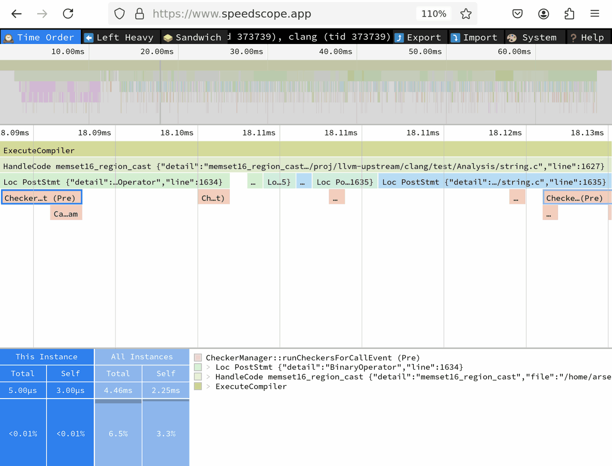

=========================
Performance Investigation
=========================

Multiple factors contribute to the time it takes to analyze a file with Clang Static Analyzer.
A translation unit contains multiple entry points, each of which take multiple steps to analyze.

You can add the ``-ftime-trace=file.json`` option to break down the analysis time into individual entry points and steps within each entry point.
You can explore the generated JSON file in a Chromium browser using the ``chrome://tracing`` URL,
or using `speedscope <https://speedscope.app>`_.
Once you narrow down to specific analysis steps you are interested in, you can more effectively employ heavier profilers,
such as `Perf <https://perfwiki.github.io/main/>`_ and `Callgrind <https://valgrind.org/docs/manual/cl-manual.html>`_.

Each analysis step has a time scope in the trace, corresponds to processing of an exploded node, and is designated with a ``ProgramPoint``.
If the ``ProgramPoint`` is associated with a location, you can see it on the scope metadata label.

On the screenshot above, under the first time ruler is the birds-eye view of the entire trace that spans a little over 8 seconds.
Under the second ruler (focused on the 4.27s time point) you can see a narrowed-down portion.
The second box (of light-green color) that spans entire screen (and actually extends beyond it) corresponds to the analysis of ``get_global_options()`` entry point that is defined in the "options.cc" file on line 303646
(the line number is huge because the file was preprocessed).
Below it, you can find multiple sub-scopes each corresponding to processing of a single exploded node.

1. A ``PostStmt`` for some statement on line 2337. This step spent most of the time in the ``ExprEngine::removeDead`` call.
2. (Selected): another ``PostStmt`` for a return statement
3. A ``BlockEdge``, and so on...

In addition to the ``-ftime-trace`` option, you can use ``-ftime-trace-granularity`` to fine-tune the time trace.

- ``-ftime-trace-granularity=NN`` dumps only time scopes that are longer than NN microseconds.
- ``-ftime-trace-verbose`` enables some additional dumps in the frontend related to template instantiations.
  At the moment, it has no effect on the traces from the static analyzer.

Note: Both Chrome-tracing and speedscope tools might struggle with time traces above 100 MB in size.
Luckily, in most cases the default max-steps boundary of 225 000 produces the traces of approximately that size
for a single entry point.
You should use ``-analyze-function=get_global_options`` together with ``-ftime-trace`` to narrow down analysis to a specific entry point.
