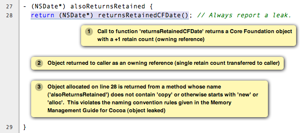

==================
Source Annotations
==================

The Clang frontend supports several source-level annotations in the form of
`GCC-style attributes <https://gcc.gnu.org/onlinedocs/gcc/Attribute-Syntax.html>`_
and pragmas that can help make using the Clang Static Analyzer more useful.
These annotations can both help suppress false positives as well as enhance the
analyzer's ability to find bugs.

This page gives a practical overview of such annotations. For more technical
specifics regarding Clang-specific annotations please see the Clang's list of
`language extensions <https://clang.llvm.org/docs/LanguageExtensions.html>`_.
Details of "standard" GCC attributes (that Clang also supports) can
be found in the `GCC manual <https://gcc.gnu.org/onlinedocs/gcc/>`_, with the
majority of the relevant attributes being in the section on
`function attributes <https://gcc.gnu.org/onlinedocs/gcc/Function-Attributes.html>`_.

Note that attributes that are labeled **Clang-specific** are not
recognized by GCC. Their use can be conditioned using preprocessor macros
(examples included on this page).

.. contents::
   :local:

General Purpose Annotations
___________________________

Null Pointer Checking
#####################

Attribute 'nonnull'
-------------------

The analyzer recognizes the GCC attribute 'nonnull', which indicates that a
function expects that a given function parameter is not a null pointer.
Specific details of the syntax of using the 'nonnull' attribute can be found in
`GCC's documentation <https://gcc.gnu.org/onlinedocs/gcc/Common-Function-Attributes.html#index-nonnull-function-attribute>`_.

Both the Clang compiler and GCC will flag warnings for simple cases where a
null pointer is directly being passed to a function with a 'nonnull' parameter
(e.g., as a constant). The analyzer extends this checking by using its deeper
symbolic analysis to track what pointer values are potentially null and then
flag warnings when they are passed in a function call via a 'nonnull'
parameter.

**Example**

.. code-block:: c

  int bar(int*p, int q, int *r) __attribute__((nonnull(1,3)));

  int foo(int *p, int *q) {
     return !p ? bar(q, 2, p)
               : bar(p, 2, q);
  }

Running ``scan-build`` over this source produces the following output:

.. image:: ../images/example_attribute_nonnull.png

.. _custom_assertion_handlers:

Custom Assertion Handlers
#########################

The analyzer exploits code assertions by pruning off paths where the
assertion condition is false. The idea is capture any program invariants
specified in the assertion that the developer may know but is not immediately
apparent in the code itself. In this way assertions make implicit assumptions
explicit in the code, which not only makes the analyzer more accurate when
finding bugs, but can help others better able to understand your code as well.
It can also help remove certain kinds of analyzer false positives by pruning off
false paths.

In order to exploit assertions, however, the analyzer must understand when it
encounters an "assertion handler". Typically assertions are
implemented with a macro, with the macro performing a check for the assertion
condition and, when the check fails, calling an assertion handler.  For
example, consider the following code fragment:

.. code-block:: c

  void foo(int *p) {
    assert(p != NULL);
  }

When this code is preprocessed on Mac OS X it expands to the following:

.. code-block:: c

  void foo(int *p) {
    (__builtin_expect(!(p != NULL), 0) ? __assert_rtn(__func__, "t.c", 4, "p != NULL") : (void)0);
  }

In this example, the assertion handler is ``__assert_rtn``. When called,
most assertion handlers typically print an error and terminate the program. The
analyzer can exploit such semantics by ending the analysis of a path once it
hits a call to an assertion handler.

The trick, however, is that the analyzer needs to know that a called function
is an assertion handler; otherwise the analyzer might assume the function call
returns and it will continue analyzing the path where the assertion condition
failed. This can lead to false positives, as the assertion condition usually
implies a safety condition (e.g., a pointer is not null) prior to performing
some action that depends on that condition (e.g., dereferencing a pointer).

The analyzer knows about several well-known assertion handlers, but can
automatically infer if a function should be treated as an assertion handler if
it is annotated with the 'noreturn' attribute or the (Clang-specific)
'analyzer_noreturn' attribute. Note that, currently, clang does not support
these attributes on Objective-C methods and C++ methods.

Attribute 'noreturn'
--------------------

The 'noreturn' attribute is a GCC attribute that can be placed on the
declarations of functions. It means exactly what its name implies: a function
with a 'noreturn' attribute should never return.

Specific details of the syntax of using the 'noreturn' attribute can be found
in `GCC's documentation <https://gcc.gnu.org/onlinedocs/gcc/Common-Function-Attributes.html#index-noreturn-function-attribute>`__.

Not only does the analyzer exploit this information when pruning false paths,
but the compiler also takes it seriously and will generate different code (and
possibly better optimized) under the assumption that the function does not
return.

**Example**

On Mac OS X, the function prototype for ``__assert_rtn`` (declared in
``assert.h``) is specifically annotated with the 'noreturn' attribute:

.. code-block:: c

  void __assert_rtn(const char *, const char *, int, const char *) __attribute__((__noreturn__));

Attribute 'analyzer_noreturn' (Clang-specific)
----------------------------------------------

The Clang-specific 'analyzer_noreturn' attribute is almost identical to
'noreturn' except that it is ignored by the compiler for the purposes of code
generation.

This attribute is useful for annotating assertion handlers that actually
*can* return, but for the purpose of using the analyzer we want to
pretend that such functions do not return.

Because this attribute is Clang-specific, its use should be conditioned with
the use of preprocessor macros.

**Example**

.. code-block:: c

  #ifndef CLANG_ANALYZER_NORETURN
  #if __has_feature(attribute_analyzer_noreturn)
  #define CLANG_ANALYZER_NORETURN __attribute__((analyzer_noreturn))
  #else
  #define CLANG_ANALYZER_NORETURN
  #endif
  #endif

  void my_assert_rtn(const char *, const char *, int, const char *) CLANG_ANALYZER_NORETURN;

Dynamic Memory Modeling Annotations
###################################

If a project uses custom functions for dynamic memory management (that e.g. act as wrappers around ``malloc``/``free`` or ``new``/``delete`` in C++) and the analyzer cannot "see" the _definitions_ of these functions, it's possible to annotate their declarations to let the analyzer model their behavior. (Otherwise the analyzer cannot know that the opaque ``my_free()`` is basically equivalent to a standard ``free()`` call.)

.. note::
  **This page only provides a brief list of these annotations.** For a full documentation, see the main `Attributes in Clang <../../AttributeReference.html#ownership-holds-ownership-returns-ownership-takes-clang-static-analyzer>`_ page.

Attribute 'ownership_returns' (Clang-specific)
----------------------------------------------

Use this attribute to mark functions that return dynamically allocated memory. Takes a single argument, the type of the allocation (e.g. ``malloc`` or ``new``).

.. code-block:: c

  void __attribute((ownership_returns(malloc))) *my_malloc(size_t);

Attribute 'ownership_takes' (Clang-specific)
--------------------------------------------

Use this attribute to mark functions that deallocate memory. Takes two arguments: the type of the allocation (e.g. ``malloc`` or ``new``) and the index of the parameter that is being deallocated (counting from 1).

.. code-block:: c

  void __attribute((ownership_takes(malloc, 1))) my_free(void *);

Attribute 'ownership_holds' (Clang-specific)
--------------------------------------------

Use this attribute to mark functions that take ownership of memory and will deallocate it at some unspecified point in the future. Takes two arguments: the type of the allocation (e.g. ``malloc`` or ``new``) and the index of the parameter that is being held (counting from 1).

.. code-block:: c

  void __attribute((ownership_holds(malloc, 2))) store_in_table(int key, record_t *val);

The annotations ``ownership_takes`` and ``ownership_holds`` both prevent memory leak reports (concerning the specified argument); the difference between them is that using taken memory is a use-after-free error, while using held memory is assumed to be legitimate.

Mac OS X API Annotations
________________________

.. _cocoa_mem:

Cocoa & Core Foundation Memory Management Annotations
#####################################################

The analyzer supports the proper management of retain counts for
both Cocoa and Core Foundation objects. This checking is largely based on
enforcing Cocoa and Core Foundation naming conventions for Objective-C methods
(Cocoa) and C functions (Core Foundation). Not strictly following these
conventions can cause the analyzer to miss bugs or flag false positives.

One can educate the analyzer (and others who read your code) about methods or
functions that deviate from the Cocoa and Core Foundation conventions using the
attributes described here. However, you should consider using proper naming
conventions or the `objc_method_family <https://clang.llvm.org/docs/LanguageExtensions.html#the-objc-method-family-attribute>`_
attribute, if applicable.

.. _ns_returns_retained:

Attribute 'ns_returns_retained' (Clang-specific)
------------------------------------------------

The GCC-style (Clang-specific) attribute 'ns_returns_retained' allows one to
annotate an Objective-C method or C function as returning a retained Cocoa
object that the caller is responsible for releasing (via sending a
``release`` message to the object). The Foundation framework defines a
macro ``NS_RETURNS_RETAINED`` that is functionally equivalent to the
one shown below.

**Placing on Objective-C methods**: For Objective-C methods, this
annotation essentially tells the analyzer to treat the method as if its name
begins with "alloc" or "new" or contains the word
"copy".

**Placing on C functions**: For C functions returning Cocoa objects, the
analyzer typically does not make any assumptions about whether or not the object
is returned retained. Explicitly adding the 'ns_returns_retained' attribute to C
functions allows the analyzer to perform extra checking.

**Example**

.. code-block:: objc

  #import <Foundation/Foundation.h>;

  #ifndef __has_feature      // Optional.
  #define __has_feature(x) 0 // Compatibility with non-clang compilers.
  #endif

  #ifndef NS_RETURNS_RETAINED
  #if __has_feature(attribute_ns_returns_retained)
  #define NS_RETURNS_RETAINED __attribute__((ns_returns_retained))
  #else
  #define NS_RETURNS_RETAINED
  #endif
  #endif

  @interface MyClass : NSObject {}
  - (NSString*) returnsRetained NS_RETURNS_RETAINED;
  - (NSString*) alsoReturnsRetained;
  @end

  @implementation MyClass
  - (NSString*) returnsRetained {
    return [[NSString alloc] initWithCString:"no leak here"];
  }
  - (NSString*) alsoReturnsRetained {
    return [[NSString alloc] initWithCString:"flag a leak"];
  }
  @end

Running ``scan-build`` on this source file produces the following output:

.. image:: ../images/example_ns_returns_retained.png

.. _ns_returns_not_retained:

Attribute 'ns_returns_not_retained' (Clang-specific)
----------------------------------------------------

The 'ns_returns_not_retained' attribute is the complement of
'`ns_returns_retained`_'. Where a function or method may appear to obey the
Cocoa conventions and return a retained Cocoa object, this attribute can be
used to indicate that the object reference returned should not be considered as
an "owning" reference being returned to the caller. The Foundation
framework defines a macro ``NS_RETURNS_NOT_RETAINED`` that is functionally
equivalent to the one shown below.

Usage is identical to `ns_returns_retained`_.  When using the
attribute, be sure to declare it within the proper macro that checks for
its availability, as it is not available in earlier versions of the analyzer:

.. code-block:objc

  #ifndef __has_feature      // Optional.
  #define __has_feature(x) 0 // Compatibility with non-clang compilers.
  #endif

  #ifndef NS_RETURNS_NOT_RETAINED
  #if __has_feature(attribute_ns_returns_not_retained)
  #define NS_RETURNS_NOT_RETAINED __attribute__((ns_returns_not_retained))
  #else
  #define NS_RETURNS_NOT_RETAINED
  #endif
  #endif

.. _cf_returns_retained:

Attribute 'cf_returns_retained' (Clang-specific)
------------------------------------------------

The GCC-style (Clang-specific) attribute 'cf_returns_retained' allows one to
annotate an Objective-C method or C function as returning a retained Core
Foundation object that the caller is responsible for releasing. The
CoreFoundation framework defines a macro ``CF_RETURNS_RETAINED`` that is
functionally equivalent to the one shown below.

**Placing on Objective-C methods**: With respect to Objective-C methods.,
this attribute is identical in its behavior and usage to 'ns_returns_retained'
except for the distinction of returning a Core Foundation object instead of a
Cocoa object.

This distinction is important for the following reason: as Core Foundation is a
C API, the analyzer cannot always tell that a pointer return value refers to a
Core Foundation object. In contrast, it is trivial for the analyzer to
recognize if a pointer refers to a Cocoa object (given the Objective-C type
system).

**Placing on C functions**: When placing the attribute
'cf_returns_retained' on the declarations of C functions, the analyzer
interprets the function as:

1. Returning a Core Foundation Object
2. Treating the function as if it its name contained the keywords
   "create" or "copy". This means the returned object as a
   +1 retain count that must be released by the caller, either by sending a
   ``release`` message (via toll-free bridging to an Objective-C object
   pointer), or calling ``CFRelease`` or a similar function.

**Example**

.. code-block:objc

  #import <Cocoa/Cocoa.h>

  #ifndef __has_feature      // Optional.
  #define __has_feature(x) 0 // Compatibility with non-clang compilers.
  #endif

  #ifndef CF_RETURNS_RETAINED
  #if __has_feature(attribute_cf_returns_retained)
  #define CF_RETURNS_RETAINED __attribute__((cf_returns_retained))
  #else
  #define CF_RETURNS_RETAINED
  #endif
  #endif

  @interface MyClass : NSObject {}
  - (NSDate*) returnsCFRetained CF_RETURNS_RETAINED;
  - (NSDate*) alsoReturnsRetained;
  - (NSDate*) returnsNSRetained NS_RETURNS_RETAINED;
  @end

  CF_RETURNS_RETAINED
  CFDateRef returnsRetainedCFDate()  {
    return CFDateCreate(0, CFAbsoluteTimeGetCurrent());
  }

  @implementation MyClass
  - (NSDate*) returnsCFRetained {
    return (NSDate*) returnsRetainedCFDate(); // No leak.
  }

  - (NSDate*) alsoReturnsRetained {
    return (NSDate*) returnsRetainedCFDate(); // Always report a leak.
  }

  - (NSDate*) returnsNSRetained {
    return (NSDate*) returnsRetainedCFDate(); // Report a leak when using GC.
  }
  @end

Running ``scan-build`` on this example produces the following output:

Attribute 'cf_returns_not_retained' (Clang-specific)
----------------------------------------------------

The 'cf_returns_not_retained' attribute is the complement of
'`cf_returns_retained`_'. Where a function or method may appear to obey the
Core Foundation or Cocoa conventions and return a retained Core Foundation
object, this attribute can be used to indicate that the object reference
returned should not be considered as an "owning" reference being
returned to the caller. The CoreFoundation framework defines a macro
**``CF_RETURNS_NOT_RETAINED``** that is functionally equivalent to the one
shown below.

Usage is identical to cf_returns_retained_. When using the attribute, be sure
to declare it within the proper macro that checks for its availability, as it
is not available in earlier versions of the analyzer:

.. code-block:objc

  #ifndef __has_feature      // Optional.
  #define __has_feature(x) 0 // Compatibility with non-clang compilers.
  #endif

  #ifndef CF_RETURNS_NOT_RETAINED
  #if __has_feature(attribute_cf_returns_not_retained)
  #define CF_RETURNS_NOT_RETAINED __attribute__((cf_returns_not_retained))
  #else
  #define CF_RETURNS_NOT_RETAINED
  #endif
  #endif

.. _ns_consumed:

Attribute 'ns_consumed' (Clang-specific)
----------------------------------------

The 'ns_consumed' attribute can be placed on a specific parameter in either
the declaration of a function or an Objective-C method. It indicates to the
static analyzer that a ``release`` message is implicitly sent to the
parameter upon completion of the call to the given function or method. The
Foundation framework defines a macro ``NS_RELEASES_ARGUMENT`` that
is functionally equivalent to the ``NS_CONSUMED`` macro shown below.

**Example**

.. code-block:objc

  #ifndef __has_feature      // Optional.
  #define __has_feature(x) 0 // Compatibility with non-clang compilers.
  #endif

  #ifndef NS_CONSUMED
  #if __has_feature(attribute_ns_consumed)
  #define NS_CONSUMED __attribute__((ns_consumed))
  #else
  #define NS_CONSUMED
  #endif
  #endif

  void consume_ns(id NS_CONSUMED x);

  void test() {
    id x = [[NSObject alloc] init];
    consume_ns(x); // No leak!
  }

  @interface Foo : NSObject
  + (void) releaseArg:(id) NS_CONSUMED x;
  + (void) releaseSecondArg:(id)x second:(id) NS_CONSUMED y;
  @end

  void test_method() {
    id x = [[NSObject alloc] init];
    [Foo releaseArg:x]; // No leak!
  }

  void test_method2() {
    id a = [[NSObject alloc] init];
    id b = [[NSObject alloc] init];
    [Foo releaseSecondArg:a second:b]; // 'a' is leaked, but 'b' is released.
  }

Attribute 'cf_consumed' (Clang-specific)
----------------------------------------

The 'cf_consumed' attribute is practically identical to ns_consumed_. The
attribute can be placed on a specific parameter in either the declaration of a
function or an Objective-C method. It indicates to the static analyzer that the
object reference is implicitly passed to a call to ``CFRelease`` upon
completion of the call to the given function or method. The CoreFoundation
framework defines a macro ``CF_RELEASES_ARGUMENT`` that is functionally
equivalent to the ``CF_CONSUMED`` macro shown below.

Operationally this attribute is nearly identical to 'ns_consumed'.

**Example**

.. code-block:objc

  #ifndef __has_feature      // Optional.
  #define __has_feature(x) 0 // Compatibility with non-clang compilers.
  #endif

  #ifndef CF_CONSUMED
  #if __has_feature(attribute_cf_consumed)
  #define CF_CONSUMED __attribute__((cf_consumed))
  #else
  #define CF_CONSUMED
  #endif
  #endif

  void consume_cf(id CF_CONSUMED x);
  void consume_CFDate(CFDateRef CF_CONSUMED x);

  void test() {
    id x = [[NSObject alloc] init];
    consume_cf(x); // No leak!
  }

  void test2() {
    CFDateRef date = CFDateCreate(0, CFAbsoluteTimeGetCurrent());
    consume_CFDate(date); // No leak, including under GC!

  }

  @interface Foo : NSObject
  + (void) releaseArg:(CFDateRef) CF_CONSUMED x;
  @end

  void test_method() {
    CFDateRef date = CFDateCreate(0, CFAbsoluteTimeGetCurrent());
    [Foo releaseArg:date]; // No leak!
  }

.. _ns_consumes_self:

Attribute 'ns_consumes_self' (Clang-specific)
---------------------------------------------

The 'ns_consumes_self' attribute can be placed only on an Objective-C method
declaration. It indicates that the receiver of the message is
"consumed" (a single reference count decremented) after the message
is sent. This matches the semantics of all "init" methods.

One use of this attribute is declare your own init-like methods that do not
follow the standard Cocoa naming conventions.

**Example**

.. code-block:objc
  #ifndef __has_feature
  #define __has_feature(x) 0 // Compatibility with non-clang compilers.
  #endif

  #ifndef NS_CONSUMES_SELF
  #if __has_feature((attribute_ns_consumes_self))
  #define NS_CONSUMES_SELF __attribute__((ns_consumes_self))
  #else
  #define NS_CONSUMES_SELF
  #endif
  #endif

  @interface MyClass : NSObject
  - initWith:(MyClass *)x;
  - nonstandardInitWith:(MyClass *)x NS_CONSUMES_SELF NS_RETURNS_RETAINED;
  @end

In this example, ``-nonstandardInitWith:`` has the same ownership
semantics as the init method ``-initWith:``. The static analyzer will
observe that the method consumes the receiver, and then returns an object with
a +1 retain count.

The Foundation framework defines a macro ``NS_REPLACES_RECEIVER`` which is
functionally equivalent to the combination of ``NS_CONSUMES_SELF`` and
``NS_RETURNS_RETAINED`` shown above.

Libkern Memory Management Annotations
#####################################

`Libkern <https://developer.apple.com/documentation/kernel/osobject?language=objc>`_
requires developers to inherit all heap allocated objects from ``OSObject`` and
to perform manual reference counting. The reference counting model is very
similar to MRR (manual retain-release) mode in
`Objective-C <https://developer.apple.com/library/archive/documentation/Cocoa/Conceptual/MemoryMgmt/Articles/mmRules.html>`_
or to CoreFoundation reference counting.
Freshly-allocated objects start with a reference count of 1, and calls to
``retain`` increment it, while calls to ``release`` decrement it. The object is
deallocated whenever its reference count reaches zero.

Manually incrementing and decrementing reference counts is error-prone:
over-retains lead to leaks, and over-releases lead to uses-after-free.
The analyzer can help the programmer to check for unbalanced
retain/release calls.

The reference count checking is based on the principle of *locality*: it should
be possible to establish correctness (lack of leaks/uses after free) by looking
at each function body, and the declarations (not the definitions) of all the
functions it interacts with.

In order to support such reasoning, it should be possible to *summarize* the
behavior of each function, with respect to reference count of its returned
values and attributes.

By default, the following summaries are assumed:

- All functions starting with ``get`` or ``Get``, unless they are returning
  subclasses of ``OSIterator``, are assumed to be returning at +0. That is, the
  caller has no reference count *obligations* with respect to the reference
  count of the returned object and should leave it untouched.

- All other functions are assumed to return at +1. That is, the caller has an
  *obligation* to release such objects.

- Functions are assumed not to change the reference count of their parameters,
  including the implicit ``this`` parameter.

These summaries can be overriden with the following
`attributes <https://clang.llvm.org/docs/AttributeReference.html#os-returns-not-retained>`_:

Attribute 'os_returns_retained'
-------------------------------

The ``os_returns_retained`` attribute (accessed through the macro
``LIBKERN_RETURNS_RETAINED``) plays a role identical to `ns_returns_retained`_
for functions returning ``OSObject`` subclasses. The attribute indicates that
it is a callers responsibility to release the returned object.

Attribute 'os_returns_not_retained'
-----------------------------------

The ``os_returns_not_retained`` attribute (accessed through the macro
``LIBKERN_RETURNS_NOT_RETAINED``) plays a role identical to
`ns_returns_not_retained`_ for functions returning ``OSObject`` subclasses. The
attribute indicates that the caller should not change the retain count of the
returned object.

**Example**

.. code-block:objc

  class MyClass {
    OSObject *f;
    LIBKERN_RETURNS_NOT_RETAINED OSObject *myFieldGetter();
  }

  // Note that the annotation only has to be applied to the function declaration.
  OSObject * MyClass::myFieldGetter() {
    return f;
  }

Attribute 'os_consumed'
-----------------------

Similarly to `ns_consumed`_ attribute, ``os_consumed`` (accessed through
``LIBKERN_CONSUMED``) attribute, applied to a parameter, indicates that the
call to the function *consumes* the parameter: the callee should either release
it or store it and release it in the destructor, while the caller should assume
one is subtracted from the reference count after the call.

.. code-block:objc
  IOReturn addToList(LIBKERN_CONSUMED IOPMinformee *newInformee);

Attribute 'os_consumes_this'
----------------------------

Similarly to `ns_consumes_self`_, the ``os_consumes_self`` attribute indicates
that the method call *consumes* the implicit ``this`` argument: the caller
should assume one was subtracted from the reference count of the object after
the call, and the callee has on obligation to either release the argument, or
store it and eventually release it in the destructor.

.. code-block:objc
  void addThisToList(OSArray *givenList) LIBKERN_CONSUMES_THIS;

Out Parameters
--------------

A function can also return an object to a caller by a means of an out parameter
(a pointer-to-OSObject-pointer is passed, and a callee writes a pointer to an
object into an argument). Currently the analyzer does not track unannotated out
parameters by default, but with annotations we distinguish four separate cases:

**1. Non-retained out parameters**, identified using
``LIBKERN_RETURNS_NOT_RETAINED`` applied to parameters, e.g.:

.. code-block:objc
  void getterViaOutParam(LIBKERN_RETURNS_NOT_RETAINED OSObject **obj)

Such functions write a non-retained object into an out parameter, and the
caller has no further obligations.

**2. Retained out parameters**, identified using ``LIBKERN_RETURNS_RETAINED``:

.. code-block:objc
  void getterViaOutParam(LIBKERN_RETURNS_NOT_RETAINED OSObject **obj)

In such cases a retained object is written into an out parameter, which the caller has then to release in order to avoid a leak.

These two cases are simple - but in practice a functions returning an
out-parameter usually also return a return code, and then an out parameter may
or may not be written, which conditionally depends on the exit code, e.g.:

.. code-block:objc
  bool maybeCreateObject(LIBKERN_RETURNS_RETAINED OSObject **obj);

For such functions, the usual semantics is that an object is written into on "success", and not written into on "failure".

For ``LIBKERN_RETURNS_RETAINED`` we assume the following definition of
success:

- For functions returning ``OSReturn`` or ``IOReturn`` (any typedef to
  ``kern_return_t``) success is defined as having an output of zero
  (``kIOReturnSuccess`` is zero).

- For all others, success is non-zero (e.g. non-nullptr for pointers)

**3. Retained out parameters on zero return** The annotation
``LIBKERN_RETURNS_RETAINED_ON_ZERO`` states that a retained object is written
into if and only if the function returns a zero value:

.. code-block:objc
  bool OSUnserializeXML(void *data, LIBKERN_RETURNS_RETAINED_ON_ZERO OSString **errString);

Then the caller has to release an object if the function has returned zero.

**4. Retained out parameters on non-zero return** Similarly,
``LIBKERN_RETURNS_RETAINED_ON_NONZERO`` specifies that a retained object is
written into the parameter if and only if the function has returned a non-zero
value.

Note that for non-retained out parameters conditionals do not matter, as the
caller has no obligations regardless of whether an object is written into or
not.
