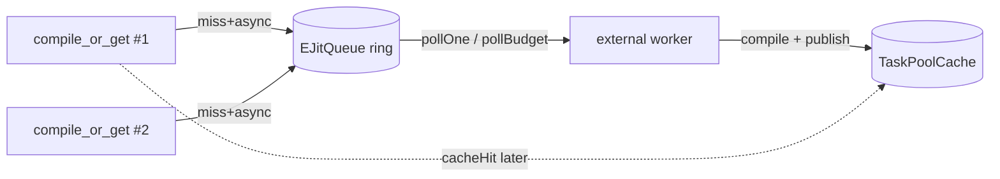
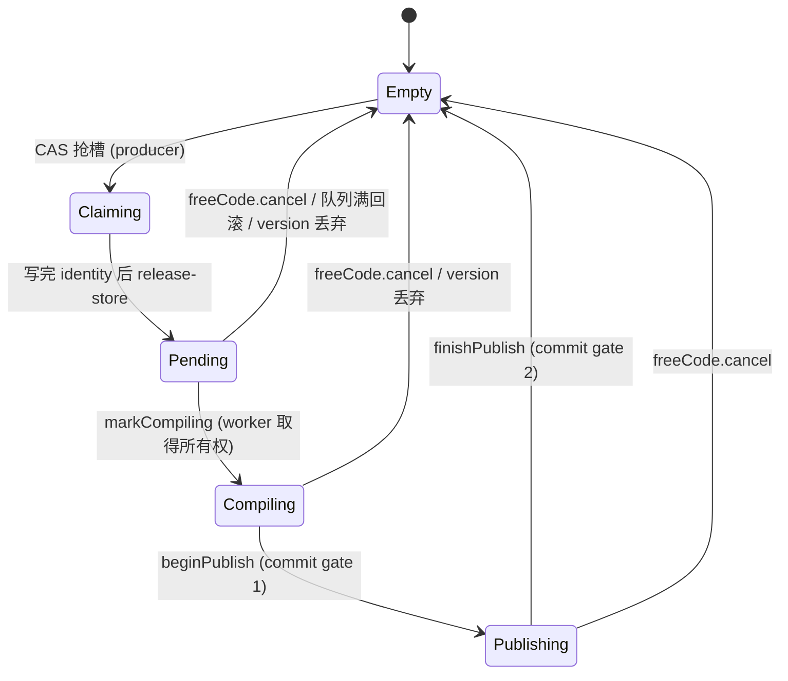
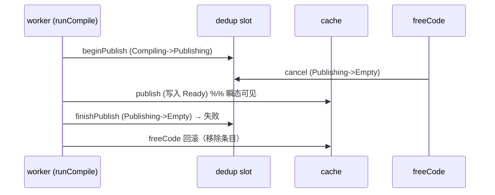

# EmbeddedJIT SRE Taskpool 编译调度机制

> 适用分支：`codex/ejit-sre-taskpool`
> 开关：`EJIT_SRE_TASKPOOL`（默认 **OFF**，上游默认行为不变）
> 目标平台：`aarch64_be`（SRE，无 C++ 线程库）

## 1. 背景：为什么不能用 std::thread / std::async

目标运行环境是 SRE 上的 `aarch64_be`，**没有可用的 C++ 线程接口**。因此本实现
全程禁止以下设施：

- `std::thread`
- `std::async`
- `std::future`
- `std::promise`
- `std::mutex`
- `std::shared_mutex`
- `std::condition_variable`

平台允许：

- 原子操作（通过 wrapper 封装，后续由平台内建桩替换）；
- SRE 队列操作（`QueueCreate` / `QueueWrite` / `QueueRead`，通过抽象封装）。

因此 taskpool 的所有共享状态都建立在原子单元（`EJitAtomic`）之上，工作队列建立
在 `EJitQueue` 抽象之上，没有任何线程/锁/条件变量。

## 2. taskpool 异步语义：producer + explicit worker/pump

这里的“异步”**不是 EJIT 内部起线程**，而是：

- **多生产者**：业务侧调用 `compile_or_get`，未命中时把 `EJitCompileRequest`
  入队，立即返回 fallback / pending；
- **单消费者**：由外部 SRE task 或显式 `poll` worker 调用
  `pollOne()` / `pollBudget()` 消费队列、执行编译、`publish` 到 cache。

worker 的驱动权完全在外部平台/调用方，EJIT 不拥有也不创建任何线程。



## 3. compile_or_get 新流程

开启 `EJIT_SRE_TASKPOOL` 后，`ejit_compile_or_get` 不再直接调用同步编译驱动，
而是统一经过 `EJitTaskPool::compileOrGet`：

1. **cache hit**：直接返回 JIT code（`CacheHit`）。
2. **disabled / Off**：不入队、不编译，返回 fallback（`DisabledFallback`）。
3. **cache miss + Sync**：构造 `EJitCompileRequest` → dedup 去重/占位 → 当前调用栈
   执行 `runCompile`（同步编译）→ 编译成功 `publish` cache → 返回结果
   （`SyncCompiled`）。
4. **cache miss + Async**：构造 `EJitCompileRequest` → dedup 去重/占位 → 入队 →
   立即返回 fallback（`EnqueuedPending`）；之后由外部 worker `pollOne` 消费、编译、
   `publish`。
5. 重复提交同一 key → `AlreadyPending`；dedup bucket 满 → `DedupFullFallback`；
   队列满 → 回滚 dedup 并返回 `QueueFullFallback`。

同步与异步**共用同一套 cache + dedup 流程**，只是消费方式不同（当前栈编译 vs.
入队后由 worker 编译）。

## 4. 同步 / 异步共用 cache / dedup

`EJitTaskPool` 内部组合：

- `EJitSwitchController`：使能位 + 模式（Off/Sync/Async）+ version；
- `EJitDedupTable`：去重表，保证一个 key 同时只有一次编译在飞；
- `EJitTaskPoolCache`：固定布局的发布 cache；
- `EJitQueue`：异步工作队列。

无论 Sync 还是 Async，都先查 `cache.lookup`，再走 `dedup.tryMarkPending`，区别仅在
“现在编译”还是“入队稍后编译”。这样可以避免 sync/async 两条路径产生重复编译或
缓存不一致。

## 5. 32 buckets 是为了减少竞争，不是 32 个单 flag

dedup 与 cache 都是**分桶 + 每桶固定 slot** 结构：

- `bucket = funcIndex % EJIT_SRE_TASKPOOL_BUCKETS`（默认 32）；
- 每个 bucket 有 `EJIT_SRE_TASKPOOL_BUCKET_SLOTS` 个 slot（默认 8）；
- slot 匹配比较**三元组**：`funcIndex` + `cacheKey` + `version`。

这并不是“`funcIndex % 32` 一个标志位”那种粗粒度去重。32 桶的目的是把竞争分散到不同
桶，降低多生产者在同一原子上的争用；同一桶内多个 slot 保证不同 `funcIndex`（哈希到
同一桶）不会互相误判，也支持同一桶内多个 key 同时在飞。

- 同一 key 重复提交 → `AlreadyPending`（只入队一次）。
- 不同 `funcIndex` 落在同一 bucket → 各占独立 slot，不误判。
- bucket 满 → `DedupFull`。

### 5.1 dedup slot 状态机（Claiming / Publishing）

dedup slot 不是单个布尔标志，而是一个 5 态生命周期：

```
Empty -> Claiming -> Pending -> Compiling -> Publishing -> Empty
```



**为什么需要 Claiming（修复 identity 后写竞态）**：旧实现先 CAS
`Empty -> Pending`，再写 `funcIndex/cacheKey/version`。多生产者下，生产者 B 可能看到
state 已非 Empty、但 identity 还没写完（读到 0 或半成品），于是 B 没识别出重复、又开了
第二个 slot。新协议把“占槽”和“可被匹配”分成两步：

1. `Empty -> Claiming`（CAS 占槽，producer 私有）；
2. 写 `funcIndex/cacheKey/version`（relaxed）；
3. `state.storeRelease(Pending)` 一次性发布 identity。

**只有 committed 状态（Pending/Compiling/Publishing）参与重复匹配**，匹配前先
`state.loadAcquire()`，与上面的 release-store 配对——因此读者要么看不到这个 slot
（Claiming 被跳过），要么看到的 identity 一定是写完整的。Claiming 是“正在初始化”的瞬态，
不会被误判为重复，也不会卡死（占槽的 producer 总会把它推进到 Pending）。

> aarch64_be 说明：每个字段都是单个自然对齐的原子标量、按类型读写（绝不按字节解析）。
> 大小端只影响“一个标量内部”的字节序，对端两侧用同一类型 load/store 时不可见。
> release/acquire 在 aarch64 上对应 `stlr`/`ldar`（或 dmb 序列），与端序无关地保证
> identity 写入先于 state 发布。

对应测试：`EJitDedupTableClaiming.ClaimingSlotNotMatchedAsDuplicate`、
`EJitDedupTableClaiming.PublishedIdentityIsConsistent`。

## 6. 队列满必须回滚 dedup flag

异步 miss 的顺序是“先占 dedup，再入队”。如果队列已满 `push` 失败，必须把刚才占用的
dedup slot **回滚**，否则该 key 会永久停留在 Pending、再也不会被编译。

实现位置：[EJitTaskPool.cpp](../llvm/lib/ExecutionEngine/EJIT/EJitTaskPool.cpp)
`EJitTaskPool::compileOrGet` 的 async 分支：

```cpp
if (!queue_.push(req)) {
  dedup_.clear(funcIndex, cacheKey, version);   // 回滚，避免永久 pending
  return {EJitCompileOrGetStatus::QueueFullFallback, fallback};
}
```

对应测试：`EJitTaskPoolAsync.QueueFullRollsBackDedup`。

### 6.1 cache publish 失败（fixed cache bucket 满）

taskpool cache 也是**分桶 + 每桶固定 slot**。`publish` 在目标 bucket 的所有 slot 都被
其他 key 的 Ready 条目占满时返回 `false`——它**绝不静默覆盖**其它 key。

`runCompile` 必须检查 `publish` 的返回值：失败时

- **不**返回 `SyncCompiled`，而是返回新状态 `CacheFullFallback`（C ABI 映射到
  `EJIT_ERR_CACHE_FULL`，ABI additive）；
- 释放 dedup slot（`clear`），避免该 key 永久卡在 in-flight；
- 因为什么都没写进 cache，后续 `lookup` 不会假命中。

```cpp
bool published = cache_.publish(funcIndex, cacheKey, version, fn);
if (!published) {
  dedup_.clear(funcIndex, cacheKey, version);   // 不卡 pending
  counters_.publishFailed.fetchAdd(1);
  outStatus = EJitCompileOrGetStatus::CacheFullFallback;  // 明确语义
  return nullptr;
}
```

对应测试：`EJitTaskPoolCacheFull.PublishBucketFullReturnsCacheFull`。

## 7. SwitchController / version 避免旧请求污染 cache

`EJitSwitchController` 持有一个单调递增的 `version`。当运行期状态变化（例如某个时间窗
失效、需要重编）时调用 `bumpVersion()`：

- 入队请求携带当时的 `version`；
- worker 在 `runCompile` 开始、以及编译完成后都会比较 `req.version` 与当前
  `version`，不一致则**丢弃该请求、不 publish**，并清理 dedup；
- cache `lookup` 也带 `version`，旧 version 的条目不会被命中。

这样即使旧请求还在队列里，version 变化后也不会把过期结果写进 cache。

对应测试：`EJitSwitchController.OldVersionRequestDroppedByPoll`。

## 8. Atomic wrapper 后续会由平台桩替换

所有原子访问集中在
[EJitAtomic.h](../llvm/include/llvm/ExecutionEngine/EJIT/EJitAtomic.h)：

- 提供 `EJitAtomic<T>` 模板与 `EJitAtomicU32 / EJitAtomicU64 / EJitAtomicUPtr`；
- 接口：`loadAcquire / loadRelaxed / storeRelease / storeRelaxed /
  compareExchange / fetchAdd / fetchSub`，**每个调用点的 memory order 都显式写明**；
- 第一版实现基于 `__atomic_*` 编译器内建（**不** `#include <atomic>`），因此在
  `EJIT_FREESTANDING` 下也能编译。

taskpool 业务逻辑文件（`EJitTaskPool.*`、`EJitSreQueue.*`）**不直接出现**
`std::atomic` 或编译器原子内建——后续目标平台只需把 `EJitAtomic` 的少量
`__atomic_*` 调用替换为平台内建桩，taskpool 数据结构与控制流无需改动。

## 9. Queue 抽象与 mock

[EJitSreQueue.h](../llvm/include/llvm/ExecutionEngine/EJIT/EJitSreQueue.h) /
[EJitSreQueue.cpp](../llvm/lib/ExecutionEngine/EJIT/EJitSreQueue.cpp)：

- `EJitQueue::push/pop/capacity/approximateSize` 封装队列操作；
- 默认（host / 测试）后端是 **Vyukov 风格的有界无锁环形队列**（power-of-two 容量），
  不使用 mutex/condition_variable，单线程可测；
- 真实 SRE 平台：定义 `EJIT_SRE_TASKPOOL_PLATFORM_QUEUE` 后，`push/pop` 路由到
  `QueueCreate/QueueWrite/QueueRead`（asm-label 到真实符号，带 weak host 兜底，
  与 `EJitSrePlatform.cpp` 同一套模式）。SRE 符号被限制在该文件的明确区域内，不散落
  到业务逻辑。

## 10. FreeCode v1 是 logical free

`ejit_taskpool_free_code` / `EJitTaskPool::freeCode`：

- 先 `dedup.cancel`（把在飞的 **Pending/Compiling/Publishing** 槽 CAS 回 Empty），
  让 worker 即使正在编译也无法通过 commit gate publish 旧结果；
- 再 `cache.freeCode`（把匹配的 Ready 条目状态置 Empty，后续 `lookup` miss）；
- **不释放 SRE code pool 物理内存**：`fnPtr` 字段保持不动，物理回收推迟到后续版本。

### 10.1 FreeCode vs worker publish 竞态保证（两段 commit gate）

仅靠“编译完成后把 slot 直接 Empty 再 publish”无法堵住一个窗口：worker 通过 gate 之后、
真正写 cache 之前，freeCode 可能恰好插入，导致 worker 仍把已释放的 key 写回 cache。

新协议把发布拆成 **Publishing 中间态 + 两段 CAS gate**：

1. `beginPublish`：`Compiling -> Publishing`（gate 1）。若 freeCode 在编译期间已 cancel，
   该 CAS 失败 → worker 直接丢弃结果、不写 cache。
2. `cache.publish(...)` 写入 Ready 条目。
3. `finishPublish`：`Publishing -> Empty`（gate 2）。若 freeCode 在 publish 窗口内把 slot
   强制 Empty，则该 CAS **失败** → worker 知道自己输给了 freeCode，于是
   `cache.freeCode(...)` **回滚刚写入的条目**。

因此无论 freeCode 落在“编译中”还是“publish 窗口中”，**被取消的 key 都不会最终留在
cache 里**。注意：在 worker 写入与回滚之间存在一个极短的瞬态窗口，期间并发读者可能
`CacheHit` 到该条目；由于 FreeCode v1 是逻辑释放、**物理 code 仍然有效**，这一瞬态命中
返回的仍是可执行的（只是已被逻辑下线的）代码，对 v1 是可接受且已文档化的行为。



FreeCode v1 的真实保证：**logical free，不释放物理 code pool，但保证已取消的 in-flight
compile 不会最终 publish 回 cache。**

对应测试：`EJitTaskPoolFreeCode.ReadyEntryFreedThenMiss`、
`EJitTaskPoolFreeCode.PendingFreedWorkerDoesNotPublish`、
`EJitTaskPoolFreeCode.FreeWhileCompilingDropsResult`、
`EJitTaskPoolFreeCode.FreeInPublishWindowRollsBack`、
`EJitTaskPoolFreeCode.FreeWhileAsyncCompilingViaWorker`、
`EJitDedupTable.FinishPublishBlockedByCancel`。

## 10.2 taskpool stats

taskpool 维护一组用 `EJitAtomic`（**非** `std::atomic`）实现的轻量计数器
`EJitTaskPoolCounters`，与旧 `EJitCache` 的 `ejit_stats_t` 相互独立：

- 旧 `ejit_get_stats` / `ejit_stats_t` 报告的是 legacy LRU `EJitCache`；在
  `EJIT_SRE_TASKPOOL=ON` 时，真正生效的是 taskpool cache，因此新增独立的
  taskpool stats 才能反映实际命中/编译/队列情况。
- 事件计数（单调递增）：`cacheHits`、`syncCompiles`、`asyncCompiles`、`asyncEnqueues`、
  `alreadyPending`、`queueFull`、`dedupFull`、`compileFailed`、`publishFailed`、
  `freeCodeCalls`。
- 实时量（快照采样）：`readyEntries`、`pendingEntries`、`queueApproxSize`。

C ABI（additive，固定布局 `uint64_t/uint32_t`）：

```c
ejit_status_t ejit_taskpool_get_stats(ejit_taskpool_stats_t *out);
```

对应测试：`EJitTaskPoolStats.CountersTrackActivity`、
`EJitTaskPoolStats.QueueFullAndDedupFullCounters`、`EJitTaskPoolStats.DedupFullCounter`。

## 11. 与 SRE code pool 的关系

- taskpool 不替换、不破坏现有 SRE code pool（`EJIT_SRE_CODE_POOL`）。
- taskpool 的编译回调最终仍调用 OrcJIT 引擎；当 `EJIT_SRE_CODE_POOL` 开启时，编译产物
  的函数指针**仍来自 SRE code pool**。
- cache `publish` 存储的就是 code pool 返回的函数地址。
- `FreeCode` 只做逻辑回收，不动 code pool 物理内存。

## 12. aarch64_be 注意事项

- **固定布局请求结构** `EJitCompileRequest` 只用 `uint32_t/uint64_t/uintptr_t`，
  无 bitfield、无析构、无 STL；`static_assert` 校验
  `sizeof == 16 + 2*sizeof(uintptr_t)`、`alignof <= 8`。
- 结构字段**按类型访问**，绝不按字节解析；**不做跨端二进制文件持久化**。
- 所有 CAS 对象都是**单个 32/64-bit 原子标量字段**（state 单独一字），
  不在 bitfield 上做原子。
- 每个原子操作的 **memory order 显式写明**（acquire/release/acq_rel/relaxed）。
- 任何 hash/key 截断都显式 `uint32_t`/`uint64_t` 转换（`funcIndex = cacheKey >> 32`）。
- 因为字段按类型访问、原子按标量字访问，大小端不影响语义。

## 13. build.sh 用法

```bash
# 推荐：aarch64_be + freestanding + SRE code pool + taskpool
./build.sh release aarch64_be --freestanding --sre-taskpool
```

新增开关：

| 开关 | 说明 | 默认 |
| --- | --- | --- |
| `--sre-taskpool` / `--no-sre-taskpool` | 开关 taskpool | OFF |
| `--sre-taskpool-buckets=<n>` | dedup/cache 桶数 | 32 |
| `--sre-taskpool-bucket-slots=<n>` | 每桶 slot 数 | 8 |
| `--sre-taskpool-queue-capacity=<n>` | 异步队列容量（pow2） | 1024 |

配置摘要会打印：

```
EJIT: sre-taskpool=ON buckets=32 slots=8 queue=1024
```

对应 CMake option：`EJIT_SRE_TASKPOOL`、`EJIT_SRE_TASKPOOL_BUCKETS`、
`EJIT_SRE_TASKPOOL_BUCKET_SLOTS`、`EJIT_SRE_TASKPOOL_QUEUE_CAPACITY`。

## 14. C ABI（黑盒接口）

`EJIT_SRE_TASKPOOL` 下新增（additive，不破坏原 ABI）：

```c
ejit_status_t ejit_taskpool_sync_compile(uint32_t funcIndex,
                                         uint64_t cacheKey, void **outFn);
ejit_status_t ejit_taskpool_free_code(uint32_t funcIndex, uint64_t cacheKey);
unsigned      ejit_taskpool_poll_one(void);
unsigned      ejit_taskpool_poll_budget(unsigned maxItems);
unsigned      ejit_taskpool_pending_count(void);
ejit_status_t ejit_taskpool_get_stats(ejit_taskpool_stats_t *out);
```

`ejit_status_t` 复用原有枚举，新增值均为追加（`EJIT_ERR_QUEUE_FULL`、
`EJIT_ERR_DEDUP_FULL`、`EJIT_ERR_DISABLED`、`EJIT_PENDING`；cache bucket 满复用
`EJIT_ERR_CACHE_FULL`），原有数值不变。`ejit_taskpool_stats_t` 是新增的固定布局
POD（仅 `uint64_t/uint32_t`），不改动原 `ejit_stats_t`。

## 15. 测试

独立测试 target：

```bash
cmake --build build-ejit-sre-taskpool --target check-ejit-taskpool -j8
```

`EJITTaskPoolTests` 直接编译 `EJitTaskPool.cpp` + `EJitSreQueue.cpp`（带 taskpool
宏 + `EJIT_SRE_TASKPOOL_TESTING`），**不依赖 `EJITTests` 是否能编译**，host 可跑，
使用 mock compiler + mock ring queue，**不使用任何真实线程**——并发交错全部用显式
`pollOne`/`pollBudget` 以及测试钩子（`setPrePublishHookForTest`、dedup 的
`beginClaimForTest`/`releaseClaimForTest`/`peekStateForTest`，仅在
`EJIT_SRE_TASKPOOL_TESTING` 下编译，不污染生产 API）模拟。覆盖：

1. atomic wrapper（load/store/CAS 成功失败、fetchAdd）；
2. SwitchController（默认模式、set、bumpVersion、旧 version 请求被 poll 丢弃）；
3. queue（容量生效、满返回 false、FIFO、pow2 取整）；
4. dedup（去重、同桶不误判、桶满 `DedupFull`、clear 回滚、状态机 transitions、
   **Claiming 不被当成重复**、cancel 阻断 finishPublish）；
5. **cache publish bucket full** → `CacheFullFallback`，无假命中；
6. sync 路径（miss 编译 / 命中 / 失败清 dedup）；
7. async 路径（入队 / poll / publish / 队列满回滚 / AlreadyPending / pollBudget）；
8. **FreeCode 竞态**（pending 取消、编译中取消、publish 窗口内取消并回滚、async
   worker publish 窗口取消）；
9. **taskpool stats** 计数；
10. request 为 flat POD 的编译期断言。

当前共 32 个用例。
