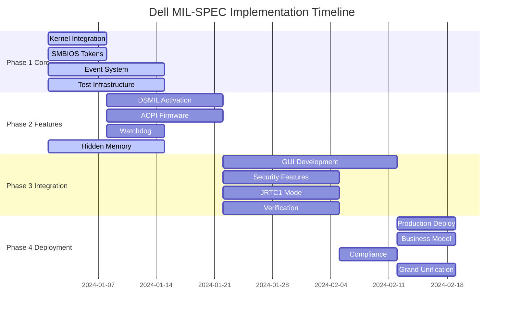

# Dell MIL-SPEC Security Platform - Execution Flow Guide

## 🎯 **MASTER EXECUTION FLOW FOR AI AGENTS**

**Purpose**: Define the sequential and parallel execution paths for all implementation plans  
**Timeline**: 16 weeks total (6 weeks with AI acceleration)  
**Agents**: 7 specialized AI agents working in parallel  

---

## 📊 **EXECUTION OVERVIEW**



---

## 🚀 **PHASE 1: CORE INFRASTRUCTURE (Weeks 1-2)**

### **Parallel Execution Group 1**
All can start immediately with no dependencies:

#### **Track A: Kernel Integration** (Agent 1)
```yaml
Plan: KERNEL-INTEGRATION-PLAN.md
Duration: 1 week (reduced from 2)
Output: Kernel-integrated driver
Dependencies: None
Parallel Safe: Yes
```

#### **Track B: SMBIOS Tokens** (Agent 1)
```yaml
Plan: SMBIOS-TOKEN-PLAN.md  
Duration: 1 week (reduced from 3)
Output: Token discovery system
Dependencies: None
Parallel Safe: Yes
```

#### **Track C: Event System** (Agent 1)
```yaml
Plan: EVENT-SYSTEM-PLAN.md
Duration: 2 weeks
Output: Kernel event infrastructure  
Dependencies: None
Parallel Safe: Yes
```

#### **Track D: Testing Framework** (Agent 4)
```yaml
Plan: TESTING-INFRASTRUCTURE-PLAN.md
Duration: 2 weeks (partial)
Output: Basic test framework
Dependencies: None
Parallel Safe: Yes
```

#### **Track E: Hidden Memory** (Agent 2)
```yaml
Plan: HIDDEN-MEMORY-PLAN.md
Duration: 2 weeks
Output: NPU memory access
Dependencies: None
Parallel Safe: Yes
```

---

## 🔧 **PHASE 2: FEATURE IMPLEMENTATION (Weeks 3-4)**

### **Sequential Execution Group**
These depend on Phase 1 kernel integration:

#### **Track F: DSMIL Activation** (Agent 1)
```yaml
Plan: DSMIL-ACTIVATION-PLAN.md
Duration: 2 weeks
Output: 12 DSMIL devices active
Dependencies: Kernel Integration (Track A)
Parallel Safe: No - requires kernel
```

#### **Track G: ACPI Firmware** (Agent 1)
```yaml
Plan: ACPI-FIRMWARE-PLAN.md
Duration: 2 weeks  
Output: ACPI method integration
Dependencies: Kernel Integration (Track A)
Parallel Safe: Can run parallel with Track F
```

#### **Track H: Watchdog** (Agent 5)
```yaml
Plan: WATCHDOG-PLAN.md
Duration: 1 week
Output: Hardware watchdog
Dependencies: Kernel Integration (Track A)
Parallel Safe: Yes
```

---

## 🎨 **PHASE 3: INTEGRATION (Weeks 5-6 with AI)**

### **Parallel Execution Group 2**
All can run in parallel after Phase 2:

#### **Track I: GUI Development** (Agent 3)
```yaml
Plan: COMPREHENSIVE-GUI-PLAN.md
Duration: 3 weeks (1.5 with AI)
Output: Complete desktop/mobile GUI
Dependencies: DSMIL Activation (Track F)
Parallel Safe: Yes
```

#### **Track J: Security Features** (Agent 2)
```yaml
Plan: ADVANCED-SECURITY-PLAN.md
Duration: 2 weeks (1 with AI)
Output: NPU threat detection
Dependencies: Hidden Memory (Track E), DSMIL (Track F)
Parallel Safe: Yes
```

#### **Track K: JRTC1 Mode** (Agent 2)
```yaml
Plan: JRTC1-ACTIVATION-PLAN.md
Duration: 2 weeks (1 with AI)
Output: Training mode features
Dependencies: DSMIL Activation (Track F)
Parallel Safe: Yes
```

#### **Track L: Verification** (Agent 4)
```yaml
Plan: FORMAL-VERIFICATION-PLAN.md
Duration: 2 weeks
Output: Mathematical proofs
Dependencies: All core features
Parallel Safe: Yes
```

---

## 🚢 **PHASE 4: DEPLOYMENT (Week 6 with AI)**

### **Sequential Final Steps**

#### **Track M: Production Deployment** (Agent 5)
```yaml
Plan: PRODUCTION-DEPLOYMENT-PLAN.md
Duration: 1 week (3 days with AI)
Output: Debian packages, CI/CD
Dependencies: All features complete
Parallel Safe: No - requires all
```

#### **Track N: Business Model** (Agent 6)
```yaml
Plan: BUSINESS-MODEL-PLAN.md
Duration: 1 week (parallel)
Output: Go-to-market strategy
Dependencies: None
Parallel Safe: Yes
```

#### **Track O: Compliance** (Agent 2)
```yaml
Plan: COMPLIANCE-CERTIFICATION-PLAN.md
Duration: 1 week
Output: Compliance documentation
Dependencies: Verification (Track L)
Parallel Safe: Yes
```

#### **Track P: Grand Unification** (Agent 7)
```yaml
Plan: GRAND-UNIFICATION-PLAN.md
Duration: 1 week (3 days with AI)
Output: Complete integrated platform
Dependencies: All tracks complete
Parallel Safe: No - final integration
```

---

## 🤖 **AI AGENT ASSIGNMENT MATRIX**

```yaml
Agent 1 - Kernel Developer:
  Week 1-2: Tracks A, B, C (parallel)
  Week 3-4: Tracks F, G (sequential)
  Total Plans: 5

Agent 2 - Security Specialist:
  Week 1-2: Track E (hidden memory)
  Week 5-6: Tracks J, K, O (parallel)
  Total Plans: 4

Agent 3 - GUI Developer:
  Week 1-4: Study existing code/plans
  Week 5-6: Track I (GUI intensive)
  Total Plans: 1 (but largest)

Agent 4 - Testing Engineer:
  Week 1-2: Track D (partial)
  Week 5-6: Track L (verification)
  Continuous: Test all outputs
  Total Plans: 2 + continuous

Agent 5 - DevOps Engineer:
  Week 3-4: Track H (watchdog)
  Week 6: Track M (deployment)
  Continuous: CI/CD setup
  Total Plans: 2 + infrastructure

Agent 6 - Documentation:
  Week 1-6: Continuous documentation
  Week 6: Track N (business)
  Total Plans: 1 + all docs

Agent 7 - Orchestrator:
  Week 1-6: Coordination
  Week 6: Track P (unification)
  Total Plans: 1 + management
```

---

## 📈 **CRITICAL PATH ANALYSIS**

### **Minimum Timeline Path**
```
1. Kernel Integration (1 week)
   ↓
2. DSMIL Activation (2 weeks)
   ↓
3. GUI Development (1.5 weeks with AI)
   ↓
4. Production Deployment (3 days)
   ↓
5. Grand Unification (3 days)

Total Critical Path: 5.5 weeks
```

### **Parallelization Opportunities**
- **Week 1-2**: 5 plans in parallel (A,B,C,D,E)
- **Week 3-4**: 3 plans in parallel (F,G,H)
- **Week 5-6**: 4 plans in parallel (I,J,K,L)
- **Week 6**: 3 plans in parallel (M,N,O)

### **Maximum Parallelization**: 5 simultaneous tracks

---

## 🔄 **DEPENDENCY GRAPH**

```
None → [Kernel, SMBIOS, Events, Tests, Hidden Memory]
  ↓
Kernel → [DSMIL, ACPI, Watchdog]
  ↓
DSMIL → [GUI, Security, JRTC1]
  ↓
All Features → [Verification]
  ↓
Verification → [Compliance]
  ↓
Everything → [Production Deploy, Grand Unification]
```

---

## ⚡ **FAST TRACK OPTIONS**

### **Option 1: Maximum AI Acceleration (6 weeks)**
- Use 7 specialized agents
- Parallel execution where possible
- AI code generation for all components
- Automated testing and verification

### **Option 2: 1000-Agent Experiment (1 day)**
- Deploy 1000 agents for 24 hours
- Complete parallelization of all tasks
- High risk, high reward
- See: HYPOTHETICAL-1000-AGENT-ANALYSIS.md

### **Option 3: Traditional Sequential (16 weeks)**
- One component at a time
- Lower risk, higher cost
- More debugging time
- Traditional development

---

## 📋 **QUICK REFERENCE EXECUTION ORDER**

### **Immediate Start (No Dependencies)**
1. KERNEL-INTEGRATION-PLAN.md
2. SMBIOS-TOKEN-PLAN.md
3. EVENT-SYSTEM-PLAN.md
4. TESTING-INFRASTRUCTURE-PLAN.md
5. HIDDEN-MEMORY-PLAN.md

### **After Kernel Integration**
6. DSMIL-ACTIVATION-PLAN.md
7. ACPI-FIRMWARE-PLAN.md
8. WATCHDOG-PLAN.md

### **After DSMIL Activation**
9. COMPREHENSIVE-GUI-PLAN.md
10. ADVANCED-SECURITY-PLAN.md
11. JRTC1-ACTIVATION-PLAN.md

### **After All Features**
12. FORMAL-VERIFICATION-PLAN.md
13. COMPLIANCE-CERTIFICATION-PLAN.md

### **Final Integration**
14. PRODUCTION-DEPLOYMENT-PLAN.md
15. BUSINESS-MODEL-PLAN.md
16. GRAND-UNIFICATION-PLAN.md

---

## 🎯 **SUCCESS METRICS**

- **Week 1**: 5 parallel tracks initiated
- **Week 2**: Core infrastructure complete
- **Week 3**: DSMIL devices activated
- **Week 4**: All features implemented
- **Week 5**: GUI and security complete
- **Week 6**: Production deployment ready

**Total Timeline**: 6 weeks with AI acceleration (vs 16 weeks traditional)