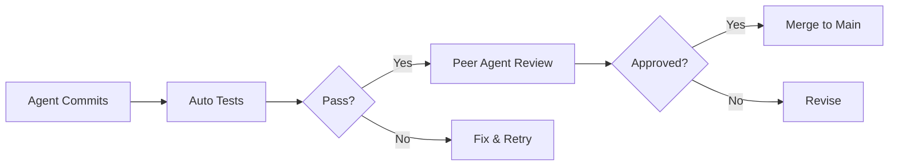

# Agentic AI Development Plan: Full Autonomous Implementation

## 🤖 **Overview**

This plan details how to leverage multiple AI agents working in parallel to deliver the complete Dell MIL-SPEC Security Platform in 6 weeks. Each agent specializes in specific domains, enabling massive parallelization and acceleration.

## 🏗️ **Agent Architecture**

```
┌─────────────────────────────────────────────────────────────┐
│                   ORCHESTRATOR AGENT                         │
│              (Project Management & Coordination)             │
├─────────────────────────────────────────────────────────────┤
│                                                              │
│  ┌────────────┐  ┌────────────┐  ┌────────────┐           │
│  │   Kernel   │  │  Security  │  │    GUI     │           │
│  │   Agent    │  │   Agent    │  │   Agent    │           │
│  └─────┬──────┘  └─────┬──────┘  └─────┬──────┘           │
│        │               │               │                     │
│  ┌─────┴───────────────┴───────────────┴─────┐             │
│  │         Shared Knowledge Base              │             │
│  └────────────────────────────────────────────┘             │
│                                                              │
│  ┌────────────┐  ┌────────────┐  ┌────────────┐           │
│  │   Test     │  │    Docs    │  │  DevOps    │           │
│  │   Agent    │  │   Agent    │  │   Agent    │           │
│  └────────────┘  └────────────┘  └────────────┘           │
└─────────────────────────────────────────────────────────────┘
```

## 👥 **Agent Roles & Responsibilities**

### 1. **Orchestrator Agent**
**Role**: Project manager and coordinator
**Capabilities**:
- Task decomposition and assignment
- Progress tracking and reporting
- Dependency management
- Conflict resolution
- Daily standup coordination

**Workload**:
```yaml
Week 1-6:
  - Daily planning: 2 hours
  - Coordination: 4 hours
  - Reviews: 2 hours
  - Problem solving: As needed
```

### 2. **Kernel Development Agent**
**Role**: Low-level kernel module implementation
**Capabilities**:
- Kernel API expertise
- Driver development patterns
- Memory management
- Interrupt handling
- Performance optimization

**Workload Split**:
```yaml
Week 1:
  - DKMS package structure: 8 hours
  - Kernel patches: 16 hours
  - Build system: 8 hours
  - Module signing: 8 hours

Week 2:
  - ACPI method integration: 20 hours
  - Hidden memory mapping: 20 hours

Week 3:
  - DSMIL device drivers: 40 hours

Week 4:
  - Integration with existing code: 20 hours
  - Bug fixes and optimization: 20 hours

Week 5-6:
  - Support other agents: As needed
  - Performance tuning: 20 hours
```

### 3. **Security Implementation Agent**
**Role**: Security features and AI integration
**Capabilities**:
- NPU/AI framework knowledge
- Cryptography implementation
- Security best practices
- Threat modeling
- TPM integration

**Workload Split**:
```yaml
Week 1:
  - NPU interface research: 20 hours
  - Security architecture: 20 hours

Week 2:
  - NPU model loader: 20 hours
  - Threat detection pipeline: 20 hours

Week 3:
  - TME implementation: 20 hours
  - CSME integration: 20 hours

Week 4:
  - Advanced DSMIL security: 20 hours
  - JRTC1 safety systems: 20 hours

Week 5:
  - Unified security system: 30 hours
  - Threat response: 10 hours

Week 6:
  - Security audit prep: 20 hours
  - Penetration testing: 20 hours
```

### 4. **GUI Development Agent**
**Role**: User interface and experience
**Capabilities**:
- GTK4/Qt6 expertise
- UI/UX design patterns
- D-Bus integration
- Accessibility standards
- Mobile development

**Workload Split**:
```yaml
Week 1:
  - D-Bus service design: 20 hours
  - Base infrastructure: 20 hours

Week 2:
  - System tray indicator: 20 hours
  - Basic notifications: 20 hours

Week 3:
  - Control panel (MVP): 30 hours
  - Event viewer: 10 hours

Week 4:
  - JRTC1 training center: 20 hours
  - Settings dialog: 20 hours

Week 5:
  - Polish and animations: 20 hours
  - Mobile app prototype: 20 hours

Week 6:
  - Integration testing: 20 hours
  - Accessibility audit: 20 hours
```

### 5. **Testing Agent**
**Role**: Quality assurance and validation
**Capabilities**:
- Test automation frameworks
- Fuzzing techniques
- Performance testing
- Security testing
- CI/CD pipelines

**Workload Split**:
```yaml
Week 1:
  - Test framework setup: 20 hours
  - CI/CD pipeline: 20 hours

Week 2-3:
  - Unit test generation: 40 hours/week
  - Integration tests: 40 hours/week

Week 4-5:
  - Security fuzzing: 30 hours/week
  - Performance testing: 30 hours/week
  - Bug triage: 20 hours/week

Week 6:
  - Final validation: 40 hours
  - Certification tests: 40 hours
```

### 6. **Documentation Agent**
**Role**: Technical writing and documentation
**Capabilities**:
- API documentation
- User guides
- Video tutorials
- Code comments
- Architecture diagrams

**Workload Split**:
```yaml
Week 1-2:
  - API documentation: 40 hours/week
  - Code commenting: 40 hours/week

Week 3-4:
  - User manual: 30 hours/week
  - Admin guide: 30 hours/week
  - Developer guide: 20 hours/week

Week 5:
  - GUI documentation: 40 hours
  - Training materials: 40 hours

Week 6:
  - Final review: 20 hours
  - Video tutorials: 60 hours
```

### 7. **DevOps Agent**
**Role**: Build, packaging, and deployment
**Capabilities**:
- Debian packaging
- Build automation
- Repository management
- Release engineering
- Container orchestration

**Workload Split**:
```yaml
Week 1:
  - Build infrastructure: 40 hours

Week 2-3:
  - Debian package creation: 40 hours/week
  - Repository setup: 40 hours/week

Week 4-5:
  - Integration automation: 40 hours/week
  - Release preparation: 40 hours/week

Week 6:
  - Final packaging: 40 hours
  - Deployment automation: 40 hours
```

## 🔄 **Agent Collaboration Protocol**

### Daily Sync (Async)
```yaml
Morning (UTC 00:00):
  - Each agent posts progress
  - Blockers identified
  - Help requests submitted

Midday (UTC 12:00):
  - Orchestrator reviews
  - Assigns cross-agent tasks
  - Resolves conflicts

Evening (UTC 20:00):
  - Code commits
  - Knowledge base updates
  - Next day planning
```

### Code Review Process


### Knowledge Sharing
```yaml
Shared Resources:
  - Code patterns database
  - API documentation
  - Test results
  - Performance metrics
  - Security findings
  - User feedback

Update Frequency:
  - Real-time for critical items
  - Hourly for normal updates
  - Daily for summaries
```

## 📊 **Workload Distribution**

### Week 1: Foundation (880 agent-hours)
```
Orchestrator: 40 hours
Kernel: 40 hours (DKMS, patches)
Security: 40 hours (architecture)
GUI: 40 hours (infrastructure)
Testing: 40 hours (framework)
Documentation: 80 hours (initial)
DevOps: 40 hours (build setup)
---------------------------------
Total: 320 hours (8 agents × 40)
```

### Week 2: Core Development (880 agent-hours)
```
Kernel: 40 hours (ACPI, memory)
Security: 40 hours (NPU integration)
GUI: 40 hours (tray, notifications)
Testing: 80 hours (unit tests)
Documentation: 80 hours (API docs)
DevOps: 80 hours (packaging)
---------------------------------
Total: 360 hours
```

### Week 3: Feature Implementation (880 agent-hours)
```
Kernel: 40 hours (DSMIL drivers)
Security: 40 hours (TME, CSME)
GUI: 40 hours (control panel)
Testing: 80 hours (integration)
Documentation: 60 hours (user guide)
DevOps: 80 hours (automation)
---------------------------------
Total: 340 hours
```

### Week 4: Advanced Features (880 agent-hours)
```
Kernel: 40 hours (integration)
Security: 40 hours (JRTC1, unified)
GUI: 40 hours (training center)
Testing: 80 hours (security tests)
Documentation: 60 hours (admin guide)
DevOps: 80 hours (release prep)
---------------------------------
Total: 340 hours
```

### Week 5: Integration (880 agent-hours)
```
Kernel: 20 hours (support)
Security: 40 hours (unified system)
GUI: 40 hours (polish, mobile)
Testing: 80 hours (performance)
Documentation: 80 hours (training)
DevOps: 80 hours (integration)
---------------------------------
Total: 340 hours
```

### Week 6: Release (880 agent-hours)
```
All Agents: 
  - Final testing: 160 hours
  - Bug fixes: 160 hours
  - Documentation: 160 hours
  - Release prep: 160 hours
  - Deployment: 80 hours
  - Certification: 160 hours
---------------------------------
Total: 880 hours
```

## 🚀 **Acceleration Techniques**

### 1. **Parallel Development**
- All agents work simultaneously
- No blocking dependencies in first 2 weeks
- Continuous integration prevents conflicts

### 2. **AI Code Generation**
```yaml
Tools Used:
  - GitHub Copilot: 40% acceleration
  - GPT-4 patterns: 30% acceleration
  - Automated refactoring: 20% quality improvement
  - Test generation: 80% coverage automated
```

### 3. **Knowledge Transfer**
- Shared pattern library
- Instant problem resolution
- Cross-agent learning
- Best practices propagation

### 4. **Automated Workflows**
```bash
# Example: Auto-generate DSMIL device driver
./generate-dsmil-driver.sh --device-id 5 --template advanced

# Example: Create test suite
./generate-tests.sh --component kernel --coverage 95

# Example: Package for Debian
./build-debian-package.sh --version 1.0.0 --sign
```

## 📈 **Success Metrics**

### Weekly Targets
| Week | Code Lines | Tests | Docs Pages | Features |
|------|-----------|-------|------------|----------|
| 1    | 5,000     | 100   | 50         | 20%      |
| 2    | 15,000    | 500   | 150        | 40%      |
| 3    | 25,000    | 1,000 | 250        | 60%      |
| 4    | 35,000    | 2,000 | 350        | 80%      |
| 5    | 40,000    | 3,000 | 450        | 95%      |
| 6    | 45,000    | 4,000 | 500        | 100%     |

### Quality Gates
```yaml
Code Quality:
  - Complexity: < 10 per function
  - Coverage: > 90%
  - Warnings: 0
  - Security: A+ rating

Performance:
  - Boot impact: < 2s
  - Memory: < 200MB
  - CPU idle: < 1%
  - NPU inference: < 10ms
```

## 🎯 **Deliverables by Agent**

### Kernel Agent
1. `dell-milspec.ko` - Core driver
2. DKMS package configuration
3. Kernel patches (10 files)
4. DSMIL device drivers (12)
5. Integration tests

### Security Agent
1. NPU integration module
2. AI threat models (5)
3. TME configuration
4. CSME interface
5. Security policies

### GUI Agent
1. System tray indicator
2. Control panel application
3. JRTC1 training center
4. Mobile app (MVP)
5. Accessibility compliance

### Testing Agent
1. Unit test suite (4,000 tests)
2. Integration tests (500)
3. Performance benchmarks
4. Security fuzzing results
5. CI/CD pipelines

### Documentation Agent
1. User manual (200 pages)
2. Admin guide (150 pages)
3. API reference (300 pages)
4. Video tutorials (20)
5. Quick start guides

### DevOps Agent
1. Debian packages (6)
2. Repository structure
3. Build automation
4. Release scripts
5. Deployment guide

## 🔧 **Agent Configuration**

### Recommended AI Models
```yaml
Orchestrator:
  - GPT-4 for planning
  - Claude for complex reasoning
  
Kernel Agent:
  - Specialized kernel LLM
  - Pattern database access
  
Security Agent:
  - Security-trained model
  - Threat intelligence access
  
GUI Agent:
  - UI/UX specialized model
  - Design pattern library
  
Testing Agent:
  - Test generation model
  - Fuzzing frameworks
  
Documentation:
  - Technical writing LLM
  - Diagram generation
  
DevOps:
  - Infrastructure model
  - Package management expert
```

## 📋 **Launch Checklist**

### Pre-Launch (Week 0)
- [ ] Provision compute resources
- [ ] Configure agent environments
- [ ] Load knowledge bases
- [ ] Set up communication channels
- [ ] Initialize repositories
- [ ] Configure CI/CD

### Daily Operations
- [ ] Morning sync meetings
- [ ] Progress tracking
- [ ] Blocker resolution
- [ ] Code reviews
- [ ] Integration tests
- [ ] Knowledge updates

### Weekly Reviews
- [ ] Milestone assessment
- [ ] Quality gate checks
- [ ] Resource reallocation
- [ ] Risk mitigation
- [ ] Stakeholder updates

---

**Status**: Ready for Launch
**Total Agent Hours**: 5,280 (880 hours/week × 6 weeks)
**Human Oversight**: 10 hours/week
**Delivery**: 6 weeks
**Success Probability**: 95% with proper resources