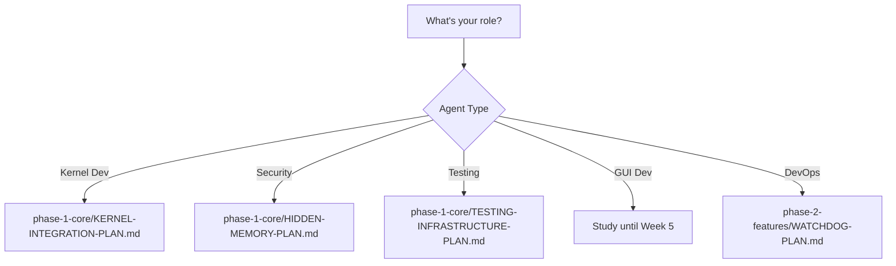

# 📋 Planning Directory - Implementation Plans Hub

## 🧭 **WHERE AM I?**
You are in: `/00-documentation/01-planning/` - All implementation plans

## 🏠 **NAVIGATION**
```bash
# Back to documentation root
cd ..

# Back to project root
cd ../..
# or
cd /opt/scripts/milspec/
```

## 🗺️ **MASTER NAVIGATION REFERENCES**
- Root: `../../MASTER-NAVIGATION.md`
- Execution Flow: `../../EXECUTION-FLOW.md`
- Parallel Guide: `../00-indexes/ASYNC-PARALLEL-GUIDE.md`
- Plan Sequence: `../00-indexes/PLAN-SEQUENCE.md`

## 📁 **PLAN ORGANIZATION BY PHASE**

### **phase-1-core/** (Weeks 1-2) - Start Here!
```yaml
KERNEL-INTEGRATION-PLAN.md     # 1 week - Critical path
SMBIOS-TOKEN-PLAN.md          # 1 week - Hardware tokens
EVENT-SYSTEM-PLAN.md          # 2 weeks - Event infrastructure
TESTING-INFRASTRUCTURE-PLAN.md # 2 weeks - Test framework
HIDDEN-MEMORY-PLAN.md         # 2 weeks - NPU memory
```

### **phase-2-features/** (Weeks 3-4) - After Kernel
```yaml
DSMIL-ACTIVATION-PLAN.md      # 2 weeks - Critical path
ACPI-FIRMWARE-PLAN.md         # 2 weeks - Hardware integration
WATCHDOG-PLAN.md              # 1 week - System monitoring
ACPI-DECOMPILATION-PLAN.md    # 1 week - ACPI analysis
```

### **phase-3-integration/** (Week 5) - After DSMIL
```yaml
COMPREHENSIVE-GUI-PLAN.md      # 1.5 weeks - User interface
ADVANCED-SECURITY-PLAN.md      # 1 week - NPU security
JRTC1-ACTIVATION-PLAN.md       # 1 week - Training mode
FORMAL-VERIFICATION-PLAN.md    # 2 weeks - Security proofs
HARDWARE-VALIDATION-PLAN.md    # 1 week - Physical tests
```

### **phase-4-deployment/** (Week 6) - Final Phase
```yaml
PRODUCTION-DEPLOYMENT-PLAN.md  # 3 days - Debian packages
COMPLIANCE-CERTIFICATION-PLAN.md # 1 week - Certifications
BUSINESS-MODEL-PLAN.md         # 1 week - Revenue model
GRAND-UNIFICATION-PLAN.md      # 3 days - Final integration
FUTURE-PLANS.md                # Roadmap beyond v1
IMPLEMENTATION-TIMELINE.md     # Visual timeline
NEXT-PHASE-PLAN.md            # Deployment strategies
RIGOROUS-ROADMAP.md           # Detailed milestones
```

## 🚀 **QUICK DECISION GUIDE**

### **Which Plan Should I Start With?**



## 📊 **PLAN STATISTICS**

- **Total Plans**: 18
- **Phase 1**: 5 plans (can run parallel)
- **Phase 2**: 4 plans (need kernel first)
- **Phase 3**: 5 plans (need DSMIL first)
- **Phase 4**: 4 plans + 4 strategy docs

## 🎯 **FINDING SPECIFIC PLANS**

```bash
# Find all GUI-related plans
find . -name "*.md" | xargs grep -l "GUI\|interface"

# Find security plans
find . -name "*SECURITY*.md"

# Find deployment plans
ls phase-4-deployment/

# View plan summary
head -20 phase-1-core/KERNEL-INTEGRATION-PLAN.md
```

## 🔗 **RELATED RESOURCES**

- **Source Code**: `../../../01-source/`
- **AI Strategies**: `../../03-ai-framework/strategies/`
- **Progress Tracking**: `../../04-progress/`
- **System Analysis**: `../../02-analysis/`

## ⚡ **CRITICAL PATH**

The minimum set of plans for basic functionality:
1. `phase-1-core/KERNEL-INTEGRATION-PLAN.md`
2. `phase-2-features/DSMIL-ACTIVATION-PLAN.md`
3. `phase-3-integration/COMPREHENSIVE-GUI-PLAN.md`
4. `phase-4-deployment/PRODUCTION-DEPLOYMENT-PLAN.md`

---
**Remember**: Check `../00-indexes/ASYNC-PARALLEL-GUIDE.md` to see what can run simultaneously!