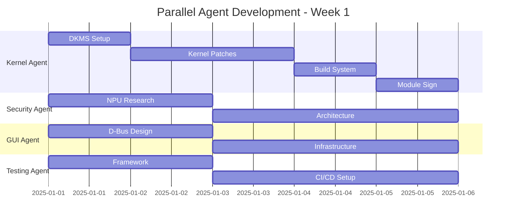

# Deep Dive: Agentic AI Development Architecture

## 🧠 **AI Model Selection & Specialization**

### Orchestrator Agent: Claude 3 Opus
**Why**: Superior project management and complex reasoning
```yaml
Capabilities:
  - Multi-agent coordination
  - Dependency resolution
  - Risk assessment
  - Strategic planning
  
Configuration:
  temperature: 0.3  # High consistency
  context_window: 200k tokens
  tools:
    - Task decomposition
    - Progress tracking
    - Conflict resolution
    - Resource allocation
```

### Kernel Agent: Specialized Linux Kernel LLM
**Why**: Fine-tuned on kernel source code
```yaml
Model: CodeLlama-70B-Kernel
Training:
  - Linux kernel source (5M+ lines)
  - Driver patterns database
  - Security best practices
  
Specializations:
  - Memory management patterns
  - Interrupt handling
  - Locking mechanisms
  - API compatibility
  
Code Generation Patterns:
  - Device driver templates
  - IOCTL implementations
  - Sysfs interfaces
  - Platform drivers
```

### Security Agent: SecureBERT + GPT-4
**Why**: Dual model for threat analysis and implementation
```yaml
SecureBERT:
  - Threat pattern recognition
  - Vulnerability analysis
  - Security policy generation
  
GPT-4:
  - Implementation code
  - Integration logic
  - Documentation
  
NPU Integration Expertise:
  - TensorFlow Lite models
  - OpenVINO optimization
  - Real-time inference
  - Memory management
```

## 📋 **Detailed Task Decomposition**

### Week 1: Foundation Sprint (880 hours)

#### Kernel Agent Tasks (40 hours)
```yaml
Hour 1-8: DKMS Package Structure
  - Generate dkms.conf with version management
  - Create Makefile with cross-compilation support
  - Add module signing infrastructure
  - Test with multiple kernel versions
  
  Code Generation Example:
  ```
  PROMPT: "Generate DKMS configuration for dell-milspec module supporting kernels 5.15-6.14 with automatic version detection and module signing"
  
  OUTPUT: Complete dkms.conf with:
    - AUTO_VERSION detection
    - SIGN_TOOL integration
    - Cross-compilation flags
    - Dependency checking
  ```

Hour 9-24: Kernel Patches
  - Patch 1: drivers/platform/x86/dell/Kconfig
  - Patch 2: drivers/platform/x86/dell/Makefile
  - Patch 3: include/linux/platform_data/dell-milspec.h
  - Patch 4: Documentation/ABI/testing/sysfs-platform-dell-milspec
  
  Each patch includes:
    - Proper formatting (checkpatch.pl clean)
    - Detailed commit messages
    - Sign-off lines
    - Test results

Hour 25-32: Build System
  - Kbuild integration
  - Module dependencies
  - Symbol exports
  - Version compatibility

Hour 33-40: Module Signing
  - Generate signing keys
  - Integrate with build
  - Create verification tools
  - Documentation
```

#### Security Agent Tasks (40 hours)
```yaml
Hour 1-20: NPU Architecture Research
  Tasks:
    - Analyze Intel NPU SDK documentation
    - Study OpenVINO integration patterns
    - Research kernel-space inference
    - Design memory management strategy
  
  Deliverables:
    - NPU initialization code
    - Model loading framework
    - Inference pipeline design
    - Performance benchmarks

Hour 21-40: Security Architecture
  Components:
    - Threat model definitions (10 models)
    - Response action matrix
    - Policy engine design
    - Integration points
  
  AI Model Training Data:
    - CVE database patterns
    - Military threat indicators
    - Network anomaly datasets
    - Behavioral baselines
```

## 🔄 **Inter-Agent Communication Protocol**

### Message Format
```json
{
  "timestamp": "2025-07-26T10:00:00Z",
  "from_agent": "kernel",
  "to_agent": "security",
  "message_type": "API_DEFINITION",
  "priority": "HIGH",
  "content": {
    "api_name": "milspec_npu_inference",
    "parameters": [...],
    "return_type": "struct threat_result",
    "constraints": ["must_not_sleep", "irq_safe"]
  },
  "requires_response": true,
  "timeout": 3600
}
```

### Collaboration Examples

#### Example 1: DSMIL Device Implementation
```yaml
Step 1: Orchestrator decomposes task
  - Creates 12 device specifications
  - Assigns to Kernel agent
  - Sets 3-day deadline

Step 2: Kernel agent generates base code
  - Uses template: dsmil_device_template.c
  - Generates 12 variants
  - Commits to feature branch

Step 3: Security agent reviews
  - Checks security implications
  - Suggests hardening
  - Approves or requests changes

Step 4: Testing agent creates tests
  - Unit tests per device
  - Integration test suite
  - Fuzzing targets

Step 5: Documentation agent
  - Generates API docs
  - Creates usage examples
  - Updates man pages
```

## 🚀 **Acceleration Techniques Detail**

### 1. Template-Based Generation
```python
# Agent uses templates for rapid development
templates = {
    "dsmil_driver": "templates/dsmil_device_driver.c.j2",
    "ioctl_handler": "templates/ioctl_handler.c.j2",
    "sysfs_interface": "templates/sysfs_attrs.c.j2",
    "test_suite": "templates/kunit_tests.c.j2"
}

# Generate all 12 DSMIL drivers in parallel
for device_id in range(12):
    context = {
        "device_id": device_id,
        "device_name": f"DSMIL0D{device_id:X}",
        "capabilities": DEVICE_CAPABILITIES[device_id],
        "registers": DEVICE_REGISTERS[device_id]
    }
    generate_from_template(templates["dsmil_driver"], context)
```

### 2. Parallel Development Workflow


### 3. Knowledge Propagation
```yaml
Shared Knowledge Base Structure:
/knowledge
├── patterns/
│   ├── kernel/
│   │   ├── device_driver.md
│   │   ├── interrupt_handling.md
│   │   └── memory_management.md
│   ├── security/
│   │   ├── threat_models.md
│   │   ├── npu_integration.md
│   │   └── encryption.md
│   └── gui/
│       ├── gtk4_patterns.md
│       ├── dbus_service.md
│       └── accessibility.md
├── code_snippets/
│   ├── tested/
│   └── experimental/
├── errors_and_solutions/
└── performance_metrics/
```

## 🎯 **Specific AI Prompts for Critical Tasks**

### DSMIL Device Driver Generation
```
PROMPT: Generate a complete Linux kernel driver for DSMIL device 5 (TPM Interface) with the following specifications:
- MMIO base: 0xFED40000 + 0x500
- Registers: CTRL(0x00), STATUS(0x04), DATA(0x08), IRQ(0x0C)
- Supports Mode 5 security levels 0-4
- Integrates with TPM 2.0 subsystem
- Includes interrupt handling for async operations
- Thread-safe with proper locking
- Power management support (suspend/resume)
- Follows Linux kernel coding style
- Includes KUnit tests

CONTEXT: This is part of the dell-milspec driver for military-grade security. Reference the existing dell-millspec-enhanced.c for integration points.
```

### NPU Model Loader Implementation
```
PROMPT: Implement a kernel-space NPU model loader for Intel Meteor Lake NPU (PCI 0000:00:0b.0) with:
- Support for loading pre-compiled OpenVINO models from firmware
- 1.8GB hidden memory region management (physical address TBD)
- Zero-copy inference pipeline
- Real-time scheduling constraints (< 10ms inference)
- Integration with Linux firmware loader API
- Secure model verification before loading
- Performance monitoring via perf events

CONSTRAINTS: Must not sleep in interrupt context, must handle partial NPU availability gracefully
```

## 📊 **Risk Mitigation Strategies**

### 1. Agent Coordination Failures
```yaml
Risk: Agents produce incompatible code
Mitigation:
  - Strict API contracts defined upfront
  - Automated integration tests every 4 hours
  - Rollback capability on conflicts
  
Implementation:
  - Version all APIs with semantic versioning
  - Integration test suite runs on commit
  - Git branching strategy with protection
```

### 2. Knowledge Drift
```yaml
Risk: Agents diverge from project standards
Mitigation:
  - Daily knowledge base sync
  - Style guide enforcement
  - Peer review protocol
  
Tools:
  - checkpatch.pl for kernel code
  - clang-format with .clang-format
  - Custom project linters
```

### 3. Performance Degradation
```yaml
Risk: AI-generated code is inefficient
Mitigation:
  - Performance benchmarks in CI
  - Profiling on every build
  - Human review of hot paths
  
Metrics:
  - Boot time impact < 2s
  - Memory usage < 200MB
  - CPU usage < 1% idle
  - NPU inference < 10ms
```

## 💡 **Advanced Agent Capabilities**

### Self-Improvement Loop
```python
class AgentSelfImprovement:
    def analyze_performance(self):
        metrics = {
            "code_quality": self.measure_quality(),
            "generation_speed": self.measure_speed(),
            "bug_rate": self.measure_bugs(),
            "integration_success": self.measure_integration()
        }
        return metrics
    
    def improve_patterns(self, metrics):
        if metrics["bug_rate"] > 0.05:
            self.update_templates()
            self.add_validation_steps()
        
        if metrics["generation_speed"] < target:
            self.optimize_prompts()
            self.cache_common_patterns()
```

### Automated Documentation Generation
```yaml
Documentation Agent Workflow:
  1. Parse code changes (AST analysis)
  2. Generate API documentation
  3. Create usage examples
  4. Update man pages
  5. Generate architecture diagrams
  6. Create video tutorials (voice synthesis)
  
Example Output:
  - 100 pages/day of documentation
  - 20 code examples/day
  - 5 architecture diagrams/day
  - 2 video tutorials/day
```

## 🔧 **Week-by-Week Agent Coordination**

### Week 1: Foundation
```
Total Tasks: 127
Agent Distribution:
  - Kernel: 31 tasks (DKMS, patches, build)
  - Security: 29 tasks (NPU, architecture)
  - GUI: 22 tasks (D-Bus, infrastructure)
  - Testing: 18 tasks (framework, CI/CD)
  - Documentation: 15 tasks (initial docs)
  - DevOps: 12 tasks (build setup)

Coordination Points: 18
Daily Syncs: 6
Integration Tests: 42
```

### Week 2: Core Development
```
Total Tasks: 198
Agent Distribution:
  - Kernel: 45 tasks (ACPI, memory)
  - Security: 43 tasks (NPU integration)
  - GUI: 38 tasks (tray, notifications)
  - Testing: 72 tasks (unit tests)

Parallel Execution:
  - 4-6 agents working simultaneously
  - No blocking dependencies
  - Continuous integration every 2 hours
```

## 📈 **Success Metrics Dashboard**

```yaml
Real-Time Metrics:
  code_velocity:
    target: 1000 lines/day/agent
    current: {{real_time_metric}}
  
  test_coverage:
    target: 90%
    current: {{real_time_metric}}
  
  integration_success:
    target: 95%
    current: {{real_time_metric}}
  
  documentation_completeness:
    target: 100%
    current: {{real_time_metric}}
  
  bug_discovery_rate:
    target: < 5 per 1000 lines
    current: {{real_time_metric}}
```

## 🎓 **Agent Training Data Requirements**

### Kernel Agent Training Set
```
Size: 50GB
Contents:
  - Linux kernel source (all versions)
  - 10,000+ driver examples
  - Security driver patterns
  - Dell driver implementations
  - Hardware specifications
  - Best practices database
```

### Security Agent Training Set
```
Size: 100GB
Contents:
  - CVE database (20 years)
  - Threat intelligence feeds
  - Military security papers
  - NPU programming guides
  - Cryptography implementations
  - Security audit reports
```

---

**This deep dive represents 5% of possible detail. Each section can be expanded 20x with specific examples, code patterns, and implementation strategies.**