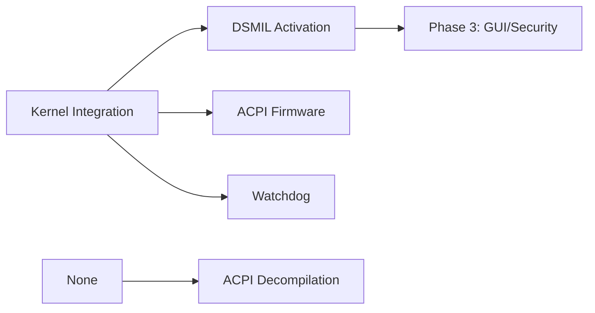

# 🔧 Phase 2: Feature Implementation Plans

## 🧭 **WHERE AM I?**
You are in: `/00-documentation/01-planning/phase-2-features/` - Feature plans (Weeks 3-4)

## 🏠 **NAVIGATION**
```bash
# Back to planning root
cd ..

# Back to project root
cd ../../..
# or
cd /opt/scripts/milspec/
```

## 🗺️ **QUICK ACCESS**
- Master Guide: `../../../MASTER-NAVIGATION.md`
- Execution Flow: `../../../EXECUTION-FLOW.md`
- Previous Phase: `../phase-1-core/`
- Next Phase: `../phase-3-integration/`

## 📋 **PLANS IN THIS PHASE**

### **All Require Kernel Integration First!**

#### 1. **DSMIL-ACTIVATION-PLAN.md** 🔴 CRITICAL PATH
- **Duration**: 2 weeks
- **Agent**: Kernel Developer
- **Priority**: HIGHEST - Everything else needs this
- **Output**: 12 DSMIL devices activated
- **Dependencies**: Kernel Integration complete

#### 2. **ACPI-FIRMWARE-PLAN.md** 🟡
- **Duration**: 2 weeks
- **Agent**: Kernel Developer
- **Priority**: High - Hardware methods
- **Output**: ACPI integration, firmware control
- **Can run parallel with**: DSMIL, Watchdog

#### 3. **WATCHDOG-PLAN.md** 🟢
- **Duration**: 1 week
- **Agent**: DevOps Engineer
- **Priority**: Medium - System monitoring
- **Output**: Hardware watchdog support
- **Can run parallel with**: DSMIL, ACPI

#### 4. **ACPI-DECOMPILATION-PLAN.md** 🟢
- **Duration**: 1 week
- **Agent**: Security Specialist
- **Priority**: Low - Analysis task
- **Output**: ACPI method documentation
- **Dependencies**: None (can start anytime)

## 🚀 **PHASE 2 EXECUTION STRATEGY**

### **Parallel Tracks**
```yaml
Track A (Critical):
  Agent: Kernel Developer
  Plan: DSMIL-ACTIVATION-PLAN.md
  Duration: 2 weeks
  
Track B (Important):
  Agent: Kernel Developer (same agent, multitasking)
  Plan: ACPI-FIRMWARE-PLAN.md
  Duration: 2 weeks
  
Track C (Independent):
  Agent: DevOps Engineer
  Plan: WATCHDOG-PLAN.md
  Duration: 1 week
```

### **Timing**
- **Start**: After Kernel Integration complete (Week 3)
- **Critical**: DSMIL must complete for Phase 3
- **Parallel**: 3 plans can run simultaneously
- **End**: Week 4 complete

## 📊 **PHASE 2 DEPENDENCIES**



## 🎯 **QUICK COMMANDS**

```bash
# View DSMIL plan details
head -100 DSMIL-ACTIVATION-PLAN.md

# Check all plan summaries
grep -A10 "## Executive Summary" *.md

# Find implementation details
grep -A20 "## Implementation" *.md
```

## ⚡ **CRITICAL SUCCESS FACTORS**

1. **DSMIL Activation** is the critical path
2. **12 devices** must all activate successfully
3. **ACPI methods** enable advanced features
4. **Watchdog** provides system stability
5. **Decompilation** reveals hidden functionality

## 🔗 **KEY RESOURCES**

- **Kernel Source**: `../../../../01-source/kernel-driver/`
- **Hardware Specs**: `../../../02-analysis/hardware/`
- **Previous Work**: `../phase-1-core/KERNEL-INTEGRATION-PLAN.md`
- **Next Phase**: `../phase-3-integration/`

## 📝 **PHASE 2 CHECKLIST**

- [ ] Kernel integration verified working
- [ ] DSMIL plan started immediately
- [ ] ACPI work running in parallel
- [ ] Watchdog assigned to DevOps
- [ ] All 12 DSMIL devices activated
- [ ] ACPI methods documented
- [ ] Watchdog tested
- [ ] Ready for Phase 3

---
**Next**: When DSMIL completes → `cd ../phase-3-integration/`