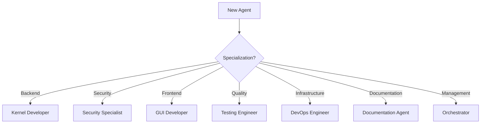

# 🤖 AI Framework Directory - Agent Development Hub

## 🧭 **WHERE AM I?**
You are in: `/00-documentation/03-ai-framework/` - AI agent coordination and strategies

## 🏠 **NAVIGATION**
```bash
# Back to documentation
cd ..

# Back to project root
cd ../..
# or
cd /opt/scripts/milspec/
```

## 🗺️ **ESSENTIAL NAVIGATION**
- Master Guide: `../../MASTER-NAVIGATION.md`
- Execution Flow: `../../EXECUTION-FLOW.md`
- Parallel Guide: `../00-indexes/ASYNC-PARALLEL-GUIDE.md`

## 📁 **AI FRAMEWORK STRUCTURE**

### **agent-types/** - Agent Specialization Guides
```yaml
To be created:
- kernel-developer.md      # Agent 1 specialization
- security-specialist.md   # Agent 2 specialization
- gui-developer.md        # Agent 3 specialization
- testing-engineer.md     # Agent 4 specialization
- devops-engineer.md      # Agent 5 specialization
- documentation.md        # Agent 6 specialization
- orchestrator.md         # Agent 7 specialization
START-HERE.md             # New agent onboarding
```

### **coordination/** - Multi-Agent Patterns
```yaml
AGENT-ROLES-MATRIX.md     # Role assignments & responsibilities
To be created:
- communication-patterns.md # Inter-agent communication
- sync-points.md          # Coordination checkpoints
- conflict-resolution.md  # Resource conflict handling
```

### **strategies/** - Implementation Strategies
```yaml
AGENTIC-DEVELOPMENT-PLAN.md        # 7-agent architecture (5,280 hours)
AGENTIC-DEEP-DIVE.md              # Detailed agent capabilities
AGENT-IMPLEMENTATION-STRATEGIES.md # Code generation patterns
AI-AGENT-ENTRY-POINT.md           # Agent onboarding guide
ASYNC-AGENT-DEVELOPMENT-PLAN.md   # Global 24/7 development
CLAUDE-DEVELOPMENT-OPTIMIZED.md   # Claude-specific optimization
AI-ACCELERATED-TIMELINE.md        # 6-week implementation
```

### **scaling/** - Agent Scaling Analysis
```yaml
Located in: ../00-indexes/agent-scaling/
- 1000-agent-analysis.md   # Mathematical scaling proof
- 500-agent-analysis.md    # Mid-scale deployment
- task-division.md         # Work distribution
```

## 🚀 **AI AGENT QUICK START**

### **Step 1: Choose Your Agent Type**


### **Step 2: Read Core Documents**
1. `strategies/AI-AGENT-ENTRY-POINT.md` - Onboarding
2. `strategies/AGENTIC-DEVELOPMENT-PLAN.md` - Architecture
3. `coordination/AGENT-ROLES-MATRIX.md` - Your role

### **Step 3: Find Your Plans**
```bash
# Kernel Developer
ls ../../01-planning/phase-1-core/

# Security Specialist
grep -l "security\|crypto" ../../01-planning/*/*.md

# GUI Developer
cat ../../01-planning/phase-3-integration/COMPREHENSIVE-GUI-PLAN.md
```

## 📊 **AGENT WORKLOAD DISTRIBUTION**

```yaml
Total Hours: 5,280 over 6 weeks
Agents: 7 specialized AI agents

Distribution:
- Agent 1 (Kernel): 880 hours, 5 plans
- Agent 2 (Security): 800 hours, 5 plans
- Agent 3 (GUI): 600 hours, 1 major plan
- Agent 4 (Testing): 880 hours, continuous
- Agent 5 (DevOps): 720 hours, 2 plans + infra
- Agent 6 (Docs): 600 hours, continuous
- Agent 7 (Orchestrator): 800 hours, coordination
```

## 🎯 **KEY STRATEGIES**

### **Parallel Execution**
- Check `../00-indexes/ASYNC-PARALLEL-GUIDE.md`
- Up to 5 parallel tracks possible
- No conflicts between different agents

### **Communication Patterns**
```yaml
Daily Sync: All agents report progress
Code Review: Before any merge
Conflict Resolution: Orchestrator decides
Documentation: Continuous updates
```

### **Quality Gates**
- Every feature needs tests
- Documentation before merge
- Security review for critical paths
- Performance benchmarks

## 🔗 **CRITICAL RESOURCES**

- **Implementation Plans**: `../01-planning/`
- **Source Code**: `../../../01-source/`
- **Progress Tracking**: `../04-progress/`
- **Parallel Guide**: `../00-indexes/ASYNC-PARALLEL-GUIDE.md`

## ⚡ **AGENT COORDINATION POINTS**

### **Week 2 Sync**
- Kernel integration complete
- All agents align on APIs

### **Week 4 Sync**
- DSMIL activation complete
- Feature integration begins

### **Week 6 Sync**
- All features complete
- Final integration phase

## 📝 **BEST PRACTICES**

1. **Daily Updates**: Update progress in `../04-progress/`
2. **Clear Communication**: Use coordination patterns
3. **Parallel Work**: Check dependencies first
4. **Quality First**: Test everything
5. **Document Always**: Keep docs current

---
**Remember**: 7 agents working in parallel can achieve in 6 weeks what would take 16 weeks sequentially!