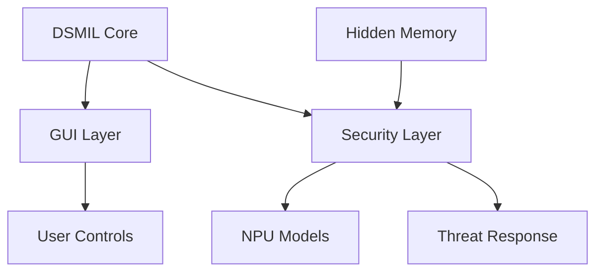

# 🎨 Phase 3: System Integration Plans

## 🧭 **WHERE AM I?**
You are in: `/00-documentation/01-planning/phase-3-integration/` - Integration plans (Week 5)

## 🏠 **NAVIGATION**
```bash
# Back to planning root
cd ..

# Back to project root
cd ../../..
# or
cd /opt/scripts/milspec/
```

## 🗺️ **QUICK ACCESS**
- Master Guide: `../../../MASTER-NAVIGATION.md`
- Execution Flow: `../../../EXECUTION-FLOW.md`
- Previous Phase: `../phase-2-features/`
- Next Phase: `../phase-4-deployment/`

## 📋 **PLANS IN THIS PHASE**

### **All Require DSMIL Activation Complete!**

#### 1. **COMPREHENSIVE-GUI-PLAN.md** 🔴 CRITICAL PATH
- **Duration**: 1.5 weeks (with AI)
- **Agent**: GUI Developer (Agent 3)
- **Priority**: HIGHEST - User interface
- **Output**: Complete desktop + mobile GUI
- **Special**: Largest single plan

#### 2. **ADVANCED-SECURITY-PLAN.md** 🟡
- **Duration**: 1 week (with AI)
- **Agent**: Security Specialist
- **Priority**: High - NPU threat detection
- **Dependencies**: DSMIL + Hidden Memory
- **Output**: AI-powered security

#### 3. **JRTC1-ACTIVATION-PLAN.md** 🟡
- **Duration**: 1 week (with AI)
- **Agent**: Security Specialist
- **Priority**: High - Training mode
- **Output**: Junior Reserve Officers' Training Corps features

#### 4. **FORMAL-VERIFICATION-PLAN.md** 🟢
- **Duration**: 2 weeks
- **Agent**: Testing Engineer
- **Priority**: Important - Security proofs
- **Output**: Mathematical verification

#### 5. **HARDWARE-VALIDATION-PLAN.md** 🟢
- **Duration**: 1 week
- **Agent**: Testing Engineer
- **Priority**: Medium - Physical testing
- **Output**: Hardware test results

## 🚀 **PHASE 3 EXECUTION STRATEGY**

### **Maximum Parallelization**
```yaml
All 5 plans can run simultaneously!

Track A (GUI):
  Agent: GUI Developer
  Focus: User interface
  Duration: 1.5 weeks
  
Track B (Security):
  Agent: Security Specialist
  Plans: ADVANCED-SECURITY + JRTC1
  Duration: 1 week each
  
Track C (Testing):
  Agent: Testing Engineer
  Plans: FORMAL-VERIFICATION + HARDWARE-VALIDATION
  Duration: 2 weeks total
```

## 📊 **PHASE 3 FEATURES**

### **GUI Components**
```yaml
Desktop Application:
- System tray indicator
- Control panel (tabbed)
- Real-time monitoring
- JRTC1 training interface

Mobile Companion:
- Android/iOS apps
- Remote monitoring
- Security alerts
- Basic controls
```

### **Security Features**
```yaml
NPU Integration:
- 1.8GB hidden memory
- AI threat models
- <10ms inference
- Real-time detection

JRTC1 Mode:
- Training scenarios
- Safe mode operation
- Instructor controls
- Progress tracking
```

## 🎯 **INTEGRATION POINTS**



## ⚡ **PHASE 3 DELIVERABLES**

### **User Interface**
- GTK4 desktop application
- Qt6 alternative version
- React Native mobile apps
- Web-based dashboard

### **Security System**
- NPU threat detection active
- JRTC1 training mode ready
- Formal proofs complete
- Hardware validated

## 🔗 **CRITICAL RESOURCES**

- **DSMIL Status**: `../phase-2-features/DSMIL-ACTIVATION-PLAN.md`
- **Hidden Memory**: `../phase-1-core/HIDDEN-MEMORY-PLAN.md`
- **GUI Mockups**: `../../../05-assets/diagrams/`
- **Security Models**: `../../../03-security/verification/`

## 📝 **PHASE 3 CHECKLIST**

### **Pre-Integration**
- [ ] DSMIL fully activated (12 devices)
- [ ] Hidden memory accessible
- [ ] NPU drivers working
- [ ] Test framework ready

### **Integration Tasks**
- [ ] GUI framework chosen
- [ ] Security models loaded
- [ ] JRTC1 mode implemented
- [ ] Verification started
- [ ] Hardware tests running

### **Deliverables**
- [ ] Desktop GUI complete
- [ ] Mobile apps functional
- [ ] Security active
- [ ] Tests passing
- [ ] Proofs verified

## 🏁 **EXIT CRITERIA**

Phase 3 complete when:
1. GUI fully functional
2. Security features active
3. JRTC1 mode working
4. All tests passing
5. Verification complete

---
**Next**: All features ready → `cd ../phase-4-deployment/`