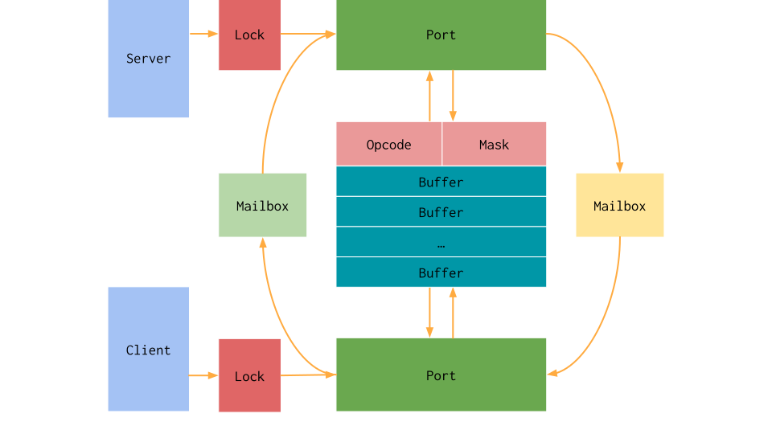

.. _libc_gpu_rpc:

======================
Remote Procedure Calls
======================

.. contents:: Table of Contents
  :depth: 4
  :local:

Remote Procedure Call Implementation
====================================

Traditionally, the C library abstracts over several functions that interface
with the platform's operating system through system calls. The GPU however does
not provide an operating system that can handle target dependent operations.
Instead, we implemented remote procedure calls to interface with the host's
operating system while executing on a GPU.

We implemented remote procedure calls using unified virtual memory to create a
shared communicate channel between the two processes. This memory is often
pinned memory that can be accessed asynchronously and atomically by multiple
processes simultaneously. This supports means that we can simply provide mutual
exclusion on a shared better to swap work back and forth between the host system
and the GPU. We can then use this to create a simple client-server protocol
using this shared memory.

This work treats the GPU as a client and the host as a server. The client
initiates a communication while the server listens for them. In order to
communicate between the host and the device, we simply maintain a buffer of
memory and two mailboxes. One mailbox is write-only while the other is
read-only. This exposes three primitive operations: using the buffer, giving
away ownership, and waiting for ownership. This is implemented as a half-duplex
transmission channel between the two sides. We decided to assign ownership of
the buffer to the client when the inbox and outbox bits are equal and to the
server when they are not.

In order to make this transmission channel thread-safe, we abstract ownership of
the given mailbox pair and buffer around a port, effectively acting as a lock
and an index into the allocated buffer slice. The server and device have
independent locks around the given port. In this scheme, the buffer can be used
to communicate intent and data generically with the server. We them simply
provide multiple copies of this protocol and expose them as multiple ports.

If this were simply a standard CPU system, this would be sufficient. However,
GPUs have my unique architectural challenges. First, GPU threads execute in
lock-step with each other in groups typically called warps or wavefronts. We
need to target the smallest unit of independent parallelism, so the RPC
interface needs to handle an entire group of threads at once. This is done by
increasing the size of the buffer and adding a thread mask argument so the
server knows which threads are active when it handles the communication. Second,
GPUs generally have no forward progress guarantees. In order to guarantee we do
not encounter deadlocks while executing it is required that the number of ports
matches the maximum amount of hardware parallelism on the device. It is also
very important that the thread mask remains consistent while interfacing with
the port.

The above diagram outlines the architecture of the RPC interface. For clarity
the following list will explain the operations done by the client and server
respectively when initiating a communication.

First, a communication from the perspective of the client:

* The client searches for an available port and claims the lock.
* The client checks that the port is still available to the current device and
  continues if so.
* The client writes its data to the fixed-size packet and toggles its outbox.
* The client waits until its inbox matches its outbox.
* The client reads the data from the fixed-size packet.
* The client closes the port and continues executing.

Now, the same communication from the perspective of the server:

* The server searches for an available port with pending work and claims the
  lock.
* The server checks that the port is still available to the current device.
* The server reads the opcode to perform the expected operation, in this
  case a receive and then send.
* The server reads the data from the fixed-size packet.
* The server writes its data to the fixed-size packet and toggles its outbox.
* The server closes the port and continues searching for ports that need to be
  serviced

This architecture currently requires that the host periodically checks the RPC
server's buffer for ports with pending work. Note that a port can be closed
without waiting for its submitted work to be completed. This allows us to model
asynchronous operations that do not need to wait until the server has completed
them. If an operation requires more data than the fixed size buffer, we simply
send multiple packets back and forth in a streaming fashion.

Server Library
--------------

The RPC server's basic functionality is provided by the LLVM C library. A static
library called ``libllvmlibc_rpc_server.a`` includes handling for the basic
operations, such as printing or exiting. This has a small API that handles
setting up the unified buffer and an interface to check the opcodes.

Some operations are too divergent to provide generic implementations for, such
as allocating device accessible memory. For these cases, we provide a callback
registration scheme to add a custom handler for any given opcode through the
port API. More information can be found in the installed header
``<install>/include/llvmlibc_rpc_server.h``.

Client Example
--------------

The Client API is not currently exported by the LLVM C library. This is
primarily due to being written in C++ and relying on internal data structures.
It uses a simple send and receive interface with a fixed-size packet. The
following example uses the RPC interface to call a function pointer on the
server.

This code first opens a port with the given opcode to facilitate the
communication. It then copies over the argument struct to the server using the
``send_n`` interface to stream arbitrary bytes. The next send operation provides
the server with the function pointer that will be executed. The final receive
operation is a no-op and simply forces the client to wait until the server is
done. It can be omitted if asynchronous execution is desired.

.. code-block:: c++

  void rpc_host_call(void *fn, void *data, size_t size) {
    rpc::Client::Port port = rpc::client.open<RPC_HOST_CALL>();
    port.send_n(data, size);
    port.send([=](rpc::Buffer *buffer) {
      buffer->data[0] = reinterpret_cast<uintptr_t>(fn);
    });
    port.recv( {});
    port.close();
  }

Server Example
--------------

This example shows the server-side handling of the previous client example. When
the server is checked, if there are any ports with pending work it will check
the opcode and perform the appropriate action. In this case, the action is to
call a function pointer provided by the client.

In this example, the server simply runs forever in a separate thread for
brevity's sake. Because the client is a GPU potentially handling several threads
at once, the server needs to loop over all the active threads on the GPU. We
abstract this into the ``lane_size`` variable, which is simply the device's warp
or wavefront size. The identifier is simply the threads index into the current
warp or wavefront. We allocate memory to copy the struct data into, and then
call the given function pointer with that copied data. The final send simply
signals completion and uses the implicit thread mask to delete the temporary
data.

.. code-block:: c++

  for(;;) {
    auto port = server.try_open(index);
    if (!port)
      return continue;

    switch(port->get_opcode()) {
    case RPC_HOST_CALL: {
      uint64_t sizes[LANE_SIZE];
      void *args[LANE_SIZE];
      port->recv_n(args, sizes, [&](uint64_t size) { return new char[size]; });
      port->recv([&](rpc::Buffer *buffer, uint32_t id) {
        reinterpret_cast<void (*)(void *)>(buffer->data[0])(args[id]);
      });
      port->send([&](rpc::Buffer *, uint32_t id) {
        delete[] reinterpret_cast<uint8_t *>(args[id]);
      });
      break;
    }
    default:
      port->recv( {});
      break;
    }
  }

CUDA Server Example
-------------------

The following code shows an example of using the exported RPC interface along
with the C library to manually configure a working server using the CUDA
language. Other runtimes can use the presence of the ``__llvm_libc_rpc_client``
in the GPU executable as an indicator for whether or not the server can be
checked. These details should ideally be handled by the GPU language runtime,
but the following example shows how it can be used by a standard user.

.. _libc_gpu_cuda_server:

.. code-block:: cuda

  #include <cstdio>
  #include <cstdlib>
  #include <cuda_runtime.h>

  #include <llvmlibc_rpc_server.h>

  [[noreturn]] void handle_error(cudaError_t err) {
    fprintf(stderr, "CUDA error: %s\n", cudaGetErrorString(err));
    exit(EXIT_FAILURE);
  }

  [[noreturn]] void handle_error(rpc_status_t err) {
    fprintf(stderr, "RPC error: %d\n", err);
    exit(EXIT_FAILURE);
  }

  // The handle to the RPC client provided by the C library.
  extern "C" __device__ void *__llvm_libc_rpc_client;

  __global__ void get_client_ptr(void **ptr) { *ptr = __llvm_libc_rpc_client; }

  // Obtain the RPC client's handle from the device. The CUDA language cannot look
  // up the symbol directly like the driver API, so we launch a kernel to read it.
  void *get_rpc_client() {
    void *rpc_client = nullptr;
    void **rpc_client_d = nullptr;

    if (cudaError_t err = cudaMalloc(&rpc_client_d, sizeof(void *)))
      handle_error(err);
    get_client_ptr<<<1, 1>>>(rpc_client_d);
    if (cudaError_t err = cudaDeviceSynchronize())
      handle_error(err);
    if (cudaError_t err = cudaMemcpy(&rpc_client, rpc_client_d, sizeof(void *),
                                     cudaMemcpyDeviceToHost))
      handle_error(err);
    return rpc_client;
  }

  // Routines to allocate mapped memory that both the host and the device can
  // access asychonrously to communicate with eachother.
  void *alloc_host(size_t size, void *) {
    void *sharable_ptr;
    if (cudaError_t err = cudaMallocHost(&sharable_ptr, sizeof(void *)))
      handle_error(err);
    return sharable_ptr;
  };

  void free_host(void *ptr, void *) {
    if (cudaError_t err = cudaFreeHost(ptr))
      handle_error(err);
  }

  // The device-side overload of the standard C function to call.
  extern "C" __device__ int puts(const char *);

  // Calls the C library function from the GPU C library.
  __global__ void hello() { puts("Hello world!"); }

  int main() {
    // Initialize the RPC server to run on the given device.
    rpc_device_t device;
    if (rpc_status_t err =
            rpc_server_init(&device, RPC_MAXIMUM_PORT_COUNT,
                            /*warp_size=*/32, alloc_host, /*data=*/nullptr))
      handle_error(err);

    // Initialize the RPC client by copying the buffer to the device's handle.
    void *rpc_client = get_rpc_client();
    if (cudaError_t err =
            cudaMemcpy(rpc_client, rpc_get_client_buffer(device),
                       rpc_get_client_size(), cudaMemcpyHostToDevice))
      handle_error(err);

    cudaStream_t stream;
    if (cudaError_t err = cudaStreamCreate(&stream))
      handle_error(err);

    // Execute the kernel.
    hello<<<1, 1, 0, stream>>>();

    // While the kernel is executing, check the RPC server for work to do.
    // Requires non-blocking CUDA kernels but avoids a separate thread.
    while (cudaStreamQuery(stream) == cudaErrorNotReady)
      if (rpc_status_t err = rpc_handle_server(device))
        handle_error(err);

    // Shut down the server running on the given device.
    if (rpc_status_t err =
            rpc_server_shutdown(device, free_host, /*data=*/nullptr))
      handle_error(err);

    return EXIT_SUCCESS;
  }

The above code must be compiled in CUDA's relocatable device code mode and with
the advanced offloading driver to link in the library. Currently this can be
done with the following invocation. Using LTO avoids the overhead normally
associated with relocatable device code linking.

.. code-block:: sh

  $> clang++ -x cuda rpc.cpp --offload-arch=native -fgpu-rdc -lcudart -lcgpu-nvptx \
       -I<install-path>include -L<install-path>/lib -lllvmlibc_rpc_server \
       -O3 -foffload-lto -o hello
  $> ./hello
  Hello world!

Extensions
----------

We describe which operation the RPC server should take with a 16-bit opcode. We
consider the first 32768 numbers to be reserved while the others are free to
use.
