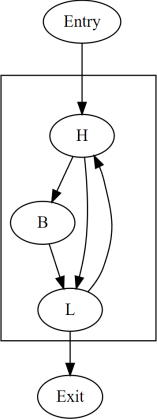
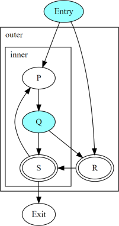
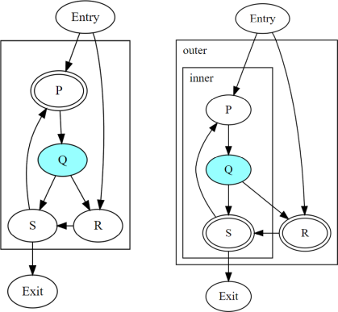
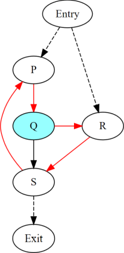
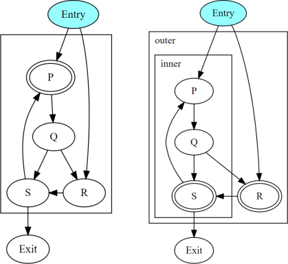

.. _convergence-and-uniformity:

==========================
Convergence And Uniformity
==========================

.. contents::
   :local:

Introduction
============

In some environments, groups of threads execute the same program in parallel,
where efficient communication within a group is established using special
primitives called :ref:`convergent operations<convergent_operations>`. The
outcome of a convergent operation is sensitive to the set of threads that
participate in it.

The intuitive picture of *convergence* is built around threads executing in
"lock step" --- a set of threads is thought of as *converged* if they are all
executing "the same sequence of instructions together". Such threads may
*diverge* at a *divergent branch*, and they may later *reconverge* at some
common program point.

In this intuitive picture, when converged threads execute an instruction, the
resulting value is said to be *uniform* if it is the same in those threads, and
*divergent* otherwise. Correspondingly, a branch is said to be a uniform branch
if its condition is uniform, and it is a divergent branch otherwise.

But the assumption of lock-step execution is not necessary for describing
communication at convergent operations. It also constrains the implementation
(compiler as well as hardware) by overspecifying how threads execute in such a
parallel environment. To eliminate this assumption:

- We define convergence as a relation between the execution of each instruction
  by different threads and not as a relation between the threads themselves.
  This definition is reasonable for known targets and is compatible with the
  semantics of :ref:`convergent operations<convergent_operations>` in LLVM IR.
- We also define uniformity in terms of this convergence. The output of an
  instruction can be examined for uniformity across multiple threads only if the
  corresponding executions of that instruction are converged.

This document describes a static analysis for determining convergence at each
instruction in a function. The analysis extends previous work on divergence
analysis [DivergenceSPMD]_ to cover irreducible control-flow. The described
analysis is used in LLVM to implement a UniformityAnalysis that determines the
uniformity of value(s) computed at each instruction in an LLVM IR or MIR
function.

.. [DivergenceSPMD] Julian Rosemann, Simon Moll, and Sebastian
   Hack. 2021. An Abstract Interpretation for SPMD Divergence on
   Reducible Control Flow Graphs. Proc. ACM Program. Lang. 5, POPL,
   Article 31 (January 2021), 35 pages.
   https://doi.org/10.1145/3434312

Motivation
==========

Divergent branches constrain
program transforms such as changing the CFG or moving a convergent
operation to a different point of the CFG. Performing these
transformations across a divergent branch can change the sets of
threads that execute convergent operations convergently. While these
constraints are out of scope for this document,
uniformity analysis allows these transformations to identify
uniform branches where these constraints do not hold.

Uniformity is also useful by itself on targets that execute threads in
groups with shared execution resources (e.g. waves, warps, or
subgroups):

- Uniform outputs can potentially be computed or stored on shared
  resources.
- These targets must "linearize" a divergent branch to ensure that
  each side of the branch is followed by the corresponding threads in
  the same group. But linearization is unnecessary at uniform
  branches, since the whole group of threads follows either one side
  of the branch or the other.

Terminology
===========

Cycles
   Described in :ref:`cycle-terminology`.

Closed path
   Described in :ref:`cycle-closed-path`.

Disjoint paths
   Two paths in a CFG are said to be disjoint if the only nodes common
   to both are the start node or the end node, or both.

Join node
   A join node of a branch is a node reachable along disjoint paths
   starting from that branch.

Diverged path
   A diverged path is a path that starts from a divergent branch and
   either reaches a join node of the branch or reaches the end of the
   function without passing through any join node of the branch.

.. _convergence-dynamic-instances:

Threads and Dynamic Instances
=============================

Each occurrence of an instruction in the program source is called a
*static instance*. When a thread executes a program, each execution of
a static instance produces a distinct *dynamic instance* of that
instruction.

Each thread produces a unique sequence of dynamic instances:

- The sequence is generated along branch decisions and loop
  traversals.
- Starts with a dynamic instance of a "first" instruction.
- Continues with dynamic instances of successive "next"
  instructions.

Threads are independent; some targets may choose to execute them in
groups in order to share resources when possible.

.. table::
   :name: convergence-thread-example
   :align: left

   +----------+--------+-----+-----+-----+-----+-----+-----+-----+-----+-----+------+
   |          |        | 1   | 2   | 3   | 4   | 5   | 6   | 7   | 8   | 9   |      |
   +----------+--------+-----+-----+-----+-----+-----+-----+-----+-----+-----+------+
   | Thread 1 | Entry1 | H1  | B1  | L1  | H3  |     | L3  |     |     |     | Exit |
   +----------+--------+-----+-----+-----+-----+-----+-----+-----+-----+-----+------+
   | Thread 2 | Entry1 | H2  |     | L2  | H4  | B2  | L4  | H5  | B3  | L5  | Exit |
   +----------+--------+-----+-----+-----+-----+-----+-----+-----+-----+-----+------+

In the above table, each row is a different thread, listing the
dynamic instances produced by that thread from left to right. Each
thread executes the same program that starts with an ``Entry`` node
and ends with an ``Exit`` node, but different threads may take
different paths through the control flow of the program. The columns
are numbered merely for convenience, and empty cells have no special
meaning. Dynamic instances listed in the same column are converged.

.. _convergence-definition:

Convergence
===========

*Convergence-before* is a strict partial order over dynamic instances
that is defined as the transitive closure of:

1. If dynamic instance ``P`` is executed strictly before ``Q`` in the
   same thread, then ``P`` is *convergence-before* ``Q``.
2. If dynamic instance ``P`` is executed strictly before ``Q1`` in the
   same thread, and ``Q1`` is *converged-with* ``Q2``, then ``P`` is
   *convergence-before* ``Q2``.
3. If dynamic instance ``P1`` is *converged-with* ``P2``, and ``P2``
   is executed strictly before ``Q`` in the same thread, then ``P1``
   is *convergence-before* ``Q``.

.. table::
   :name: convergence-order-example
   :align: left

   +----------+-------+-----+-----+-----+-----+-----+-----+-----+------+
   |          | 1     | 2   | 3   | 4   | 5   | 6   | 7   | 8   | 9    |
   +----------+-------+-----+-----+-----+-----+-----+-----+-----+------+
   | Thread 1 | Entry | ... |     |     |     | S2  | T   | ... | Exit |
   +----------+-------+-----+-----+-----+-----+-----+-----+-----+------+
   | Thread 2 | Entry | ... |     | Q2  | R   | S1  |     | ... | Exit |
   +----------+-------+-----+-----+-----+-----+-----+-----+-----+------+
   | Thread 3 | Entry | ... | P   | Q1  |     |     |     | ... |      |
   +----------+-------+-----+-----+-----+-----+-----+-----+-----+------+

The above table shows partial sequences of dynamic instances from
different threads. Dynamic instances in the same column are assumed
to be converged (i.e., related to each other in the converged-with
relation). The resulting convergence order includes the edges ``P ->
Q2``, ``Q1 -> R``, ``P -> R``, ``P -> T``, etc.

*Converged-with* is a transitive symmetric relation over dynamic instances
produced by *different threads* for the *same static instance*.

It is impractical to provide any one definition for the *converged-with*
relation, since different environments may wish to relate dynamic instances in
different ways. The fact that *convergence-before* is a strict partial order is
a constraint on the *converged-with* relation. It is trivially satisfied if
different dynamic instances are never converged. Below, we provide a relation
called :ref:`maximal converged-with<convergence-maximal>`, which satisifies
*convergence-before* and is suitable for known targets.

.. _convergence-note-convergence:

.. note::

   1. The convergence-before relation is not
      directly observable. Program transforms are in general free to
      change the order of instructions, even though that obviously
      changes the convergence-before relation.

   2. Converged dynamic instances need not be executed at the same
      time or even on the same resource. Converged dynamic instances
      of a convergent operation may appear to do so but that is an
      implementation detail.

   3. The fact that ``P`` is convergence-before
      ``Q`` does not automatically imply that ``P`` happens-before
      ``Q`` in a memory model sense.

.. _convergence-maximal:

Maximal Convergence
-------------------

This section defines a constraint that may be used to
produce a *maximal converged-with* relation without violating the
strict *convergence-before* order. This maximal converged-with
relation is reasonable for real targets and is compatible with
convergent operations.

The maximal converged-with relation is defined in terms of cycle
headers, with the assumption that threads converge at the header on every
"iteration" of the cycle. Informally, two threads execute the same iteration of
a cycle if they both previously executed the cycle header the same number of
times after they entered that cycle. In general, this needs to account for the
iterations of parent cycles as well.

   **Maximal converged-with:**

   Dynamic instances ``X1`` and ``X2`` produced by different threads
   for the same static instance ``X`` are converged in the maximal
   converged-with relation if and only if:

   - ``X`` is not contained in any cycle, or,
   - For every cycle ``C`` with header ``H`` that contains ``X``:

     - every dynamic instance ``H1`` of ``H`` that precedes ``X1`` in
       the respective thread is convergence-before ``X2``, and,
     - every dynamic instance ``H2`` of ``H`` that precedes ``X2`` in
       the respective thread is convergence-before ``X1``,
     - without assuming that ``X1`` is converged with ``X2``.

.. note::

   Cycle headers may not be unique to a given CFG if it is irreducible. Each
   cycle hierarchy for the same CFG results in a different maximal
   converged-with relation.

   For brevity, the rest of the document restricts the term
   *converged* to mean "related under the maximal converged-with
   relation for the given cycle hierarchy".

Maximal convergence can now be demonstrated in the earlier example as follows:

.. table::
   :align: left

   +----------+--------+-----+-----+-----+-----+-----+-----+-----+-----+-----+------+
   |          |        | 1   | 2   | 3   | 4   | 5   | 6   | 7   | 8   | 9   |      |
   +----------+--------+-----+-----+-----+-----+-----+-----+-----+-----+-----+------+
   | Thread 1 | Entry1 | H1  | B1  | L1  | H3  |     | L3  |     |     |     | Exit |
   +----------+--------+-----+-----+-----+-----+-----+-----+-----+-----+-----+------+
   | Thread 2 | Entry2 | H2  |     | L2  | H4  | B2  | L4  | H5  | B3  | L5  | Exit |
   +----------+--------+-----+-----+-----+-----+-----+-----+-----+-----+-----+------+

- ``Entry1`` and ``Entry2`` are converged.
- ``H1`` and ``H2`` are converged.
- ``B1`` and ``B2`` are not converged due to ``H4`` which is not
  convergence-before ``B1``.
- ``H3`` and ``H4`` are converged.
- ``H3`` is not converged with ``H5`` due to ``H4`` which is not
  convergence-before ``H3``.
- ``L1`` and ``L2`` are converged.
- ``L3`` and ``L4`` are converged.
- ``L3`` is not converged with ``L5`` due to ``H5`` which is not
  convergence-before ``L3``.

.. _convergence-cycle-headers:

Dependence on Cycles Headers
----------------------------

Contradictions in *convergence-before* are possible only between two
nodes that are inside some cycle. The dynamic instances of such nodes
may be interleaved in the same thread, and this interleaving may be
different for different threads. Cycle headers serve as implicit
*points of convergence* in the maximal converged-with relation.
When a thread executes a node ``X`` once and then executes it again,
it must have followed a closed path in the CFG that includes ``X``.
Such a path must pass through the header of at least one cycle --- the
smallest cycle that includes the entire closed path. In a given
thread, two dynamic instances of ``X`` are either separated by the
execution of at least one cycle header, or ``X`` itself is a cycle
header.

Consider a sequence of nested cycles ``C1``, ``C2``, ..., ``Ck`` such
that ``C1`` is the outermost cycle and ``Ck`` is the innermost cycle,
with headers ``H1``, ``H2``, ..., ``Hk`` respectively. When a thread
enters the cycle ``Ck``, any of the following is possible:

1. The thread directly entered cycle ``Ck`` without having executed
   any of the headers ``H1`` to ``Hk``.

2. The thread executed some or all of the nested headers one or more
   times.

The maximal converged-with relation captures the following intuition
about cycles:

1. When two threads enter a top-level cycle ``C1``, they execute
   converged dynamic instances of every node that is a :ref:`child
   <cycle-parent-block>` of ``C1``.

2. When two threads enter a nested cycle ``Ck``, they execute
   converged dynamic instances of every node that is a child of
   ``Ck``, until either thread exits ``Ck``, if and only if they
   executed converged dynamic instances of the last nested header that
   either thread encountered.

   Note that when a thread exits a nested cycle ``Ck``, it must follow
   a closed path outside ``Ck`` to reenter it. This requires executing
   the header of some outer cycle, as described earlier.

Consider two dynamic instances ``X1`` and ``X2`` produced by threads ``T1``
and ``T2`` for a node ``X`` that is a child of nested cycle ``Ck``.
Maximal convergence relates ``X1`` and ``X2`` as follows:

1. If neither thread executed any header from ``H1`` to ``Hk``, then
   ``X1`` and ``X2`` are converged.

2. Otherwise, if there are no converged dynamic instances ``Q1`` and
   ``Q2`` of any header ``Q`` from ``H1`` to ``Hk`` (where ``Q`` is
   possibly the same as ``X``), such that ``Q1`` precedes ``X1`` and
   ``Q2`` precedes ``X2`` in the respective threads, then ``X1`` and
   ``X2`` are not converged.

3. Otherwise, consider the pair ``Q1`` and ``Q2`` of converged dynamic
   instances of a header ``Q`` from ``H1`` to ``Hk`` that occur most
   recently before ``X1`` and ``X2`` in the respective threads. Then
   ``X1`` and ``X2`` are converged if and only if there is no dynamic
   instance of any header from ``H1`` to ``Hk`` that occurs between
   ``Q1`` and ``X1`` in thread ``T1``, or between ``Q2`` and ``X2`` in
   thread ``T2``. In other words, ``Q1`` and ``Q2`` represent the last
   point of convergence, with no other header being executed before
   executing ``X``.

**Example:**

The above figure shows two nested irreducible cycles with headers
``R`` and ``S``. The nodes ``Entry`` and ``Q`` have divergent
branches. The table below shows the convergence between three threads
taking different paths through the CFG. Dynamic instances listed in
the same column are converged.

   .. table::
      :align: left

      +---------+-------+-----+-----+-----+-----+-----+-----+-----+------+
      |         | 1     | 2   | 3   | 4   | 5   | 6   | 7   | 8   | 10   |
      +---------+-------+-----+-----+-----+-----+-----+-----+-----+------+
      | Thread1 | Entry | P1  | Q1  | S1  | P3  | Q3  | R1  | S2  | Exit |
      +---------+-------+-----+-----+-----+-----+-----+-----+-----+------+
      | Thread2 | Entry | P2  | Q2  |     |     |     | R2  | S3  | Exit |
      +---------+-------+-----+-----+-----+-----+-----+-----+-----+------+
      | Thread3 | Entry |     |     |     |     |     | R3  | S4  | Exit |
      +---------+-------+-----+-----+-----+-----+-----+-----+-----+------+

- ``P2`` and ``P3`` are not converged due to ``S1``
- ``Q2`` and ``Q3`` are not converged due to ``S1``
- ``S1`` and ``S3`` are not converged due to ``R2``
- ``S1`` and ``S4`` are not converged due to ``R3``

Informally, ``T1`` and ``T2`` execute the inner cycle a different
number of times, without executing the header of the outer cycle. All
threads converge in the outer cycle when they first execute the header
of the outer cycle.

.. _convergence-uniformity:

Uniformity
==========

1. The output of two converged dynamic instances is uniform if and
   only if it compares equal for those two dynamic instances.
2. The output of a static instance ``X`` is uniform *for a given set
   of threads* if and only if it is uniform for every pair of
   converged dynamic instances of ``X`` produced by those threads.

A non-uniform value is said to be *divergent*.

For a set ``S`` of threads, the uniformity of each output of a static
instance is determined as follows:

1. The semantics of the instruction may specify the output to be
   uniform.
2. Otherwise, the output is divergent if the static instance is not
   :ref:`m-converged <convergence-m-converged>`.
3. Otherwise, if the static instance is m-converged:

   1. If it is a PHI node, its output is uniform if and only
      if for every pair of converged dynamic instances produced by all
      threads in ``S``:

      a. Both instances choose the same output from converged
         dynamic instances, and,
      b. That output is uniform for all threads in ``S``.
   2. Otherwise, the output is uniform if and only if the input
      operands are uniform for all threads in ``S``.

Divergent Cycle Exits
---------------------

When a divergent branch occurs inside a cycle, it is possible that a
diverged path continues to an exit of the cycle. This is called a
divergent cycle exit. If the cycle is irreducible, the diverged path
may re-enter and eventually reach a join within the cycle. Such a join
should be examined for the :ref:`diverged entry
<convergence-diverged-entry>` criterion.

Nodes along the diverged path that lie outside the cycle experience
*temporal divergence*, when two threads executing convergently inside
the cycle produce uniform values, but exit the cycle along the same
divergent path after executing the header a different number of times
(informally, on different iterations of the cycle). For a node ``N``
inside the cycle the outputs may be uniform for the two threads, but
any use ``U`` outside the cycle receives a value from non-converged
dynamic instances of ``N``. An output of ``U`` may be divergent,
depending on the semantics of the instruction.

.. _uniformity-analysis:

Static Uniformity Analysis
==========================

Irreducible control flow results in different cycle hierarchies
depending on the choice of headers during depth-first traversal. As a
result, a static analysis cannot always determine the convergence of
nodes in irreducible cycles, and any uniformity analysis is limited to
those static instances whose convergence is independent of the cycle
hierarchy:

.. _convergence-m-converged:

  **m-converged static instances:**

  A static instance ``X`` is *m-converged* for a given CFG if and only
  if the maximal converged-with relation for its dynamic instances is
  the same in every cycle hierarchy that can be constructed for that CFG.

  .. note::

   In other words, two dynamic instances ``X1`` and ``X2`` of an
   m-converged static instance ``X`` are converged in some cycle
   hierarchy if and only if they are also converged in every other
   cycle hierarchy for the same CFG.

   As noted earlier, for brevity, we restrict the term *converged* to
   mean "related under the maximal converged-with relation for a given
   cycle hierarchy".

Each node ``X`` in a given CFG is reported to be m-converged if and
only if every cycle that contains ``X`` satisfies the following necessary
conditions:

  1. Every divergent branch inside the cycle satisfies the
     :ref:`diverged entry criterion<convergence-diverged-entry>`, and,
  2. There are no :ref:`diverged paths reaching the
     cycle<convergence-diverged-outside>` from a divergent branch
     outside it.

.. note::

   A reducible cycle :ref:`trivially satisfies
   <convergence-reducible-cycle>` the above conditions. In particular,
   if the whole CFG is reducible, then all nodes in the CFG are
   m-converged.

The uniformity of each output of a static instance
is determined using the criteria
:ref:`described earlier <convergence-uniformity>`. The discovery of
divergent outputs may cause their uses (including branches) to also
become divergent. The analysis propagates this divergence until a
fixed point is reached.

The convergence inferred using these criteria is a safe subset of the
maximal converged-with relation for any cycle hierarchy. In
particular, it is sufficient to determine if a static instance is
m-converged for a given cycle hierarchy ``T``, even if that fact is
not detected when examining some other cycle hierarchy ``T'``.

This property allows compiler transforms to use the uniformity
analysis without being affected by DFS choices made in the underlying
cycle analysis. When two transforms use different instances of the
uniformity analysis for the same CFG, a "divergent value" result in
one analysis instance cannot contradict a "uniform value" result in
the other.

Generic transforms such as SimplifyCFG, CSE, and loop transforms
commonly change the program in ways that change the maximal
converged-with relations. This also means that a value that was
previously uniform can become divergent after such a transform.
Uniformity has to be recomputed after such transforms.

Divergent Branch inside a Cycle
-------------------------------

The above figure shows a divergent branch ``Q`` inside an irreducible
cyclic region. When two threads diverge at ``Q``, the convergence of
dynamic instances within the cyclic region depends on the cycle
hierarchy chosen:

1. In an implementation that detects a single cycle ``C`` with header
   ``P``, convergence inside the cycle is determined by ``P``.

2. In an implementation that detects two nested cycles with headers
   ``R`` and ``S``, convergence inside those cycles is determined by
   their respective headers.

.. _convergence-diverged-entry:

A conservative approach would be to simply report all nodes inside
irreducible cycles as having divergent outputs. But it is desirable to
recognize m-converged nodes in the CFG in order to maximize
uniformity. This section describes one such pattern of nodes derived
from *closed paths*, which are a property of the CFG and do not depend
on the cycle hierarchy.

  **Diverged Entry Criterion:**

  The dynamic instances of all the nodes in a closed path ``P`` are
  m-converged only if for every divergent branch ``B`` and its
  join node ``J`` that lie on ``P``, there is no entry to ``P`` which
  lies on a diverged path from ``B`` to ``J``.

Consider the closed path ``P -> Q -> R -> S`` in the above figure.
``P`` and ``R`` are :ref:`entries to the closed
path<cycle-closed-path>`. ``Q`` is a divergent branch and ``S`` is a
join for that branch, with diverged paths ``Q -> R -> S`` and ``Q ->
S``.

- If a diverged entry ``R`` exists, then in some cycle hierarchy,
  ``R`` is the header of the smallest cycle ``C`` containing the
  closed path and a :ref:`child cycle<cycle-definition>` ``C'``
  exists in the set ``C - R``, containing both branch ``Q`` and join
  ``S``. When threads diverge at ``Q``, one subset ``M`` continues
  inside cycle ``C'``, while the complement ``N`` exits ``C'`` and
  reaches ``R``. Dynamic instances of ``S`` executed by threads in set
  ``M`` are not converged with those executed in set ``N`` due to the
  presence of ``R``. Informally, threads that diverge at ``Q``
  reconverge in the same iteration of the outer cycle ``C``, but they
  may have executed the inner cycle ``C'`` differently.

  .. table::
     :align: left

     +---------+-------+-----+-----+-----+-----+-----+-----+-----+-----+-----+------+
     |         | 1     | 2   | 3   | 4   | 5   | 6   | 7   | 8   | 9   | 10  | 11   |
     +---------+-------+-----+-----+-----+-----+-----+-----+-----+-----+-----+------+
     | Thread1 | Entry | P1  | Q1  |     |     |     | R1  | S1  | P3  | ... | Exit |
     +---------+-------+-----+-----+-----+-----+-----+-----+-----+-----+-----+------+
     | Thread2 | Entry | P2  | Q2  | S2  | P4  | Q4  | R2  | S4  |     |     | Exit |
     +---------+-------+-----+-----+-----+-----+-----+-----+-----+-----+-----+------+

  In the table above, ``S2`` is not converged with ``S1`` due to ``R1``.

|

- If ``R`` does not exist, or if any node other than ``R`` is the
  header of ``C``, then no such child cycle ``C'`` is detected.
  Threads that diverge at ``Q`` execute converged dynamic instances of
  ``S`` since they do not encounter the cycle header on any path from
  ``Q`` to ``S``. Informally, threads that diverge at ``Q``
  reconverge at ``S`` in the same iteration of ``C``.

  .. table::
     :align: left

     +---------+-------+-----+-----+-----+-----+-----+-----+-----+-----+------+
     |         | 1     | 2   | 3   | 4   | 5   | 6   | 7   | 8   | 9   | 10   |
     +---------+-------+-----+-----+-----+-----+-----+-----+-----+-----+------+
     | Thread1 | Entry | P1  | Q1  | R1  | S1  | P3  | Q3  | R3  | S3  | Exit |
     +---------+-------+-----+-----+-----+-----+-----+-----+-----+-----+------+
     | Thread2 | Entry | P2  | Q2  |     | S2  | P4  | Q4  | R2  | S4  | Exit |
     +---------+-------+-----+-----+-----+-----+-----+-----+-----+-----+------+

|

  .. note::

     In general, the cycle ``C`` in the above statements is not
     expected to be the same cycle for different headers. Cycles and
     their headers are tightly coupled; for different headers in the
     same outermost cycle, the child cycles detected may be different.
     The property relevant to the above examples is that for every
     closed path, there is a cycle ``C`` that contains the path and
     whose header is on that path.

The diverged entry criterion must be checked for every closed path
passing through a divergent branch ``B`` and its join ``J``. Since
:ref:`every closed path passes through the header of some
cycle<cycle-closed-path-header>`, this amounts to checking every cycle
``C`` that contains ``B`` and ``J``. When the header of ``C``
dominates the join ``J``, there can be no entry to any path from the
header to ``J``, which includes any diverged path from ``B`` to ``J``.
This is also true for any closed paths passing through the header of
an outer cycle that contains ``C``.

Thus, the diverged entry criterion can be conservatively simplified
as follows:

  For a divergent branch ``B`` and its join node ``J``, the nodes in a
  cycle ``C`` that contains both ``B`` and ``J`` are m-converged only
  if:

  - ``B`` strictly dominates ``J``, or,
  - The header ``H`` of ``C`` strictly dominates ``J``, or,
  - Recursively, there is cycle ``C'`` inside ``C`` that satisfies the
    same condition.

When ``J`` is the same as ``H`` or ``B``, the trivial dominance is
insufficient to make any statement about entries to diverged paths.

.. _convergence-diverged-outside:

Diverged Paths reaching a Cycle
-------------------------------

The figure shows two cycle hierarchies with a divergent branch in
``Entry`` instead of ``Q``. For two threads that enter the closed path
``P -> Q -> R -> S`` at ``P`` and ``R`` respectively, the convergence
of dynamic instances generated along the path depends on whether ``P``
or ``R`` is the header.

-  Convergence when ``P`` is the header.

   .. table::
      :align: left

      +---------+-------+-----+-----+-----+-----+-----+-----+-----+-----+-----+-----+-----+------+
      |         | 1     | 2   | 3   | 4   | 5   | 6   | 7   | 8   | 9   | 10  | 11  | 12  | 13   |
      +---------+-------+-----+-----+-----+-----+-----+-----+-----+-----+-----+-----+-----+------+
      | Thread1 | Entry |     |     |     | P1  | Q1  | R1  | S1  | P3  | Q3  |     | S3  | Exit |
      +---------+-------+-----+-----+-----+-----+-----+-----+-----+-----+-----+-----+-----+------+
      | Thread2 | Entry |     | R2  | S2  | P2  | Q2  |     | S2  | P4  | Q4  | R3  | S4  | Exit |
      +---------+-------+-----+-----+-----+-----+-----+-----+-----+-----+-----+-----+-----+------+

   |

-  Convergence when ``R`` is the header.

   .. table::
      :align: left

      +---------+-------+-----+-----+-----+-----+-----+-----+-----+-----+-----+-----+------+
      |         | 1     | 2   | 3   | 4   | 5   | 6   | 7   | 8   | 9   | 10  | 11  | 12   |
      +---------+-------+-----+-----+-----+-----+-----+-----+-----+-----+-----+-----+------+
      | Thread1 | Entry |     | P1  | Q1  | R1  | S1  | P3  | Q3  | S3  |     |     | Exit |
      +---------+-------+-----+-----+-----+-----+-----+-----+-----+-----+-----+-----+------+
      | Thread2 | Entry |     |     |     | R2  | S2  | P2  | Q2  | S2  | P4  | ... | Exit |
      +---------+-------+-----+-----+-----+-----+-----+-----+-----+-----+-----+-----+------+

   |

Thus, when diverged paths reach different entries of an irreducible
cycle from outside the cycle, the static analysis conservatively
reports every node in the cycle as not m-converged.

.. _convergence-reducible-cycle:

Reducible Cycle
---------------

If ``C`` is a reducible cycle with header ``H``, then in any DFS,
``H`` :ref:`must be the header of some cycle<cycle-reducible-headers>`
``C'`` that contains ``C``. Independent of the DFS, there is no entry
to the subgraph ``C`` other than ``H`` itself. Thus, we have the
following:

1. The diverged entry criterion is trivially satisfied for a divergent
   branch and its join, where both are inside subgraph ``C``.
2. When diverged paths reach the subgraph ``C`` from outside, their
   convergence is always determined by the same header ``H``.

Clearly, this can be determined only in a cycle hierarchy ``T`` where
``C`` is detected as a reducible cycle. No such conclusion can be made
in a different cycle hierarchy ``T'`` where ``C`` is part of a larger
cycle ``C'`` with the same header, but this does not contradict the
conclusion in ``T``.

Controlled Convergence
======================

:ref:`Convergence control tokens <dynamic_instances_and_convergence_tokens>`
provide an explicit semantics for determining which threads are converged at a
given point in the program. The impact of this is incorporated in a
:ref:`controlled maximal converged-with <controlled_maximal_converged_with>`
relation over dynamic instances and a :ref:`controlled m-converged
<controlled_m_converged>` property of static instances. The :ref:`uniformity
analysis <uniformity-analysis>` implemented in LLVM includes this for targets
that support convergence control tokens.

Preservation of Uniformity at Use
=================================

Introduction
------------

In execution of a program, the outputs produced by two converged dynamic
instances of a static instance are *uniform* if they compare equal; 
otherwise, *divergent*. In any given program, uniformity is determined 
through static analysis, which depends on the current state of the program’s 
control flow. During execution, a transformation may alter the original 
structure of the program, potentially leading to a change in control flow.

When a group of threads executes the same program in parallel, the program's 
control flow determines which subset of threads will execute any given static 
instance. With the change in control flow, it is possible that the new set of 
threads reaching a static instance includes some threads that did not previously 
execute it.

Although the original set of threads continues to execute the same static 
instance, the inclusion of these additional threads may change the 
classification. This means that during execution, a static instance marked 
as *uniform* by the analysis may be marked as *divergent* after a transformation
that changes the control flow of the original program.

However, our proof in this document demonstrates that this conservative 
classification does not impact the uniformity of "the original subset of threads"
that executed the static instance in the original program.

In this document, we have defined a set of observable :ref:`fundamental properties<convergence-valid-transform>`
in any program that are essential for a transformation to be considered valid. 
Building on these properties, our proof demonstrates that any valid 
transformation preserves "the uniformity of each value at its use". That is, for 
a given program *P* and a valid transformation *R* resulting in a transformed 
program *P'*, any assumptions about uniformity built into *P'* are preserved in
*P''*.

Concepts
--------

**Static instance**

Each occurrence of an instruction or a constant literal in the program source 
is called a *static instance*.

**Dynamic instance**

When a thread executes a program, each execution of a static instance produces 
a distinct *dynamic instance* of that instruction. The dynamic instance of
a constant literal is simply its value.

Both terms, *static instance* and *dynamic instance*, match the definitions 
used in the LLVM specification of  :ref:`convergence and uniformity<convergence-dynamic-instances>`.

.. _convergence-valid-transform:

Core Properties of a Valid Transformation
------------------------------------------

Let *P* denote the input program and *R* be any transformation applied to *P*,
resulting in the transformed program *P′ = R(P)*. Let *P* and *P′* be executed
under the same initial conditions by the set of threads *T*.

.. _convergence-VT-1:

Property VT.1: Correspondence of Static and Dynamic instances
^^^^^^^^^^^^^^^^^^^^^^^^^^^^^^^^^^^^^^^^^^^^^^^^^^^^^^^^^^^^^^

Let *X* be a set of static instances in program *P*, and *X′* be their 
corresponding static instances in the transformed program *P′*. Let *D(X)* 
denote the set of all dynamic instances of *X* during the execution of *P*.
Similarly, let *D′(X)* denote the set of all dynamic instances of *X′* 
during the execution of *P′*.

A valid transformation *R* maps a set of static instances *X* in *P* to a set
of corresponding static instances *X’* in *P’* such that:

- For each dynamic instance *d* in *D(X)*, if there is a set of corresponding
  dynamic instances in *P’*, then that set is in *D’(X)*.
- Every dynamic instance *d’* in *D’(X)* must correspond to one or more dynamic
  instances in *D(X)*.

Thus, the correspondence is **closed** between the dynamic instances produced by 
program *P* and program *P′* for the same input and the same set of threads.

**Example:**

Program P:

::

  C = ...
  E = ...
  A = B ? C : E   // B is constant true

- X: Static instance representing the ternary operator as *A*. 
- Dynamic instances of X in P will always evaluate *C*, because *B* is constant true. 

Thus: 

- Every dynamic instance d in D(X) computes the value of *C*. 

Transformed program P’:

::

  A = C

- The transformation R simplifies the ternary operator by eliminating the unused E, resulting in a direct assignment. 
- X’: Static instance representing A = C; in P’. 

After transformation, A and C in P both correspond to C in P’. 

Thus: 

- The static instance A in P corresponds to the static instance C in P’. 
- The set of dynamic instances D({A, C}) corresponds to the set D’(C). 

Thus, the transformation establishes a *close correspondence* between the set *D({A, C})* in program P and the set *D’(C)* in program P’. 

.. _convergence-VT-2:

Property VT.2: Correspondence of Use-def chain across Dynamic instances
^^^^^^^^^^^^^^^^^^^^^^^^^^^^^^^^^^^^^^^^^^^^^^^^^^^^^^^^^^^^^^^^^^^^^^^^

Let *X* and *Y* be any pair of static instances such that static instance *Y* uses the value defined by static instance *X*.

For any valid transformation *R* applied to *P*, each use-def pair of dynamic instances (*d’(X)*, *d’(Y)*) in the execution 
of *P’* has a corresponding use-def pair (*d(X)*, *d(Y)*) in the execution of program *P* such that:

- *d′(X)* corresponds to *d(X)*, and
- *d′(Y)* corresponds to *d(Y)*,
- and *d′(Y)* uses the value defined by *d′(X)*.

Thus, the correspondence is **closed** in use-def relationships between program *P* and program *P’*.

**Example:**

Program P:

::  

   A = ... 
   B = ...A  // B uses A. 
   C = ...B  // C uses B. 

Let's assume that *B* compute the same value as *A*. 

Transformed program P’: 

::

   A = ... 
   C = ...A  // C uses A. 

This a classical value forwarding optimization. 

- The static instance *A* in the transformed program corresponds to the set of static instances *{A, B}* in the original program. 
- The static instance *C* in the final program corresponds to the static instance *C* in the original program. 
- Similarly, the dynamic instances. 
- The use-def pair *{A, C}* in the transformed program corresponds to the use-def pair *{{A, B}, {B, C}}* in the original program. 
- The use-def pair *{A, B}* in the original program corresponds to *A* in the transformed program. 

.. _convergence-VT-3:

Property VT.3: Preserving statically known uniformity
^^^^^^^^^^^^^^^^^^^^^^^^^^^^^^^^^^^^^^^^^^^^^^^^^^^^^^

In any program P, certain static instances are known to be *uniform*, and this property
cannot be changed by a transformation. These sources of uniformity include: 

- Function arguments to a kernel are always uniform. 
- Constants are always Uniform. 
- The return value of a function call marked as `alwaysUniform` are always uniform. 

Likewise, some operations are statically known to be *divergent*, such as: 

- Atomics, which are always divergent. 
- The return value of a function call is always divergent, unless it is a
  call to a function that is marked `alwaysUniform`. 
- Function arguments to a non-kernel function are always divergent. 

If a static instance X is known to be *uniform*, then after the transform R,
its corresponding dynamic instances *d1’(X)* and *d2’(X)* must also be *uniform*. 

In particular: 

- A transformation may replace a *divergent* value with a *uniform* value, if possible. 
- However, a transformation must not replace a "statically uniform" value with a *divergent* one. 

**Example:**

Consider a program P where a convergent operation, such as `readfirstlane()`,
is marked as `alwaysUniform`. This operation is defined in a static instance
*A* and is used later in the program at some static instance *B*. 

Program P: 

::

   A = readfirstlane() // isAlwaysUniform, Convergent  
   B = A ...  

In program P, all dynamic instances of *A* are uniform across the threads that
execute it. This is because the operation is marked as `alwaysUniform` and is
convergent ensuring that the threads executing *A* compute the same value. 

Now, consider a transformation R that restructures the control flow by introducing
an `if-else` condition and duplicates the convergent operation within these branches
in the transformed program P': 

Transformed program P’: 

::

   if (divergent_cond)  
      A1 = readfirstlane()  
   else  
      A2 = readfirstlane()  
   A = phi(A1, A2)  
   B = ... A 

In this transformed program P’, the static instance *A* from P is now mapped
to a *phi node* that merges the values of *A1* and *A2* depending on the control path taken. 

Although `readfirstlane()` is convergent and `alwaysUniform` in each branch individually,
the phi node introduces a merge between divergent control paths which clearly
implies that the *phi node* is divergent. 

Thus, this transformation is **invalid** because transformation does not preserve
the *static uniformity* of the convergent operation marked as `alwaysUniform`. 

.. _convergence-statement-1:

Statement 1: Preservation of uniformity at value computation 
-------------------------------------------------------------

If the converged dynamic instances of a static instance are *uniform* across the set
of threads T in program P, then in the transformed program P’, the "corresponding
dynamic instances" must also be *uniform* across the same set of threads. 

**Proof** 

Let X be any static instance in the execution of program P. Let *d1(X)* and *d2(X)*
be converged dynamic instances of *X* in the threads t1 and t2. After transformation R,
from :ref:`VT.1<convergence-VT-1>`, let *d1’(X)*, *d2’(X)*, be the corresponding
dynamic instances in the program P’.   

**Base Case** 

After transformation R, if the static instance *X* is a source of statically
known uniformity (e.g., a constant, a uniform argument), then from :ref:`VT.3<convergence-VT-3>`,
its dynamic instances *d1’(X)*, *d2’(X)* in P’ must be *uniform*. 

**Inductive Step** 

For contradiction, assume that dynamic instances *d1’(X)*, *d2’(X)* in thread t1, t2
are not uniform in P’. This is possible only in two scenarios: 

Operand dependence: 

- If *d1’(X)* and *d2’(X)* are not uniform, then one or more operands of *X* must
  have become *divergent* as a result of the transform R. 
- For each operand *O*, we can replace *X* with *O* as the new def and inductively
  apply the same reasoning until we reach a "source of statically known uniformity". 

Control dependence: 

- If the output differs even for "uniform operands", then the execution of static
  instance *X* depends on threads reaching it, which is only relevant if *X* is a `convergent operation`.  
- If X is not marked as `convergent`, then the program itself is *invalid*.
- If it is marked as `convergent`, then a valid transformation R must *preserve*
  the set of threads that executed the convergent operation. 

Therefore, for the original static instance *X*, dynamic instances *d1’(X)* and *d2’(X)* must be *uniform*. 

.. _convergence-statement-2:

Statement 2: Preservation of Uniformity at Use  
-----------------------------------------------

If the converged dynamic instances of a static instance are uniform at their use across
the set of threads T in program P, then in the transformed program P′, the "corresponding
dynamic instances must also be uniform at their use" for the same set of threads. 

**Proof** 

Let *X* and *Y* be two static instances in P, such that *Y* uses *X*. Let *d1(X)* and *d2(X)* be
converged dynamic instances of *X* in threads t1 and t2, and similarly *d1(Y)* and *d2(Y)*.
After transformation, let *d1’(X)*, *d2’(X)*, etc be the corresponding dynamic instances of *X* in P’.  

- Using :ref:`Property VT.2<convergence-VT-2>`, since dynamic instance *d1(Y)* uses *d1(X)*, there exists a
  "corresponding use-def pair" such that, dynamic instance *d1’(Y)* uses *d1’(X)* and
  *d1’(Y)*, *d1’(X)* corresponds to *d1(Y)*, *d1(X)* respectively. Similarly, for pair *d2(Y) and d2(X)*. 
- From :ref:`statement.1<convergence-statement-1>`, *d1’(X), d2’(X)* are *uniform* for threads t1, t2, since
  *d1(X) and d2(X)* are known to be *uniform*. 
- From points 1, 2, use of dynamic instances *d1’(X), d2’(X)* in dynamic instances
  *d1’(Y), d2’(Y)* is also *uniform* for threads t1, t2. 

Hence, "use of corresponding dynamic instances" in transformed program P' is *uniform*.

.. note::

   This proof provides intuitive reasoning and checkable properties for compiler
   engineers. It is not a mechanically-verified formal proof in the programming
   languages theory sense.
