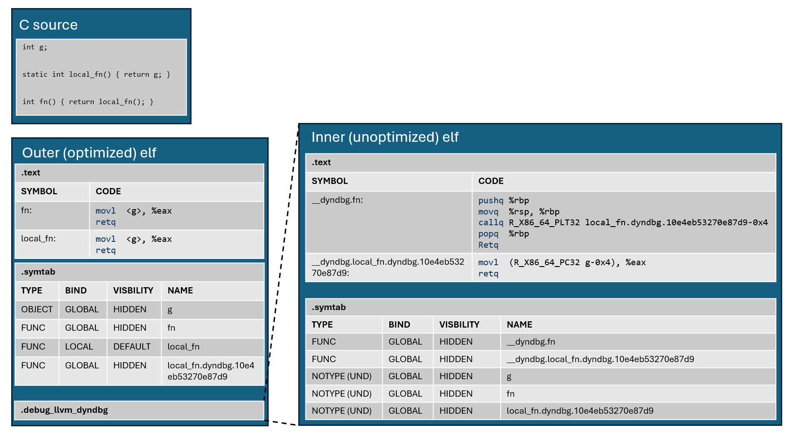

# Dynamic Debugging
## Overview and usage

Dynamic Debugging lets developers step through unoptimized code from optimized binaries. It largely removes the historical trade-off of runtime performance for improved debuggability by providing both at the cost of longer compile times and larger object files.

The feature is enabled from Clang with `-fdynamic-debugging` (disabled with `-fno-dynamic-debugging`) and requires a compatible linker such as LLD. No additional flags are required for linking dynamic debugging objects. Objects compiled with dynamic debugging can be linked with objects compiled without it. It also requires a compatible debugger (note that LLDB does not support the feature).

The full unoptimized binary is compiled ahead of time along with the optimized version, and all of its globals reference the optimized binary (both data and code - so unoptimized functions call optimized ones). While debugging, when a breakpoint is requested the debugger patches the optimized function entry to jump to the unoptimized version. Because unoptimized functions call optimized versions, continuing execution returns execution to the optimized binary.

Important info:
* Compiler flags apply to both versions (except optimization level, which is set to 0 for the unoptimized version).
* Preprocessor definitions apply to both versions so the unoptimized version may differ from a standalone "debug" build (consider debug and assert macros such as NDEBUG).
* Some optimizations are suppressed so the optimized object may be different to an optimized object built without dynamic debugging.
* There is a compile time and object file size impact.
* Linking an object file that has no strong external symbols multiple times into the same ELF may result in a symbol redefinition linker error when built with this feature.

## Support

* Currently the feature is only supported with the ELF file format. Non-x86 targets are not supported yet; although they should work the feature has only been tested on x86 platforms.
* LLDB does not support Dynamic Debugging.
* LLD does not support `--wrap=<symbol>` with Dynamic Debugging.
* Dynamic Debugging with LTO is not supported.

## Nested object design

The broad idea is that the unoptimized program (“inner object”) is compiled and stored in a new `.debug_llvm_dyndbg` section in the optimized version (“outer object"). “Nesting” the objects allows build systems and other tools to continue to manage a single object file per translation unit.

High level nested object design:

* In the outer (optimized) module, globals with internal linkage not in a COMDAT are “promoted” so they can be referenced by the inner (unoptimized) module. We implement this by introducing aliases with external linkage with suffixes unique to the translation unit. The suffix is “.dyndbg.<hash of directory, file, and driver flags>”.
* The inner (unoptimized) module contains unoptimized copies of the outer module’s functions. Their names are prefixed with “__dyndbg.”
* Declarations corresponding to the originally external and now-promoted globals in the outer module are added to the inner module. All global references (function and data) in the inner module refer to the outer module.
* After linking, the inner ELF is still essentially an ET_REL object. It’s the debugger’s job to extract, load, and apply relocations for the inner ELF.

This diagram illustrates the result of compiling a simple source example

## Compiler implementation

`llvm::prepareForDynamicDebugging` is an LLVM utility that clones the input module without global variable definitions, renames the functions as appropriate, and generates aliases as needed in the original (to-be-optimized) module.

Clang calls `llvm::prepareForDynamicDebugging` after CodeGen (`clang::emitBackendOutput`) and runs a separate optimization pipeline (`emitAssembly`), set to optimization level `O0`, on the unoptimized module. The binary output is embedded into the to-be-optimized module (using `embedBufferInModule`) to be embedded in a `.debug_llvm_dyndbg` section.

It's essential for the debugger's run-time detour patching that the inner and outer function interfaces are identical. To block interprocedural optimizations `noipa` is applied to functions in the outer module. In order for the debugger to switch to an unoptimized function it must exist, so we block function specialization through `noipa` and `nooutline`.

Functions are padded to prevent the debugger writing over unrelated program bytes with its detour patches. LLVM controls this by applying a function attribute `tail-pad-to-size=<min byte size>`. For x86_64 we assume a debugger will patch using a 32-bit relative jump, requiring functions to be at least 5 bytes. The default value for the pad bytes is `0` unless specified using `tail-pad-value=<byte value>`: on x86_64 this is set to `144` (`0x90`, `nop`).

## Linker implementation

In a link with dynamic debugging enabled, ELF LLD basically performs a relocatable link of the inner (unoptimized) objects within the regular link of the outer (optimized) objects. The outer link includes the symbol dependencies of any inner objects. The result of the inner relocatable link is placed in the `.debug_llvm_dyndbg` output section of the outer link output. For executable outputs, the inner relocatable link uses the option `--force-group-allocation` to resolve groups and discards groups. It also enables merging of the input sections. This helps to reduce the size of the final `.debug_llvm_dyndbg` output section for executables, especially for input objects that use `-ffunction-sections`. For relocatable output, the inner relocatable link is the same as a regular ELF relocatable link.

The key changes required to ELF LLD are to support the nested linking and to handle the symbol dependencies from the inner (unoptimized) objects to the outer (optimized) objects and the final executable output.

## Debugger implementation considerations
Broadly, a debugger that supports dynamic debugging must:

* Read the relocations from the inner (unoptimized) ELF and apply them.
* Load the .text of the inner (unoptimized) ELF into the debuggee’s memory.
* Using DW_TAG_inlined_subroutine, build a map from each inlined function to a set of parent functions that inline it.

When setting a file/line breakpoint for a non-inlined function the Debugger should:
* Lookup the address in the inner ELF’s line information and set the breakpoint in the unoptimized code.
* Lookup the address in the outer ELF’s line information and patch the optimized function with a detour to the unoptimized function.

When setting a file/line breakpoint for an inlined function the Debugger should:
* Find the possible parent functions for the inlined function using the inliners map.
* Repeat the process for non-inlined functions for every possible parent function.

Function breakpoints can use similar mechanisms as file/line breakpoints, where the address lookup is done using symbol information instead. Address breakpoints do not need any special handling.

Users may create breakpoints that require patching of the same function. Due to this, patches in optimized functions should be reference counted. Patches can be removed when the reference count drops to zero.

Function calls in the unoptimized code will call functions in the optimized code. The Debugger must force execution back to the unoptimized code when stepping into function calls from unoptimized code. The Debugger should:

* Put a temporary breakpoint on the call target.
* After stopping at the call target, map the PC to the corresponding function in the unoptimized code.
* Set the PC to the start of the function in the unoptimized code.

The exact timing of the detour patching needs to be considered. If the PC of any threads is currently in a function to be patched, it may not safe to apply. A fallback mechanism that uses temporary breakpoints and sets the PC in the Debugger when the breakpoint is hit can be used until the function is safe to patch. While using the fallback mechanism, the Debugger should also put a breakpoint in the optimized code. This is for the case where a thread may already be executing the function and will never end up in the unoptimized code.

There are some considerations around attaching and detaching. When detaching, the Debugger should remove any patches it has added to optimized code. Debuggers can decide whether to remove the unoptimized code from the debuggee’s memory when detaching. A Debugger could, for example, leave the code and some metadata behind so that if a user re-attaches later the initial loading and relocating doesn’t have to be done again.

## Toolchain resource usage
The costs of compiling with dynamic debugging are not straightforwardly “unoptimized plus optimized build”. In terms of size, the inner ELF remains relocatable after the outer ELF is linked, so it contains many relocations. The outer ELF contains many more functions than it would under normal optimizations (we can’t delete the optimized definitions as they’re called from the inner ELF), and those come with extra debug info.

Adding `-fdynamic-debugging`  to a `-O3 -g` build results in an executable file size increase of +189.58% (and the increase for object files is more pronounced), geomean over the CTMark projects.

Compile time can be fairly significantly impacted depending on the source. C++ parsing only happens once, and the codegen/emission time of the inner ELF is comparable to a normal unoptimzed build. However, the outer module can take significantly longer to compile than a normal optimized build due to the (sometimes vast) number of function definitions that are preserved that would otherwise be fully optimized away. Optimizations, ISel, and object emission all take longer as a result.

Adding `-fdynamic-debugging`  to a `-O3 -g` build results in an compile time increase of +14.81%, geomean over CTMark projects (measured in instructions:u sampled, as on compile-time-tracker). The range across the CTMark codebases is from less than +2% to nearly +40% increase, indicating this is highly dependent on the codebase.

Linking of output with dynamic debugging has a significant impact on memory usage.

# Future work

* LLD support for `--gc-sections` is limited and therefore has reduced output size savings.
* LLD support for `--wrap=<symbol>`.
* LTO isn't supported with the feature.
* An inline instance of a function may have its instructions completely optimized away which also removes the debug metadata specifying that there's an inline scope. In this situation a debugger wouldn't be able to patch the parent function when a breakpoint is set on the inlinee. It could be possible for LLVM to preserve the inline scope metadata in order to emit an empty inline scope in DWARF (inline subroutine without any PC ranges), which would be a useful signal to the debugger that this has happened.
