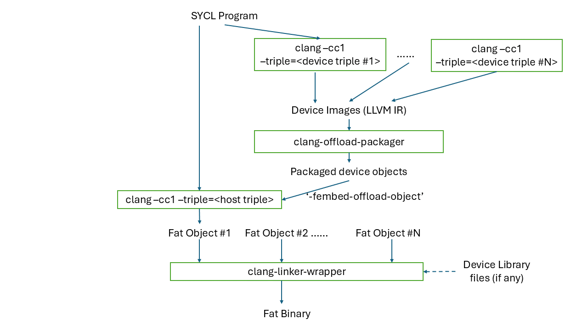
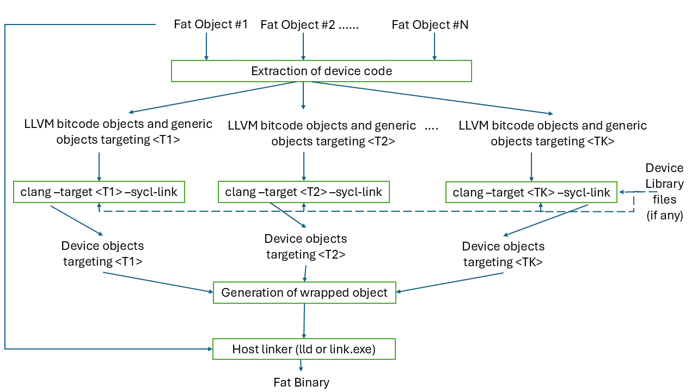

==================================
SYCL Offloading Design & Internals
==================================

.. contents::
   :local:

************
Introduction
************

SYCL is a high-level single-source standard C++ programming model that can 
target a wide range of heterogeneous platforms. SYCL is an industry-driven
standard developed by Khronos Group and announced in March 2014 that allows data
parallelism for heterogeneous systems based on C++ 17. It is a royalty-free,
cross-platform abstraction layer that enables the development of applications
and frameworks with the portability and efficiency of OpenCL, while providing a
user interface that's flexible and easy to use. SYCL standard is designed to be
both highly portable and highly efficient and allows applications to offload
compute kernels and data transfer to OpenCL-enabled accelerators such as GPUs,
FPGAs, and other processors.

A SYCL implementation refers to a software version or revision of the SYCL
programming model. It consists of the necessary tools, libraries, and runtime
support that enable developers to write SYCL code and execute it on compatible
hardware platforms. These are some of the popular SYCL implementations that are
available. This document focuses on DPCPP by Intel which is a part of the oneAPI
solution that supports Intel CPUs, GPUs, and FPGAs as well as NVIDIA and AMD
GPUs. For more details, please look at `sycl-overview <https://www.khronos.org/sycl/>`_.

  .. code-block:: c++
    :linenos:
    
      #include <sycl/sycl.hpp>
      using namespace sycl;
      int main() {
          queue Q;                        // The queue, Q, is the object that
                                          // submits the task to a device.
          int const size = 10;
          buffer<int> A{ size };          // The buffer, A, is the memory used to
                                          // transfer data between host and device.
          Q.submit([&](handler& h) {      // The handler, h, is the object that contains
                                          // the single_task function to be used.
              accessor A_acc(A, h);       // The accessor, A_acc, is the object that
                                          // efficiently accesses the buffer elements.
              h.single_task([=]() {
                  A_acc[5] = 77;
                  });
              });
          host_accessor result(A);        // host_accessor is the object that allows
                                          // the host to access the buffer memory.
          for (int i = 0; i < size; i++)  // Print output
              std::cout << result[i] << " "; std::cout << "\n";
          return 0;
      }

Here, we present a code with a simple SYCL algorithm called single_task, which
is equivalent in standard C++ would be std::thread, to gain a fundamental
understanding of SYCL components. The construct single_task is used to define a
unit of work that should be executed on a single processing element, typically a
single CPU core or GPU thread. A SYCL kernel function is a lambda function that
is passed as an argument to the single_task construct.
This document describes the clang driver and code generation steps for creating
offloading applications. Clang supports offloading to various architectures
using programming models like CUDA, HIP, and OpenMP. Currently, Clang support
for SYCL offloading is being added.

Clang will support SYCL target offloading to several different architectures
such as Intel CPUs and GPUs, NVPTX, and AMDGPU. Offloading code is generated by
clang and then executed using SYCL runtime. This section describes the steps
necessary to create a functioning device image that can be loaded by the SYCL
runtime. {{ SYCL runtime reference? }}.

SYCL offloading can support two modes of compilation: (i) Just-In-Time (JIT)
compilation and (ii) Ahead-Of-Time (AOT) compilation. In JIT compilation, final
wrapped device object is represented using the SPIR-V Intermediate
Representation. Final device code generation is deferred until application
runtime. JIT compilation provides portability of device code and allows for
target specific optimizations to happen. In AOT copilation, final device code is
generated at compile time (before the wrapping step) to produce the final
binary. AOT compilation reduces application execution time by skipping the
device code generation step during runtime and final device code can also be
tested before deploying.

Remainder of this document illustrates the steps necessary to compile a SYCL
offloading application using clang.

*******************************************
High-level SYCL Offloading Compilation Flow
*******************************************


  
  Figure 1: Top-level SYCL offloading compilation flow.

Figure 1 showcases the SYCL offloading compilation flow. The SYCL compiler
performs the following high-level actions to generate SYCL offloading code:

  - Front-end device compilation step (`clang --target=<device triple>`)
  - Packaging of device code (`clang-offload-packager`)
  - Front-end host compilation step (`clang --target=<host triple> --fembed-offload-object`)
  - Linking stage (`clang-linker-wrapper`)

The set of possible 'clang -cc1' invocations for a given user command is shown
below. 

.. code-block:: console
  :linenos:

    $ clang++ -fsycl --offload-arch=pvc,sm_52 test.cpp -###
    clang -cc1 -triple nvptx64 ...     // AOT device compilation for sm_52
    clang -cc1 -triple spir64_gen ...  // AOT device compilation for pvc
    clang -cc1 -triple spirv64 ...     // JIT device compilation (backup) for pvc
    clang -cc1 -triple x86_64 ...      // Host compilation

****************************
Front-end device compilation
****************************
This step parses input source, outlines device part of the code, applies
additional restrictions on the device code (e.g. no exceptions or virtual
calls), generates LLVM IR bitcode for the device code only and "integration
header" which provides information like kernel name, parameters order and data
type for the runtime library. Multiple LLVM IR bitcodes (in case of multiple
targets) are packaged into a single object by the clang-offload-packager.

An example of front-end device compilation command is shown below:

  .. code-block:: console

    $ clang -cc1 -triple spirv64 -fsycl-is-device test.cpp -o test.bc
    
Front-end device compilation for SYCL offloading can be split into the following
components - Device code outlining, SYCL kernel function object lowering,
Generation of device code diagnostics, and Integration header generation. These
components are explained :ref:`in this document<sycl_frontend_device_compilation>`.

*********************
Device code packaging
*********************
When dealing with multiple device binaries, an additional step is performed to
package the multiple device binaries before being added to the host object. This
additional step is performed with the clang-offload-packager taking image inputs
containing information relating to the target triple, architecture setting and
offloading kind.

The clang-offload-packager is run during ‘fat object’ generation regardless of
the number of device binaries being added to the conglomerate fat object. The
device binaries are contained in what is designated as an ‘Offload Binary’.
These binaries can reside in a variety of binary formats including Bitcode
files, ELF objects, executables and shared objects, COFF objects, archives or
simply stored as an offload binary.

Example usage of clang-offload-packager:

  .. code-block:: console

    $ clang-offload-packager --image=file=<name>,triple=<triple>,kind=<kind>
    $ clang-offload-packager --image=file=test.bc,triple=spirv64,kind=sycl -o device.out

**************************
Front-end host compilation
**************************
This step parses input file and emits code for the host device. This host
compilation takes an additional argument which helps to embed the packaged
device binary into the host code. This step generates a fat object that will be
consumed during link stage.

An example of front-end host compilation command is shown below:

  .. code-block:: console

    $ clang -cc1 -triple x86_64 -fsycl-is-host -fembed-offload-object=device.out test.cpp -o test.o

*************
Linking stage
*************
In this step, fat object file(s)  are passed to linker wrapper tool. The tool
extracts the device objects and runs the device linking action on the extracted
objects. Fully formed device images are then wrapped into host objects and then
linked with host image in the original fat object using the host linker tool.


  
  Figure 2: Device linking flow for SYCL offloading inside the linker-wrapper tool.

Figure 2 shows the compilation flow inside the linker-wrapper tool. First, all
device objects are extracted from the fat objects and grouped according to the
target device. For each target device group, we invoke clang to link the device
objects and generate a list of device objects. All the device objects are then
wrapped together and embedded into a wrapped host object. This wrapped object is
linked normally with the rest of host objects and/or libraries using the usual
linker - e.g. `ld` on Linux and `link.exe` on Windows.

Remainder of this chapter provides a detailed explanation of different steps of
SYCL compilation flow inside the linker-wrapper tool.

Linking of device objects
=========================
  Device code linking for SYCL offloading will be performed by making a call to
  the clang driver. A SYCL specific option '--sycl-link' is passed to the driver
  to control the linking process. In the presence of this option, the clang driver
  will invoke a SYCL linker tool called 'clang-sycl-linker'. This tool is
  responsible for linking the device bitcode and generating a group of
  fully-formed device images. An example of a call to clang-sycl-linker is shown
  below.

  .. code-block:: console

    $ clang++ --target <device triple> --sycl-link test.bc test.o -Xlinker <SYCLLINKOPTS> -###
    clang-sycl-linker -triple <device triple> <SYCLLINKOPTS> test.bc test.o

  .. figure:: figures/sycl_linker.png
    :scale: 50%
    :align: center
  
    Figure 3: SYCL-specific device code linking for JIT compilation flow.

  Figure 3 shows the device code linking process performed inside the SYCL linker
  tool for JIT compilation. Following are the key steps performed:

  1. All the inputs of LLVM IR bitcode type are gathered and linked together using
  the linkInModule API calls.

  2. If the user provides device library files, the output of the previous step is
  linked with such files to get the final fully linked LLVM IR device bitcode
  image.

  3. The fully linked LLVM IR device bitcode image undergoes several post-link
  steps. This include device code splitting, specialization constant lowering,
  symbol table generation, and property sets generation.

  4. Each of the split device images in the LLVM IR format will be translated to
  SPIR-V IR.using an external tool 'llvm-spirv'.

  Remainder of this section discusses the various post-link steps and the
  translation to SPIR-V IR.

Device code splitting
---------------------
  This process takes as input a fully linked device module with a set of SYCL
  device kernels for a specific target and performs splitting to generate
  several fully-contained device modules. Each of the newly formed module
  contains a sub-set of the original set of SYCL device kernels along with a
  union of all the functions from each of their respective call graphs. Here,
  call graph of a SYCL kernel is the set of all functions reachable from that
  kernel.
  Device code splitting is performed for two reasons:

  (1) User requests a specific mode of code splitting. Three modes of code
  splitting are supported. They are:

    i. per-kernel - Every SYCL kernel and the functions that are contained in its 
    call graph go into a separate module.

    ii. per-module - All SYCL kernels belonging to a specific user-specified
    module and all functions from their respective call graphs go into a separate
    module.

    iii. auto - per-kernel or per-module option is selected based on some
    heuristics.

  (2) SYCL kernels can be specialized for different devices. For example, kernels
  that use 64-bit floating point (FP64) operations can be executed only on devices
  that support such operations. Hence, it is required that all kernels that
  require FP64 support be grouped separately from kernels that do not require FP64
  support. A point to note: A SYCL kernel is said to require FP64 support if the
  kernel itself or any funtion in its call graph uses FP64 operations. Figure 4
  showcases this device code split.

  .. figure:: figures/code_split.png
    :scale: 50%
    :align: center
   
    Figure 4: An example of device code splitting for SYCL offloading.

Specialization constant lowering
--------------------------------
  Specialization constants are implemented in accordance with how they are
  defined by SYCL 2020 specification. Here are links to `sycl-registry <https://www.khronos.org/registry/SYCL/>`_
  and `sycl-2020-spec <https://www.khronos.org/registry/SYCL/specs/sycl-2020/html/sycl-2020.html>`_.

  Specialization constants represent constants whose values can be set
  dynamically during execution of the SYCL application. The values of these
  constants are fixed when a SYCL kernel function is invoked, and they do not
  change during the execution of the kernel. However, the application is able to
  set a new value for a specialization constants each time a kernel is invoked,
  so the values can be tuned differently for each invocation.
  An example usage of specialization constant is shown below:

  .. code-block:: c++
    :linenos:

      #include <sycl/sycl.hpp>
      using namespace sycl;
      using coeff_t = std::array<std::array<float, 3>, 3>;
      // Read coefficients from somewhere.
      coeff_t get_coefficients();
      // Identify the specialization constant.
      constexpr specialization_id<coeff_t> coeff_id;
      void do_conv(buffer<float, 2> in, buffer<float, 2> out) {
        queue myQueue;
        myQueue.submit([&](handler &cgh) {
          accessor in_acc { in, cgh, read_only };
          accessor out_acc { out, cgh, write_only };
          // Set the coefficient of the convolution as constant.
          // This will build a specific kernel the coefficient available as literals.
          cgh.set_specialization_constant<coeff_id>(get_coefficients());
          cgh.parallel_for<class Convolution>(
              in.get_range(), [=](item<2> item_id, kernel_handler h) {
                float acc = 0;
                coeff_t coeff = h.get_specialization_constant<coeff_id>();
                for (int i = -1; i <= 1; i++) {
                  if (item_id[0] + i < 0 || item_id[0] + i >= in_acc.get_range()[0])
                    continue;
                  for (int j = -1; j <= 1; j++) {
                    if (item_id[1] + j < 0 || item_id[1] + j >= in_acc.get_range()[1])
                      continue;
                    // The underlying JIT can see all the values of the array returned
                    // by coeff.get().
                    acc += coeff[i + 1][j + 1] *
                          in_acc[item_id[0] + i][item_id[1] + j];
                  }
                }
                out_acc[item_id] = acc;
              });
        });
        myQueue.wait();
      }

Handling of specialization constants requires the compiler to have access to a 
fully linked device image and hence happens during the post-link step.
This handling happens inside a dedicated LLVM IR pass named`SpecConstantsPass`
which:
1. Assigns numeric IDs to specialization constants found in the linked module.
2. Transforms IR to a form expected by the LLVM to SPIR-V translation step.
3. Translates SPIR-V friendly IR to SPIR-V IR during LLVM to SPIR-V
transation step.
1. Collects and provides \<Symbolic ID\> =\> \<numeric IDs + additional info\>
mapping, which is later being used by SYCL runtime to set specialization
constant values provided by user.

Remainder of this section explains these three steps in detail.

Assignment of numeric IDs to specialization constants
`````````````````````````````````````````````````````

This task is achieved by maintaining a map, which holds a list of numeric IDs
for each encountered symbolic ID of a specialization constant. Those IDs are
used to identify the specialization constants at SPIR-V level.

As noted above one symbolic ID can have several numeric IDs assigned to it -
such 1:N mapping comes from the fact that at SPIR-V level, composite
specialization constants don't have dedicated IDs and they are being identified
and specialized through their scalar leafs and corresponding numeric IDs.

For example, the following code:

  .. code-block:: c++
    :linenos:

      struct Nested {
        float a, b;
      };
      struct A {
        int x;
        Nested n;
      };
      constexpr specialization_id<int> id_int;
      constexpr specialization_id<A> id_A;
      // ...
        [=](kernel_handler h) {
          h.get_specialization_constant<id_int>();
          h.get_specialization_constant<id_A>();
        }

Will result in the following numeric IDs assignment:

  .. code-block:: c++
    :linenos:

      // since `id_int` is a simple arithmetic specialization constant, we only
      // have a single numeric ID associated with its symbolic ID
      unique_symbolic_id_for_id_int -> { 0 }
      // `id_A` is a composite with three leafs (scalar members, including ones
      // located in nested composite types), which results in three numeric IDs
      // associated with the same symbolic ID
      unique_symbolic_id_for_id_A -> { 1, 2, 3 }

As it is shown in the example above, if a composite specialization constant
contains another composite within it, that nested composite is also being
"flattened" and its leafs are considered to be leafs of the parent
specialization constants. This done by depth-first search through the composite
elements.

Transformation of LLVM IR to SPIR-V friendly IR form
````````````````````````````````````````````````````

SPIR-V friendly IR form is a special representation of LLVM IR, where some
function are named in particular way in order to be recognizable by the SPIR-V
translator to convert them into corresponding SPIR-V instructions later.
The format is documented [here][spirv-friendly-ir] `spirv-friendly-ir <https://github.com/KhronosGroup/SPIRV-LLVM-Translator/blob/master/docs/SPIRVRepresentationInLLVM.rst>`_

For specialization constant, we need to generate the following constructs:

  .. code-block:: c++
    :linenos:

      template<typename T> // T is arithmetic type
      T __spirv_SpecConstant(int numericID, T default_value);

      template<typename T, typename... Elements> // T is composite type,
      // Elements are arithmetic or composite types
      T __spirv_SpecConstantComposite(Elements... elements);

Particularly, `SpecConstantsPass` translates calls to the

  .. code-block:: c++
    
    T __sycl_getScalar2020SpecConstantValue(const char *SymbolicID, const void *DefaultValue, const char *RTBuffer)

intrinsic into calls to 

  .. code-block:: c++

    T __spirv_SpecConstant(int ID, T default_val)

And for 

  .. code-block:: c++

    T __sycl_getComposite2020SpecConstantValue(const char *SybmolicID, const void *DefaultValue, const char *RTBuffer)

it generates number of 

  .. code-block:: c++

    T __spirv_SpecConstant(int ID, T default_val) 

calls for each leaf of the composite type, plus number of

  .. code-block:: c++

    T __spirv_SpecConstantComposite(Elements... elements)

for each composite type (including the outermost one).

Example of LLVM IR transformation can be found below, input LLVM IR:

  .. code-block:: c++
    :linenos:

      %struct.POD = type { [2 x %struct.A], <2 x i32> }
      %struct.A = type { i32, float }

      @gold_scalar_default = global %class.specialization_id { i32 42 }
      @gold_default = global %class.specialization_id { %struct.POD { [2 x %struct.A] [%struct.A { i32 1, float 2.000000e+00 }, %struct.A { i32 2, float 3.000000e+00 }], <2 x i32> <i32 44, i32 44> } }

      ; the second argument of intrinsics below are simplified a bit
      ; in real-life LLVM IR it looks like:
      ;   i8* bitcast (%class.specialization_id* @gold_scalar_default to i8*
      %gold_scalar = call i32 __sycl_getScalar2020SpecConstantValue<int type mangling> ("gold_scalar_identifier", @gold_scalar_default, i8* %buffer)
      %gold = call %struct.POD __sycl_getComposite2020SpecConstantValue<POD type mangling> ("gold_identifier", @gold_default, i8* %default)

LLVM IR generated by `SpecConstantsPass`:

  .. code-block:: c++
    :linenos:

      %gold_scalar = call i32 __spirv_SpecConstant(i32 0, i32 42)

      %gold_POD_A0_x = call i32 __spirv_SpecConstant(i32 1, i32 1)
      %gold_POD_A0_y = call float __spirv_SpecConstant(i32 2, float 2.000000e+00)

      %gold_POD_A0 = call %struct.A __spirv_SpecConstantComposite(i32 %gold_POD_A0_x, float %gold_POD_A0_y)

      %gold_POD_A1_x = call i32 __spirv_SpecConstant(i32 3, i32 2)
      %gold_POD_A1_y = call float __spirv_SpecConstant(i32 4, float 3.000000e+00)

      %gold_POD_A1 = call %struct.A __spirv_SpecConstantComposite(i32 %gold_POD_A1_x, float %gold_POD_A1_y)

      %gold_POD_A = call [2 x %struct.A] __spirv_SpecConstantComposite(%struct.A %gold_POD_A0, %struct.A %gold_POD_A1)

      %gold_POD_b0 = call i32 __spirv_SpecConstant(i32 4, i32 44)
      %gold_POD_b1 = call i32 __spirv_SpecConstant(i32 6, i32 44)
      %gold_POD_b = call <2 x i32> __spirv_SpecConstant(i32 %gold_POD_b0, i32 %gold_POD_b1)

      %gold = call %struct.POD __spirv_SpecConstantComposite([2 x %struct.A] %gold_POD_A, <2 x i32> %gold_POD_b)

This SPIR-V friendly LLVM IR will be handled appropriately by the LLVM to SPIR-V
translation step.

Translating SPIR-V friendly LLVM IR to SPIR-V
`````````````````````````````````````````````
Given the `__spirv_SpecConstant` intrinsic calls produced by the
`SpecConstants` pass:

  .. code-block:: c++
    :linenos:
    
      ; Function Attrs: alwaysinline
      define dso_local spir_func i32 @get() local_unnamed_addr #0 {
        ; args are "ID" and "default value":
        %1 = tail call spir_func i32 @_Z20__spirv_SpecConstantii(i32 42, i32 0)
        ret i32 %1
      }

      %struct.A = type { i32, float }

      ; Function Attrs: alwaysinline
      define dso_local spir_func void @get2(%struct.A* sret %ret.ptr) local_unnamed_addr #0 {
        ; args are "ID" and "default value":
        %1 = tail call spir_func i32 @_Z20__spirv_SpecConstantii(i32 43, i32 0)
        %2 = tail call spir_func float @_Z20__spirv_SpecConstantif(i32 44, float 0.000000e+00)
        %ret = tail call spir_func %struct.A @_Z29__spirv_SpecConstantCompositeif(%1, %2)
        store %struct.A %ret, %struct.A* %ret.ptr
        ret void
      }

the translator will generate `OpSpecConstant` SPIR-V instructions with proper
`SpecId` decorations:

.. code-block:: c++
  :linenos:

    OpDecorate %i32 SpecId 42                                      ; ID
    %i32 = OpSpecConstant %int 0                                   ; Default value
    OpDecorate %A.i32 SpecId 43                                    ; ID of the 1st member
    OpDecorate %A.float SpecId 44                                  ; ID of the 2nd member
    %A.i32 = OpSpecConstant %int.type 0                            ; 1st member with default value
    %A.float = OpSpecConstant %float.type 0.0                      ; 2nd member with default value
    %struct = OpSpecConstantComposite %struct.type %A.i32 %A.float ; Composite doens't need IDs or default value
    %1 = OpTypeFunction %int

    %get = OpFunction %int None %1
    %2 = OpLabel
    OpReturnValue %i32
    OpFunctionEnd
    %1 = OpTypeFunction %struct.type

    %get2 = OpFunction %struct.type None %struct
    %2 = OpLabel
    OpReturnValue %struct
    OpFunctionEnd

Collecting spec constants info and communicating it to SYCL runtime
```````````````````````````````````````````````````````````````````

For each encountered specialization constants, we emit a property, which encodes
information required by SYCL runtime to set the value of a specialization
constant through corresponding API.

These properties are stored in "SYCL/specialization constants" property set and
their names are the same as symbolic IDs of corresponding specialization
constants.

Each such property contains an array of tuples (descriptors)
\<leaf spec ID, offset, size\>. This descriptor might be overcomplicated for
simple arithmetic spec constants, but it is still used for them in order to
unify internal representation of scalar and composite spec constants and
simplify their handling in SYCL runtime.
This descriptor is needed, because at SYCL runtime level, composite constants
are set by user as a byte array and we have to break it down to the leaf members
of the composite and set a value for each leaf as for a separate scalar
specialization constant.

For simple scalar specialization constants the array will only contain a single
descriptor representing the constant itself. For composite specialization
constants the array will contain several descriptors for each leaf of the
composite type.

The descriptor contains the following fields:
- ID of a composite constant leaf, i.e. ID of a scalar specialization constant,
which is a part of a composite type or ID of a constant itself if it is a
scalar.
- Offset from the beginning of composite, which points to the location of a
scalar value within the composite, i.e. the position where scalar
specialization constant resides within the byte array supplied by the user.
For scalar specialization constants it will always be 0.
- Size of the scalar specialization constant

For example, the following code:
  .. code-block:: c++
    :linenos:

      struct Nested {
        float a, b;
      };
      struct A {
        int x;
        Nested n;
      };

      constexpr specialization_id<int> id_int;
      constexpr specialization_id<A> id_A;
      // ...
        [=](kernel_handler h) {
          h.get_specialization_constant<id_int>();
          h.get_specialization_constant<id_A>();
        }

Will result in the following property set generated:
  .. code-block:: c++
    :linenos:

      property_set {
        Name = "SYCL/specialization constants",
        properties: [
          property {
            Name: "id_int_symbolic_ID",
            ValAddr: points to byte array [{0, 0, 4}],
            Type: PI_PROPERTY_TYPE_BYTE_ARRAY,
            Size: sizeof(byte array above)
          },
          property {
            Name: "id_A_symbolic_ID",
            ValAddr: points to byte array [{1, 0, 4}, {2, 4, 4}, {3, 8, 4}],
            Type: PI_PROPERTY_TYPE_BYTE_ARRAY,
            Size: sizeof(byte array above)
          },
        ]
      }

During the creation of the wrapped device image, these device image properties
are embedded into the application together with device code and used by SYCL
runtime while handling specialization constants during application execution. It
calls appropriate API to set a value of a specialization constant.

Symbol table generation
-----------------------

During the post-linking stage, a symbol table (list of kernels) for each
produced device module is generated. This facilitates proper module selection 
by SYCL runtime. This symbol table will consist name of all device entry points
inside a given module. An example LLVM IR module is shown below.
  .. code-block:: c++
    :linenos:

      define spir_kernel void @foo(%arg1, %arg2) {
      }
      define spir_kernel void @bar(%arg1, %arg2) {
      }
      define spir_kernel void @alpha(%arg1, %arg2) {
      }

For this example, the following symbol table generated. All symbols in symbol
table will be concatenated in a single string (line breaks are used as
separators) which is then added to the StringData map of the offloading device
image. 
  .. code-block:: c++
    :linenos:
    
      Image.StringData["SYMBOL_TABLE"] = "foo\nbar\nalpha\n"

Property Set Generation
-----------------------

SYCL LLVM to SPIR-V translation
===============================

AOT compilation flow for SPIR-V based targets
=============================================

AOT compilation flow for non SPIR-V based targets (NVPTX AND AMD)
=================================================================

Generation of wrapped object
============================

Generation of final host-linked object
======================================

SYCL runtime
============
