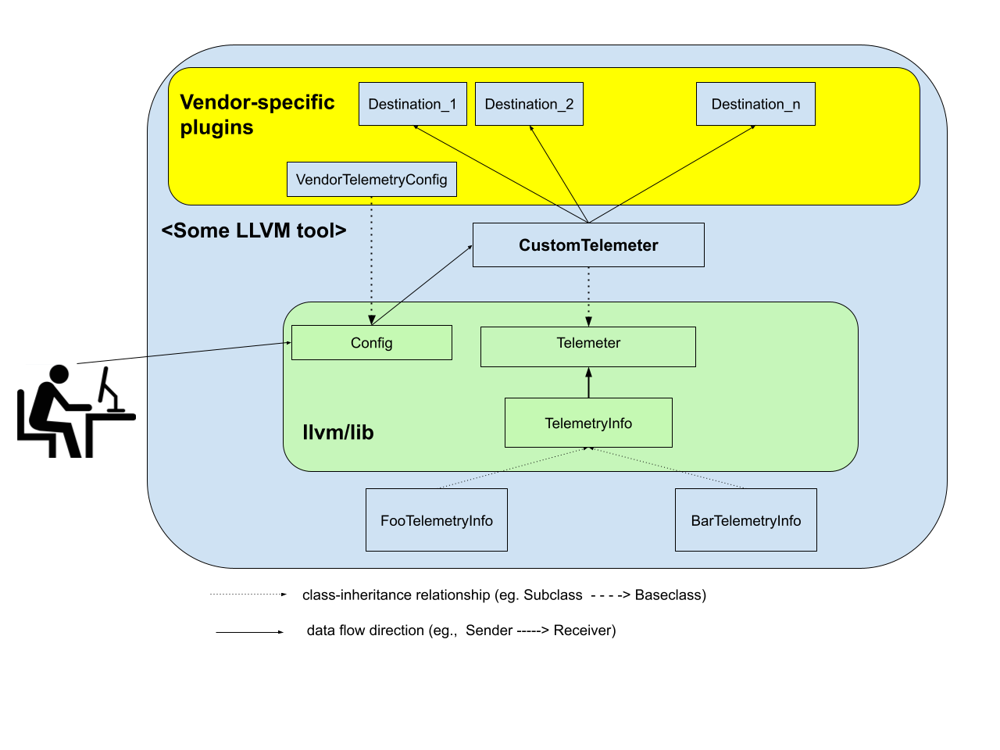

===========================
Telemetry framework in LLVM
===========================

.. contents::
   :local:

.. toctree::
   :hidden:

===========================
Telemetry framework in LLVM
===========================

Objective
=========

Provides a common framework in LLVM for collecting various usage and performance
metrics.
It is located at `llvm/Telemetry/Telemetry.h`

Characteristics
---------------
* Configurable and extensible by:

  * Tools: any tool that wants to use Telemetry can extend and customize it.
  * Vendors: Toolchain vendors can also provide custom implementation of the
    library, which could either override or extend the given tool's upstream
    implementation, to best fit their organization's usage and privacy models.
  * End users of such tool can also configure Telemetry(as allowed by their
    vendor).

Important notes
----------------

* There is no concrete implementation of a Telemetry library in upstream LLVM.
  We only provide the abstract API here. Any tool that wants telemetry will
  implement one.
  
  The rationale for this is that, all the tools in llvm are very different in
  what they care about(what/where/when to instrument data). Hence, it might not
  be practical to have a single implementation.
  However, in the future, if we see enough common pattern, we can extract them
  into a shared place. This is TBD - contributions are welcomed.

* No implementation of Telemetry in upstream LLVM shall store any of the
  collected data due to privacy and security reasons:
  
  * Different organizations have different privacy models:
  
    * Which data is sensitive, which is not?
    * Whether it is acceptable for instrumented data to be stored anywhere?
      (to a local file, what not?)
      
  * Data ownership and data collection consents are hard to accommodate from
    LLVM developers' point of view:
  
    * Eg., data collected by Telemetry is not neccessarily owned by the user
      of an LLVM tool with Telemetry enabled, hence the user's consent to data
      collection is not meaningful. On the other hand, LLVM developers have no
      reasonable ways to request consent from the "real" owners.

High-level design
=================

Key components
--------------

The framework is consisted of four important classes:

* `llvm::telemetry::Telemeter`: The class responsible for collecting and
  transmitting telemetry data. This is the main point of interaction between the
  framework and any tool that wants to enable telemery.
* `llvm::telemetry::TelemetryInfo`: Data courier
* `llvm::telemetry::Destination`: Data sink to which the Telemetry framework
  sends data.
  Its implementation is transparent to the framework.
  It is up to the vendor to decide which pieces of data to forward and where
  to forward them to their final storage.
* `llvm::telemetry::Config`: Configurations on the `Telemeter`.
  

How to implement and interact with the API
------------------------------------------

To use Telemetry in your tool, you need to provide a concrete implementation of the `Telemeter` class and `Destination`.

1) Define a custom `Telemeter` and `Destination`

.. code-block:: c++

    // This destiantion just prints the given entry to a stdout.
    // In "real life", this would be where you forward the data to your
    // custom data storage.
    class MyStdoutDestination : public llvm::telemetry::Destiantion {
    public:
      Error emitEntry(const TelemetryInfo* Entry) override {
         return sendToBlackBox(Entry);
         
      }
      
    private:
      Error sendToBlackBox(const TelemetryInfo* Entry) {
          // This could send the data anywhere.
          // But we're simply sending it to stdout for the example.
          llvm::outs() << entryToString(Entry) << "\n";
          return llvm::success();
      }
      
      std::string entryToString(const TelemetryInfo* Entry) {
        // make a string-representation of the given entry.
      }
    };
    
    // This defines a custom TelemetryInfo that has an addition Msg field.
    struct MyTelemetryInfo : public llvm::telemetry::TelemetryInfo {
      std::string Msg;
      
      json::Object serializeToJson() const {
        json::Object Ret = TelemeteryInfo::serializeToJson();
        Ret.emplace_back("MyMsg", Msg);
        return std::move(Ret);
      }
      
      // TODO: implement getKind() and classof() to support dyn_cast operations.
    };
    
    class MyTelemeter : public llvm::telemery::Telemeter {
    public:
      static std::unique_ptr<MyTelemeter> createInstatnce(llvm::telemetry::Config* config) {
        // If Telemetry is not enabled, then just return null;
        if (!config->EnableTelemetry) return nullptr;
        
        std::make_unique<MyTelemeter>();
      }
      MyTelemeter() = default;
      
      void logStartup(llvm::StringRef ToolName, TelemetryInfo* Entry) override {
        if (MyTelemetryInfo* M = dyn_cast<MyTelemetryInfo>(Entry)) {
          M->Msg = "Starting up tool with name: " + ToolName;
          emitToAllDestinations(M);
        } else {
          emitToAllDestinations(Entry);
        }
      }
      
      void logExit(llvm::StringRef ToolName, TelemetryInfo* Entry) override {
        if (MyTelemetryInfo* M = dyn_cast<MyTelemetryInfo>(Entry)) {
          M->Msg = "Exitting tool with name: " + ToolName;
          emitToAllDestinations(M);
        } else {
          emitToAllDestinations(Entry);
        }
      }
      
      void addDestination(Destination* dest) override {
        destinations.push_back(dest);
      }
      
      // You can also define additional instrumentation points.)
      void logAdditionalPoint(TelemetryInfo* Entry) {
          // .... code here
      }
    private:
      void emitToAllDestinations(const TelemetryInfo* Entry) {
        // Note: could do this in paralle, if needed.
        for (Destination* Dest : Destinations)
          Dest->emitEntry(Entry);
      }
      std::vector<Destination> Destinations;
    };
    
2) Use the library in your tool.

Logging the tool init-process:

.. code-block:: c++

  // At tool's init code
  auto StartTime = std::chrono::time_point<std::chrono::steady_clock>::now();
  llvm::telemetry::Config MyConfig = makeConfig(); // build up the appropriate Config struct here.
  auto Telemeter = MyTelemeter::createInstance(&MyConfig);
  std::string CurrentSessionId = ...; // Make some unique ID corresponding to the current session here.
  
  // Any other tool's init code can go here
  // ...
  
  // Finally, take a snapshot of the time now so we know how long it took the
  // init process to finish
  auto EndTime = std::chrono::time_point<std::chrono::steady_clock>::now();
  MyTelemetryInfo Entry;
  Entry.SessionId = CurrentSessionId ; // Assign some unique ID here.
  Entry.Stats = {StartTime, EndTime};
  Telemeter->logStartup("MyTool", &Entry);

Similar code can be used for logging the tool's exit.

Additionall, at any other point in the tool's lifetime, it can also log telemetry:

.. code-block:: c++

   // At some execution point:
   auto StartTime = std::chrono::time_point<std::chrono::steady_clock>::now();
   
   // ... other events happening here
   
   auto EndTime = std::chrono::time_point<std::chrono::steady_clock>::now();
  MyTelemetryInfo Entry;
  Entry.SessionId = CurrentSessionId ; // Assign some unique ID here.
  Entry.Stats = {StartTime, EndTime};
  Telemeter->logAdditionalPoint(&Entry);
