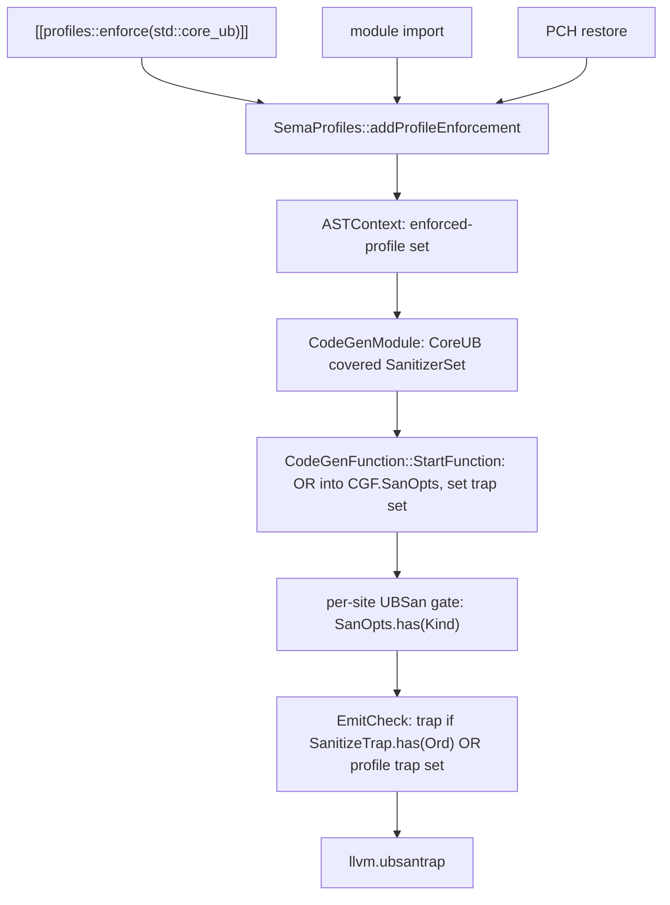

# Implementation Plan: `std::core_ub` Profile (P4317)

- Branch: `profiles-framework` (fork `cppalliance/clang`)
- Scope of this plan: the locally checkable subset of P4317 Appendix A.1, each case mapped to an existing UBSan check kind, emitted in trap mode
- Activation: `[[profiles::enforce(std::core_ub)]]` under `-fprofiles` (attribute driven, no new user flag)
- Response to a violation: trap (`llvm.ubsantrap`), matching libc++ hardening and Apple `-fbounds-safety`
- Each increment below is one commit with its own test, code comments, and commit message

## 1. Why this design

Every existing profile (`std::init`, the `test::` profiles) is a compile time Sema check. `std::core_ub` is the first profile that must reach CodeGen and emit runtime checks. Clang already emits exactly the checks P4317 A.1 enumerates, through UBSan. The whole strategy is therefore: **do not write new check emission; make the profile turn on the UBSan checks it covers, in trap mode.**

Two facts in the codebase make this a small, surgical change:

- `CodeGenFunction::SanOpts` is initialized from `CGM.getLangOpts().Sanitize` and then mutated per function in `StartFunction` (see `clang/lib/CodeGen/CodeGenFunction.cpp` around line 799, where `no_sanitize` attributes are applied). Every per site UBSan gate reads `CGF.SanOpts.has(Kind)`. Augmenting `CGF.SanOpts` there makes the existing emission fire.
- `EmitCheck` routes a failed check to a trap when `CGM.getCodeGenOpts().SanitizeTrap.has(Ord)` (see `clang/lib/CodeGen/CGExpr.cpp` line 4177). This is the single point that chooses trap vs handler for all targeted kinds (division, overflow, shift, null, alignment, bounds, float cast, enum, return all funnel through `EmitCheck`).

`CodeGenModule` holds `LangOpts` and `CodeGenOpts` as `const` references (`clang/lib/CodeGen/CodeGenModule.h` lines 349, 353), so the profile cannot mutate the global sanitizer sets. Instead the profile augments the per function `CGF.SanOpts` (already mutable) and carries a small per function trap set that `EmitCheck` also consults.

## 2. The Sema to CodeGen bridge

Enforcement is recorded in exactly one place today: `SemaProfiles::addProfileEnforcement` (`clang/lib/Sema/SemaProfiles.cpp` line 53). It is the choke point for all three enforcement sources:

- parse of `[[profiles::enforce(std::core_ub)]]` (via `handleProfilesEnforceAttr`, `clang/lib/Sema/SemaDeclAttr.cpp` line 5455)
- module import (`clang/lib/Sema/SemaModule.cpp` lines 489, 504)
- PCH restore (`clang/lib/Serialization/ASTReader.cpp` line 9302)

Because the enforce attribute must precede every non empty declaration in the TU (P3589R2 `[decl.attr.enforce]p1`), enforcement is known before any function body is code generated. CodeGen reads it through `ASTContext`.



Suppression (`[[profiles::suppress(std::core_ub)]]`) attaches a `ProfilesSuppressAttr` to the declaration or statement (`clang/lib/Sema/SemaDeclAttr.cpp` line 5516, `clang/lib/Sema/SemaStmtAttr.cpp` line 78). For this plan CodeGen honors it at function and declaration scope by reading `FunctionDecl`'s `ProfilesSuppressAttr` in `StartFunction`. Statement scope suppression inside a function body is deferred (Section 6).

## 3. Case to check-kind mapping

| P4317 identifier | `SanitizerKind` | Emission site (gate) |
|---|---|---|
| `{expr.mul.div.by.zero}` | `IntegerDivideByZero` | `CGExprScalar.cpp` `EmitDiv`/`EmitRem` |
| `{expr.mul.representable.type.result}` | `SignedIntegerOverflow` | `CGExprScalar.cpp` `EmitOverflowCheckedBinOp` (add/sub/mul/negate, `INT_MIN/-1`) |
| `{expr.shift.neg.and.width}` | `ShiftBase`, `ShiftExponent` | `CGExprScalar.cpp` `EmitShl`/`EmitShr` |
| `{basic.align.object.alignment}` | `Alignment` | `CGExpr.cpp` `EmitTypeCheck` |
| `{expr.unary.dereference}` (null) | `Null` | `CGExpr.cpp` `EmitTypeCheck` |
| `{expr.add.out.of.bounds}` (static bound) | `ArrayBounds` | `CGExpr.cpp` `EmitBoundsCheck` |
| `{conv.fpint.*}`, `{conv.double.out.of.range}` | `FloatCastOverflow` | `CGExprScalar.cpp` `EmitFloatConversionCheck` |
| `{expr.static.cast.enum.outside.range}` | `Enum` | `CGExprScalar.cpp` enum load/cast |
| `{stmt.return.flow.off}` | `Return` | `CodeGenFunction.cpp` line 1635 (function epilogue) |

All nine funnel through `EmitCheck`, so a single trap routing change serves them all.

## 4. Increments

Each row is one commit. Every increment is independently buildable and testable. Increment 1 carries the shared plumbing plus the first check, because plumbing alone emits nothing observable. Increment 2 adds the opt out before more checks pile on (safe by default with an opt out). Increments 3 to 10 each add exactly one case and one test.

| # | Title | New behavior | Test kind |
|---|---|---|---|
| 1 | Wire in profile plus integer divide by zero | Bridge, `CGF.SanOpts` augmentation, `EmitCheck` trap routing, `IntegerDivideByZero` | IR |
| 2 | Function and declaration scope suppression | `[[profiles::suppress(std::core_ub)]]` disables emission | IR |
| 3 | Signed integer overflow | `SignedIntegerOverflow` | IR |
| 4 | Shift errors | `ShiftBase`, `ShiftExponent` | IR |
| 5 | Alignment | `Alignment` | IR |
| 6 | Null dereference | `Null` | IR |
| 7 | Array bounds (static) | `ArrayBounds` | IR |
| 8 | Floating point to integer conversion overflow | `FloatCastOverflow` | IR |
| 9 | Enum out of range | `Enum` | IR |
| 10 | Missing return value | `Return` | IR |
| 11 | Documentation and release note | user and internals docs | doc build |

### Increment 1: Wire in the profile and guard integer division by zero

Goal: `[[profiles::enforce(std::core_ub)]]` under `-fprofiles` makes an integer division trap on a zero (or `INT_MIN/-1`) divisor, with no `-fsanitize` flag.

Files:

- `clang/include/clang/AST/ASTContext.h` and `clang/lib/AST/ASTContext.cpp`: add an enforced profile set and `void setProfileEnforced(StringRef)` plus `bool isProfileEnforced(StringRef) const`, backed by `llvm::StringSet<>`.
- `clang/lib/Sema/SemaProfiles.cpp`: in `addProfileEnforcement`, after recording, call `getASTContext().setProfileEnforced(Name)`.
- `clang/lib/CodeGen/CodeGenModule.h` and `.cpp`: add a `SanitizerSet CoreUBChecks` member, computed once at construction: if `LangOpts.Profiles` and `Context.isProfileEnforced("std::core_ub")`, set `IntegerDivideByZero`. Add `const SanitizerSet &getCoreUBChecks() const`.
- `clang/lib/CodeGen/CodeGenFunction.h`: add `SanitizerSet ProfileTrapChecks;` and `bool isProfileTrapCheck(SanitizerKind::SanitizerOrdinal Ord) const`.
- `clang/lib/CodeGen/CodeGenFunction.cpp` (`StartFunction`): before the `no_sanitize` handling, OR `CGM.getCoreUBChecks()` into `SanOpts` and into `ProfileTrapChecks`.
- `clang/lib/CodeGen/CGExpr.cpp` (`EmitCheck`, line 4177): change the trap test to `bool IsTrap = CGM.getCodeGenOpts().SanitizeTrap.has(Ord) || isProfileTrapCheck(Ord);` and select `TrapCond` from `IsTrap`.

Test: `clang/test/CodeGenCXX/safety-profile-core-ub-divide.cpp`

```cpp
// RUN: %clang_cc1 -std=c++23 -fprofiles -triple x86_64-linux-gnu -emit-llvm %s -o - | FileCheck %s
// RUN: %clang_cc1 -std=c++23 -triple x86_64-linux-gnu -emit-llvm %s -o - | FileCheck %s --check-prefix=OFF
[[profiles::enforce(std::core_ub)]];
// CHECK-LABEL: define {{.*}}@_Z3divii
// CHECK: call void @llvm.ubsantrap
// OFF-LABEL: define {{.*}}@_Z3divii
// OFF-NOT: llvm.ubsantrap
int div(int a, int b) { return a / b; }
```

Also add `clang/test/AST/ast-dump-profiles-core-ub.cpp` mirroring `ast-dump-profiles-enforce.cpp`, and a PCH round trip `clang/test/PCH/profiles-core-ub-enforce.cpp` confirming enforcement survives serialization (patterned on `clang/test/PCH/cxx-profiles-enforce.cpp`).

Commit message:

```
[clang][profiles] Add std::core_ub profile guarding integer division

Introduce the std::core_ub runtime-checking profile (P4317) and wire
profile enforcement through to CodeGen. Enforcement recorded in Sema is
now stored on ASTContext, read by CodeGenModule to build the set of UBSan
checks the profile covers, and OR'd into each function's SanOpts in trap
mode. EmitCheck routes those checks to llvm.ubsantrap.

This first case guards {expr.mul.div.by.zero}: under
[[profiles::enforce(std::core_ub)]] an integer division traps on a zero
or INT_MIN/-1 divisor, with no -fsanitize flag.
```

### Increment 2: Function and declaration scope suppression

Goal: `[[profiles::suppress(std::core_ub)]]` on a function (or its declaration) turns the profile checks back off for that function, the in source opt out SD-10 4.1 requires.

Files:

- `clang/lib/CodeGen/CodeGenFunction.cpp` (`StartFunction`): before augmenting `SanOpts`, if `D` has a `ProfilesSuppressAttr` naming `std::core_ub` (empty rule, or a rule matching a core_ub case), skip the augmentation for the suppressed kinds.

Test: `clang/test/CodeGenCXX/safety-profile-core-ub-suppress.cpp`

```cpp
// RUN: %clang_cc1 -std=c++23 -fprofiles -triple x86_64-linux-gnu -emit-llvm %s -o - | FileCheck %s
[[profiles::enforce(std::core_ub)]];
// CHECK-LABEL: define {{.*}}@_Z8unguardedii
// CHECK-NOT: llvm.ubsantrap
[[profiles::suppress(std::core_ub)]]
int unguarded(int a, int b) { return a / b; }
// CHECK-LABEL: define {{.*}}@_Z6guardedii
// CHECK: call void @llvm.ubsantrap
int guarded(int a, int b) { return a / b; }
```

Commit message:

```
[clang][profiles] Honor [[profiles::suppress(std::core_ub)]] in CodeGen

Skip std::core_ub check augmentation for a function that carries a
matching ProfilesSuppressAttr, giving the in-source opt-out at function
and declaration scope. Statement-scope suppression is not yet handled.
```

### Increment 3: Signed integer overflow

Goal: guard `{expr.mul.representable.type.result}`. Add `SignedIntegerOverflow` to `CoreUBChecks`.

Files: `clang/lib/CodeGen/CodeGenModule.cpp` (extend the `CoreUBChecks` set).

Test: `clang/test/CodeGenCXX/safety-profile-core-ub-overflow.cpp`, functions doing `a + b`, `a * b`, `-a` on `int`, each expecting `llvm.ubsantrap`; an `unsigned` variant expecting none.

Commit message:

```
[clang][profiles] Guard signed integer overflow under std::core_ub

Add SignedIntegerOverflow to the std::core_ub check set, covering
{expr.mul.representable.type.result} for addition, subtraction,
multiplication, negation, and INT_MIN/-1.
```

### Increment 4: Shift errors

Goal: guard `{expr.shift.neg.and.width}`. Add `ShiftBase` and `ShiftExponent`.

Test: `clang/test/CodeGenCXX/safety-profile-core-ub-shift.cpp`, `a << b` and `a >> b` expecting `llvm.ubsantrap`.

Commit message:

```
[clang][profiles] Guard invalid shifts under std::core_ub

Add ShiftBase and ShiftExponent, covering {expr.shift.neg.and.width}: a
negative or too-large shift amount, or a signed left shift that overflows.
```

### Increment 5: Alignment

Goal: guard `{basic.align.object.alignment}`. Add `Alignment`.

Test: `clang/test/CodeGenCXX/safety-profile-core-ub-alignment.cpp`, a load through a `reinterpret_cast`ed under aligned pointer expecting `llvm.ubsantrap`.

Commit message:

```
[clang][profiles] Guard misaligned access under std::core_ub

Add Alignment, covering {basic.align.object.alignment}: an access through
a pointer that does not meet the referenced type's alignment.
```

### Increment 6: Null dereference

Goal: guard `{expr.unary.dereference}` for the null case. Add `Null`.

Test: `clang/test/CodeGenCXX/safety-profile-core-ub-null.cpp`, a dereference of a pointer parameter expecting `llvm.ubsantrap`.

Commit message:

```
[clang][profiles] Guard null dereference under std::core_ub

Add Null, covering the null-pointer case of {expr.unary.dereference}.
```

### Increment 7: Array bounds (statically known)

Goal: guard `{expr.add.out.of.bounds}` where the array bound is statically known. Add `ArrayBounds`.

Test: `clang/test/CodeGenCXX/safety-profile-core-ub-bounds.cpp`, indexing a fixed size array expecting `llvm.ubsantrap`.

Commit message:

```
[clang][profiles] Guard array bounds under std::core_ub

Add ArrayBounds, covering {expr.add.out.of.bounds} for arrays whose bound
is known at the access site.
```

### Increment 8: Floating point to integer conversion overflow

Goal: guard `{conv.fpint.*}` and `{conv.double.out.of.range}`. Add `FloatCastOverflow`.

Test: `clang/test/CodeGenCXX/safety-profile-core-ub-float-cast.cpp`, `(int)d` for `double d` expecting `llvm.ubsantrap`.

Commit message:

```
[clang][profiles] Guard float-to-int conversion overflow under std::core_ub

Add FloatCastOverflow, covering {conv.fpint.*} and
{conv.double.out.of.range}: a floating value outside the target's range.
```

### Increment 9: Enum out of range

Goal: guard `{expr.static.cast.enum.outside.range}`. Add `Enum`.

Test: `clang/test/CodeGenCXX/safety-profile-core-ub-enum.cpp`, `static_cast<E>(n)` for an out of range `n` expecting `llvm.ubsantrap`.

Commit message:

```
[clang][profiles] Guard out-of-range enum values under std::core_ub

Add Enum, covering {expr.static.cast.enum.outside.range}.
```

### Increment 10: Missing return value

Goal: guard `{stmt.return.flow.off}`. Add `Return`.

Test: `clang/test/CodeGenCXX/safety-profile-core-ub-return.cpp`, a value returning function whose control can fall off the end expecting `llvm.ubsantrap` in the epilogue.

Commit message:

```
[clang][profiles] Guard falling off a value-returning function under std::core_ub

Add Return, covering {stmt.return.flow.off}: reaching the closing brace of
a function that must return a value.
```

### Increment 11: Documentation and release note

Files:

- `clang/docs/ProfilesFramework.rst`: user facing section for `std::core_ub`, the guarded cases, the trap response, and how to enforce and suppress it.
- `clang/docs/ProfilesFrameworkInternals.rst`: the bridge (ASTContext to CodeGenModule to `CGF.SanOpts`), the `EmitCheck` trap routing, and how to add another case (one line in the `CoreUBChecks` set plus a test).
- `clang/docs/ReleaseNotes.rst`: one entry.

Commit message:

```
[clang][profiles][docs] Document the std::core_ub profile
```

## 5. Testing

Build and run (validated on this machine):

```bash
cmake -S llvm -B build -G Ninja -DCMAKE_BUILD_TYPE=Release \
  -DLLVM_ENABLE_PROJECTS=clang -DLLVM_TARGETS_TO_BUILD=X86 \
  -DLLVM_ENABLE_ASSERTIONS=ON
ninja -C build clang FileCheck count not split-file llvm-config clang-resource-headers
```

Per increment:

```bash
python build/bin/llvm-lit.py -sv clang/test/CodeGenCXX/safety-profile-core-ub-*.cpp
```

Regression gate before each commit (the profile framework must stay green):

```bash
python build/bin/llvm-lit.py -sv clang/test/SemaCXX/safety-profile-*.cpp \
  clang/test/Parser/cxx-profiles-framework*.cpp
```

Conventions, matching the existing `safety-profile-*` tests:

- enforcement requires `-fprofiles`; every CodeGen test enforces via `[[profiles::enforce(std::core_ub)]];` as the first declaration
- each test carries a negative run (no `-fprofiles`, or a suppressed or unenforced function) proving the trap is absent
- IR tests pin a triple so mangled names and `llvm.ubsantrap` are stable
- exact `ubsantrap` handler id bytes are read off the first build of each increment and pinned in the test

## 6. Out of scope for this plan

- The 58 instrumented cases of P4317 A.3 (lifetime, type, provenance). They need sanitizer style whole program instrumentation, a separate effort.
- Statement scope `[[profiles::suppress(std::core_ub)]]` inside a function body. Increment 2 covers function and declaration scope; statement scope needs per statement tracking in CodeGen and is a follow up.
- The 15 defined replacement cases of P4317 A.4 (for example signed overflow to wraparound). This plan terminates on every guarded case; replacement behavior is a later design.
- Interaction note: a kind that is both `-fsanitize` enabled in diagnostic mode and profile enabled will trap, because the profile forces trap for its covered kinds. This is consistent with the profile's terminate guarantee.

## 7. Recommendation

Proceed increment by increment on this branch as laid out. Confidence: high, because the check emission already exists and is exercised by UBSan, the bridge has a single Sema choke point and a single CodeGen trap routing point, and the framework test suite gives a regression gate. The main residual risk is a future rebase onto upstream conflicting in `CGExpr.cpp` or `CodeGenFunction.cpp`, but the profile touches only a few lines there, so conflicts would be small. Confidence: medium on the rebase point, since upstream is far ahead.
