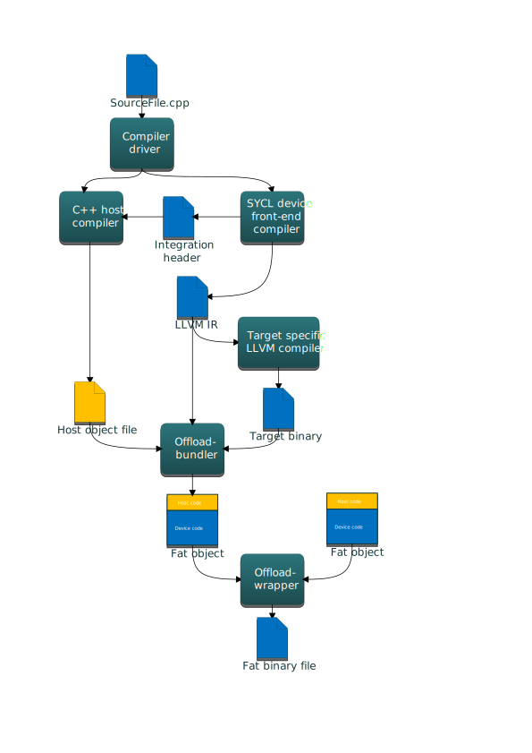
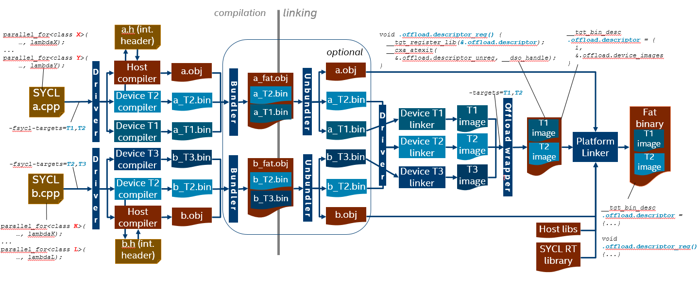

# SYCL\* Compiler and Runtime architecture design

## Introduction

This document describes the architecture of the SYCL compiler and runtime
library.  Base SYCL specification version is
[1.2.1](https://www.khronos.org/registry/SYCL/specs/sycl-1.2.1.pdf).

## SYCL Compiler architecture

SYCL application compilation flow:



SYCL compiler logically can be split into the host compiler and a number of
device compilers—one per each supported target. Clang driver orchestrates the
compilation process, it will invoke the device compiler once per each requested
target, then it will invoke the host compiler to compile the host part of a
SYCL source. The result of compilation is a set of so-called "fat objects" -
one fat object per SYCL source file. A fat object contains compiled host code
and a number of compiled device code instances—one per each target. Fat
objects can be linked into "fat binary".

SYCL sources can be also compiled as a regular C++ code, in this mode there is
no "device part" of the code—everything is executed on the host.

Device compiler is further split into the following major components:

- **Front-end** - parses input source, outlines "device part" of the code,
applies additional restrictions on the device code (e.g. no exceptions or
virtual calls), generated LLVM IR for the device code only and "integration
header" which provides information like kernel name, parameters order and data
type for the runtime library.
- **Middle-end** - transforms the initial LLVM IR* to get consumed by the
back-end. Today middle-end transformations include just a couple of passes:
  - OpenCL C++* to SPIR-V* built-in function names mapper
  - Address space handling pass
  - TBD: potentially the middle-end optimizer can run any LLVM IR
  transformation with only one limitation: back-end compiler should be able to
  handle transformed LLVM IR.
  - Optionally: LLVM IR → SPIR-V translator.
- **Back-end** - produces native "device" code in ahead-of-time compilation
mode.

### SYCL support in the driver

SYCL offload support in the driver is based on the clang driver concepts and
defines:

- target triple and a native tool chain for each target (including "virtual"
targets like SPIR-V).
- SYCL offload action based on generic offload action

#### Enable SYCL offload

To enable compilation with SYCL specification conformance, a special option
must be passed to the clang driver:

`-fsycl`

With this option specified, the driver will invoke the host SYCL compiler and a
number of device compilers for targets specified in the `-fsycl-targets`
option.  If this option is not specified, then single SPIR-V target is assumed,
and single device compiler for this target is invoked.

#### Ahead of time (AOT) compilation

Ahead-of-time compilation is the process of invoking the back-end at compile
time to produce the final binary, as opposed to just-in-time (JIT) compilation
when final code generation is deferred until application runtime time.

AOT compilation reduces application execution time by skipping JIT compilation
and final device code can be tested before deploy.

JIT compilation provides portability of device code and target specific
optimizations.

#### List of native targets

The ahead-of-time compilation mode implies that there must be a way to specify
a set of target architectures for which to compile device code. By default the
compiler generates SPIR-V and OpenCL device JIT compiler produces native target
binary.

There are existing options for OpenMP* offload:

`-fopenmp-targets=triple1,triple2`

would produce binaries for target architectures identified by target triples
`triple1` and `triple2`.

A similar approach is used for SYCL:

`-fsycl-targets=triple1,triple2`

will produce binaries from SYCL kernels for devices identified by the two
target triples. This basically tells the driver which device compilers must be
invoked to compile the SYCL kernel code. By default, the JIT compilation
approach is assumed and device code is compiled for a single target triple -
`[spir,spir64]-*-*`.

#### Device code formats

Each target may support a number of code forms, each device compiler defines
and understands mnemonics designating a particular code form, for example
"`visa:3.3`" could designate virtual ISA version 3.3 for Intel GPU target (Gen
architecture).  User can specify desired code format using the target-specific
option mechanism, similar to OpenMP.

`-Xsycl-target=<triple> <arg>`

For example, to support offload to CPU, FPGA, Gen9/vISA3.3, Gen9/SPIR-V the
following options would be used:

`-fsycl -fsycl-targets=x86,fpga,gen9 -Xsycl-target=gen9 "-fmt:visa -fmt:spirv"`

The `<arg>` parameter is passed by the driver directly to the SYCL device
compiler for the corresponding target w/o parsing it. For each target there is
some default code form which is generated in the absence of overriding via the
`-Xsycl-target` option.

**TBD:** Having multiple code forms for the same target in the fat binary might
mean invoking device compiler multiple times. Multiple invocations are not
needed if these forms can be dumped at various compilation stages by the single
device compilation, like SPIR-V → visa → ISA. But if e.g. `gen9:visa3.2` and
`gen9:visa3.3` are needed at the same time, then some mechanism is needed.
Should it be a dedicated target triple for each needed visa version or Gen
generation?

#### Separate Compilation and Linking

The compiler supports linking of device code obtained from different source
files before generating the final SPIR-V to be fed to the back-end. The basic
mechanism is to produce "fat objects" as a result of compilation—object files
containing both host and device code for all targets—then break fat objects
into their constituents before linking and link host code and device code
(per-target) separately and finally produce a "fat binary" - a host executable
with embedded linked images for each target specified at the command line.



The clang driver orchestrates compilation and linking process based on a
SYCL-specific offload action builder and invokes external tools as needed. On
the diagram above, every dark-blue box is a tool invoked as a separate process
by the clang driver.

Compilation starts with compiling the input source `a.cpp` for one of the
targets requested via the command line - `T2`. When doing this first
compilation, the driver requests the device compiler to generate an
"integration header" via a special option. Device compilation for other targets
\- `T1` - don't need to generate the integration header, as it must be the same
for all the targets.

*Design note: Current design does not use the host compiler to produce the
integration header for two reasons: first, it must be possible to use any host
compiler to produce SYCL heterogeneous application, and second, even if the
same clang is used for the host compilation, information provided in the
integration header is used (included) by the SYCL runtime implementation so it
must be ready before host compilation starts.*

Now, after all the device compilations are completed resulting in `a_T2.bin`
and `a_T1.bin`, and the integration header `a.h` is generated, the driver
invokes the host compiler passing it the integration header via `-include`
option to produce the host object `a.obj`. Then the offload bundler tool is
invoked to pack `a_T2.bin`, `a_T1.bin` and `a.obj` into `a_fat.obj` - the fat
object file for the source `a.cpp`.

The compilation process is repeated for all the sources in the application
(maybe on different machines).

Device linking starts with breaking the fat objects back into constituents with
the unbundler tool (bundler invoked with `-unbundle` option). For each fat
object the unbundler produces a target list file which contains pairs
"`<target-triple>, <filename>`" each representing a device object extracted
from the fat object and its target. Once all the fat objects are unbundled, the
driver uses the target list files to construct a list of targets available for
linking and a list of corresponding object files for each: "`<T1: a_T1.bin>,
<T2: a_T2.bin, b_T2.bin>, <T3: b_T3.bin>`". Then the driver invokes linkers for
each of the targets to produce device binary images for those targets.

*Current implementation uses LLVM IR as a default device binary format for `fat
objects` and translates "linked LLVM IR" to SPIR-V. One of the reasons for this
decision is that SPIR-V doesn't support linking template functions, which could
be defined in multiple modules and linker must resolve multiple definitions.
LLVM IR uses function attributes to satisfy "one definition rule", which have
no counterparts in SPIR-V.*

Host linking starts after all device images are produced - with invocation of
the offload wrapper tool. Its main function is to create a host object file
wrapping all the device images and provide the runtime with access to that
information. So when creating the host wrapper object the offload wrapper tool
does the following:

- creates a `.sycl_offloading.descriptor` symbol which is a structure
containing the number of device images and the array of the device images
themselves

```C++
struct __tgt_device_image {
  void *ImageStart;
  void *ImageEnd;
};
struct __tgt_bin_desc {
  int32_t NumDeviceImages;
  __tgt_device_image *DeviceImages;
};
__tgt_bin_desc .sycl_offloading.descriptor;
```

- creates a `void .sycl_offloading.descriptor_reg()` function and registers it
for execution at module loading; this function invokes the `__tgt_register_lib`
registration function (the name can also be specified via an option) which must
be implemented by the runtime and which registers the device images with the
runtime:

```C++
void __tgt_register_lib(__tgt_bin_desc *desc);
```

- creates a `void .sycl_offloading.descriptor_unreg()` function and registers
it for execution at module unloading; this function calls the
`__tgt_unregister_lib` function (the name can also be specified via an option)
which must be implemented by the runtime and which unregisters the device
images with the runtime:

```C++
void __tgt_unregister_lib(__tgt_bin_desc *desc);
```

Once the offload wrapper object file is ready, the driver finally invokes the
host linker giving it the following input:

- all the application host objects (result of compilation or unbundling)
- the offload wrapper object file
- all the host libraries needed by the application
- the SYCL runtime library

The result is so-called "fat binary image" containing the host code, code for
all the targets plus the registration/unregistration functions and the
information about the device binary images.

When compilation and linking is done in single compiler driver invocation, the
bundling and unbundling steps are skipped.

*Design note: the described scheme differs from current llvm.org
implementation.  Current design uses Linux-specific linker script approach and
requires that all the linked fat objects are compiled for the same set of
targets. The described design uses OS-neutral offload-wrapper tool and does not
impose restrictions on fat objects.*

### Integration with SPIR-V format

This section explains how to generate SPIR-V specific types and operations from
C++ classes and functions.

Translation of SYCL C++ programs to the code executable on heterogeneous
systems can be considered as three step process:

1) translation of SYCL C++ programs into LLVM IR
1) translation from LLVM IR to SPIR-V
1) translation from SPIR-V to machine code

LLVM-IR to SPIR-V translation is performed by a dedicated tool -
[translator](https://github.com/KhronosGroup/SPIRV-LLVM-Translator).
This tool correctly translates most of regular LLVM IR types/operations/etc to
SPIR-V.

For example:

- Type: `i32` → `OpTypeInt`
- Operation: `load` → `OpLoad`
- Calls: `call` → `OpFunctionCall`

SPIR-V defines special built-in types and operations that do not have
corresponding equivalents in LLVM IR. E.g.

- Type: ??? → `OpTypeEvent`
- Operation: ??? → `OpGroupAsyncCopy`

Translation from LLVM IR to SPIR-V for special types is also supported, but
such LLVM IR must comply to some special requirements. Unfortunately there is
no canonical form of special built-in types and operations in LLVM IR, moreover
we can't re-use existing representation generated by OpenCL C front-end
compiler.  For instance here is how `OpGroupAsyncCopy` operation looks in LLVM IR
produced by OpenCL C front-end compiler.

```LLVM
@_Z21async_work_group_copyPU3AS3fPU3AS1Kfjj(float addrspace(3)*, float addrspace(1)*, i32, i32)
```

It's a regular function, which can conflict with user code produced from C++
source.


SYCL compiler uses solution developed for OpenCL C++ compiler prototype:

- Compiler: https://github.com/KhronosGroup/SPIR/tree/spirv-1.1
- Headers: https://github.com/KhronosGroup/libclcxx

SPIR-V types and operations that do not have LLVM equivalents are **declared**
(but not defined) in the headers and satisfy following requirements:

- the type must be pre-declared as a C++ class in `cl::__spirv` namespace
- the type must not have actual definition in C++ program
- the operation is expressed in C++ as `extern` function not throwing C++
  exceptions
- the operation must not have the actual definition in C++ program

For example, the following C++ code is successfully recognized and translated
into SPIR-V operation `OpGroupAsyncCopy`:

```C++
namespace cl {
  namespace __spirv {
  // This class does not have definition, it is only predeclared here.
  // The pointers to this class objects can be passed to or returned from
  // SPIR-V built-in functions. Only in such cases the class is recognized
  // as SPIR-V type OpTypeEvent.
  class OpTypeEvent;

  template <typename dataT>
  extern OpTypeEvent *OpGroupAsyncCopy(int32_t Scope, __local dataT *Dest,
                                       __global dataT *Src, size_t NumElements,
                                       size_t Stride, OpTypeEvent *E) noexcept;
  } // namespace __spirv
} // namespace cl

cl::__spirv::OpTypeEvent *e =
    cl::__spirv::OpGroupAsyncCopy<dataT>(cl::__spirv::Scope::Workgroup,
                                         dst, src, numElements, 1, 0);
```

OpenCL C++ compiler uses a special module pass in clang that transforms the
names of C++ classes, globals and functions from the namespace `cl::__spirv::`
to
["SPIR-V representation in LLVM IR"](https://github.com/KhronosGroup/SPIRV-LLVM-Translator/blob/master/docs/SPIRVRepresentationInLLVM.rst)
which is recognized by the LLVM IR to SPIR-V translator.

In the OpenCL C++ prototype project the pass is located at the directory:
`lib/CodeGen/OclCxxRewrite`.  The file with the pass is:
`lib/CodeGen/OclCxxRewrite/BifNameReflower.cpp`.  The other files in
`lib/CodeGen/OclCxxRewrite` are utility files implementing Itanium demangler
and other helping functionality.

That LLVM module pass has been ported from OpenCL C++ prototype to the SYCL
compiler as is. It made possible using simple declarations of C++ classes and
external functions as if they were the SPIR-V specific types and operations.

#### Some details and agreements on using SPIR-V special types and operations

The SPIR-V specific C++ enumerators and classes are declared in the file:
`sycl/include/CL/__spirv/spirv_types.hpp`.

The SPIR-V specific C++ function declarations are in the file:
`sycl/include/CL/__spirv/spirv_ops.hpp`.

The SPIR-V specific functions are implemented in for the SYCL host device here:
`sycl/source/spirv_ops.cpp`.

### Address spaces handling

SYCL 1.2.1 language defines several address spaces where data can reside, the
same as OpenCL - global, local, private and constant. From the spec: "In OpenCL
C, these address spaces are manually specified using OpenCL-specific keywords.
In SYCL, the device compiler is expected to auto-deduce the address space for
pointers in common situations of pointer usage. However, there are situations
where auto-deduction is not possible".

We believe that requirement for the compiler to automatically deduce address
spaces is too strong. Instead the following approach will be implemented in the
compiler:

*TBD*

### Compiler/Runtime interface

## SYCL Runtime architecture

*TBD*

## Supported extensions

- [Intel subgroups](extensions/sub_group_ndrange/sub_group_ndrange.md)

## Unsupported extensions/proposals

- [Ordered queue](extensions/ordered_queue/ordered_queue.adoc)
- [Unified shared memory](extensions/usm/usm.adoc)

\*Other names and brands may be claimed as the property of others.
